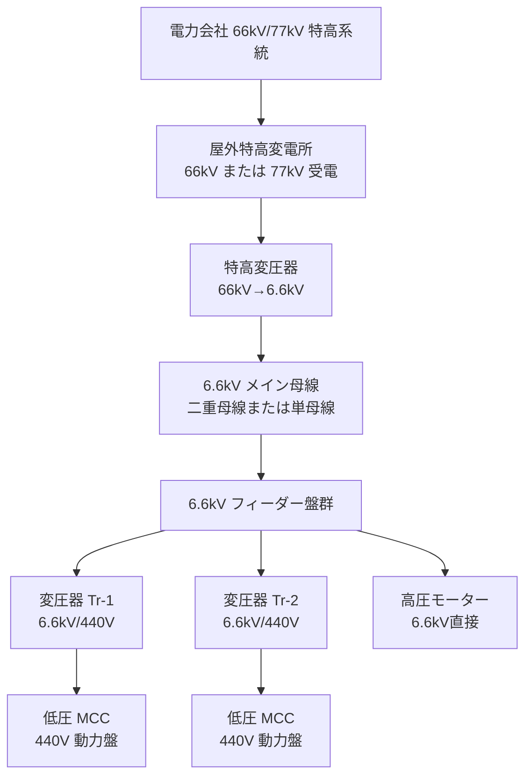

# 受変電設備概論

## 30秒まとめ

化学プラントの受変電設備は「特高受電→6.6kV母線→各変圧器（6.6kV/440V）→負荷」が典型構成。電気主任技術者は電気事業法上の義務者。単線結線図を読めることが電気管理業務の基本スキル。

---

## 化学プラントの典型的な受変電構成



---

## 単線結線図の主要記号

| 記号 | 機器名 | 説明 |
|------|--------|------|
| VCB（○に V） | 真空遮断器 | 高圧回路の開閉・保護 |
| DS（─┤├─） | 断路器 | 停電確認後の電路開放（電流遮断不可） |
| CT（○に矢印） | 変流器 | 大電流を 5A 等に変換して計測・保護に使用 |
| PT（○に矢印） | 計器用変圧器 | 高電圧を 110V 等に変換して計測・保護に使用 |
| ZCT（○に Z） | 零相変流器 | 地絡電流（零相電流）を検出 |
| LA（→） | 避雷器 | 雷サージ・開閉サージを吸収 |
| TR（○に波線） | 変圧器 | 電圧変換 |
| SC（□） | 進相コンデンサ | 力率改善 |

---

## 責任分界点

電力会社の設備と自家設備の境界。通常は**PAS（高圧気中開閉器）またはキュービクル受電点のメーターボックス**が分界点となる。

| 分界点より電源側 | 分界点より負荷側 |
|--------------|--------------|
| 電力会社の責任 | 自家設備の責任（電気主任技術者の管轄） |
| 電力会社が保守 | 自社が保守 |

---

## 電気主任技術者の法的義務（電気事業法）

| 義務 | 内容 |
|------|------|
| 選任義務 | 自家用電気工作物（500kW以上）は電気主任技術者の選任が義務 |
| 保安規程の制定 | 設備の工事・維持・運用に関する保安規程を定め、届出 |
| 工事の監督 | 電気工作物の工事に立ち会い、確認・監督 |
| 自家用電気工作物の維持 | 技術基準（電技）に適合するよう維持する義務 |
| 事故報告 | 感電死傷・火災・供給支障が発生した場合は経済産業省へ報告 |

---

## 需要率・不等率・負荷率

変圧器容量を選定・評価するときに使う指標。

| 指標 | 定義 | 用途 |
|------|------|------|
| 需要率 | 最大需要電力 / 設備容量の合計 | 設備合計から実際の最大需要を推定 |
| 不等率 | 各負荷の最大需要の合計 / 合計の最大需要 | 個別ピークが同時に来ないことを考慮（≥1.0） |
| 負荷率 | 平均需要電力 / 最大需要電力 | 設備の利用効率を示す |

### 計算例

設備容量合計：1000 kW、需要率：0.7、不等率：1.2 の場合

```
最大需要電力 = 1000 × 0.7 / 1.2 = 583 kW
```

変圧器容量はこの最大需要電力に将来余裕（20〜30%）を加算して選定する。
