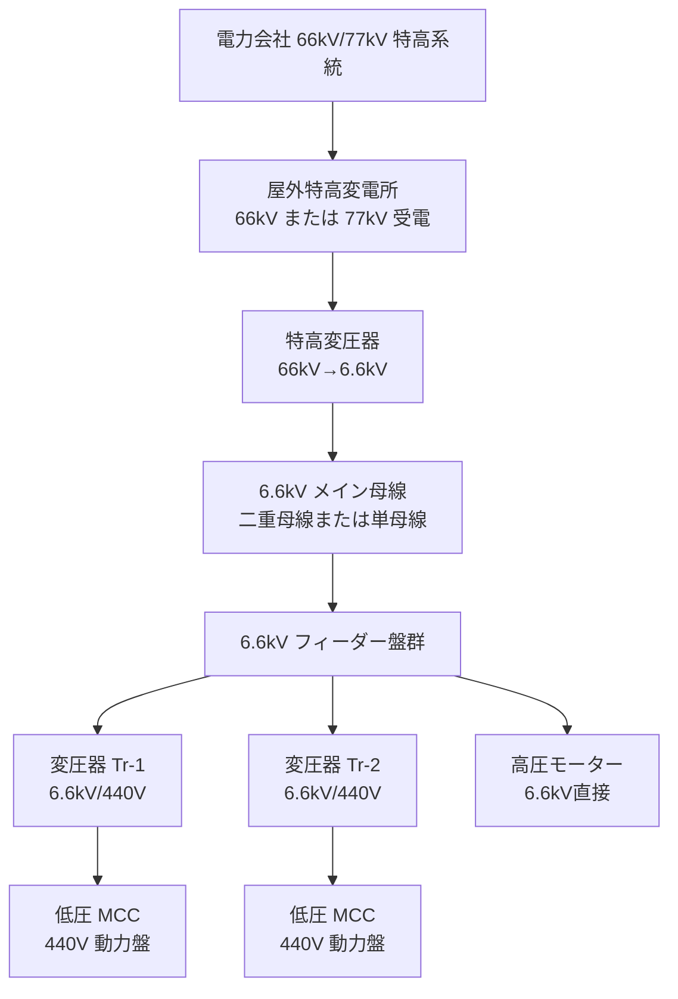

# 受変電設備概論

## 30秒まとめ

化学プラントの受変電設備は「特高受電→6.6kV母線→各変圧器（6.6kV/440V）→負荷」が典型構成。主任技術者の選任・保安規程の届出・技術基準適合維持の義務を負うのは**設置者（事業者）**であり、選任された電気主任技術者は保安の**監督**を行う（電気事業法第43条）。単線結線図を読めることが電気管理業務の基本スキル。

---

## 化学プラントの典型的な受変電構成


```mermaid
flowchart TD
    A[電力会社 66kV/77kV 特高系統] --> B[屋外特高変電所\n66kV または 77kV 受電]
    B --> C[特高変圧器\n66kV→6.6kV]
    C --> D[6.6kV メイン母線\n二重母線または単母線]
    D --> E[6.6kV フィーダー盤群]
    E --> F1[変圧器 Tr-1\n6.6kV/440V]
    E --> F2[変圧器 Tr-2\n6.6kV/440V]
    E --> F3[高圧モーター\n6.6kV直接]
    F1 --> G1[低圧 MCC\n440V 動力盤]
    F2 --> G2[低圧 MCC\n440V 動力盤]
```

---

## 単線結線図の主要記号

| 記号 | 機器名 | 説明 |
|------|--------|------|
| VCB（○に V） | 真空遮断器 | 高圧回路の開閉・保護 |
| DS（─┤├─） | 断路器 | 停電確認後の電路開放（電流遮断不可） |
| CT（電路を貫く○） | 変流器 | 大電流を 5A 等に変換して計測・保護に使用 |
| PT（○を2つ重ねた変圧器記号） | 計器用変圧器（VT） | 高電圧を 110V 等に変換して計測・保護に使用 |
| ZCT（○に Z） | 零相変流器 | 地絡電流（零相電流）を検出 |
| LA（→） | 避雷器 | 雷サージ・開閉サージを吸収 |
| TR（○に波線） | 変圧器 | 電圧変換 |
| SC（□） | 進相コンデンサ | 力率改善 |

---

## 責任分界点

電力会社の設備と自家設備の境界。高圧受電では**構内第1柱の区分開閉器（PAS・UGS 等）の電源側接続点**とすることが多いが、実際の位置は電力会社との契約（供給約款・協議）で個別に定まるため、自社の受電契約書・単線結線図で確認する。

| 分界点より電源側 | 分界点より負荷側 |
|--------------|--------------|
| 電力会社の責任 | 自家設備の責任（電気主任技術者の管轄） |
| 電力会社が保守 | 自社が保守 |

---

## 電気事業法上の義務の帰属（設置者と主任技術者）

義務の多くは**設置者（事業者）**に課されており、電気主任技術者に課されるのは保安の**監督**の職務である。この帰属の区別は実務でも試験でも混同しやすい。

| 義務・職務 | 誰の義務か | 内容 |
|-----------|----------|------|
| 主任技術者の選任 | **設置者** | 事業用電気工作物を設置する者は、保安の監督をさせるため主任技術者免状の交付を受けている者のうちから主任技術者を選任しなければならない（第43条第1項）。選任・解任は遅滞なく届出（同条第3項）。高圧受電の自家用電気工作物は規模によらず選任が必要（500kW・2000kWは許可主任技術者や保安管理業務の外部委託といった別制度の区分であり、選任義務の有無を分ける閾値ではない） |
| 保安規程の制定・届出 | **設置者** | 工事・維持・運用に関する保安を確保するため保安規程を定め、使用開始前に主務大臣へ届出（第42条第1項）。変更時も遅滞なく届出（同条第2項）。設置者と従業者には遵守義務（同条第4項） |
| 技術基準適合維持 | **設置者** | 事業用電気工作物を主務省令で定める技術基準（電技）に適合するように維持する義務（第39条第1項） |
| 保安の監督 | **主任技術者** | 工事・維持・運用に関する保安の監督の職務を誠実に行う（第43条第4項）。工事・維持・運用に従事する者は、主任技術者の保安のための指示に従う義務（同条第5項） |
| 事故報告 | **設置者** | 感電等による死傷（死亡または入院）・電気火災・供給支障等の事故は、原則として電気工作物の設置の場所を管轄する**産業保安監督部長**へ報告（電気関係報告規則第3条）。対象事故の区分・速報と報告書の期限は [電気事故対応と報告](../09-hoantokei/jiko-taiou.md) が正典 |

---

## 需要率・不等率・負荷率 { #juyoritsu-futouritsu }

変圧器容量を選定・評価するときに使う指標。

| 指標 | 定義 | 用途 |
|------|------|------|
| 需要率 | 最大需要電力 / 設備容量の合計 | 設備合計から実際の最大需要を推定 |
| 不等率 | 各負荷の最大需要の合計 / 合計の最大需要 | 個別ピークが同時に来ないことを考慮（≥1.0） |
| 負荷率 | 平均需要電力 / 最大需要電力 | 設備の利用効率を示す |

### イメージ：社員食堂の席数と同じ { #shokudo-image }

!!! tip "1000人の工場に、食堂の席は何席いるか"
    1000席あれば絶対に足りるが、そんなに要らない。席を減らせる理由が2つ、順番に効く。

    - **部署ごとに見ても、全員は来ない**：製造部400人のうち食堂に来るのは多くて280人、事務部350人のうち245人、研究部250人のうち175人。どの部署も所属人数の 0.7 倍で、足すと700人。この 0.7 が**需要率**。
    - **部署ごとのピーク時刻がばらける**：事務は11:00、製造は11:30、研究は12:30が混雑のピーク。700人は**別々の時刻の最大人数を足した数**である。実際に一番混む11:30に部屋にいるのは、製造280人＋事務210人＋研究93人＝583人にとどまる。この 700 ÷ 583 ≒ 1.2 が**不等率**。

    人数が負荷の大きさ、席数が供給設備の大きさに対応する。2段階で削った583人ぶんに将来の増員を上乗せするのが容量選定の考え方だが、比喩の対応はここまで。実際の変圧器容量は 583 kW をさらに力率で割って kVA に直す（後述）。

### 計算例 { #keisan-rei }

設備容量合計：1000 kW、**各系統に共通の需要率**：0.7、不等率：1.2 の場合

```text
各系統の最大需要の合計 = 1000 kW × 0.7 = 700 kW
合成最大需要電力       =  700 kW ÷ 1.2 = 583 kW（583.3 の丸め）
```

内訳を A・B・C の3系統（設備容量 400 / 350 / 250 kW）に分けると、各系統の最大需要は 280 / 245 / 175 kW で、いずれも設備容量の 0.7 倍。単純に足せば 700 kW になる。しかしピーク時刻が 14時 / 10時 / 16時 とずれているため、3系統を積み上げた曲線の最大は 14時の 583 kW にとどまる。この 700 ÷ 583 ≒ 1.20 が不等率である。

!!! warning "0.7 は「各系統の」需要率であって、設備全体の需要率ではない"
    設備全体で見た需要率（合わせた需要率）は、定義どおり **合成最大需要電力 ÷ 設備容量合計 = 583 ÷ 1000 = 0.583** になる。
    設備容量合計に掛ける 0.7 と、設備全体の需要率 0.583 は別物である。設備容量合計にまとめて 0.7 を掛けられるのは、0.7 が各系統の需要率を**設備容量で加重平均した値**になっているときで、この例は3系統ともちょうど 0.7 だからそうなっている。系統ごとに需要率が違う場合は、加重平均が使えると確認できない限り系統別に掛けてから足す。

<figure id="fig-diversity" style="scroll-margin-top: 4rem">
<svg viewBox="0 0 640 340" width="640" height="340" role="img"
     aria-labelledby="fig-diversity-factor-title" xmlns="http://www.w3.org/2000/svg">
  <title id="fig-diversity-factor-title">A・B・C 3系統の需要曲線を積み上げた図。各系統の最大需要は A が14時に280キロワット、B が10時に245キロワット、C が16時に175キロワットで、単純に足すと700キロワットになる。しかしピーク時刻がずれているため、3系統を積み上げた合成曲線の最大は14時の583キロワットにとどまり、700キロワットの破線には届かない。この700対583の比が不等率1.2である。</title>
  <!-- 軸 -->
  <g style="stroke: var(--md-default-fg-color); fill: none" stroke-width="1.4">
    <line x1="90" y1="50" x2="90" y2="280"/>
    <line x1="90" y1="280" x2="590" y2="280"/>
  </g>
  <!-- 目盛 -->
  <g style="stroke: var(--md-default-fg-color--light); fill: none" stroke-width="1">
    <line x1="86" y1="220" x2="90" y2="220"/>
    <line x1="86" y1="160" x2="90" y2="160"/>
    <line x1="86" y1="100" x2="90" y2="100"/>
  </g>
  <!-- 積み上げ帯（濃さで系統を区別・下から A / B / C） -->
  <g style="fill: var(--md-default-fg-color); stroke: none">
    <path d="M90,280 L90,244 L188,226 L286,208 L384,196 L482,214 L580,238 L580,280 Z" fill-opacity="0.30"/>
    <path d="M90,244 L188,226 L286,208 L384,196 L482,214 L580,238 L580,208 L482,169 L384,133 L286,145 L188,152.5 L90,184 Z" fill-opacity="0.17"/>
    <path d="M90,184 L188,152.5 L286,145 L384,133 L482,169 L580,208 L580,163 L482,116.5 L384,105.1 L286,118 L188,131.5 L90,166 Z" fill-opacity="0.07"/>
  </g>
  <!-- 系統の境界 -->
  <g style="stroke: var(--md-default-fg-color--light); fill: none" stroke-width="1.2">
    <polyline points="90,244 188,226 286,208 384,196 482,214 580,238"/>
    <polyline points="90,184 188,152.5 286,145 384,133 482,169 580,208"/>
  </g>
  <!-- 各系統が最も厚くなる時刻（＝その系統のピーク） -->
  <g style="stroke: var(--md-default-fg-color--light); fill: none" stroke-width="1">
    <line x1="384" y1="280" x2="384" y2="196"/>
    <line x1="188" y1="226" x2="188" y2="152.5"/>
    <line x1="482" y1="169" x2="482" y2="116.5"/>
  </g>
  <!-- 700 kW（各ピークの単純合計） -->
  <g style="stroke: var(--md-default-fg-color--light); fill: none" stroke-width="1.4" stroke-dasharray="6 4">
    <line x1="90" y1="70" x2="590" y2="70"/>
  </g>
  <!-- 合成最大の時刻における 700 kW との差＝不等率で割って減る分 -->
  <g style="stroke: var(--md-default-fg-color); fill: none" stroke-width="1.2">
    <line x1="384" y1="75" x2="384" y2="100"/>
    <line x1="379" y1="75" x2="389" y2="75"/>
    <line x1="379" y1="100" x2="389" y2="100"/>
  </g>
  <!-- 合成需要曲線とその最大点 -->
  <polyline points="90,166 188,131.5 286,118 384,105.1 482,116.5 580,163"
            style="stroke: var(--md-default-fg-color); fill: none"
            stroke-width="2.6" stroke-linecap="round" stroke-linejoin="round"/>
  <circle cx="384" cy="105.1" r="5" style="fill: var(--md-default-fg-color); stroke: none"/>
  <!-- 文字 -->
  <g style="fill: var(--md-default-fg-color)" font-size="12">
    <text x="82" y="284" text-anchor="end">0</text>
    <text x="82" y="224" text-anchor="end">200</text>
    <text x="82" y="164" text-anchor="end">400</text>
    <text x="82" y="104" text-anchor="end">600</text>
    <text x="90" y="300" text-anchor="middle">8</text>
    <text x="188" y="300" text-anchor="middle">10</text>
    <text x="286" y="300" text-anchor="middle">12</text>
    <text x="384" y="300" text-anchor="middle">14</text>
    <text x="482" y="300" text-anchor="middle">16</text>
    <text x="580" y="300" text-anchor="middle">18</text>
    <text x="340" y="320" text-anchor="middle">時刻（時）</text>
    <text x="26" y="170" text-anchor="middle" transform="rotate(-90 26 170)">需要電力（kW）</text>
    <text x="96" y="64" text-anchor="start">700 kW ＝ 各系統ピークの単純合計（この高さには届かない）</text>
    <text x="376" y="100" text-anchor="end">合成最大 583 kW（14時）</text>
    <text x="394" y="92" text-anchor="start">÷ 1.2 で減る分（約 117 kW）</text>
    <text x="378" y="242" text-anchor="end">A 280 kW</text>
    <text x="182" y="194" text-anchor="end">B 245 kW</text>
    <text x="476" y="134" text-anchor="end">C 175 kW</text>
  </g>
</svg>
<figcaption>3系統を積み上げた需要曲線。細い縦線がその系統の最も厚い時刻（＝各系統のピーク）で、A は14時、B は10時、C は16時と横にずれている。ずれている分だけ合成曲線の頂点は下がり、各ピークを単純に足した 700 kW（破線）には届かず 583 kW にとどまる。数値は不等率 1.2 を説明するための作例。</figcaption>
</figure>

### 掛けるものと割るものがある理由 { #kakeru-waru }

- **需要率は「割合」**。設備容量のうち実際に使う分を取り出すので **掛ける**（1000 → 700 kW）。設備を定格容量以内で使う前提では 1 以下。
- **不等率は「同時には起きない分の割増し」**。700 kW は各系統の最大需要を発生時刻を無視して足した値で、実際に同時発生する 583 kW より 1.2 倍大きい。同時発生ベースに戻すので **割る**（700 → 583 kW）。合計の最大 ≦ 各最大の合計 なので、つねに 1 以上。

不等率が 1.0 のときは全系統のピークが同じ瞬間に揃った最悪ケースで、割っても減らない。**ピークがばらけているほど不等率は大きくなり、変圧器を小さくできる**。

!!! note "取り違え防止：分子と分母をセットで覚える"
    - 需要率 ＝ 最大需要電力 ÷ **設備容量**
    - 不等率 ＝ **各系統の最大需要の合計** ÷ 合成最大需要電力
    - 負荷率 ＝ **平均**需要電力 ÷ 最大需要電力

    不等率と負荷率はどちらも分母に最大需要電力が現れるため、**分母の名前だけでは見分けられない**。分子が「各最大の合計」なら不等率、「平均」なら負荷率と判別する。
    方向を思い出す目安としては、需要率が「設備の天井に対してどこまで使うか」という縦方向の比、不等率が「ピーク時刻のずれから生まれる」横方向の比。ただしこれは覚え方であって、不等率が時間差そのものを測る量というわけではない。

### 変圧器容量への換算 { #kva-kansan }

最大需要電力は kW だが、**変圧器の定格は皮相電力 kVA** である。合成最大需要電力を力率で割って kVA に換算し、そのうえで将来余裕（20〜30%）を見込んで容量を選定する。

```text
必要容量 = 583 kW ÷ 力率 0.9 ≈ 648 kVA
将来余裕 20% → 648 × 1.2 ≈ 778 kVA 以上の容量を選ぶ
```

使う力率は**合成最大需要が発生する時刻の総合力率**であって、個別機器の定格力率ではない。将来余裕 20〜30% は法令・規格の定めではなく設計上の仮定なので、増設計画がはっきりしている場合はその計画値を使う。

標準容量の系列と選定手順は [変圧器](transformer.md) を参照。デマンド監視による契約電力側の管理は [デマンド管理](../08-energy/demand-management.md) を参照。

## 根拠

### 本ページが正典の範囲

- 化学プラント受変電の典型構成・単線結線図の読み方・需要率／不等率／負荷率の定義と使い方（概論としての導入）。

### 一次照合済みの条項号（e-Gov 法令 API・2026-08-06 照合)

- **電気事業法第43条**（主任技術者）: 第1項＝設置者の選任義務、第2項＝免状非保有者の許可選任、第3項＝選任・解任の届出、第4項＝主任技術者の保安監督の誠実義務、第5項＝従事者の指示遵守義務。
- **電気事業法第42条**（保安規程）: 第1項＝設置者が定め使用開始前に主務大臣へ届出、第2項＝変更の届出、第4項＝設置者・従業者の遵守義務。
- **電気事業法第39条**（維持）: 第1項＝設置者の技術基準適合維持義務。
- **電気関係報告規則第3条**（事故報告）: 自家用電気工作物の設置者の報告先は原則「電気工作物の設置の場所を管轄する産業保安監督部長」。感電等による死傷は「死亡又は病院若しくは診療所に入院した場合に限る」。
- いずれも e-Gov 法令 API（電気事業法＝昭和39年法律第170号／電気関係報告規則＝昭和40年通商産業省令第54号）の現行条文 XML から該当条を抽出し逐語確認した。

### 一次計算で検算済み

- 計算例: 最大需要電力 = 設備容量合計 1000 kW × 需要率 0.7 ÷ 不等率 1.2 = 583.3 → 583 kW（2026-08-06 再計算一致）。不等率 ≥ 1.0 の向き（個別最大の合計 ≥ 合成最大）も定義と整合。
- 3系統の内訳と図（2026-08-10 追加・作例）: 設備容量 400 / 350 / 250 kW（合計 1000 kW）に需要率 0.7 を掛けると各系統の最大需要は 280 / 245 / 175 kW（合計 700 kW）。図に描いた 2時間刻みの需要値（A: 120/180/240/280/220/140、B: 200/245/210/210/150/100、C: 60/70/90/93/175/150 kW）を時刻ごとに合計すると 380/495/540/583/545/390 kW となり、合成最大は 14時の 583 kW。不等率 = 700 ÷ 583 = 1.2007 ≒ 1.20 で本文の設定値と一致する。各系統の需要率も 280/400 = 245/350 = 175/250 = 0.7 で整合。図の「÷ 1.2 で減る分」は 700 − 583 = 117 kW（不等率を厳密に 1.2 とすれば 700 − 583.33 = 116.7）。
- 需要率の適用対象（2026-08-10 明記）: 0.7 は各系統の需要率であり、設備全体の需要率（合わせた需要率）は定義どおり 583 ÷ 1000 = 0.583。両者を同一視すると合わせた需要率を問われたときに誤答するため、本文に警告ブロックを置いた。設備容量合計にまとめて 0.7 を掛けられる条件は「各系統の需要率が等しいこと」ではなく「0.7 が設備容量による加重平均であること」（反例: 設備 500/500 kW・需要率 0.6/0.8 は不揃いだが 500×0.6 + 500×0.8 = 700 = 1000×0.7 で一致する）。
- 食堂の比喩の内訳（2026-08-10・作例）: 各部署 400/350/250人 × 0.7 = 280/245/175人（合計700人）、合成最大時刻の内訳 280+210+93 = 583人 は図の14時の列（A 280 / B 210 / C 93 kW）と同じ値を使っており、電気側の数値と矛盾しない。比喩が対応するのは kW までで、kVA 換算（力率）は比喩の外だと本文に明記した。
- kVA 換算（2026-08-10 追加）: 583 kW ÷ 0.9 = 647.8 kVA、647.8 × 1.2 = 777.3 → 778 kVA 以上。力率 0.9・将来余裕 20% は例示値。

### 是正の記録（2026-08-06）

- 30秒まとめの「電気主任技術者は電気事業法上の義務者」という**帰属の取り違え**を是正。選任・保安規程・維持・事故報告の義務者は設置者であり、主任技術者の職務は保安の監督（第43条第4項）。
- 「電気主任技術者の法的義務」と題した表が設置者の義務（選任・保安規程・維持・事故報告）と主任技術者の職務（保安の監督）を混在させていたため、「誰の義務か」列を設けて帰属を分離。
- 事故報告の報告先「経済産業省へ報告」を「管轄産業保安監督部長へ報告（電気関係報告規則第3条）」に是正（同条は報告先が大臣になる場合を別に定めるが、自家用の感電死傷・電気火災等の原則は監督部長）。
- 責任分界点の「キュービクル受電点のメーターボックスが分界点」という断定を撤回し、「区分開閉器の電源側接続点とすることが多いが契約で個別に定まる」に是正（分界点の位置は法令の一律の定めではなく需給契約事項）。
- CT と PT の図記号説明が同一（「○に矢印」）になっていた内部矛盾を修正。
- 構成図・単線結線図記号のその他の行・需要率／不等率／負荷率の定義は照合したがずれ無し。

### 原本未照合（honest-hold）

- 「500kW＝許可主任技術者、2000kW＝外部委託承認の区分」という運用値は電気事業法本文ではなく施行規則・告示・内規レベルの定めであり、本ページでは原本未照合。閾値の数値を根拠に使う場合は施行規則第52条・第53条等の現行条文を一次照合すること（本文では「選任義務の閾値ではない」という否定の限度でのみ使用しており、これは第43条第1項の逐語照合で裏づく）。

### 実務慣行（規格・法令の裏付けなし)

- 「特高受電→6.6kV→440V」の典型構成、変圧器容量の将来余裕 20〜30% は化学プラントの実務慣行であり、法令・規格の定めではない。

### 正典参照

- 事故報告の対象区分・速報／報告書の期限 → [電気事故対応と報告](../09-hoantokei/jiko-taiou.md)
- 月次・年次点検などの法定業務の全体像 → [法定業務一覧](../09-hoantokei/legal-duties.md)
- 変圧器の構造・運用 → [変圧器](transformer.md) ／ 保護方式 → [保護継電器](relay.md)

照合日: 2026-08-06（電気事業法第39・42・43条と電気関係報告規則第3条を e-Gov API で逐語照合し、義務の帰属・報告先の誤りを是正。計算例を再計算）。

追記日: 2026-08-10（需要率・不等率の直感的な説明、3系統の積み上げ図、kW から kVA への換算手順を追加。従来「最大需要電力に将来余裕を加算して選定する」とだけ書いていた箇所に、力率で kVA に換算する段を補った。法令記述の変更なし）。

## 関連ページ

- [変圧器](transformer.md) — 受変電の中核機器
- [保護継電器](relay.md) — 受電点の保護方式
- [法定業務一覧](../09-hoantokei/legal-duties.md) — 自家用電気工作物としての法的義務
- [高圧カテゴリ](index.md) — より広い高圧知識へ
