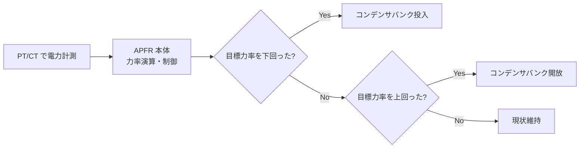

# 力率改善

## 30秒まとめ

力率改善はコンデンサで遅れ無効電力を補償する。直列リアクトルなしのコンデンサ単独設置は高調波で損傷するリスクがある（必ず直列リアクトル付きにする）。インバータが増えると進相側に振れる場合もあるため現状確認が先。

---

## 力率の定義とベクトル図

```
力率 = 有効電力（P）/ 皮相電力（S）= cos φ

皮相電力（S）= √(P² + Q²)
P：有効電力（kW）、Q：無効電力（kvar）、S：皮相電力（kVA）
```

```
         S（皮相電力）
        /|
       / |
      /  |
     /   | Q（無効電力）
    / φ  |
   /_____|
   P（有効電力）

cos φ が大きいほど S が小さくなり、電流が減少する
```

### 力率改善の電力三角形（計算例の値）

有効電力 P を固定し、コンデンサ Qc で無効電力 Q を押し下げると、力率角 φ が小さくなり皮相電力 S が縮む。下図は計算例（P = 500 kW、Qc ≒ 280 kvar、cos φ₁ = 0.75 → cos φ₂ = 0.95）の関係を示す。

<svg viewBox="0 0 640 360" role="img" aria-label="力率改善の電力三角形。有効電力Pを固定し、コンデンサQcで無効電力をQ1からQ2へ押し下げると、力率角がφ1からφ2へ小さくなり、皮相電力がS1からS2へ縮む。" style="max-width:100%;height:auto;font-family:sans-serif;">
  <!-- P (horizontal, fixed) -->
  <line x1="100" y1="310" x2="400" y2="310" stroke="currentColor" stroke-width="2"/>
  <!-- Q1 (before, tall) : right edge, dashed -->
  <line x1="400" y1="310" x2="400" y2="45" stroke="currentColor" stroke-width="1.5" stroke-dasharray="4 3"/>
  <!-- Q2 (after) portion, solid -->
  <line x1="400" y1="310" x2="400" y2="212" stroke="currentColor" stroke-width="2"/>
  <!-- S1 (before) hypotenuse -->
  <line x1="100" y1="310" x2="400" y2="45" stroke="currentColor" stroke-width="1.5" stroke-dasharray="4 3"/>
  <!-- S2 (after) hypotenuse -->
  <line x1="100" y1="310" x2="400" y2="212" stroke="currentColor" stroke-width="2.5"/>
  <!-- Qc segment (the part removed by capacitor) highlighted on the Q axis -->
  <line x1="400" y1="212" x2="400" y2="45" stroke="currentColor" stroke-width="5" opacity="0.3"/>
  <!-- Qc bracket to the right -->
  <line x1="470" y1="212" x2="470" y2="45" stroke="currentColor" stroke-width="1"/>
  <line x1="465" y1="212" x2="475" y2="212" stroke="currentColor" stroke-width="1"/>
  <line x1="465" y1="45" x2="475" y2="45" stroke="currentColor" stroke-width="1"/>
  <line x1="405" y1="212" x2="470" y2="212" stroke="currentColor" stroke-width="0.7" opacity="0.5" stroke-dasharray="3 3"/>
  <line x1="405" y1="45" x2="470" y2="45" stroke="currentColor" stroke-width="0.7" opacity="0.5" stroke-dasharray="3 3"/>
  <!-- origin dot -->
  <circle cx="100" cy="310" r="3" fill="currentColor"/>
  <!-- angle arcs -->
  <path d="M 150 310 A 50 50 0 0 0 138 275" fill="none" stroke="currentColor" stroke-width="1"/>
  <path d="M 180 310 A 80 80 0 0 0 176 296" fill="none" stroke="currentColor" stroke-width="1"/>
  <!-- labels -->
  <text x="250" y="332" fill="currentColor" font-size="15" text-anchor="middle">P（有効電力）= 500 kW</text>
  <text x="410" y="130" fill="currentColor" font-size="13" text-anchor="start">Q₁（改善前）</text>
  <text x="410" y="270" fill="currentColor" font-size="13" text-anchor="start">Q₂（改善後）</text>
  <text x="484" y="134" fill="currentColor" font-size="14" text-anchor="start">Qc ≒ 280 kvar</text>
  <text x="200" y="150" fill="currentColor" font-size="14" text-anchor="middle" transform="rotate(-41 200 150)">S₁（改善前）</text>
  <text x="235" y="255" fill="currentColor" font-size="14" text-anchor="middle" transform="rotate(-18 235 255)">S₂（改善後）</text>
  <text x="158" y="303" fill="currentColor" font-size="13" text-anchor="start">φ₁</text>
  <text x="187" y="306" fill="currentColor" font-size="12" text-anchor="start">φ₂</text>
  <text x="20" y="350" fill="currentColor" font-size="12" text-anchor="start" opacity="0.85">cos φ₁=0.75 → cos φ₂=0.95（φ₁ &gt; φ₂）</text>
</svg>

*P を固定したまま Qc で無効電力を Q₁ から Q₂ へ下げると φ₁ &gt; φ₂ となり、皮相電力が S₁ から S₂ へ縮む。*

---

## コンデンサ容量計算

### 目標力率への改善に必要なコンデンサ容量

```
Qc = P × (tan φ₁ - tan φ₂)

P：有効電力（kW）、φ₁：改善前の力率角、φ₂：目標力率角
```

### 計算例

有効電力 500 kW、現在力率 0.75（遅れ）→ 目標力率 0.95 に改善する場合

```
tan φ = √(1 - cos²φ) / cos φ

tan φ₁ = √(1 - 0.75²) / 0.75 = 0.6614 / 0.75 = 0.8819
tan φ₂ = √(1 - 0.95²) / 0.95 = 0.3122 / 0.95 = 0.3287

Qc = 500 × (0.8819 - 0.3287) = 500 × 0.5532 = 276.6 kvar ≒ 280 kvar
```

---

## 高調波とコンデンサ損傷リスク

### なぜ直列リアクトルが必要か

コンデンサ単体を接続すると、コンデンサのインピーダンスは周波数が高いほど低くなる（Xc = 1/2πfC）。このため高調波電流がコンデンサに集中し、過熱・損傷・最悪は爆発につながる。

直列リアクトルを接続することで**共振周波数を商用周波数より低い帯域**（4次高調波以下）に下げ、高調波電流の集中を防ぐ。

| 直列リアクトルの容量 | 共振周波数 | 効果 |
|-----------------|---------|------|
| 6%（標準） | 基本波の約4倍 | 5次以上の高調波を抑制 |
| 13%（高調波多い環境） | 基本波の約2.8倍 | 3次・5次高調波を抑制 |

!!! danger "直列リアクトルなしのコンデンサは設置禁止"
    インバータ・整流器が多い化学プラントでは高調波環境が厳しい。
    直列リアクトルなしのコンデンサ単体設置は高調波共振による損傷リスクが非常に高い。

---

## 自動力率調整装置（APFR）の動作

APFR（Automatic Power Factor Regulator）は系統の力率を監視し、コンデンサバンクを自動的に投入・開放して目標力率（通常 0.95〜1.0）を維持する。



### APFR の設定ポイント

| 設定項目 | 内容 |
|---------|------|
| 目標力率 | 0.95〜1.0（電力会社の要求値に合わせる） |
| 不感帯 | ±0.02 程度（ハンチング防止） |
| 投入・開放ディレイ | 30〜60秒（頻繁なスイッチングを防止） |
| 投入順序 | 基本：最も長く開放されていたバンクから投入 |

---

## 化学プラント固有：インバータ増加による力率の変化

近年インバータ（VFD）の普及により、力率の状況が変わってきている。

| 要因 | 力率への影響 |
|------|-----------|
| インバータ入力の高調波 | 見かけの力率を悪化させる（歪み率の影響） |
| インバータの内蔵 PFC 機能 | 力率を改善する方向に働く |
| インバータ増加でコンデンサが過剰になる | 進相過剰 → 電圧上昇・コンデンサ過負荷 |

!!! warning "コンデンサ設備の定期見直し"
    インバータ増設等で系統の無効電力バランスが変化することがある。
    電力会社の検針結果で力率を定期的に確認し、コンデンサ容量が過剰になっていないか確認する。
    進相過剰は電圧上昇・変圧器の絶縁劣化・コンデンサ自身の損傷につながる。
