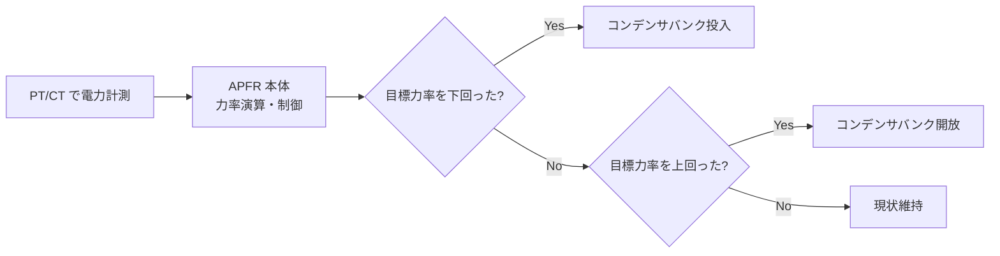

# 力率改善

## 30秒まとめ

力率改善はコンデンサで遅れ無効電力を補償する。直列リアクトルなしのコンデンサ単独設置は高調波で損傷するリスクがある（必ず直列リアクトル付きにする）。インバータが増えると系統の遅れ無効電力が減り、**固定コンデンサが相対的に過剰**になって進相側に振れることがあるため現状確認が先。

!!! info "技術はこのページ、経済性は ROI ページ"
    本ページは**技術面**（力率の定義・コンデンサ容量計算・直列リアクトルの必要性・APFR の動作）を扱います。
    **投資回収の判断**（力率割引制度・85%基準・回収年数の試算）は [力率改善ROI](../08-energy/power-factor-roi.md) を参照してください。容量計算と直列リアクトルの説明は両ページにありますが、**技術的な正典は本ページ**です。

---

## 力率の定義とベクトル図

```
力率 = 有効電力（P）/ 皮相電力（S）= cos φ

皮相電力（S）= √(P² + Q²)
P：有効電力（kW）、Q：無効電力（kvar）、S：皮相電力（kVA）
```

```
         S（皮相電力）
        /|
       / |
      /  |
     /   | Q（無効電力）
    / φ  |
   /_____|
   P（有効電力）

cos φ が大きいほど S が小さくなり、電流が減少する
```

!!! note "cos φ（変位力率）と P/S（総合力率）は歪みがあると一致しない"
    上のベクトル図は**正弦波（基本波だけ）**を前提にした関係です。インバータ・整流器のように電流波形が歪む負荷では、皮相電力に高調波分が乗るため **P/S（総合力率）< cos φ（基本波の変位力率）** になります。
    コンデンサで補償できるのは**基本波の遅れ無効電力**だけで、歪みによる差分はコンデンサを足しても埋まりません。歪みが疑われる場合は [高調波対策](harmonics.md) を先に確認してください。

---

## コンデンサ容量計算

### 目標力率への改善に必要なコンデンサ容量

```
Qc = P × (tan φ₁ - tan φ₂)

P：有効電力（kW）、φ₁：改善前の力率角、φ₂：目標力率角
```

### 計算例

有効電力 500 kW、現在力率 0.75（遅れ）→ 目標力率 0.95 に改善する場合

```
tan φ₁ = tan(arccos 0.75) = 0.8819
tan φ₂ = tan(arccos 0.95) = 0.3287

Qc = 500 × (0.8819 - 0.3287) = 500 × 0.5532 = 276.6 kvar ≒ 280 kvar
```

---

## 高調波とコンデンサ損傷リスク

### なぜ直列リアクトルが必要か

コンデンサ単体を接続すると、コンデンサのインピーダンスは周波数が高いほど低くなる（Xc = 1/2πfC）。このため高調波電流がコンデンサに集中し、過熱・損傷・最悪は爆発につながる。

直列リアクトルを接続すると、リアクトルとコンデンサの**直列共振点が基本波より高い次数**に現れます。設計のねらいは、この共振次数を**抑制したい最低次の高調波（通常は5次）より下**に置くことです。共振次数より高い周波数では回路全体が**誘導性**になるため、高調波電流がコンデンサに集中しなくなります。

共振次数 n は、リアクトルの容量比（コンデンサ容量に対する %）から求まります。

```text
n = 1 / √(リアクトル容量比)

6 %  → n = 1/√0.06 = 4.08   （5次より下）
13 % → n = 1/√0.13 = 2.77   （3次より下）
```

| 直列リアクトルの容量 | 直列共振の次数 | ねらい |
|-----------------|---------|------|
| 6%（標準） | 約 4.08 次 | 5次以上に対して誘導性 → 5次高調波の流入を抑える |
| 13%（3次高調波が多い環境） | 約 2.77 次 | 3次以上に対して誘導性 → 3次・5次高調波の流入を抑える |

!!! warning "「共振周波数を商用周波数より低くする」ではありません"
    かつて本ページは「共振周波数を商用周波数より低い帯域に下げる」と書いていましたが、直列共振点は上の計算のとおり**基本波の約4倍（6%の場合）**で、商用周波数より**高い**位置にあります。2026-08-05 に是正しました。低くするのは「共振点そのものの周波数」ではなく「共振**次数**を、抑制したい高調波の次数より下に置く」という意味です。

!!! danger "直列リアクトルなしのコンデンサは設置禁止"
    インバータ・整流器が多い化学プラントでは高調波環境が厳しい。
    直列リアクトルなしのコンデンサ単体設置は高調波共振による損傷リスクが非常に高い。

!!! info "高調波の発生源・障害・抑制ガイドラインは正典ページへ"
    高調波の発生源（次数 n = 6k ± 1）・障害・抑制対策ガイドラインと流出電流計算は[高調波対策](harmonics.md)にまとめています。ここでは進相コンデンサ側の直列リアクトル選定に絞って説明します。

---

## 自動力率調整装置（APFR）の動作

APFR（Automatic Power Factor Regulator）は系統の力率を監視し、コンデンサバンクを自動的に投入・開放して目標力率（通常 0.95〜1.0）を維持する。


```mermaid
flowchart LR
    A[PT/CT で電力計測] --> B[APFR 本体\n力率演算・制御]
    B --> C{目標力率を下回った?}
    C -- Yes --> D[コンデンサバンク投入]
    C -- No --> E{目標力率を上回った?}
    E -- Yes --> F[コンデンサバンク開放]
    E -- No --> G[現状維持]
```

### APFR の設定ポイント

| 設定項目 | 内容 |
|---------|------|
| 目標力率 | 0.95〜1.0（電力会社の要求値に合わせる） |
| 不感帯 | ±0.02 程度（ハンチング防止） |
| 投入・開放ディレイ | 30〜60秒（頻繁なスイッチングを防止） |
| 投入順序 | 基本：最も長く開放されていたバンクから投入 |

---

## 化学プラント固有：インバータ増加による力率の変化

近年インバータ（VFD）の普及により、力率の状況が変わってきている。

| 要因 | 力率への影響 |
|------|-----------|
| インバータ入力の高調波 | 総合力率（P/S）を悪化させる（歪みの影響。cos φ は良く見えることがある） |
| 力率改善（PFC）回路を**内蔵する機種**の採用 | 総合力率を改善する方向に働く（汎用のダイオード整流形は PFC 回路を持たず、AC/DC リアクトルで高調波を抑える構成が一般的） |
| インバータ化で系統の遅れ無効電力が減る | 既設の固定コンデンサが相対的に過剰 → 進相過剰・電圧上昇・コンデンサ過負荷 |

!!! warning "コンデンサ設備の定期見直し"
    インバータ増設等で系統の無効電力バランスが変化することがある。
    電力会社の検針結果で力率を定期的に確認し、コンデンサ容量が過剰になっていないか確認する。
    進相過剰は電圧上昇・変圧器の絶縁劣化・コンデンサ自身の損傷につながる。

---

## 根拠

### 本ページが正典の範囲

力率の定義・コンデンサ容量計算・直列リアクトルの選定（6%/13%）・APFR の動作は**本ページが技術面の正典**です。投資回収・力率割引制度は [力率改善ROI](../08-energy/power-factor-roi.md)、高調波の発生源・限度値・ガイドラインは [高調波対策](harmonics.md) が正典で、本ページは数値を再記述しません。

### 一次計算で検算済み（規格・法令を必要としない）

次はすべて定義から導けるもので、本ページで計算し直して確認しました（2026-08-05）。

| 項目 | 検算 |
|---|---|
| Qc = P(tan φ₁ − tan φ₂) | tan(arccos 0.75) = √(1−0.75²)/0.75 = 0.8819、tan(arccos 0.95) = √(1−0.95²)/0.95 = 0.3287。差 0.5532 × 500 kW = 276.6 kvar |
| 直列リアクトル 6% の共振次数 | n = 1/√0.06 = 4.082（5次より下） |
| 直列リアクトル 13% の共振次数 | n = 1/√0.13 = 2.774（3次より下） |
| Xc = 1/(2πfC) | 定義。周波数が高いほど容量性リアクタンスが下がる＝高調波電流が流れ込みやすい |

### 是正の記録

- **共振の向きの誤り**: 「共振周波数を商用周波数より低い帯域（4次高調波以下）に下げる」と書いていましたが、直列共振点は基本波の**約4.08倍**で商用周波数より**高い**位置にあります。「共振次数を、抑制したい高調波の次数より下に置く」が正しい表現です（2026-08-05 是正）
- **力率の定義の射程**: cos φ（変位力率）と P/S（総合力率）は歪みがあると一致しません。歪み分はコンデンサでは補償できないことを明示しました
- **インバータの PFC**: 「インバータの内蔵 PFC 機能」を一般的な要因として挙げていましたが、汎用のダイオード整流形は PFC 回路を持ちません。**内蔵する機種に限る**限定を付けました
- **進相側に振れる機序**: インバータ自身が進相無効電力を出すのではなく、**遅れ無効電力が減って既設の固定コンデンサが相対的に過剰になる**ことが原因です。因果を明示しました

### 原本未照合（honest-hold）

- **JIS C 4902（高圧及び特別高圧進相コンデンサ・直列リアクトル）は未入手**です。6% / 13% という容量比の**規格上の位置づけ（標準値か推奨値か）は本 Wiki では確認していません**。本文の 6% / 13% は実務で広く使われる値として扱い、規格の要求としては書いていません
- **直列リアクトルの定格（過負荷耐量・高調波含有率の前提）**も未照合です。実機選定はメーカーの技術資料と系統の実測高調波によってください
- **APFR の設定値**（不感帯 ±0.02、投入・開放ディレイ 30〜60 秒、目標力率 0.95〜1.0）は**規格・法令の裏付けがない実務慣行**です。機種と系統で変わります

### 実務慣行（規格・法令の裏付けなし）

- 「最も長く開放されていたバンクから投入する」という循環方式の投入順序（コンデンサと開閉器の寿命の平準化がねらい）
- 検針結果で力率を定期的に確認し、コンデンサ容量の過剰を見直す運用

### 限界の明示

- **直列リアクトルは高調波を「消す」装置ではありません。** コンデンサへの高調波電流の集中を防ぐもので、系統に流出する高調波の低減は [高調波対策](harmonics.md) の範囲です
- **共振次数の計算は理想的な LC 直列回路の値**です。実際は系統側インダクタンスと組み合わさるため、既設への追加時は並列共振の可能性を含めて検討してください
- 進相過剰の是正（バンクの解列・容量の見直し）は電圧上昇を伴うため、[変圧器](transformer.md) のタップ・許容電圧範囲とあわせて判断してください

### 正典参照

| 項目 | 正典 |
|---|---|
| 高調波の発生源・限度値・抑制ガイドライン | [高調波対策](harmonics.md) |
| 力率割引制度・回収年数の試算 | [力率改善ROI](../08-energy/power-factor-roi.md) |
| 進相過剰による電圧上昇と変圧器への影響 | [変圧器](transformer.md) |

照合日: 2026-08-05（計算は本ページで検算。規格原本は未照合）。

---

## 関連ページ

- [力率改善ROI](../08-energy/power-factor-roi.md) — 投資回収の試算・力率割引制度（経済性の正典）
- [高調波対策](harmonics.md) — 直列リアクトルと高調波の関係を掘り下げる
- [変圧器](transformer.md) — 進相過剰による電圧上昇が変圧器に与える影響
- [高圧カテゴリ](index.md) — より広い高圧知識へ
