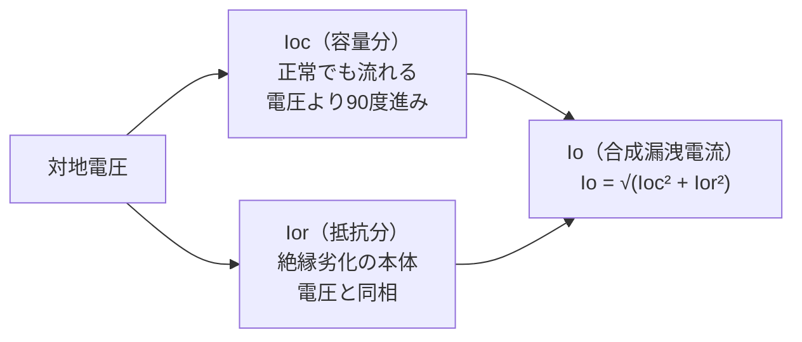

# 絶縁監視装置（常時監視・Ior方式）

## 30秒まとめ

絶縁監視装置（Insulation Monitoring Device）は、停電せずに低圧回路の絶縁状態を常時監視する装置です。劣化の本体は抵抗分漏洩電流（Ior）であり、対地静電容量による漏洩電流（Ioc）に埋もれて見えなくなります。インバータや長距離ケーブルが多く Ioc が大きい化学プラントでは、合成漏洩電流（Io）だけを見る方式は誤報・見逃しが増えるため、Ior を分離して監視する方式が有効です。

!!! info "スポット測定とは補完関係"
    停電して絶縁抵抗計（メガー）で測る方法は [耐圧試験・絶縁診断](../01-koatsu/insulation-test.md) を参照してください。本ページは **無停電で連続監視する** 装置を扱います。

---

## スポット測定との違い — 「点」と「線」

絶縁抵抗計（Insulation Resistance Tester、メガー）による測定は、停電したうえである瞬間の絶縁抵抗値を「点」で捉えます。一方、絶縁監視は運転を止めずに絶縁状態を「線」（連続）で捉えます。

| 観点 | スポット測定（メガー） | 常時監視（絶縁監視装置） |
|------|---------------------|----------------------|
| 測定タイミング | 停電時の一時点 | 通電中に連続 |
| 停電の要否 | 必要 | 不要 |
| 捉えられる現象 | 測定時点の絶縁抵抗 | 劣化の進行トレンド・突発的な低下 |
| 連続プロセスへの適性 | 低い（年次点検などに限られる） | 高い |
| 主な弱点 | 測定間の変化を見逃す | 機器個別の故障点までは特定しにくい |

!!! tip "連続プラントでこそ価値がある"
    化学プラントは年に数回しか全停電できないことが多く、メガー測定の機会が限られます。停止できない回路の絶縁劣化を、運転したまま早期に把握できる点が常時監視の最大の利点です。両者は排他ではなく、常時監視でトレンドを掴み、停止時にメガーで確定する補完関係で運用します。

---

## 漏洩電流の分解 — Io・Ioc・Ior

低圧回路の対地漏洩電流には、性質の異なる 2 つの成分が含まれます。

- **Ioc（容量分漏洩電流）**: 電線やケーブルの対地静電容量を通って流れる電流。絶縁が正常でも常に流れ、印加電圧に対して位相が 90 度進みます。
- **Ior（抵抗分漏洩電流）**: 絶縁体の抵抗を通って流れる電流。絶縁劣化が進むほど増えるため、**こちらが劣化の本体**です。印加電圧と同相です。

合成漏洩電流 Io は、この 2 成分のベクトル和になります。位相が 90 度ずれているため、単純な足し算ではなく次の関係になります。

**Io = √(Ioc² + Ior²)**



ベクトルで見ると、Ioc を一辺、Ior をそれに直交する一辺とした直角三角形の斜辺が Io にあたります。Ioc が大きい回路では、Ior が多少増えても斜辺 Io はほとんど変わりません。

!!! warning "Io 監視だけでは劣化が埋もれる"
    対地静電容量が大きい回路（長距離ケーブル、ノイズフィルタ内蔵機器など）では Ioc が支配的になり、劣化を表す Ior の増加が Io の中に埋もれます。その結果、

    - **見逃し**: Ior が増えても Io が動かず、劣化に気づけない
    - **誤報**: 機器の増設やケーブル延長で Ioc が増えただけなのに Io が上がり、劣化と誤判定する

    という両方向の不具合が起こります。Ior を分離して監視すると、この構造的な弱点を避けられます。

---

## Ior方式が化学プラントで有効な理由

Ior 方式（抵抗分検出方式）は、対地電圧の位相を基準に漏洩電流から抵抗分だけを取り出して監視します。Ioc の影響を受けにくいため、容量分が大きい現場ほど Io 方式に対する優位が大きくなります。

化学プラントは、まさに Ioc が大きくなりやすい条件がそろっています。

| プラント側の条件 | Ioc への影響 | Io 方式で起きること |
|----------------|------------|------------------|
| インバータ（Inverter）を多用 | 内蔵 EMC フィルタ・対地容量で Ioc 増加 | キャリアノイズ・高調波で Io が変動し誤報 |
| 長距離ケーブル配線 | ケーブル対地静電容量で Ioc 増加 | Ior 増加が Io に埋もれ見逃し |
| 多数の負荷が同一系統に集中 | 並列で Ioc が累積 | ベースライン Io が高く感度低下 |
| ノイズ環境（動力機器が密集） | 高調波電流が漏洩電流に重畳 | Io が振れて警報が安定しない |

!!! info "Io 方式が不利になるほど Ior 方式が効く"
    Io 方式が苦手とする「Ioc が大きく・ノイズが多い」現場は、化学プラントの典型条件です。Ioc の影響を受けにくい Ior 方式は、こうした現場でこそ誤報・見逃しの抑制効果が大きくなります。インバータのノイズ対策そのものは [インバータ](inverter.md) と [接地（低圧）](grounding-lv.md) を参照してください。

---

## 警報設定の考え方

絶縁監視装置の警報は、固定した一つのしきい値ではなく、**回路ごとのベースライン（平常値）からの変化**で考えるのが基本です。回路によって正常時の漏洩電流は大きく異なるため、絶対値だけで一律に判定すると感度が合いません。

### 2段警報の考え方

| 段階 | 役割 | 想定する対応 |
|------|------|------------|
| 注意（第1段） | 平常値からの上昇傾向を早期に検知 | トレンド確認・点検計画への反映 |
| 警報（第2段） | 明確な劣化・無視できない上昇を通知 | 停止時の精密測定・原因調査 |

2 段にすることで、「すぐ対応すべき劣化」と「監視を強める段階」を分けて運用できます。

<svg viewBox="0 0 640 320" role="img" aria-label="Ior のトレンド線に対し、平常値の2〜3倍を注意、さらに上を警報とする2段しきい値と対応アクションを示した時間軸グラフ" style="max-width:100%;height:auto;" xmlns="http://www.w3.org/2000/svg">
  <!-- 軸 -->
  <line x1="70" y1="30" x2="70" y2="270" stroke="currentColor" stroke-width="1.5"/>
  <line x1="70" y1="270" x2="610" y2="270" stroke="currentColor" stroke-width="1.5"/>
  <text x="40" y="150" fill="currentColor" font-size="13" text-anchor="middle" transform="rotate(-90 40 150)">Ior</text>
  <text x="340" y="298" fill="currentColor" font-size="13" text-anchor="middle">時間（トレンド）</text>

  <!-- 平常値（ベースライン） -->
  <line x1="70" y1="240" x2="610" y2="240" stroke="currentColor" stroke-width="1" stroke-dasharray="2 3" opacity="0.6"/>
  <text x="78" y="235" fill="currentColor" font-size="12" opacity="0.8">平常値（ベースライン）</text>

  <!-- 注意ライン（平常値の2〜3倍） -->
  <line x1="70" y1="160" x2="610" y2="160" stroke="currentColor" stroke-width="1.3" stroke-dasharray="6 4"/>
  <text x="600" y="153" fill="currentColor" font-size="12" text-anchor="end">注意（平常値の2〜3倍）</text>

  <!-- 警報ライン（さらに上の水準） -->
  <line x1="70" y1="90" x2="610" y2="90" stroke="currentColor" stroke-width="1.5"/>
  <text x="600" y="83" fill="currentColor" font-size="12" text-anchor="end">警報（さらに上の水準）</text>

  <!-- Ior 上昇トレンド線 -->
  <path d="M 80 242 C 200 238, 300 205, 380 160 S 520 105, 590 78" fill="none" stroke="currentColor" stroke-width="2.5"/>

  <!-- 注意到達点 -->
  <circle cx="380" cy="160" r="4.5" fill="currentColor"/>
  <text x="380" y="185" fill="currentColor" font-size="11.5" text-anchor="middle">→ トレンド確認・点検計画へ反映</text>

  <!-- 警報到達点 -->
  <circle cx="560" cy="90" r="4.5" fill="currentColor"/>
  <text x="558" y="118" fill="currentColor" font-size="11.5" text-anchor="middle">→ 停止時の精密測定・原因調査</text>
</svg>

*時間とともに上昇する Ior が、平常値の2〜3倍で「注意」、さらに上の水準で「警報」に達し、段ごとに対応アクションが切り替わる。*

!!! note "具体的なしきい値は回路条件に依存する"
    警報値（mA）は、回路の長さ・負荷構成・系統の対地容量によって大きく変わるため、**一般的な数値をそのまま当てはめることはできません**。一般的な目安として「平常時 Ior の 2〜3 倍程度を注意、さらに上の水準を警報」のように、各回路で実測したベースラインを基準に相対的に設定する考え方が用いられます。具体的な mA 値は装置メーカーの推奨と現場のベースライン測定にもとづいて決めてください。

---

## 導入・運用ステップ

常時監視は「付けて終わり」ではなく、ベースラインを把握しトレンドを管理して初めて機能します。

```
1. 重要回路の選定
   - 停止できない連続プロセス、停止コストの大きい回路を優先
   - 過去に絶縁トラブルがあった回路、長距離・高経年の回路を含める

2. ベースライン測定
   - 健全な状態の Io / Ior を一定期間記録し、平常値の範囲を把握
   - 負荷の運転パターン（インバータの稼働など）による変動幅も確認

3. 警報値設定
   - 回路ごとのベースラインを基準に、注意・警報の2段を設定
   - 一律の絶対値ではなく、平常値からの上昇で判定

4. トレンド管理
   - 漏洩電流の推移を継続記録し、緩やかな上昇傾向を早期に把握
   - しきい値到達を待たず、傾向の段階で点検・対策につなげる
```

!!! tip "ベースラインなしの警報は機能しない"
    平常値を把握しないまま既定値で警報だけ入れると、Ioc の大きい回路では常時警報、小さい回路では劣化を見逃す、という両極端になりがちです。導入初期のベースライン測定が運用の成否を分けます。

---

## 落とし穴

!!! warning "インバータのキャリアノイズ・高調波"
    インバータのスイッチングによるキャリア周波数成分や高調波は、漏洩電流に重畳して測定値を揺らします。Io 方式では誤報の主因になります。基本波の対地電圧を基準に抵抗分を取り出す Ior 方式や、装置側のフィルタ機能で影響を抑える設計が前提になります。装置の対応周波数範囲とインバータのキャリア周波数の関係も確認してください。

!!! warning "B種接地線への取付位置"
    変流器（ZCT など）の取付位置によって、監視できる範囲が変わります。系統全体を見るのか個別フィーダを見るのかで取付点が異なり、位置を誤ると監視範囲が意図とずれます。B 種接地線まわりに取り付ける場合は、監視対象の系統とリターン経路を取り違えないよう、結線を確認したうえで設置してください。接地工事側の前提は [接地（低圧）](grounding-lv.md) を参照してください。

!!! warning "複数バンク系統での監視範囲"
    変圧器が複数バンクある系統では、どのバンク（どの接地系統）を監視しているのかを明確にする必要があります。バンクをまたいで漏洩電流の経路を取り違えると、別系統の変動を自回路の劣化と誤認したり、逆に監視できていない死角が生じたりします。系統構成図と接地系統の対応を整理してから監視範囲を決めてください。

!!! info "法令上の位置づけ"
    低圧電路の絶縁性能は電気設備技術基準で定める水準を満たす必要があり（低圧電路の対地電圧区分ごとの絶縁抵抗の法定下限0.1/0.2/0.4MΩは電技省令第58条）、絶縁監視はその維持・確認を運転中に支援する手段と位置づけられます。常時監視装置の設置自体が一律に義務づけられているわけではないため、自社の保安規程・設備の重要度に応じて導入を判断します。具体的な要求値や条文の適用は一次情報で確認してください。

---

## 関連ページ

- [耐圧試験・絶縁診断](../01-koatsu/insulation-test.md) — 停電して測るスポット測定（メガー・PI 値・耐圧試験）
- [インバータ](inverter.md) — キャリアノイズ・高調波の発生源とノイズ対策
- [接地（低圧）](grounding-lv.md) — D 種接地・B 種接地・ノイズ接地の実装
- [低圧ケーブル](lv-cable.md) — 対地静電容量に関わるケーブル選定
- [グランドと接地](../03-keiso/grounding-gnd.md) — FG/SG/PGND など接地種別の定義
