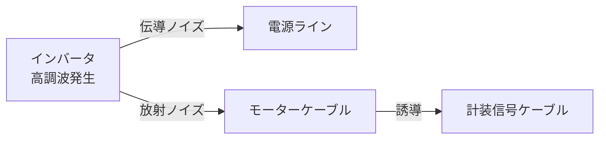

# インバータ

## 30秒まとめ

インバータ容量はモーター定格の 1.1〜1.5 倍で選定。キャリア周波数を上げると音が静かになるが損失増加・長距離配線問題が悪化する。化学プラントでは防爆エリアにインバータを設置できないため制御盤は安全エリアに置き、長距離ケーブルにはリアクトルを追加する。

---

## 容量選定

```
インバータ定格容量 [kVA] ≥ モーター定格出力 [kW] × 1.1〜1.5 倍
```

| 条件 | 選定係数 |
|------|---------|
| 通常（ポンプ・ファン） | 1.1〜1.2 倍 |
| 慣性が大きい負荷（コンプレッサー・攪拌機） | 1.3〜1.5 倍 |
| 頻繁な加減速 | 1.5 倍 |
| 短絡保護協調を要する場合 | メーカー選定ツールで確認 |

!!! tip "電流ベースで確認"
    容量選定後、インバータの定格電流がモーター定格電流を上回ることを確認する。kW 換算だけでは不十分。

---

## 基本パラメータ一覧

| パラメータ | 内容 | 一般的な設定範囲 |
|-----------|------|---------------|
| 加速時間（Acc） | 0Hz → 最高周波数に達するまでの時間 | 5〜60秒（負荷慣性による） |
| 減速時間（Dec） | 最高周波数 → 0Hz に達するまでの時間 | 5〜60秒（過電圧トリップに注意） |
| 上限周波数 | モーター最大回転数を規定 | 50/60/80Hz（設備許容値以下） |
| 下限周波数 | 最低回転数（ファン冷却確保） | 10〜20Hz |
| キャリア周波数 | PWM スイッチング周波数 | 2〜15kHz（長距離配線は低め） |
| V/f 特性 | 電圧・周波数比率 | 汎用：定トルク / ファン・ポンプ：2乗低下 |

!!! warning "減速時間が短すぎると"
    慣性の大きい負荷では制動エネルギーで直流中間回路電圧が上昇し過電圧フォルトが発生する。制動抵抗または回生対応インバータを選定する。

---

## 主要メーカー パラメータ対応表

| 機能 | 三菱 FR-A800 | 安川 A1000 | 富士 FRENIC-Ace |
|------|------------|-----------|---------------|
| 加速時間 | Pr.7 | C1-01 | F07 |
| 減速時間 | Pr.8 | C1-02 | F08 |
| 上限周波数 | Pr.1 | d2-01 | F03 |
| 下限周波数 | Pr.2 | d2-02 | F04 |
| キャリア周波数 | Pr.72 | C6-02 | F26 |
| トルクブースト | Pr.0 | A1-02（制御モード） | F09 |
| 熱電子保護レベル | Pr.9 | E2-01 | F11 |
| 外部異常入力 | Pr.185 | H1-xx | E01〜 |

---

## ノイズ対策

### 発生源と伝搬経路



### 対策一覧

| 対策 | 内容 | 効果 |
|------|------|------|
| EMC フィルタ（ラインフィルタ） | インバータ一次側に挿入 | 電源ラインへの伝導ノイズ低減 |
| シールドケーブル（モーターケーブル） | 両端接地または盤側のみ接地 | 放射ノイズ低減 |
| 出力リアクトル | インバータ二次側に挿入 | 電流波形改善、長距離ケーブル対策 |
| 強電・弱電の分離 | ラック分離または仕切板使用（300mm 以上） | 誘導ノイズ防止 |
| キャリア周波数低減 | 2〜4kHz に設定 | 放射ノイズ低減（ただし音が大きくなる） |
| 接地の一点化 | インバータ、モーター、シールドを同一接地点に | ループアース防止 |

---

## 長距離配線時のリアクトル必要性

モーターケーブルが長くなるとケーブルの浮遊容量による充電電流がインバータに流れ込み、インバータの過電流保護が誤動作したり、モーター絶縁に悪影響を与える。

| ケーブル長 | 対策 |
|----------|------|
| 50m 以内 | 通常配線で問題なし |
| 50〜100m | 出力リアクトル推奨 |
| 100m 超 | 出力リアクトル必須、sinフィルタも検討 |

---

## 化学プラント固有：防爆エリアの取り扱い

!!! danger "インバータを防爆エリアに設置禁止"
    インバータ本体は防爆構造に適合しないため、防爆エリア（危険場所）への直接設置は原則禁止。

**標準的な配置：**

```
安全エリア（制御室・電気室）
    │
  [インバータ 盤内設置]
    │
  シールドケーブル（長距離配線）
    │
防爆エリア（危険場所）
    │
  [防爆型モーター]（Ex 認証品）
```

- インバータ〜モーター間のケーブルには出力リアクトルを挿入
- ケーブルシールドは電気室端で接地（防爆エリア側は単端接地）
- モーター端子箱は防爆認証（Ex d または Ex e）を確認
