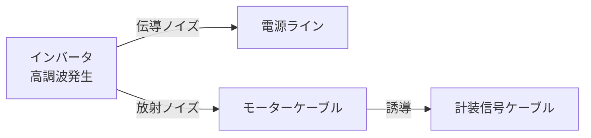

# インバータ

## 30秒まとめ

インバータは定格電流ベースでモーター定格電流の 1.1〜1.5 倍の余裕を持たせて選定。キャリア周波数を上げると音が静かになるが損失増加・長距離配線問題が悪化する。化学プラントでは防爆エリアにインバータを設置できないため制御盤は安全エリアに置き、長距離ケーブルにはリアクトルを追加する。防爆モーターのインバータ駆動は「組合せで防爆検定を受けた専用品」が前提。

---

## 容量選定

```
インバータ定格電流 [A] ≥ モーター定格電流 [A] × 選定係数（1.1〜1.5）
```

適用モーター容量 [kW] 表示はメーカー・シリーズごとの基準（過負荷耐量・使用条件）が異なるため、**最終確認は必ず定格電流で行う**。kVA 表示の定格容量と kW 表示のモーター出力を直接比較しない（単位が異なり、力率・効率の分だけずれる）。

| 条件 | 選定係数 |
|------|---------|
| 通常（ポンプ・ファン） | 1.1〜1.2 倍 |
| 慣性が大きい負荷（コンプレッサー・攪拌機） | 1.3〜1.5 倍 |
| 頻繁な加減速 | 1.5 倍 |
| 短絡保護協調を要する場合 | メーカー選定ツールで確認 |

!!! tip "電流ベースで確認"
    容量選定後、インバータの定格電流がモーター定格電流を上回ることを確認する。kW 換算だけでは不十分。

---

## 基本パラメータ一覧

| パラメータ | 内容 | 一般的な設定範囲 |
|-----------|------|---------------|
| 加速時間（Acc） | 0Hz → 最高周波数に達するまでの時間 | 5〜60秒（負荷慣性による） |
| 減速時間（Dec） | 最高周波数 → 0Hz に達するまでの時間 | 5〜60秒（過電圧トリップに注意） |
| 上限周波数 | モーター最大回転数を規定 | 50/60/80Hz（設備許容値以下） |
| 下限周波数 | 最低回転数（ファン冷却確保） | 10〜20Hz |
| キャリア周波数 | PWM スイッチング周波数 | 2〜15kHz（長距離配線は低め） |
| V/f 特性 | 電圧・周波数比率 | 汎用：定トルク / ファン・ポンプ：2乗低下 |

!!! warning "減速時間が短すぎると"
    慣性の大きい負荷では制動エネルギーで直流中間回路電圧が上昇し過電圧フォルトが発生する。制動抵抗または回生対応インバータを選定する。

---

## 主要メーカー パラメータ対応表

| 機能 | 三菱 FR-A800 | 安川 A1000 | 富士 FRENIC-Ace |
|------|------------|-----------|---------------|
| 加速時間 | Pr.7 | C1-01 | F07 |
| 減速時間 | Pr.8 | C1-02 | F08 |
| 上限周波数 | Pr.1 | d2-01 | F15（周波数リミッタ 上限） |
| 下限周波数 | Pr.2 | d2-02 | F16（周波数リミッタ 下限） |
| キャリア周波数 | Pr.72 | C6-02 | F26（モータ運転音） |
| トルクブースト | Pr.0 | A1-02（制御モード） | F09 |
| 電子サーマル（動作レベル） | Pr.9 | E2-01（モータ定格電流） | F11 |
| 外部異常入力 | Pr.185 | H1-xx | E01〜 |

!!! note "この表は時点の例示"
    パラメータ番号は機種・世代・ROM バージョンで変わる。FRENIC-Ace の「最高出力周波数」は別コード（F03）で、上限周波数の役割は周波数リミッタ（F15）が担う。設定前に必ず該当機種の取扱説明書で確認すること。

---

## ノイズ対策

### 発生源と伝搬経路


```mermaid
flowchart LR
    INV[インバータ\n高調波発生] -->|伝導ノイズ| PWR[電源ライン]
    INV -->|放射ノイズ| CABLE[モーターケーブル]
    CABLE -->|誘導| SIG[計装信号ケーブル]
```

### 対策一覧

| 対策 | 内容 | 効果 |
|------|------|------|
| EMC フィルタ（ラインフィルタ） | インバータ一次側に挿入 | 電源ラインへの伝導ノイズ低減 |
| シールドケーブル（モーターケーブル） | 両端接地または盤側のみ接地 | 放射ノイズ低減 |
| 出力リアクトル | インバータ二次側に挿入 | 電流波形改善、長距離ケーブル対策 |
| 強電・弱電の分離 | ラック分離または仕切板使用。**インバータ電力ケーブルは通常動力線の2倍（600mm 以上）を推奨**（正典: [計装配線](../03-keiso/wiring.md)） | 誘導ノイズ防止 |
| キャリア周波数低減 | 2〜4kHz に設定 | 放射ノイズ低減（ただし音が大きくなる） |
| 接地の一点化 | インバータ、モーター、シールドを同一接地点に | ループアース防止 |

---

## 長距離配線時のリアクトル必要性

モーターケーブルが長くなるとケーブルの浮遊容量による充電電流がインバータに流れ込み、インバータの過電流保護が誤動作したり、モーター絶縁に悪影響を与える。

| ケーブル長 | 対策 |
|----------|------|
| 50m 以内 | 通常配線で問題なし |
| 50〜100m | 出力リアクトル推奨 |
| 100m 超 | 出力リアクトル必須、サインフィルタ（正弦波フィルタ）も検討 |

---

## 化学プラント固有：防爆エリアの取り扱い

!!! danger "インバータを防爆エリアに設置禁止"
    インバータ本体は防爆構造に適合しないため、防爆エリア（危険場所）への直接設置は原則禁止。

**標準的な配置：**

```
安全エリア（制御室・電気室）
    │
  [インバータ 盤内設置]
    │
  シールドケーブル（長距離配線）
    │
防爆エリア（危険場所）
    │
  [防爆型モーター]（Ex 認証品）
```

- インバータ〜モーター間のケーブルには出力リアクトルを挿入
- ケーブルシールドの接地方法（両端接地／盤側のみの単端接地）はメーカーの EMC 指針・防爆設計指針に従う（上のノイズ対策表参照）
- **モーターはインバータ駆動対応として「インバータとの組合せで防爆検定（型式検定）を受けた耐圧防爆品」を使う**。指定された組合せ以外のインバータで駆動しない

!!! danger "既設の防爆モーターを汎用インバータで駆動しない"
    商用電源での運転を前提に検定を受けた防爆モーター（特に安全増防爆 Ex e）は、インバータ駆動が**原則不可**。低速運転時の冷却低下と高調波による温度上昇で、検定時の温度上昇限度を超え、防爆性能が担保されなくなる。インバータ化する場合はモーターごと「インバータ駆動対応の組合せ検定品」に更新する。

---

## 根拠

### 本ページが正典の範囲

本ページは「インバータの選定・パラメータ・ノイズ対策・防爆エリアでの配置」の正典です。防爆構造の種類・危険場所の区分は [防爆](../03-keiso/explosion-proof.md)、モーターの始動方式は [モーター制御](motor-control.md) が正典で、本ページでは数値を再記述しません。

### 一次照合済みの条項号（e-Gov 照合）

| 条項 | 確認した内容 |
|---|---|
| 労働安全衛生規則 第280条 | 引火性の物の蒸気・可燃性ガスが爆発の危険のある濃度に達するおそれのある箇所では「防爆性能を有する防爆構造電気機械器具でなければ、使用してはならない」（第1項）。労働者にも同項の機器以外の使用を禁じる（第2項）。→ 防爆性能を持たない汎用インバータを危険場所に設置できない根拠 |

### 一次照合済み（メーカー原本 照合）

富士電機 FRENIC-Ace 取扱説明書 第5章「機能コード」の一覧表で以下を逐語確認した：F03=最高出力周波数1／F04=ベース（基底）周波数1／F07=加速時間1／F08=減速時間1／F09=トルクブースト1／F10・F11=電子サーマル1（モータ保護用・動作レベル）／F15=周波数リミッタ（上限）／F16=周波数リミッタ（下限）／F26=モータ運転音（キャリア周波数）。

### 二次資料で一致を確認（原本未照合）

- 防爆モーターのインバータ駆動は「モーターとインバータの**組合せで防爆検定の型式認定**を受けたもの」が必要であり、既設の防爆モーター・安全増防爆モーターを汎用インバータで駆動してはならないこと（三菱電機FA・東芝産業機器システムの公式技術FAQで一致。型式検定の基準文書原本は未照合）
- 減速時間が短すぎると直流中間回路の過電圧トリップに至ること、長距離配線で浮遊容量による充電電流・過電流誤動作が起きることは、複数メーカーの技術資料で一致

### 是正の記録（2026-08-05）

- 「インバータ定格容量 [kVA] ≥ モーター定格出力 [kW] × 1.1〜1.5 倍」→「インバータ定格電流 [A] ≥ モーター定格電流 [A] × 1.1〜1.5」 → kVA と kW を同じ式で直接比較する単位系の混在を是正（30秒まとめも同期）
- FRENIC-Ace「下限周波数 = F04」→「F16（周波数リミッタ 下限）」 → F04 はベース（基底）周波数であり下限周波数ではない（取説原本で確定）。上限周波数も F03（最高出力周波数）→ F15（周波数リミッタ 上限）に是正
- 「熱電子保護レベル」→「電子サーマル（動作レベル）」 → 用語の誤り（正式名称は電子サーマル）
- 「モーター端子箱は防爆認証（Ex d または Ex e）を確認」→ 組合せ検定品の使用を明記 → 端子箱の認証だけ確認すればよい・Ex e でもインバータ駆動可、と誤読される危険側の記述を是正（安全増防爆のインバータ駆動は原則不可）
- 「ケーブルシールドは電気室端で接地（防爆エリア側は単端接地）」→ メーカー指針参照に変更 → 同一ページ内のノイズ対策表（両端接地または盤側のみ接地）と矛盾していた内部不一致を解消
- 「sinフィルタ」→「サインフィルタ（正弦波フィルタ）」 → 表記の是正

### 是正の記録（2026-08-06 — 離隔距離の横断監査）

**離隔距離が正典と食い違っていました。** 本ページは「強電・弱電の分離｜ラック分離または仕切板使用（**300mm 以上**）」と書いていましたが、正典 [計装配線](../03-keiso/wiring.md) は次のとおりです。

- 平行布設（金属仕切り**なし**）: 300 mm 以上／平行布設（金属仕切り**あり**）: 150 mm 以上／交差（90°）: 離隔不要
- **インバータ（VFD）の電力ケーブルは高周波ノイズが多いため、通常動力線の2倍（600 mm 以上）を推奨**

つまり本ページは、**インバータ専用の推奨値（600 mm）ではなく一般の動力線の値（300 mm）を書いており**、かつ「ラック分離**または**仕切板使用」と並べたことで**仕切りの有無で値が変わる**（150／300）区別も潰していました。**インバータのページがインバータ固有の推奨を下回る値を示す**のは影響が大きいため、正典参照に一本化しました。離隔距離の一次照合結果（電技解釈第167条には**並び順も離隔距離の規定も無い**＝実務目安であること）は正典側が持ちます。

### 原本未照合（honest-hold）

- 三菱 FR-A800（Pr.7／Pr.8／Pr.1／Pr.2／Pr.72／Pr.0／Pr.9／Pr.185）・安川 A1000（C1／d2／C6／A1／E2／H1 系）のパラメータ番号は取説原本を未照合。時点の例示であり、設定前に必ず該当機種の取説で確認すること
- 防爆検定（型式検定）の実施主体・基準文書（電気機械器具防爆構造規格・工場電気設備防爆指針）の原本は未照合

### 実務慣行（規格・法令の裏付けなし）

- 選定係数 1.1〜1.5（負荷種別ごとの目安）、加減速時間 5〜60 秒、下限周波数 10〜20 Hz、キャリア周波数 2〜15 kHz という設定範囲の目安
- 接地の一点化（離隔距離の目安は正典 [計装配線](../03-keiso/wiring.md) に一本化。本ページでは値を再記述しない）
- ケーブル長 50 m／100 m でリアクトル要否を切り替えるしきい値（メーカー推奨に基づく目安で、機種・キャリア周波数により変わる）

### 限界の明示

- 本ページの目安値だけで**機器選定・防爆設計を確定してはいけない**。容量はメーカー選定ツールと定格電流で、防爆はモーター・インバータの検定内容と危険場所区分で確定する
- 危険場所の区分（Zone）・防爆構造の選定は [防爆](../03-keiso/explosion-proof.md) が正典

### 正典参照

| 項目 | 正典 |
|---|---|
| 防爆構造の種類・危険場所区分 | [防爆](../03-keiso/explosion-proof.md) |
| モーター始動方式・保護 | [モーター制御](motor-control.md) |
| 低圧配電・フィルタ配置 | [低圧配電](distribution.md) |
| PLC との通信 | [PLC基礎](plc.md) |

照合日: 2026-08-06（離隔距離を正典と突合。2026-08-05: 労安則第280条を e-Gov 法令APIで逐語照合、FRENIC-Ace 機能コードをメーカー取説原本の一覧表で照合、防爆モーターのインバータ駆動可否をメーカー公式FAQ 2系統で確認）。

---

## 関連ページ

- [モーター制御](motor-control.md) — モーター直入れ・Y-Δ始動との比較
- [低圧配電](distribution.md) — インバータ給電・EMC フィルタ配置
- [PLC基礎](plc.md) — インバータとの通信（CC-Link/Modbus/EtherNet）
- [低圧カテゴリ](index.md) — より広い低圧知識へ
