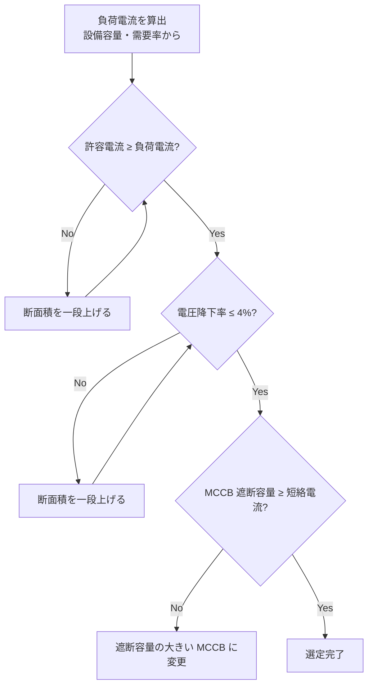

# 低圧ケーブル

## 30秒まとめ

低圧ケーブル選定は「許容電流 → 電圧降下 → 短絡容量」の順に確認する。化学プラントでは耐熱・耐油・耐薬品性も選定要素に入る。CV/CVT が標準だが腐食雰囲気や防爆エリアは EM-CE や耐熱 VV など用途別を選ぶ。

---

## 電線・ケーブル種類

| 種類 | 絶縁・外装 | 主な用途 | 特徴 |
|------|-----------|---------|------|
| IV | ビニル絶縁 | 盤内配線・接地線 | 単線・より線、管路使用 |
| VVR | ビニル絶縁・ビニル外装（丸形） | 一般幹線・制御 | 可とう性あり、室内敷設 |
| CV | 架橋ポリエチレン絶縁・ビニル外装 | 動力・幹線 | 許容電流大・標準品 |
| CVT | CV 3芯撚合せ | 動力幹線（省スペース） | 曲げやすい |
| EM-CE | エコ架橋ポリエチレン絶縁・難燃 | 動力・制御（難燃要求） | ノンハロゲン難燃 |
| 耐熱 VV | 耐熱ビニル絶縁・外装 | 高温雰囲気（60℃超） | 最高許容温度 75℃ |
| MI ケーブル | 無機絶縁（酸化マグネシウム） | 非常用・耐火配線 | 耐火 950℃ |

---

## 許容電流表（CV 3芯 600V）

| 断面積 [mm²] | 管路敷設 [A] | 空中敷設（気中） [A] | ケーブルラック [A] |
|------------|------------|-------------------|-----------------|
| 2.0 | 19 | 26 | 24 |
| 3.5 | 26 | 36 | 33 |
| 5.5 | 34 | 47 | 43 |
| 8 | 42 | 58 | 53 |
| 14 | 61 | 84 | 77 |
| 22 | 78 | 107 | 98 |
| 38 | 105 | 144 | 132 |
| 60 | 135 | 185 | 170 |
| 100 | 175 | 240 | 220 |

!!! warning "補正係数を忘れずに"
    - 周囲温度 40℃ 超：温度補正係数を乗じる（40℃ 基準値）
    - 管路内多条：本数に応じた低減係数を適用
    - 太陽直射：直射補正係数（気中値より低下）

---

## 電圧降下計算式

### 三相 3 線式

```
e = √3 × I × (R cosθ + X sinθ) × L

e     : 電圧降下 [V]
I     : 電流 [A]
R     : 導体抵抗 [Ω/km]
X     : リアクタンス [Ω/km]（ケーブルカタログ値）
cosθ  : 負荷力率（電動機は 0.8 が目安）
L     : 片道ケーブル長 [km]
```

### 単相 2 線式

```
e = 2 × I × (R cosθ + X sinθ) × L
```

### 電圧降下率

```
電圧降下率 [%] = e / V0 × 100

V0 : 受電端電圧 [V]（200V または 400V）
```

### 許容値（内線規程）

| 区分 | 許容電圧降下率 |
|------|-------------|
| 幹線（受電点〜分電盤） | 2% 以内 |
| 分岐（分電盤〜負荷） | 2% 以内 |
| 合計 | 4% 以内 |

電動機始動時は通常負荷の 5〜8 倍の電流が流れるため、始動電流での電圧降下も別途確認する。

---

## ケーブルサイズ選定ツール

<div class="cable-calc" markdown="block">

<style>
.cable-calc-box {
  background: var(--md-code-bg-color, #f5f5f5);
  border: 1px solid var(--md-default-fg-color--lightest, #ddd);
  border-radius: 8px;
  padding: 1.2rem 1.5rem;
  margin: 1rem 0;
}
.cable-calc-box h4 {
  margin: 0 0 1rem 0;
  font-size: 1rem;
  color: var(--md-primary-fg-color, #00897b);
}
.cable-grid {
  display: grid;
  grid-template-columns: repeat(auto-fit, minmax(200px, 1fr));
  gap: 0.8rem;
}
.cable-field label {
  display: block;
  font-size: 0.82rem;
  color: var(--md-default-fg-color--light, #666);
  margin-bottom: 0.25rem;
}
.cable-field input,
.cable-field select {
  width: 100%;
  padding: 0.4rem 0.6rem;
  border: 1px solid var(--md-default-fg-color--lightest, #ccc);
  border-radius: 4px;
  font-size: 0.95rem;
  background: var(--md-default-bg-color, #fff);
  color: var(--md-default-fg-color, #333);
  box-sizing: border-box;
}
.cable-btn {
  margin-top: 1rem;
  padding: 0.5rem 1.5rem;
  background: var(--md-primary-fg-color, #00897b);
  color: #fff;
  border: none;
  border-radius: 4px;
  cursor: pointer;
  font-size: 0.95rem;
}
.cable-btn:hover { opacity: 0.85; }
.cable-result {
  margin-top: 1rem;
  display: none;
}
.cable-result-main {
  background: #e8f5e9;
  border-left: 4px solid #43a047;
  border-radius: 4px;
  padding: 0.8rem 1rem;
  margin-bottom: 0.8rem;
}
.cable-result-main.warn {
  background: #fff8e1;
  border-left-color: #fb8c00;
}
.cable-result-main .size-label {
  font-size: 1.4rem;
  font-weight: bold;
  color: #1b5e20;
}
.cable-result-main.warn .size-label { color: #e65100; }
.cable-result-table {
  width: 100%;
  border-collapse: collapse;
  font-size: 0.85rem;
  margin-top: 0.5rem;
}
.cable-result-table th {
  background: var(--md-primary-fg-color, #00897b);
  color: #fff;
  padding: 0.35rem 0.6rem;
  text-align: center;
}
.cable-result-table td {
  padding: 0.3rem 0.6rem;
  text-align: center;
  border-bottom: 1px solid var(--md-default-fg-color--lightest, #eee);
}
.cable-result-table tr.selected {
  background: #e8f5e9;
  font-weight: bold;
}
.cable-result-table .ok { color: #2e7d32; }
.cable-result-table .ng { color: #c62828; }
</style>

<div class="cable-calc-box">
<h4>⚡ CV ケーブルサイズ選定ツール（600V CV 3芯）</h4>

<div class="cable-grid">
  <div class="cable-field">
    <label>負荷電流 [A]</label>
    <input type="number" id="cc_current" value="30" min="1" step="1">
  </div>
  <div class="cable-field">
    <label>ケーブル長 [m]</label>
    <input type="number" id="cc_length" value="50" min="1" step="1">
  </div>
  <div class="cable-field">
    <label>電源電圧</label>
    <select id="cc_voltage">
      <option value="200">200 V（三相）</option>
      <option value="400">400 V（三相）</option>
      <option value="200s">200 V（単相 2線）</option>
      <option value="100">100 V（単相 2線）</option>
    </select>
  </div>
  <div class="cable-field">
    <label>敷設方法</label>
    <select id="cc_install">
      <option value="conduit">管路敷設</option>
      <option value="air">空中（気中）敷設</option>
      <option value="rack">ケーブルラック</option>
    </select>
  </div>
  <div class="cable-field">
    <label>負荷力率 cosθ</label>
    <input type="number" id="cc_pf" value="0.85" min="0.1" max="1.0" step="0.01">
  </div>
  <div class="cable-field">
    <label>許容電圧降下率 [%]</label>
    <input type="number" id="cc_vd_limit" value="4" min="1" max="10" step="0.5">
  </div>
</div>

<button class="cable-btn" onclick="calcCable()">選定実行</button>

<div class="cable-result" id="cc_result">
  <div class="cable-result-main" id="cc_result_main">
    <div style="font-size:0.85rem; margin-bottom:0.3rem">推奨ケーブルサイズ</div>
    <div class="size-label" id="cc_result_size"></div>
    <div style="font-size:0.82rem; margin-top:0.4rem" id="cc_result_reason"></div>
  </div>
  <table class="cable-result-table">
    <thead>
      <tr>
        <th>断面積 [mm²]</th>
        <th>許容電流 [A]</th>
        <th>電流マージン</th>
        <th>電圧降下 [V]</th>
        <th>電圧降下率 [%]</th>
        <th>判定</th>
      </tr>
    </thead>
    <tbody id="cc_result_tbody"></tbody>
  </table>
  <div style="font-size:0.78rem; color:#888; margin-top:0.5rem">
    ※ CV 3芯 600V 基準。周囲温度・多条敷設の補正係数は別途適用すること。<br>
    ※ リアクタンス X = 0.09 Ω/km（固定値）。精密計算はカタログ値を使用。
  </div>
</div>

</div>

<script>
(function(){
  // CV 3芯 許容電流 [管路, 気中, ラック]
  var CABLE_DATA = [
    { size: 2.0,  amp: [19, 26, 24],  R: 9.61  },
    { size: 3.5,  amp: [26, 36, 33],  R: 5.48  },
    { size: 5.5,  amp: [34, 47, 43],  R: 3.49  },
    { size: 8,    amp: [42, 58, 53],  R: 2.40  },
    { size: 14,   amp: [61, 84, 77],  R: 1.37  },
    { size: 22,   amp: [78, 107, 98], R: 0.872 },
    { size: 38,   amp: [105,144,132], R: 0.505 },
    { size: 60,   amp: [135,185,170], R: 0.320 },
    { size: 100,  amp: [175,240,220], R: 0.193 },
  ];
  var X = 0.09; // Ω/km

  window.calcCable = function() {
    var I      = parseFloat(document.getElementById('cc_current').value);
    var L      = parseFloat(document.getElementById('cc_length').value) / 1000; // km
    var vSel   = document.getElementById('cc_voltage').value;
    var inst   = document.getElementById('cc_install').value;
    var pf     = parseFloat(document.getElementById('cc_pf').value);
    var vdLim  = parseFloat(document.getElementById('cc_vd_limit').value);

    var instIdx = {conduit:0, air:1, rack:2}[inst];
    var isSingle = (vSel === '200s' || vSel === '100');
    var V0 = parseFloat(vSel) || 200;
    var factor = isSingle ? 2 : Math.sqrt(3);
    var sinθ = Math.sqrt(1 - pf*pf);

    var tbody = document.getElementById('cc_result_tbody');
    tbody.innerHTML = '';

    var recommended = null;

    for (var i = 0; i < CABLE_DATA.length; i++) {
      var d = CABLE_DATA[i];
      var allowable = d.amp[instIdx];
      var currentOK = allowable >= I;
      var vd = factor * I * (d.R * pf + X * sinθ) * L;
      var vdRate = vd / V0 * 100;
      var vdOK = vdRate <= vdLim;
      var both = currentOK && vdOK;

      if (both && recommended === null) recommended = { d: d, allowable: allowable, vd: vd, vdRate: vdRate };

      var tr = document.createElement('tr');
      if (both && recommended && recommended.d.size === d.size) tr.className = 'selected';

      var margin = ((allowable / I - 1) * 100).toFixed(0);
      var currentClass = currentOK ? 'ok' : 'ng';
      var vdClass = vdOK ? 'ok' : 'ng';
      var judge = (currentOK && vdOK) ? '<span class="ok">✓ OK</span>' : '<span class="ng">✗ NG</span>';

      tr.innerHTML = '<td>' + (d.size < 10 ? d.size.toFixed(1) : d.size) + '</td>'
        + '<td class="' + currentClass + '">' + allowable + '</td>'
        + '<td class="' + currentClass + '">' + (currentOK ? '+' + margin + '%' : '不足') + '</td>'
        + '<td class="' + vdClass + '">' + vd.toFixed(2) + '</td>'
        + '<td class="' + vdClass + '">' + vdRate.toFixed(2) + '</td>'
        + '<td>' + judge + '</td>';
      tbody.appendChild(tr);
    }

    var resultMain = document.getElementById('cc_result_main');
    var resultSize = document.getElementById('cc_result_size');
    var resultReason = document.getElementById('cc_result_reason');

    if (recommended) {
      resultMain.className = 'cable-result-main';
      var sizeStr = recommended.d.size < 10 ? recommended.d.size.toFixed(1) : recommended.d.size;
      resultSize.textContent = 'CV ' + sizeStr + ' mm²';
      resultReason.textContent = '許容電流 ' + recommended.allowable + ' A（負荷の ' + ((recommended.allowable/I)*100).toFixed(0) + '%）、電圧降下率 ' + recommended.vdRate.toFixed(2) + '%';
    } else {
      resultMain.className = 'cable-result-main warn';
      resultSize.textContent = '100mm² 超 — 要別途検討';
      resultReason.textContent = '表内サイズでは条件を満たせません。ケーブル並列または電圧昇圧を検討してください。';
    }

    document.getElementById('cc_result').style.display = 'block';
  };
})();
</script>

</div>

---

## 選定フロー



!!! tip "実務のポイント"
    電圧降下で断面積を大きくしても許容電流の余裕は増えるが、短絡容量は変わらない。短絡電流が大きい場合は MCCB の遮断容量を別途確認する。
