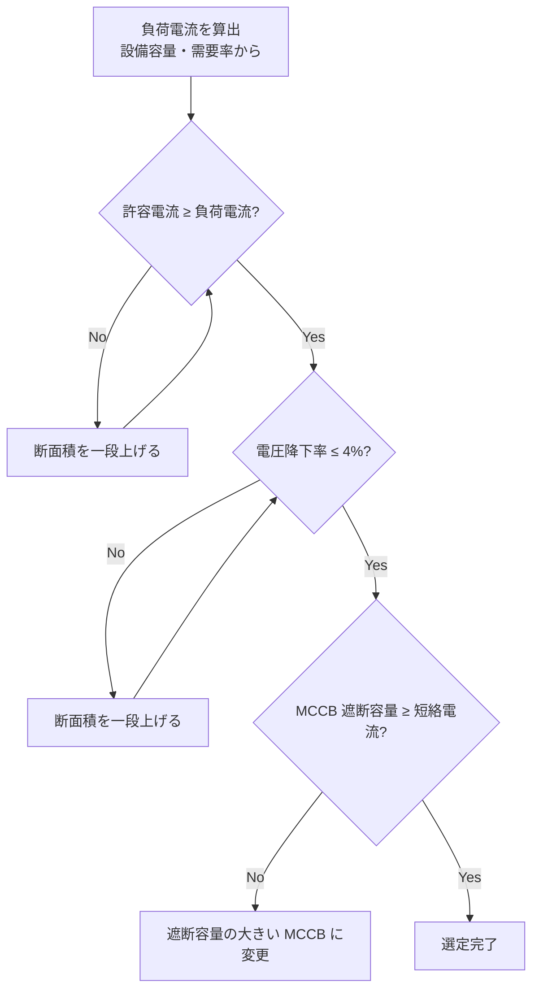

# 低圧ケーブル

## 30秒まとめ

低圧ケーブル選定は「許容電流 → 電圧降下 → 短絡容量」の順に確認する。化学プラントでは耐熱・耐油・耐薬品性も選定要素に入る。CV/CVT が標準だが腐食雰囲気や防爆エリアは EM-CE や耐熱 VV など用途別を選ぶ。

---

## 電線・ケーブル種類

| 種類 | 絶縁・外装 | 主な用途 | 特徴 |
|------|-----------|---------|------|
| IV | ビニル絶縁 | 盤内配線・接地線 | 単線・より線、管路使用 |
| VVR | ビニル絶縁・ビニル外装（丸形） | 一般幹線・制御 | 可とう性あり、室内敷設 |
| CV | 架橋ポリエチレン絶縁・ビニル外装 | 動力・幹線 | 許容電流大・標準品 |
| CVT | CV 3芯撚合せ | 動力幹線（省スペース） | 曲げやすい |
| EM-CE | エコ架橋ポリエチレン絶縁・難燃 | 動力・制御（難燃要求） | ノンハロゲン難燃 |
| 耐熱 VV | 耐熱ビニル絶縁・外装 | 高温雰囲気（60℃超） | 最高許容温度 75℃ |
| MI ケーブル | 無機絶縁（酸化マグネシウム） | 非常用・耐火配線 | 耐火 950℃ |

---

## 許容電流表（600V）

<div style="margin-bottom:0.6rem">
<button id="amp-btn-cv" onclick="switchAmpTable('cv')" style="padding:0.3rem 1rem;border:2px solid var(--md-primary-fg-color,#00897b);background:var(--md-primary-fg-color,#00897b);color:#fff;border-radius:4px 0 0 4px;cursor:pointer;font-size:0.9rem">CV 3芯</button><button id="amp-btn-cvt" onclick="switchAmpTable('cvt')" style="padding:0.3rem 1rem;border:2px solid var(--md-primary-fg-color,#00897b);background:transparent;color:var(--md-primary-fg-color,#00897b);border-radius:0 4px 4px 0;cursor:pointer;font-size:0.9rem">CVT</button>
</div>

<table id="amp-table-cv" style="width:100%;border-collapse:collapse">
<thead><tr style="background:var(--md-primary-fg-color,#00897b);color:#fff">
<th style="padding:0.4rem 0.8rem;text-align:left">断面積 [mm²]</th>
<th style="padding:0.4rem 0.8rem;text-align:right">管路敷設 [A]</th>
<th style="padding:0.4rem 0.8rem;text-align:right">気中敷設 [A]</th>
<th style="padding:0.4rem 0.8rem;text-align:right">ケーブルラック [A]</th>
</tr></thead>
<tbody>
<tr><td style="padding:0.3rem 0.8rem">2.0</td><td style="text-align:right;padding:0.3rem 0.8rem">19</td><td style="text-align:right;padding:0.3rem 0.8rem">26</td><td style="text-align:right;padding:0.3rem 0.8rem">24</td></tr>
<tr style="background:var(--md-default-bg-color,#fff)"><td style="padding:0.3rem 0.8rem">3.5</td><td style="text-align:right;padding:0.3rem 0.8rem">26</td><td style="text-align:right;padding:0.3rem 0.8rem">36</td><td style="text-align:right;padding:0.3rem 0.8rem">33</td></tr>
<tr><td style="padding:0.3rem 0.8rem">5.5</td><td style="text-align:right;padding:0.3rem 0.8rem">34</td><td style="text-align:right;padding:0.3rem 0.8rem">47</td><td style="text-align:right;padding:0.3rem 0.8rem">43</td></tr>
<tr style="background:var(--md-default-bg-color,#fff)"><td style="padding:0.3rem 0.8rem">8</td><td style="text-align:right;padding:0.3rem 0.8rem">42</td><td style="text-align:right;padding:0.3rem 0.8rem">58</td><td style="text-align:right;padding:0.3rem 0.8rem">53</td></tr>
<tr><td style="padding:0.3rem 0.8rem">14</td><td style="text-align:right;padding:0.3rem 0.8rem">61</td><td style="text-align:right;padding:0.3rem 0.8rem">84</td><td style="text-align:right;padding:0.3rem 0.8rem">77</td></tr>
<tr style="background:var(--md-default-bg-color,#fff)"><td style="padding:0.3rem 0.8rem">22</td><td style="text-align:right;padding:0.3rem 0.8rem">78</td><td style="text-align:right;padding:0.3rem 0.8rem">107</td><td style="text-align:right;padding:0.3rem 0.8rem">98</td></tr>
<tr><td style="padding:0.3rem 0.8rem">38</td><td style="text-align:right;padding:0.3rem 0.8rem">105</td><td style="text-align:right;padding:0.3rem 0.8rem">144</td><td style="text-align:right;padding:0.3rem 0.8rem">132</td></tr>
<tr style="background:var(--md-default-bg-color,#fff)"><td style="padding:0.3rem 0.8rem">60</td><td style="text-align:right;padding:0.3rem 0.8rem">135</td><td style="text-align:right;padding:0.3rem 0.8rem">185</td><td style="text-align:right;padding:0.3rem 0.8rem">170</td></tr>
<tr><td style="padding:0.3rem 0.8rem">100</td><td style="text-align:right;padding:0.3rem 0.8rem">175</td><td style="text-align:right;padding:0.3rem 0.8rem">240</td><td style="text-align:right;padding:0.3rem 0.8rem">220</td></tr>
</tbody>
</table>

<table id="amp-table-cvt" style="width:100%;border-collapse:collapse;display:none">
<thead><tr style="background:var(--md-primary-fg-color,#00897b);color:#fff">
<th style="padding:0.4rem 0.8rem;text-align:left">断面積 [mm²]</th>
<th style="padding:0.4rem 0.8rem;text-align:right">管路敷設 [A]</th>
<th style="padding:0.4rem 0.8rem;text-align:right">気中敷設 [A]</th>
<th style="padding:0.4rem 0.8rem;text-align:right">ケーブルラック [A]</th>
</tr></thead>
<tbody>
<tr><td style="padding:0.3rem 0.8rem">14</td><td style="text-align:right;padding:0.3rem 0.8rem">61</td><td style="text-align:right;padding:0.3rem 0.8rem">88</td><td style="text-align:right;padding:0.3rem 0.8rem">80</td></tr>
<tr style="background:var(--md-default-bg-color,#fff)"><td style="padding:0.3rem 0.8rem">22</td><td style="text-align:right;padding:0.3rem 0.8rem">78</td><td style="text-align:right;padding:0.3rem 0.8rem">112</td><td style="text-align:right;padding:0.3rem 0.8rem">103</td></tr>
<tr><td style="padding:0.3rem 0.8rem">38</td><td style="text-align:right;padding:0.3rem 0.8rem">105</td><td style="text-align:right;padding:0.3rem 0.8rem">152</td><td style="text-align:right;padding:0.3rem 0.8rem">139</td></tr>
<tr style="background:var(--md-default-bg-color,#fff)"><td style="padding:0.3rem 0.8rem">60</td><td style="text-align:right;padding:0.3rem 0.8rem">135</td><td style="text-align:right;padding:0.3rem 0.8rem">194</td><td style="text-align:right;padding:0.3rem 0.8rem">178</td></tr>
<tr><td style="padding:0.3rem 0.8rem">100</td><td style="text-align:right;padding:0.3rem 0.8rem">175</td><td style="text-align:right;padding:0.3rem 0.8rem">252</td><td style="text-align:right;padding:0.3rem 0.8rem">231</td></tr>
<tr style="background:var(--md-default-bg-color,#fff)"><td style="padding:0.3rem 0.8rem">150</td><td style="text-align:right;padding:0.3rem 0.8rem">210</td><td style="text-align:right;padding:0.3rem 0.8rem">302</td><td style="text-align:right;padding:0.3rem 0.8rem">277</td></tr>
<tr><td style="padding:0.3rem 0.8rem">200</td><td style="text-align:right;padding:0.3rem 0.8rem">240</td><td style="text-align:right;padding:0.3rem 0.8rem">346</td><td style="text-align:right;padding:0.3rem 0.8rem">317</td></tr>
<tr style="background:var(--md-default-bg-color,#fff)"><td style="padding:0.3rem 0.8rem">250</td><td style="text-align:right;padding:0.3rem 0.8rem">270</td><td style="text-align:right;padding:0.3rem 0.8rem">385</td><td style="text-align:right;padding:0.3rem 0.8rem">353</td></tr>
</tbody>
</table>

!!! warning "補正係数を忘れずに"
    - 周囲温度 40℃ 超：温度補正係数を乗じる（40℃ 基準値）
    - 管路内多条：本数に応じた低減係数を適用
    - 太陽直射：直射補正係数（気中値より低下）

---

## 電圧降下計算式

### 三相 3 線式

```
e = √3 × I × (R cosθ + X sinθ) × L

e     : 電圧降下 [V]
I     : 電流 [A]
R     : 導体抵抗 [Ω/km]
X     : リアクタンス [Ω/km]（ケーブルカタログ値）
cosθ  : 負荷力率（電動機は 0.8 が目安）
L     : 片道ケーブル長 [km]
```

### 単相 2 線式

```
e = 2 × I × (R cosθ + X sinθ) × L
```

### 電圧降下率

```
電圧降下率 [%] = e / V0 × 100

V0 : 受電端電圧 [V]（200V または 400V）
```

### 許容値（内線規程）

| 区分 | 許容電圧降下率 |
|------|-------------|
| 幹線（受電点〜分電盤） | 2% 以内 |
| 分岐（分電盤〜負荷） | 2% 以内 |
| 合計 | 4% 以内 |

電動機始動時は通常負荷の 5〜8 倍の電流が流れるため、始動電流での電圧降下も別途確認する。

---

## ケーブルサイズ選定ツール

<div id="cable-calc-wrap" style="background:var(--md-code-bg-color,#f5f5f5);border:1px solid #ddd;border-radius:8px;padding:1.2rem 1.5rem;margin:1rem 0">
<p style="margin:0 0 1rem;font-weight:bold;color:var(--md-primary-fg-color,#00897b)">⚡ ケーブルサイズ選定ツール（600V CV / CVT）</p>

<div style="display:grid;grid-template-columns:repeat(auto-fit,minmax(190px,1fr));gap:0.8rem">

<div>
<label style="display:block;font-size:0.82rem;color:#666;margin-bottom:0.2rem">ケーブル種類</label>
<select id="cc_ctype" style="width:100%;padding:0.4rem 0.6rem;border:1px solid #ccc;border-radius:4px;font-size:0.95rem;box-sizing:border-box">
<option value="cv">CV 3芯（2.0〜100mm²）</option>
<option value="cvt">CVT（14〜250mm²）</option>
</select>
</div>

<div>
<label style="display:block;font-size:0.82rem;color:#666;margin-bottom:0.2rem">負荷電流 [A]</label>
<input id="cc_current" type="number" value="30" min="1" step="1" style="width:100%;padding:0.4rem 0.6rem;border:1px solid #ccc;border-radius:4px;font-size:0.95rem;box-sizing:border-box">
</div>

<div>
<label style="display:block;font-size:0.82rem;color:#666;margin-bottom:0.2rem">ケーブル長 [m]</label>
<input id="cc_length" type="number" value="50" min="1" step="1" style="width:100%;padding:0.4rem 0.6rem;border:1px solid #ccc;border-radius:4px;font-size:0.95rem;box-sizing:border-box">
</div>

<div>
<label style="display:block;font-size:0.82rem;color:#666;margin-bottom:0.2rem">電源電圧</label>
<select id="cc_voltage" style="width:100%;padding:0.4rem 0.6rem;border:1px solid #ccc;border-radius:4px;font-size:0.95rem;box-sizing:border-box">
<option value="200">200 V（三相）</option>
<option value="400">400 V（三相）</option>
<option value="200s">200 V（単相2線）</option>
<option value="100">100 V（単相2線）</option>
</select>
</div>

<div>
<label style="display:block;font-size:0.82rem;color:#666;margin-bottom:0.2rem">敷設方法</label>
<select id="cc_install" style="width:100%;padding:0.4rem 0.6rem;border:1px solid #ccc;border-radius:4px;font-size:0.95rem;box-sizing:border-box">
<option value="conduit">管路敷設</option>
<option value="air">空中（気中）敷設</option>
<option value="rack">ケーブルラック</option>
</select>
</div>

<div>
<label style="display:block;font-size:0.82rem;color:#666;margin-bottom:0.2rem">負荷力率 cosθ</label>
<input id="cc_pf" type="number" value="0.85" min="0.1" max="1.0" step="0.01" style="width:100%;padding:0.4rem 0.6rem;border:1px solid #ccc;border-radius:4px;font-size:0.95rem;box-sizing:border-box">
</div>

<div>
<label style="display:block;font-size:0.82rem;color:#666;margin-bottom:0.2rem">許容電圧降下率 [%]</label>
<input id="cc_vd_limit" type="number" value="4" min="1" max="10" step="0.5" style="width:100%;padding:0.4rem 0.6rem;border:1px solid #ccc;border-radius:4px;font-size:0.95rem;box-sizing:border-box">
</div>

</div>

<button onclick="calcCable()" style="margin-top:1rem;padding:0.5rem 1.5rem;background:var(--md-primary-fg-color,#00897b);color:#fff;border:none;border-radius:4px;cursor:pointer;font-size:0.95rem">選定実行</button>

<div id="cc_result" style="display:none;margin-top:1rem">
<div id="cc_result_main" style="border-left:4px solid #43a047;background:#e8f5e9;border-radius:4px;padding:0.8rem 1rem;margin-bottom:0.8rem">
<div style="font-size:0.82rem;margin-bottom:0.3rem">推奨ケーブルサイズ</div>
<div id="cc_result_size" style="font-size:1.4rem;font-weight:bold;color:#1b5e20"></div>
<div id="cc_result_sub" style="font-size:0.82rem;margin-top:0.3rem"></div>
</div>
<table style="width:100%;border-collapse:collapse;font-size:0.85rem">
<thead><tr style="background:var(--md-primary-fg-color,#00897b);color:#fff">
<th style="padding:0.35rem 0.6rem">断面積 [mm²]</th>
<th style="padding:0.35rem 0.6rem">許容電流 [A]</th>
<th style="padding:0.35rem 0.6rem">電流マージン</th>
<th style="padding:0.35rem 0.6rem">電圧降下 [V]</th>
<th style="padding:0.35rem 0.6rem">電圧降下率 [%]</th>
<th style="padding:0.35rem 0.6rem">判定</th>
</tr></thead>
<tbody id="cc_result_tbody"></tbody>
</table>
<p style="font-size:0.78rem;color:#888;margin-top:0.5rem">※ CV 3芯 600V 基準。温度・多条補正係数は別途適用すること。リアクタンス X = 0.09 Ω/km（固定値）。</p>
</div>

</div>

---

## 選定フロー



!!! tip "実務のポイント"
    電圧降下で断面積を大きくしても許容電流の余裕は増えるが、短絡容量は変わらない。短絡電流が大きい場合は MCCB の遮断容量を別途確認する。
