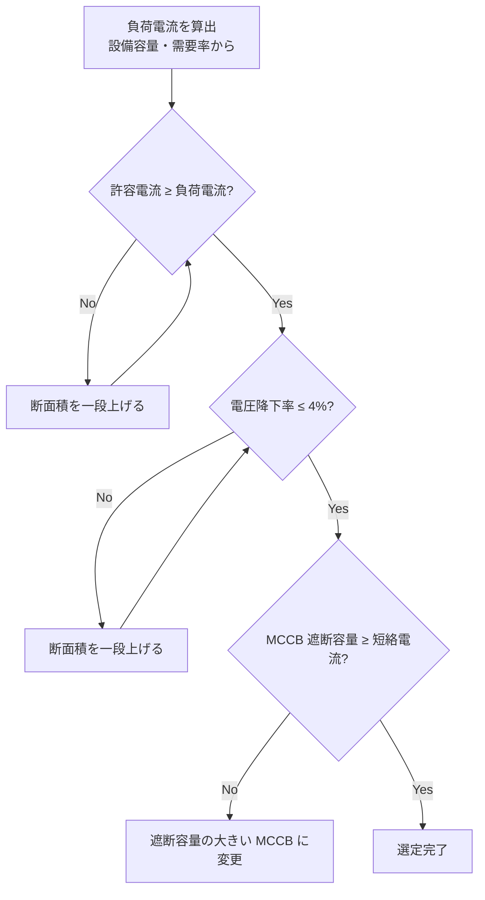

# 低圧ケーブル

## 30秒まとめ

低圧ケーブル選定は「許容電流 → 電圧降下 → 短絡容量」の順に確認する。化学プラントでは耐熱・耐油・耐薬品性も選定要素に入る。CV/CVT が標準だが腐食雰囲気や防爆エリアは EM-CE や耐熱 VV など用途別を選ぶ。

---

## 電線・ケーブル種類

| 種類 | 絶縁・外装 | 主な用途 | 特徴 |
|------|-----------|---------|------|
| IV | ビニル絶縁 | 盤内配線・接地線 | 単線・より線、管路使用 |
| VVR | ビニル絶縁・ビニル外装（丸形） | 一般幹線・制御 | 可とう性あり、室内敷設 |
| CV | 架橋ポリエチレン絶縁・ビニル外装 | 動力・幹線 | 許容電流大・標準品 |
| CVT | CV 3芯撚合せ | 動力幹線（省スペース） | 曲げやすい |
| EM-CE | エコ架橋ポリエチレン絶縁・難燃 | 動力・制御（難燃要求） | ノンハロゲン難燃 |
| 耐熱 VV | 耐熱ビニル絶縁・外装 | 高温雰囲気（60℃超） | 最高許容温度 75℃ |
| MI ケーブル | 無機絶縁（酸化マグネシウム） | 非常用・耐火配線 | 耐火 950℃ |

---

## 許容電流表（600V）

<div style="margin-bottom:0.6rem">
<button id="amp-btn-cv" onclick="switchAmpTable('cv')" style="padding:0.3rem 1rem;border:2px solid var(--md-primary-fg-color,#00897b);background:var(--md-primary-fg-color,#00897b);color:#fff;border-radius:4px 0 0 4px;cursor:pointer;font-size:0.9rem">CV 3芯</button><button id="amp-btn-cvt" onclick="switchAmpTable('cvt')" style="padding:0.3rem 1rem;border:2px solid var(--md-primary-fg-color,#00897b);background:transparent;color:var(--md-primary-fg-color,#00897b);border-radius:0 4px 4px 0;cursor:pointer;font-size:0.9rem">CVT</button>
</div>

<table id="amp-table-cv" style="width:100%;border-collapse:collapse">
<thead><tr style="background:var(--md-primary-fg-color,#00897b);color:#fff">
<th style="padding:0.4rem 0.8rem;text-align:left">断面積 [mm²]</th>
<th style="padding:0.4rem 0.8rem;text-align:right">電線管布設 [A]</th>
<th style="padding:0.4rem 0.8rem;text-align:right">気中・暗渠布設 [A]</th>
<th style="padding:0.4rem 0.8rem;text-align:right">ケーブルラック単条 [A]</th>
</tr></thead>
<tbody>
<tr><td style="padding:0.3rem 0.8rem">2.0</td><td style="text-align:right;padding:0.3rem 0.8rem">19</td><td style="text-align:right;padding:0.3rem 0.8rem">23</td><td style="text-align:right;padding:0.3rem 0.8rem">23</td></tr>
<tr style="background:var(--md-default-bg-color,#fff)"><td style="padding:0.3rem 0.8rem">3.5</td><td style="text-align:right;padding:0.3rem 0.8rem">26</td><td style="text-align:right;padding:0.3rem 0.8rem">33</td><td style="text-align:right;padding:0.3rem 0.8rem">33</td></tr>
<tr><td style="padding:0.3rem 0.8rem">5.5</td><td style="text-align:right;padding:0.3rem 0.8rem">35</td><td style="text-align:right;padding:0.3rem 0.8rem">44</td><td style="text-align:right;padding:0.3rem 0.8rem">44</td></tr>
<tr style="background:var(--md-default-bg-color,#fff)"><td style="padding:0.3rem 0.8rem">8</td><td style="text-align:right;padding:0.3rem 0.8rem">43</td><td style="text-align:right;padding:0.3rem 0.8rem">54</td><td style="text-align:right;padding:0.3rem 0.8rem">54</td></tr>
<tr><td style="padding:0.3rem 0.8rem">14</td><td style="text-align:right;padding:0.3rem 0.8rem">59</td><td style="text-align:right;padding:0.3rem 0.8rem">76</td><td style="text-align:right;padding:0.3rem 0.8rem">76</td></tr>
<tr style="background:var(--md-default-bg-color,#fff)"><td style="padding:0.3rem 0.8rem">22</td><td style="text-align:right;padding:0.3rem 0.8rem">77</td><td style="text-align:right;padding:0.3rem 0.8rem">100</td><td style="text-align:right;padding:0.3rem 0.8rem">100</td></tr>
<tr><td style="padding:0.3rem 0.8rem">38</td><td style="text-align:right;padding:0.3rem 0.8rem">110</td><td style="text-align:right;padding:0.3rem 0.8rem">140</td><td style="text-align:right;padding:0.3rem 0.8rem">140</td></tr>
<tr style="background:var(--md-default-bg-color,#fff)"><td style="padding:0.3rem 0.8rem">60</td><td style="text-align:right;padding:0.3rem 0.8rem">150</td><td style="text-align:right;padding:0.3rem 0.8rem">190</td><td style="text-align:right;padding:0.3rem 0.8rem">190</td></tr>
<tr><td style="padding:0.3rem 0.8rem">100</td><td style="text-align:right;padding:0.3rem 0.8rem">210</td><td style="text-align:right;padding:0.3rem 0.8rem">260</td><td style="text-align:right;padding:0.3rem 0.8rem">260</td></tr>
</tbody>
</table>

<table id="amp-table-cvt" style="width:100%;border-collapse:collapse;display:none">
<thead><tr style="background:var(--md-primary-fg-color,#00897b);color:#fff">
<th style="padding:0.4rem 0.8rem;text-align:left">断面積 [mm²]</th>
<th style="padding:0.4rem 0.8rem;text-align:right">電線管布設 [A]</th>
<th style="padding:0.4rem 0.8rem;text-align:right">気中・暗渠布設 [A]</th>
<th style="padding:0.4rem 0.8rem;text-align:right">ケーブルラック単条 [A]</th>
</tr></thead>
<tbody>
<tr><td style="padding:0.3rem 0.8rem">14</td><td style="text-align:right;padding:0.3rem 0.8rem">63</td><td style="text-align:right;padding:0.3rem 0.8rem">86</td><td style="text-align:right;padding:0.3rem 0.8rem">86</td></tr>
<tr style="background:var(--md-default-bg-color,#fff)"><td style="padding:0.3rem 0.8rem">22</td><td style="text-align:right;padding:0.3rem 0.8rem">82</td><td style="text-align:right;padding:0.3rem 0.8rem">110</td><td style="text-align:right;padding:0.3rem 0.8rem">110</td></tr>
<tr><td style="padding:0.3rem 0.8rem">38</td><td style="text-align:right;padding:0.3rem 0.8rem">110</td><td style="text-align:right;padding:0.3rem 0.8rem">155</td><td style="text-align:right;padding:0.3rem 0.8rem">155</td></tr>
<tr style="background:var(--md-default-bg-color,#fff)"><td style="padding:0.3rem 0.8rem">60</td><td style="text-align:right;padding:0.3rem 0.8rem">150</td><td style="text-align:right;padding:0.3rem 0.8rem">210</td><td style="text-align:right;padding:0.3rem 0.8rem">210</td></tr>
<tr><td style="padding:0.3rem 0.8rem">100</td><td style="text-align:right;padding:0.3rem 0.8rem">215</td><td style="text-align:right;padding:0.3rem 0.8rem">290</td><td style="text-align:right;padding:0.3rem 0.8rem">290</td></tr>
<tr style="background:var(--md-default-bg-color,#fff)"><td style="padding:0.3rem 0.8rem">150</td><td style="text-align:right;padding:0.3rem 0.8rem">275</td><td style="text-align:right;padding:0.3rem 0.8rem">380</td><td style="text-align:right;padding:0.3rem 0.8rem">380</td></tr>
<tr><td style="padding:0.3rem 0.8rem">200</td><td style="text-align:right;padding:0.3rem 0.8rem">340</td><td style="text-align:right;padding:0.3rem 0.8rem">465</td><td style="text-align:right;padding:0.3rem 0.8rem">465</td></tr>
<tr style="background:var(--md-default-bg-color,#fff)"><td style="padding:0.3rem 0.8rem">250</td><td style="text-align:right;padding:0.3rem 0.8rem">395</td><td style="text-align:right;padding:0.3rem 0.8rem">535</td><td style="text-align:right;padding:0.3rem 0.8rem">535</td></tr>
</tbody>
</table>

上表は **JCS 0168-2 の 600V CV／CVT 許容電流**（周囲温度 40 ℃、絶縁体許容温度 90 ℃、**1条布設**）です。CV は「3心1条」、CVT は「単心3個より1条」の値で、CVT は撚合せのぶん CV 3芯より大きくなります。ケーブルラックは規格に独立した列がなく、**ラック上の単条は気中・暗渠と同一条件**のため同値としています（多条・多段の低減は下記のとおり別途乗じます）。詳細は「根拠」を参照してください。

!!! warning "補正係数を忘れずに"
    - 周囲温度 40℃ 超：温度補正係数を乗じる（40℃ 基準値）
    - 電線管内・ラック上の多条：条数・離隔・段数に応じた低減率を適用（ラックは実運用ではほぼ多条のため、上表の値をそのまま使わない）
    - 太陽直射：直射補正係数（気中値より低下）

    係数は [許容電流の補正](../reference/ampacity.md) を参照してください。

---

## 電圧降下計算式

### 三相 3 線式

```text
e = √3 × I × (R cosθ + X sinθ) × L

e     : 電圧降下 [V]
I     : 電流 [A]
R     : 導体抵抗 [Ω/km]
X     : リアクタンス [Ω/km]（サイズ・種別・周波数で決まる。[R・X 表](../04-sekkei/voltage-drop.md)参照）
cosθ  : 負荷力率（電動機は 0.8 が目安）
L     : 片道ケーブル長 [km]
```

### 単相 2 線式

```text
e = 2 × I × (R cosθ + X sinθ) × L
```

### 電圧降下率

```text
電圧降下率 [%] = e / V0 × 100

V0 : 基準とする公称線間電圧 [V]（200V または 400V）
     ※受電端電圧ではない。受電端が要るときは Vr = V0 - e として別に求める
```

分母の定義は [電圧降下計算](../04-sekkei/voltage-drop.md) を正典とし、本Wikiは**公称電圧を分母**に統一する。

### 許容値

| 区分 | 許容電圧降下率 |
|------|-------------|
| 幹線（受電点〜分電盤） | 2% 以内 |
| 分岐（分電盤〜負荷） | 2% 以内 |
| 合計 | 4% 以内 |

内線規程（JEAC 8001）の規定値として広く引用される値です。**同規程は民間自主規格かつ有償で、本 Wiki では原本を照合していません**（節番号・版年は挙げません）。正典は [電圧降下計算](../04-sekkei/voltage-drop.md) で、緩和規定の有無を含めた整理はそちらにあります。

電動機始動時は通常負荷の 5〜8 倍の電流が流れるため、始動電流での電圧降下も別途確認する（倍率は実務慣行の目安。同じく [電圧降下計算](../04-sekkei/voltage-drop.md) を正典とする）。

---

## ケーブルサイズ選定ツール

<div id="cable-calc-wrap" style="background:var(--md-code-bg-color,#f5f5f5);border:1px solid #ddd;border-radius:8px;padding:1.2rem 1.5rem;margin:1rem 0">
<p style="margin:0 0 1rem;font-weight:bold;color:var(--md-primary-fg-color,#00897b)">⚡ ケーブルサイズ選定ツール（600V CV / CVT）</p>

<div style="display:grid;grid-template-columns:repeat(auto-fit,minmax(190px,1fr));gap:0.8rem">

<div>
<label style="display:block;font-size:0.82rem;color:#666;margin-bottom:0.2rem">ケーブル種類</label>
<select id="cc_ctype" style="width:100%;padding:0.4rem 0.6rem;border:1px solid #ccc;border-radius:4px;font-size:0.95rem;box-sizing:border-box">
<option value="cv">CV 3芯（2.0〜100mm²）</option>
<option value="cvt">CVT（14〜250mm²）</option>
</select>
</div>

<div>
<label style="display:block;font-size:0.82rem;color:#666;margin-bottom:0.2rem">負荷電流 [A]</label>
<input id="cc_current" type="number" value="30" min="1" step="1" style="width:100%;padding:0.4rem 0.6rem;border:1px solid #ccc;border-radius:4px;font-size:0.95rem;box-sizing:border-box">
</div>

<div>
<label style="display:block;font-size:0.82rem;color:#666;margin-bottom:0.2rem">ケーブル長 [m]</label>
<input id="cc_length" type="number" value="50" min="1" step="1" style="width:100%;padding:0.4rem 0.6rem;border:1px solid #ccc;border-radius:4px;font-size:0.95rem;box-sizing:border-box">
</div>

<div>
<label style="display:block;font-size:0.82rem;color:#666;margin-bottom:0.2rem">電源電圧</label>
<select id="cc_voltage" style="width:100%;padding:0.4rem 0.6rem;border:1px solid #ccc;border-radius:4px;font-size:0.95rem;box-sizing:border-box">
<option value="200">200 V（三相）</option>
<option value="400">400 V（三相）</option>
<option value="200s">200 V（単相2線）</option>
<option value="100">100 V（単相2線）</option>
</select>
</div>

<div>
<label style="display:block;font-size:0.82rem;color:#666;margin-bottom:0.2rem">敷設方法</label>
<select id="cc_install" style="width:100%;padding:0.4rem 0.6rem;border:1px solid #ccc;border-radius:4px;font-size:0.95rem;box-sizing:border-box">
<option value="conduit">電線管布設（1条）</option>
<option value="air">気中・暗渠布設（1条）</option>
<option value="rack">ケーブルラック（単条＝気中と同値）</option>
</select>
</div>

<div>
<label style="display:block;font-size:0.82rem;color:#666;margin-bottom:0.2rem">周波数</label>
<select id="cc_freq" style="width:100%;padding:0.4rem 0.6rem;border:1px solid #ccc;border-radius:4px;font-size:0.95rem;box-sizing:border-box">
<option value="60">60 Hz（西日本）</option>
<option value="50">50 Hz（東日本）</option>
</select>
</div>

<div>
<label style="display:block;font-size:0.82rem;color:#666;margin-bottom:0.2rem">負荷力率 cosθ</label>
<input id="cc_pf" type="number" value="0.85" min="0.1" max="1.0" step="0.01" style="width:100%;padding:0.4rem 0.6rem;border:1px solid #ccc;border-radius:4px;font-size:0.95rem;box-sizing:border-box">
</div>

<div>
<label style="display:block;font-size:0.82rem;color:#666;margin-bottom:0.2rem">許容電圧降下率 [%]</label>
<input id="cc_vd_limit" type="number" value="4" min="1" max="10" step="0.5" style="width:100%;padding:0.4rem 0.6rem;border:1px solid #ccc;border-radius:4px;font-size:0.95rem;box-sizing:border-box">
</div>

</div>

<button onclick="calcCable()" style="margin-top:1rem;padding:0.5rem 1.5rem;background:var(--md-primary-fg-color,#00897b);color:#fff;border:none;border-radius:4px;cursor:pointer;font-size:0.95rem">選定実行</button>

<div id="cc_result" style="display:none;margin-top:1rem">
<div id="cc_result_main" style="border-left:4px solid #43a047;background:#e8f5e9;border-radius:4px;padding:0.8rem 1rem;margin-bottom:0.8rem">
<div style="font-size:0.82rem;margin-bottom:0.3rem">推奨ケーブルサイズ</div>
<div id="cc_result_size" style="font-size:1.4rem;font-weight:bold;color:#1b5e20"></div>
<div id="cc_result_sub" style="font-size:0.82rem;margin-top:0.3rem"></div>
</div>
<table style="width:100%;border-collapse:collapse;font-size:0.85rem">
<thead><tr style="background:var(--md-primary-fg-color,#00897b);color:#fff">
<th style="padding:0.35rem 0.6rem">断面積 [mm²]</th>
<th style="padding:0.35rem 0.6rem">許容電流 [A]</th>
<th style="padding:0.35rem 0.6rem">電流マージン</th>
<th style="padding:0.35rem 0.6rem">電圧降下 [V]</th>
<th style="padding:0.35rem 0.6rem">電圧降下率 [%]</th>
<th style="padding:0.35rem 0.6rem">判定</th>
</tr></thead>
<tbody id="cc_result_tbody"></tbody>
</table>
<p style="font-size:0.78rem;color:#888;margin-top:0.5rem">※ CV 3芯 600V 基準。温度・多条補正係数は別途適用すること。リアクタンス X はサイズ・種別・周波数ごとの規格値（技資第103号B）を使用。</p>
</div>

</div>

---

## 選定フロー


```mermaid
flowchart TD
    A[負荷電流を算出\n設備容量・需要率から] --> B{許容電流 ≥ 負荷電流?}
    B -- No --> C[断面積を一段上げる]
    C --> B
    B -- Yes --> D{電圧降下率 ≤ 4%?}
    D -- No --> E[断面積を一段上げる]
    E --> D
    D -- Yes --> F{MCCB 遮断容量 ≥ 短絡電流?}
    F -- No --> G[遮断容量の大きい MCCB に変更]
    F -- Yes --> H[選定完了]
```

!!! tip "実務のポイント"
    電圧降下で断面積を大きくしても許容電流の余裕は増えるが、短絡容量は変わらない。短絡電流が大きい場合は MCCB の遮断容量を別途確認する。

---

## 根拠

### 許容電流表の位置づけ

本ページの許容電流表と選定ツールは、**同じデータ（`docs/javascripts/cable-calc.js` の `CABLE_DB`）を参照**しています。表とツールの値が食い違わないことを 2026-08-02 に全数照合しました（CV 9 サイズ・CVT 8 サイズ × 電線管／気中・暗渠／ラックの計 51 値）。

#### 出典は JCS 0168-2（2026-08-02 にメーカー技術資料で確定）

数値は **JCS 0168-2（日本電線工業会規格）の 600V CV・CVT 許容電流**です。布設条件は **周囲温度 40 ℃・絶縁体許容温度 90 ℃・1条布設**で、CV は「3心1条」、CVT は「単心3個より1条」の列を採っています。

**JCS 原本は有償のため照合していません。** ただし同規格を出典として明記した公開のメーカー技術資料・カタログで全値を照合し、一致を確認しました。

| 条件 | 照合したメーカー資料 | 結果 |
|---|---|---|
| 気中・暗渠布設（CV 3心1条） | フジクラ・ダイヤケーブル 600V CV カタログ／SWCC 技術資料「許容電流」／電材商社カタログ附録（いずれも「JCS 0168-2より」と明記） | 3資料の全サイズが完全一致 |
| 気中・暗渠布設（CVT 単心3個より1条） | フジクラ・ダイヤケーブル 600V CVD・CVT・CVQ カタログ／SWCC 技術資料 | 2社の全サイズが完全一致 |
| 電線管布設（CV 3心・CVT 単心3個より） | SWCC 技術資料「許容電流」／矢崎エナジーシステム 許容電流表 | 2社の全サイズが完全一致 |

#### 旧値は全サイズが出所不明だったため差し替えました

2026-08-02 以前の表は「JIS C 3605／内線規程の参考値」とされていましたが、上記どの資料とも一致せず、**小さいサイズでは規格値より高い（＝危険側）値**でした。単調な換算では説明できない食い違い方であり出所を特定できないため、全 51 値を規格値に差し替えています。差の例（CV 気中）: 2.0 mm² 26 → 23 A、14 mm² 84 → 76 A、100 mm² 240 → 260 A。

CVT についても「保守的に CV 3芯と同値」としていた運用をやめました。CVT は撚合せにより放熱が有利で、**規格上も CV 3心と別値**です（14 mm² 気中で CVT 86 A・CV 3心 76 A）。

#### ケーブルラック列の扱い

JCS 0168-2 にケーブルラック専用の列はありません。**ラック上に単条で置いたケーブルは気中・暗渠と同一条件**であり、同規格の気中多条布設低減率も 1 条では 1.00 です。このため本表のラック列は気中・暗渠と同値としています。旧表はラックを気中の約 0.92 倍に落としていましたが、この係数にも出所がありませんでした。

**実際のラックは多条・多段が普通です。** 密着単層 6 条なら低減率は 0.70、2 段積みならさらに下がります。ラック列の値をそのまま使わず、[許容電流の補正](../reference/ampacity.md) の低減率を必ず乗じてください。

#### 変わらない限界

**この表の数値は法令が定めた値ではありません。調達・施工の判断には使わないでください。** 実際の許容電流は、採用するケーブルの**メーカーカタログ値**と、次の補正を反映した値が正です。

- 周囲温度（表は 40 ℃ 基準）
- 電線管内・ラック上の多条布設による低減
- 直射日光（本表は「日射の影響なし」の値）

補正係数の考え方は [許容電流の補正](../reference/ampacity.md) を参照してください。

### 電圧降下（正典参照）

- **計算式と分母の定義**は [電圧降下計算](../04-sekkei/voltage-drop.md) が正典です。本 Wiki は**公称線間電圧を分母**に統一しています（受電端電圧ではありません）
- 式は送り端・受電端の**位相差を無視した簡略式**です（通常の低圧配線の精度としては十分）
- **許容値 2 % / 2 % / 4 %** は内線規程（JEAC 8001）の値として広く引用されますが、**原本未照合**です。節番号・版年は挙げません
- **始動電流 5〜8 倍**・**電動機の力率 0.8** は実務慣行の目安です。正確には銘板・データシートの拘束電流値によります

### 選定ツールの前提

- **リアクタンス X** は **日本電線工業会 技資第103号B「低圧電線・ケーブルのインピーダンス」(2024年6月)** の規格値を、**サイズ・種別（CV 3心／CVT）・周波数（50/60 Hz）ごと**に使います。同資料は無償公開で 2026-08-02 に原本 PDF を直接照合しました（照合経路は [電圧降下計算](../04-sekkei/voltage-drop.md) の「根拠」が正典）
- **周波数の選択を必ず合わせてください**。X は周波数に比例し、14 sq CV で 50 Hz 0.0828 → 60 Hz 0.0994 と約 2 割変わります。既定は保守側の 60 Hz です
- **CVT の X は CV 3 心より 2〜3 割大きい**です（14 sq・50 Hz で 0.107 対 0.0828）。許容電流は CVT が有利、リアクタンスは CV 3 心が有利という逆向きの関係になります
- かつては **X = 0.09 Ω/km の全サイズ固定**でしたが、この値は全サイズ・両種別・両周波数のどれとも一致せず出所不明だったため 2026-08-02 に差し替えました
- **導体抵抗 R** は JIS C 3605 の最大導体抵抗（20 ℃、多心 CV・CVT）です。2026-08-02 にメーカーカタログ3社で全サイズ照合し、[電圧降下計算](../04-sekkei/voltage-drop.md) の R 表と同一値に統一しました（照合経路は同ページの「根拠」が正典）。**単心は別値**（14 sq で 1.31 Ω/km）で、本ツールは扱いません
- R は 20 ℃ の値です。運転温度が上がれば抵抗も上がります（CV の最高許容温度 90 ℃ で 20 ℃ 値の約 1.28 倍）
- ツールは**温度・多条の補正を行いません**（結果欄にも注記しています）

### ケーブル種類の仕様値

**耐熱 VV の最高許容温度 75 ℃**・**MI ケーブルの耐火 950 ℃**・EM-CE のノンハロゲン難燃性は、いずれも**製品規格・メーカー仕様**に基づく代表値です。本ページでは規格番号を挙げていません（未照合のため）。実際の使用限界は採用品の仕様書によります。

### 関連する法令（本ページの範囲外）

低圧配線の施設方法（金属ダクト工事の充填率など）・過電流遮断器との組み合わせ・接地は、それぞれ [盤設計](../04-sekkei/panel-design.md)・[幹線サイズと過電流遮断器](../04-sekkei/feeder-breaker-sizing.md)・[分岐回路の施設](../04-sekkei/branch-circuit-sizing.md)・[接地（低圧）](grounding-lv.md) が正典です。本ページはケーブル自体の選定に絞っています。

照合日: 2026-08-02（許容電流表の出典確定）。それ以外の記述の照合日は 2026-08-01。

---

## 関連ページ

- [幹線サイズと過電流遮断器](../04-sekkei/feeder-breaker-sizing.md) — 電動機を含む幹線の許容電流と過電流遮断器（MCCB）定格の求めかた
- [分岐回路の施設](../04-sekkei/branch-circuit-sizing.md) — 分岐回路の過電流遮断器の位置・149-1表の電線太さ
- [電圧降下計算](../04-sekkei/voltage-drop.md) — 三相／単相の電圧降下計算式・許容値
- [短絡電流計算](../04-sekkei/fault-current.md) — MCCB 遮断容量の確認に使う短絡電流の算定
- [低圧配電](distribution.md) — 分電盤構成・MCCB/ELCB 選定・保護協調
