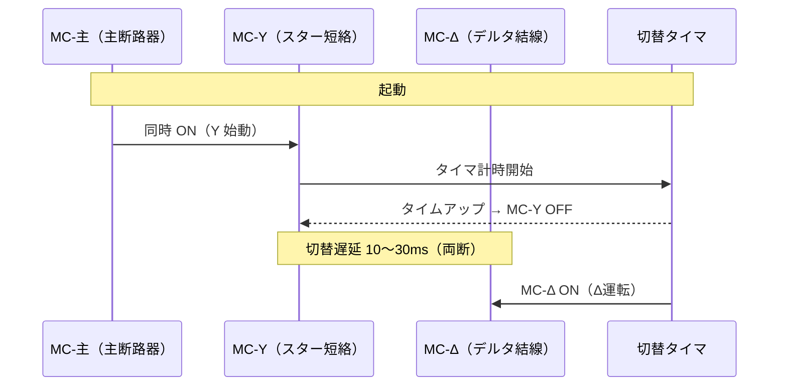

# モーター制御

## 30秒まとめ

モーター制御回路の基本は「MC 自己保持 + サーマル保護 + 非常停止」の3要素。正逆転は電気・機械の二重インターロックで短絡事故を防ぐ。Y-Δ切替タイマは短すぎると再突入電流でトリップするため実測調整が必須。

---

## MC 自己保持回路

### 展開接続図（横書き）

```
制御電源 L1 ─────────────────────────────── L2

         [停止 NC]  [起動 NO]
L1 ─────┤        ├─┤        ├──┬──[MC コイル]── L2
                               │
                          [MC 補助 NO]（自己保持）
                               │
L1 ───────────────────────────┘
```

**動作フロー：**

1. 起動 PB 押下 → MC コイル励磁 → 主接点・補助接点 閉
2. 起動 PB 離しても補助接点（自己保持接点）で回路継続
3. 停止 PB 押下またはサーマルトリップ → コイル回路開放 → 全接点 開放

### 主回路

```
R ─[MCCB]─[MC 主接点 R]─[サーマル]─ U（モーター）
S ─[MCCB]─[MC 主接点 S]─[サーマル]─ V（モーター）
T ─[MCCB]─[MC 主接点 T]─[サーマル]─ W（モーター）
```

---

## 正逆転制御のインターロック

!!! danger "同時投入 = 電源短絡事故"
    正転 MC と逆転 MC が同時に閉になると R-S-T が直結して短絡事故になる。電気インターロックと機械インターロックの二重化が必須。

### 電気インターロック

```
正転回路：
L1─[停止 NC]─[正転起動 NO]─[逆転 MC 補助接点 NC]─[正転 MC コイル]─L2
                                   ↑
                         逆転 MC が入ると正転コイル回路を遮断

逆転回路：
L1─[停止 NC]─[逆転起動 NO]─[正転 MC 補助接点 NC]─[逆転 MC コイル]─L2
```

### 機械インターロック

- 電磁接触器本体にメカニカルインターロック付きタイプを選定
- 一方が閉のとき他方は物理的に入らない構造
- 電気インターロックとの二重化を標準とする

---

## Y-Δ（スターデルタ）始動

### 目的と適用基準

| 項目 | 内容 |
|------|------|
| 目的 | 始動電流（定格の 5〜8 倍）を Y 始動時 1/3 に低減 |
| 適用目安 | 11kW 以上の誘導電動機（全電圧始動が電源容量に対し過大な場合） |
| 前提条件 | モーター端子が独立 6 端子（U1/V1/W1/U2/V2/W2） |

### なぜ Y 始動で電流が 1/3 になるか

=== "結論"
    Y始動の線電流は、全電圧（Δ）始動の **1/3** になる。
    始動トルクも同じく **1/3** に低下する。

=== "しくみ（3ステップ）"
    **① Y結線では巻線にかかる電圧が下がる**

    - Δ結線：巻線電圧 ＝ 線間電圧（200V なら 200V）
    - Y結線：巻線電圧 ＝ 線間電圧 ÷ √3（200V なら 約115V）

    **② 電圧が下がると電流も下がる（オームの法則）**

    - 電流 ＝ 電圧 ÷ インピーダンス（Z）
    - 巻線電圧が 1/√3 倍 → 巻線電流も 1/√3 倍

    **③ Y結線は「線電流＝巻線電流」なので比較しやすい**

    - Y始動の線電流　：(線間電圧 ÷ √3) ÷ Z
    - Δ運転の線電流　：√3 × (線間電圧 ÷ Z)
    - 比をとると　　　：**1/3**

=== "比較表（200V系の例）"
    | | Y結線（始動） | Δ結線（運転） | 比率 |
    |--|:--:|:--:|:--:|
    | 巻線にかかる電圧 | 115 V | 200 V | 約 1/1.73 |
    | 巻線電流 | 115/Z | 200/Z | 約 0.58 倍 |
    | **電源から見た線電流** | **115/Z** | **346/Z** | **1/3 倍** |

    ※ Y結線は線電流＝巻線電流。Δ結線の線電流は巻線電流 × √3 になる。

!!! warning "トルクも 1/3 に落ちる"
    始動トルクは電流の二乗に比例する。Y始動では電流が 1/3 になるためトルクも 1/3。
    重負荷（ファン・ポンプ等）では回転数が上がりきらず切替失敗になるケースがあるため注意。

### 接続と切替シーケンス



### 切替タイマ設定の判断基準

| 確認項目 | 判断基準 |
|---------|---------|
| 切替前の電流 | 定格電流の 3 倍以下まで下がっていること |
| 切替前の回転数 | 同期速度の 75〜80% 到達を目安 |
| タイマ時間の目安 | 5〜15秒（負荷慣性モーメントによる。実測確認） |
| 切替遅延（両断区間） | 10〜30ms（MC-Y が完全に開いてから MC-Δ を投入） |

!!! warning "切替タイマが短すぎると"
    Y→Δ 切替時に再突入電流（定格の 4〜6 倍）が発生しサーマルリレーがトリップする。電流トレンドを見ながら設定する。

---

## サーマルリレー整定

### なぜ 1.0〜1.1 倍か

**下限が 1.0 倍（定格電流以上）の理由**

モーターは定格電流で連続運転できる設計になっている。定格電流を下回る整定にすると、正常な全負荷運転中にサーマルがトリップしてしまう。

**上限が 1.1 倍の理由**

電技解釈（第153条）では低圧電動機の過負荷保護装置の動作電流を**定格電流の 1.1 倍以下**と規定している。これを超えると過負荷保護の目的（巻線の焼損防止）が達成できなくなる。

> モーター巻線の許容温度上昇は絶縁クラスで決まる（E種=75K, B種=80K 等）。電流の二乗に比例して発熱するため、定格の 1.1 倍超で長時間流れると絶縁劣化が加速する。

**なぜ 1.0 倍ではなく 1.1 倍の余裕があるか**

電源電圧の変動（±10%）や測定誤差でモーター電流はわずかに変動する。定格ぴったりで整定すると電圧低下時の正常運転でもトリップするため、実用上 1.0〜1.1 倍の範囲で設定する。

### 整定値の計算

```
整定電流 = モーター定格電流 × 1.0〜1.1 倍
```

| 項目 | 内容 |
|------|------|
| 上限 | 定格電流の 1.1 倍を超えない（電技解釈 第153条・過負荷保護が失われる） |
| 周囲温度補正 | 40℃ 超の環境では補正係数（温度特性グラフ）を確認 |
| 欠相保護 | 欠相保護付きサーマルを標準使用（三相不平衡検出） |
| 復帰方式 | 化学プラントでは手動復帰（Manual）を原則とする |

!!! tip "復帰方式の考え方"
    自動復帰（Auto）は再起動前に原因確認ができないため危険。トリップ後は必ず現場確認→手動復帰を徹底する。

---

## 非常停止回路の設計原則

### 3 原則

| 原則 | 内容 |
|------|------|
| フェールセーフ | 断線・電源喪失時に停止方向に動作 |
| フールプルーフ | 誤操作しても危険な状態にならない |
| 二重化 | 単一故障で保護機能を喪失しない |

### 回路設計（フェールセーフの実装）

```
非常停止ボタン（NC 接点）を制御回路の直列に挿入：

L1 ─[非常停止 NC]─[停止 NC]─[起動 NO]─[MC コイル]─ L2
       ↑
   ケーブル断線・接点故障 → 回路開放 → 停止（フェールセーフ）
```

!!! danger "NO 接点での非常停止は禁止"
    常開（NO）接点では断線時に「停止信号なし」= 機器が停止しない。非常停止回路は必ず常閉（NC）接点を使用する。

### IEC 60204 停止カテゴリ

| カテゴリ | 動作 | 適用例 |
|---------|------|-------|
| 0 | 直ちに動力遮断（非制御停止） | ポンプ・コンプレッサー（標準） |
| 1 | 制御停止後に動力遮断 | クレーン・大型コンベア |
| 2 | 制御停止・動力保持 | 特殊工作機械 |

化学プラントのポンプ・コンプレッサーはカテゴリ 0 が基本。機械的慣性で危険が生じる場合のみカテゴリ 1 を検討する。
