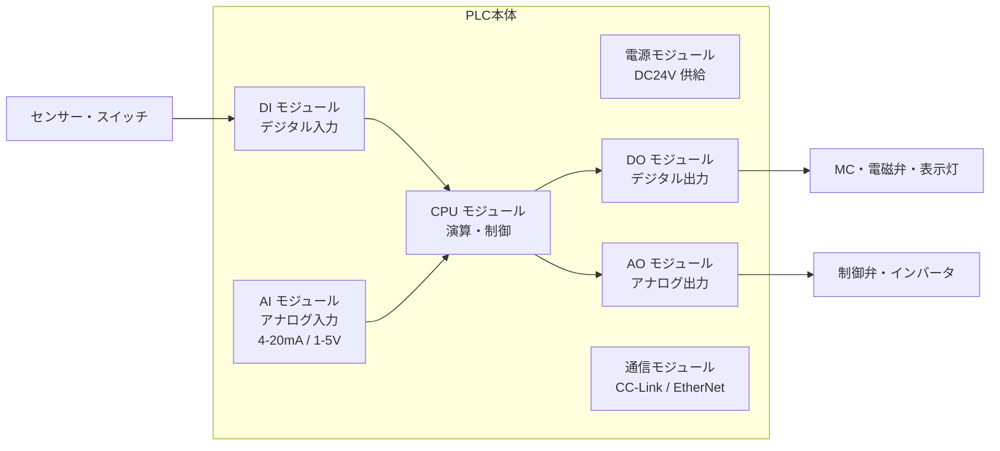
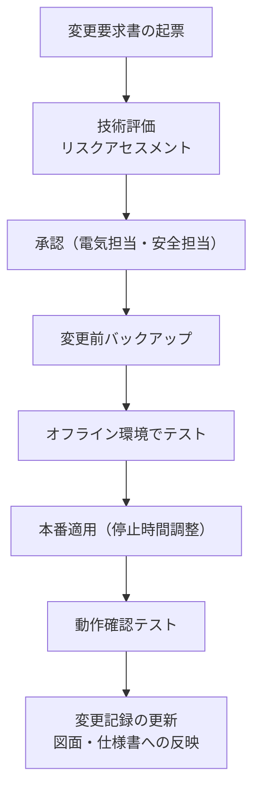

# PLC 基礎

## 30秒まとめ

PLC の核心は「I/O 割付の正確な管理」と「プログラムバックアップ」。変更時は MOC（変更管理）手続きを経ること。化学プラントでは PLC プログラムの無断変更が重大事故につながるため、変更記録とテスト手順が必須。

---

## PLC の構成



| モジュール | 主な仕様確認ポイント |
|-----------|------------------|
| CPU | スキャンタイム・プログラムメモリ容量・バッテリー有無 |
| DI | 入力電圧（DC24V/AC100V）・点数・応答時間 |
| DO | 出力形式（リレー/トランジスタ/トライアック）・定格電流 |
| AI | 分解能（12bit/16bit）・入力範囲・チャンネル数 |
| AO | 出力範囲（4-20mA/0-10V）・分解能 |

---

## I/O 割付の考え方

### 物理番号とソフトアドレスの対応

```
物理的な配線（フィールド側）
    └─ DI モジュール スロット 2、チャンネル 3
         └─ ソフトアドレス X023（三菱 MELSEC の例）
              └─ ラダープログラム内で使用
```

### 割付設計の原則

| 原則 | 内容 |
|------|------|
| 機能別グルーピング | 同一ユニット・系統の I/O を連番で集める |
| 予備点確保 | 各モジュールに 20% 以上の予備点を確保 |
| 安全入力は専用モジュール | 安全 PLC 使用の場合は安全 I/O と通常 I/O を分離 |
| アナログとデジタル分離 | ノイズ干渉を防ぐため物理的に離して配置 |

---

## ラダー基本命令

| 命令 | 三菱 | 安川 | 機能 |
|------|------|------|------|
| 常開接点読み込み | LD X0 | LD I0.00 | 接点 ON で導通 |
| 常閉接点読み込み | LDI X1 | LDNOT I0.01 | 接点 OFF で導通 |
| コイル出力 | OUT Y0 | OUT Q0.00 | コイル制御 |
| AND 接続 | AND X2 | AND I0.02 | 直列接続 |
| AND ブロック結合 | ANB | ANDNOT | ブロック直列 |
| OR 接続 | OR X3 | OR I0.03 | 並列接続 |
| OR ブロック結合 | ORB | — | ブロック並列 |
| タイマ | OUT T0 K50 | TIM T0 #50 | 5.0秒タイマ |
| カウンタ | OUT C0 K10 | CNT C0 #10 | 10カウント |

---

## 主要通信プロトコル

| プロトコル | 特徴 | 主な用途 |
|-----------|------|---------|
| CC-Link IE Field | 1Gbps 光/電気、三菱標準 | 三菱 PLC 間・リモート I/O |
| PROFIBUS-DP | 12Mbps、IEC 標準、欧州系に多い | 計装機器との接続 |
| EtherNet/IP | 汎用 Ethernet ベース | 上位システム（SCADA/DCS）連携 |
| MODBUS RTU | シンプル、低速（115kbps） | 計装機器との簡易接続 |
| HART（デジタル重畳） | 4-20mA にデジタル重畳 | 伝送器の設定・診断 |

---

## プログラムバックアップとバッテリー交換

### バックアップ手順

1. プログラミングツール（GX Works / Sysmac Studio 等）でオンライン接続
2. PLC からプログラムを PC に読み出し（アップロード）
3. プロジェクトファイルを日付付きフォルダに保存（バージョン管理）
4. 重要設備はサーバーにも保管

!!! warning "バッテリーアラームは即対応"
    バッテリーアラームが出たら 1 週間以内に交換する。バッテリー切れはプログラム消失・設定パラメータ消失につながる。交換前に必ずバックアップを取る。

### バッテリー交換サイクル目安

| 機種・タイプ | 推奨交換周期 |
|------------|------------|
| 三菱 Q シリーズ | 5 年または電圧低下アラーム時 |
| 三菱 iQ-R シリーズ | 5 年（リチウム電池） |
| 安川 MP シリーズ | 5 年 |
| オムロン NJ/NX | スーパーキャパシタ方式（交換不要機種もあり） |

---

## 化学プラント固有：変更管理（MOC）手順

!!! danger "PLC プログラムの無断変更禁止"
    化学プラントでは PLC プログラムの変更が設備の安全機能に直結する。MOC（Management of Change）手続きなしの変更は厳禁。

### MOC ステップ



- 変更記録：日付・変更者・変更内容・確認者を記録
- 現物図面への反映：ラダー変更後は展開接続図・フロー図も更新
- 現地確認：変更後の実機で入出力動作を点対点で確認

---

## 関連ページ

- [モーター制御](motor-control.md) — PLC 出力による MC 制御
- [制御回路](control-circuit.md) — ラダー設計・シーケンス管理
- [低圧配電](distribution.md) — PLC 電源・DCS 給電系統
- [低圧カテゴリ](index.md) — より広い低圧知識へ
