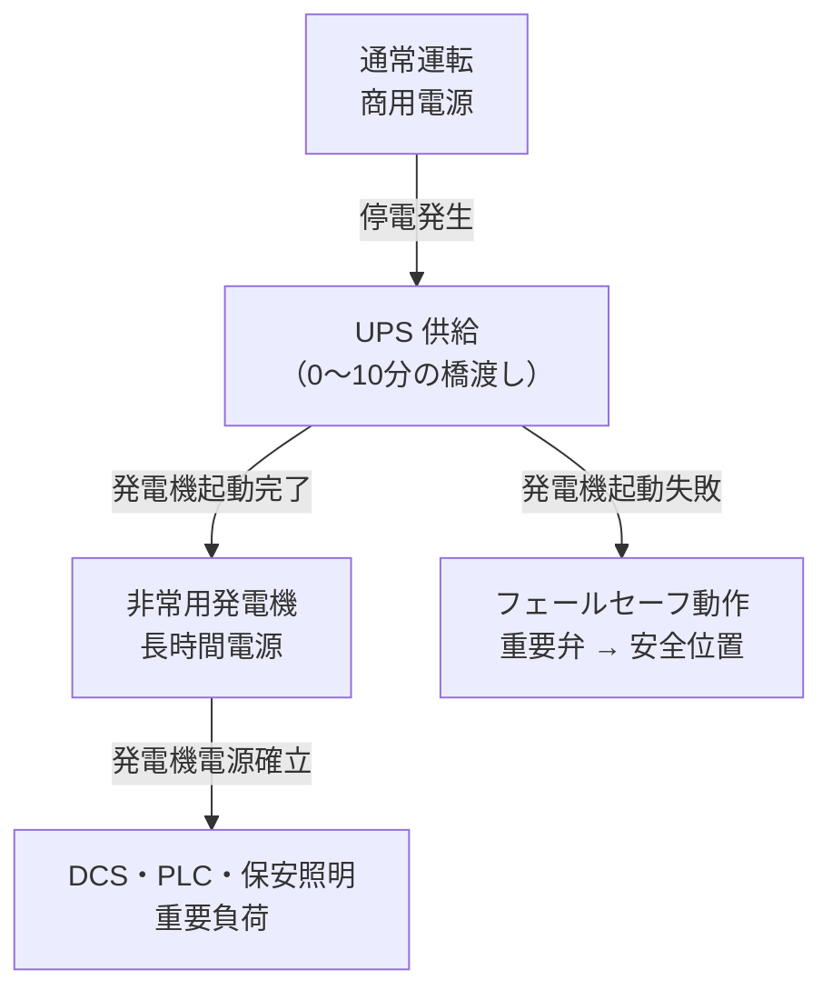

# UPS・非常電源

## 30秒まとめ

UPS は「常時インバータ給電」が DCS・PLC 等の計装電源に適した方式。バッテリー容量は「負荷 VA × バックアップ時間 ÷ 放電深度」で計算。化学プラントでは非常用発電機との優先度設計（UPS は短時間橋渡し、発電機は長時間）が重要。

---

## UPS 種類比較

| 方式 | 特徴 | 切替時間 | 適用 |
|------|------|---------|------|
| 常時商用給電（スタンバイ） | 通常は商用電源。停電時にインバータへ切替 | 5〜20ms | 一般 OA 機器・照明 |
| ラインインタラクティブ | 電圧変動は AVR で吸収。停電時のみインバータ動作 | 2〜10ms | 一般サーバー |
| 常時インバータ給電（ダブルコンバージョン） | 常時インバータ経由。電圧・周波数を完全制御 | 0ms（無瞬断） | DCS・PLC・精密計装 |

!!! tip "計装・制御系には常時インバータ"
    DCS やプロセスコンピューターは 20ms 以上の瞬停でシステムが誤動作・再起動する場合がある。常時インバータ給電方式（0ms 切替）を選定する。

---

## バッテリー容量計算

```
必要バッテリー容量 [Ah] = 負荷容量 [VA] × バックアップ時間 [h] ÷ (放電電圧 [V] × 放電深度)

放電深度: 鉛蓄電池は 0.8（80%放電まで使用）
         リチウムイオンは 0.9（90%放電まで使用）
```

### 計算例

| 項目 | 数値 |
|------|------|
| DCS 電源 | 3,000 VA |
| PLC 電源 | 500 VA |
| 合計負荷 | 3,500 VA |
| 力率 | 0.9（実効 3,150 W） |
| バックアップ時間 | 30 分（0.5 h） |
| 放電電圧 | 100V（UPS 内部 DC 換算は設計による） |

→ バックアップ時間・容量はメーカーの選定ツールで最終確認（電圧・温度特性が複雑なため）

---

## 各機器の許容停電時間確認

| 機器 | 許容停電時間の目安 |
|------|-----------------|
| DCS コントローラ | 20ms 以内（常時インバータ必須） |
| PLC | 20〜100ms（機種による） |
| 伝送器（4-20mA） | DC24V 供給なので UPS 経由で 30 分以上確保 |
| 電磁弁 | 電源喪失 = フェールセーフ位置に動作（要確認） |
| 非常照明 | 消防法 20 分以上（内蔵バッテリー対応） |

---

## 定期点検項目

| 点検周期 | 点検項目 | 判定基準 |
|---------|---------|---------|
| 月次 | 充電電流・充電電圧の確認 | カタログ仕様値 ±5% 以内 |
| 月次 | UPS 本体の警報ランプ確認 | 警報なし |
| 年次 | バッテリー端子電圧測定（各セル） | 均等化誤差 ±0.05V 以内 |
| 年次 | 内部インピーダンス測定 | 初期値の 1.5 倍以内 |
| 年次 | 放電試験（実負荷での動作確認） | 設計バックアップ時間の確保 |
| 年次 | 切替試験（商用 → インバータ） | 切替時の出力電圧維持確認 |

---

## バッテリー交換周期

| バッテリー種類 | 推奨交換周期 | 判断基準 |
|-------------|------------|---------|
| 鉛蓄電池（密閉型） | 4〜5 年 | 内部インピーダンスが初期値の 1.5 倍超 |
| リチウムイオン | 8〜10 年 | 容量が初期値の 80% 以下 |

!!! warning "高温環境ではバッテリー劣化が加速"
    周囲温度が 25℃ 超になるごとに寿命が約 50% 短縮（アレニウス則）。UPS 設置場所は空調管理または換気を確保する。

---

## 化学プラント固有：非常用発電機との優先度設計



**負荷の優先度分類：**

| 優先度 | 負荷例 | 電源 |
|--------|-------|------|
| 最優先 | DCS・安全計装・非常照明 | UPS → 発電機 |
| 優先 | ユーティリティポンプ・換気 | 発電機 |
| 通常 | 一般動力・照明 | 発電機（余力があれば） |
| 停電中停止 | 生産設備・空調非重要 | 復電まで停止 |
