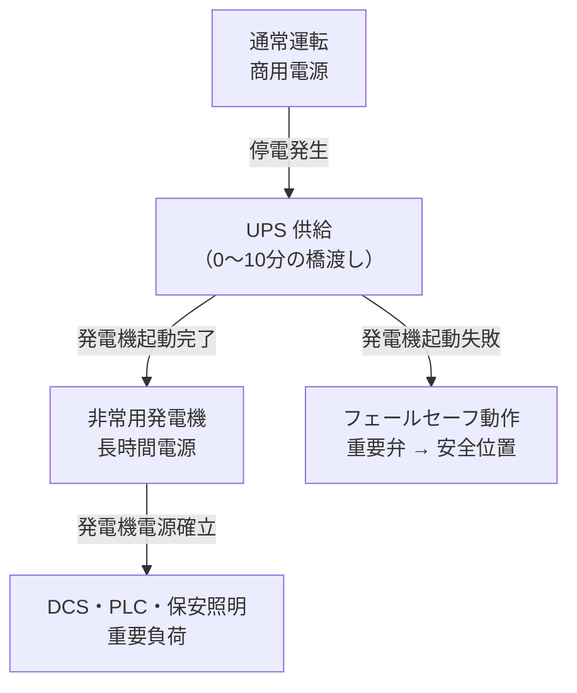

# UPS・非常電源

## 30秒まとめ

UPS は「常時インバータ給電」が DCS・PLC 等の計装電源に適した方式。バッテリー容量は「負荷電力（W）× バックアップ時間」をバッテリー電圧・放電深度・インバータ効率で割って概算する。化学プラントでは非常用発電機との優先度設計（UPS は短時間橋渡し、発電機は長時間）が重要。

---

## UPS 種類比較

| 方式 | 特徴 | 切替時間 | 適用 |
|------|------|---------|------|
| 常時商用給電（スタンバイ） | 通常は商用電源。停電時にインバータへ切替 | 5〜20ms | 一般 OA 機器・照明 |
| ラインインタラクティブ | 電圧変動は AVR で吸収。停電時のみインバータ動作 | 2〜10ms | 一般サーバー |
| 常時インバータ給電（ダブルコンバージョン） | 常時インバータ経由。電圧・周波数を完全制御 | 0ms（無瞬断） | DCS・PLC・精密計装 |

!!! tip "計装・制御系には常時インバータ"
    停電に耐えられるかは「**UPS の切替時間 ＜ 負荷機器の電源保持時間（ホールドアップタイム）**」で決まる。機器側の電源ユニットは内部コンデンサで短時間（一般に 10〜20ms 程度・機器仕様による）は出力を保持できるが、UPS の切替がそれより長いと機器がリセットされる。DCS やプロセスコンピューターの許容瞬停時間は機器仕様書で確認し、切替時間 0ms の常時インバータ給電方式を選定するのが原則。

---

## バッテリー容量計算

```text
必要バッテリー容量 [Ah] ≒ 負荷電力 [W] × バックアップ時間 [h]
                        ÷ (バッテリー電圧 [V] × 放電深度 × インバータ効率)

負荷電力 [W] = 負荷容量 [VA] × 力率

放電深度（設計上使ってよい放電量の割合）: 鉛蓄電池 0.8・リチウムイオン 0.9 を目安
インバータ効率: 0.85〜0.95 程度（機種による）
```

!!! warning "インバータ効率を忘れると容量不足（危険側）になる"
    バッテリーが放出した電力の一部はインバータの変換損失で消える。効率を入れずに計算すると必要容量を**小さく**見積もることになり、設計バックアップ時間を確保できない。また VA のまま計算すると力率の分だけ過大（安全側）になるが、正しくは W に換算してから計算する。

### 計算例

| 項目 | 数値 |
|------|------|
| DCS 電源 | 3,000 VA |
| PLC 電源 | 500 VA |
| 合計負荷 | 3,500 VA |
| 力率 | 0.9（実効 3,150 W） |
| バックアップ時間 | 30 分（0.5 h） |
| バッテリー電圧 | DC 100V（内部 DC バス電圧は設計による） |
| 放電深度 | 0.8（鉛蓄電池） |
| インバータ効率 | 0.9 |

```text
必要容量 ≒ 3,150 W × 0.5 h ÷ (100 V × 0.8 × 0.9)
        = 1,575 ÷ 72 ≒ 21.9 Ah → 経年劣化の余裕を見て上位容量を選定
```

→ 実際の選定は必ずメーカーの選定ツールで最終確認する（放電レートによる実効容量の低下・温度特性・セル電圧の下限設定が上式には入っていないため）

---

## 各機器の許容停電時間確認

| 機器 | 許容停電時間の目安 |
|------|-----------------|
| DCS コントローラ | 20ms 以内（常時インバータ必須） |
| PLC | 20〜100ms（機種による） |
| 伝送器（4-20mA） | DC24V 供給なので UPS 経由で 30 分以上確保 |
| 電磁弁 | 電源喪失 = フェールセーフ位置に動作（要確認） |
| 誘導灯・非常用照明 | 誘導灯＝消防法系 20 分間、非常用照明＝建築基準法系 30 分間（詳細は [照明・コンセント](lighting.md) を正典とする。内蔵バッテリー対応が一般的） |

---

## 定期点検項目

| 点検周期 | 点検項目 | 判定基準 |
|---------|---------|---------|
| 月次 | 充電電流・充電電圧の確認 | カタログ仕様値 ±5% 以内 |
| 月次 | UPS 本体の警報ランプ確認 | 警報なし |
| 年次 | バッテリー端子電圧測定（各セル） | 均等化誤差 ±0.05V 以内 |
| 年次 | 内部インピーダンス測定 | 初期値の 1.5 倍以内 |
| 年次 | 放電試験（実負荷での動作確認） | 設計バックアップ時間の確保 |
| 年次 | 切替試験（商用 → インバータ） | 切替時の出力電圧維持確認 |

---

## バッテリー交換周期

| バッテリー種類 | 推奨交換周期 | 判断基準 |
|-------------|------------|---------|
| 鉛蓄電池（密閉型） | 4〜5 年 | 内部インピーダンスが初期値の 1.5 倍超 |
| リチウムイオン | 8〜10 年 | 容量が初期値の 80% 以下 |

!!! warning "高温環境ではバッテリー劣化が加速"
    鉛蓄電池の期待寿命は基準温度 25℃ で示され、周囲温度が **10℃ 上昇するごとに寿命が約半分**になる（アレニウス則にもとづく 10℃ 半減則。バッテリーメーカーの技術資料で広く示される目安）。UPS 設置場所は空調管理または換気を確保する。

---

## 化学プラント固有：非常用発電機との優先度設計


```mermaid
flowchart TD
    NORMAL[通常運転\n商用電源] -->|停電発生| UPS_BRIDGE[UPS 供給\n（0〜10分の橋渡し）]
    UPS_BRIDGE -->|発電機起動完了| GEN[非常用発電機\n長時間電源]
    GEN -->|発電機電源確立| LOAD[DCS・PLC・保安照明\n重要負荷]
    UPS_BRIDGE -->|発電機起動失敗| SAFE[フェールセーフ動作\n重要弁 → 安全位置]
```

**負荷の優先度分類：**

| 優先度 | 負荷例 | 電源 |
|--------|-------|------|
| 最優先 | DCS・安全計装・非常照明 | UPS → 発電機 |
| 優先 | ユーティリティポンプ・換気 | 発電機 |
| 通常 | 一般動力・照明 | 発電機（余力があれば） |
| 停電中停止 | 生産設備・空調非重要 | 復電まで停止 |

## 根拠

### 本ページが正典の範囲

UPS の方式比較・バッテリー容量の概算式・点検周期・非常用発電機との優先度設計は本ページが正典です。誘導灯・非常用照明の法令帰属とバックアップ時間は [照明・コンセント](lighting.md)、UPS 系統の停電・切替失敗時の対応は [電源トラブル](../06-trouble/power.md) が正典で、本ページは数値を再記述しません。

### 一次計算で検算済み

| 項目 | 検算 |
|---|---|
| 負荷電力 | 3,500 VA × 0.9 = 3,150 W |
| 必要容量 | 3,150 W × 0.5 h ÷ (100 V × 0.8 × 0.9) = 1,575 ÷ 72 ≒ 21.9 Ah |

### 是正の記録（2026-08-06）

- **バッテリー容量式が「負荷 VA ÷（放電電圧 × 放電深度）」でインバータ効率と力率を含んでいなかった**: インバータ効率を省くと必要容量を小さく見積もる**危険側**の式になるため、負荷電力（W）換算とインバータ効率を含む式に是正し、計算例を数値まで完結させました（30秒まとめの式も同時に同期）
- **「周囲温度が 25℃ 超になるごとに寿命が約 50% 短縮」という不正確な表現**: 正しくは「基準 25℃・**10℃ 上昇ごとに寿命が約半分**」（10℃ 半減則）。「25℃ 超になるごとに」では上昇幅と半減の対応が読み取れないため是正しました
- **許容停電時間表の「非常照明＝消防法 20 分以上」が法令帰属を混同**: 消防法系（20 分間）は誘導灯で、非常用照明は建築基準法系（30 分間）です。区分は [照明・コンセント](lighting.md) を正典として参照に変えました
- **瞬停でリセットされる機序を明示**: 「UPS の切替時間 ＜ 機器の電源保持時間」が成立条件であることを tip に追記しました（従来の記述も方向は正しかったが、判定基準が書かれていなかった）

### 実務慣行（規格・法令の裏付けなし）

- 方式別の切替時間（スタンバイ 5〜20ms・ラインインタラクティブ 2〜10ms）と機器別の許容停電時間（DCS 20ms 以内・PLC 20〜100ms）は目安で、実際は機器仕様値によります
- 放電深度（鉛 0.8・リチウムイオン 0.9）・インバータ効率（0.85〜0.95）・点検判定値（充電電圧 ±5%・セル間 ±0.05V・内部インピーダンス初期値の 1.5 倍）・交換周期（鉛 4〜5 年・リチウムイオン 8〜10 年）はいずれも実務目安・メーカー推奨値で、法定値ではありません

### 限界の明示

- 容量概算式には**放電レートによる実効容量低下（ペウケルト効果）・温度特性・セル電圧下限**が入っていません。最終選定は必ずメーカーの選定ツールによってください
- UPS・発電機の切替シーケンスはプラントごとの設計事項で、本ページのフローは一例です

照合日: 2026-08-06（容量式・計算例を一次検算で確定。切替時間・点検値は実務目安として区分し、法令帰属の混同 1 件を是正）。

---

## 関連ページ

- [電源トラブル](../06-trouble/power.md) — UPS 系統の停電・切替失敗時
- [低圧配電](distribution.md) — UPS 上流／下流の配電構成
- [低圧カテゴリ](index.md) — より広い低圧知識へ
