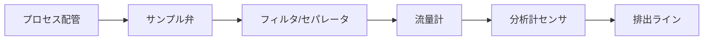

# 分析計

## 30秒まとめ

分析計はセンサが消耗品であり定期校正・電極交換が前提。サンプリングシステムの詰まりが計測値の異常原因になることが多い。防爆エリアの設置では必ず Ex 認証を確認する。

---

## pH計

### 電極の構造と原理
pH計はガラス電極（測定極）と比較電極（参照極）の電位差を計測する。

```
ガラス電極：ガラス薄膜の両側のH+濃度差に応じた電位が発生
比較電極：一定の基準電位を発生（塩化銀/塩化カリウム溶液）
計測電位差（mV）→ pH値に換算（Nernst式：59.16 mV/pH（25℃時））
```

<svg viewBox="0 0 660 320" role="img" aria-label="pH電極の構造断面図。ガラス電極と比較電極を測定液に浸し、両電極間の電位差を計測する。" style="max-width:100%;height:auto;" xmlns="http://www.w3.org/2000/svg">
  <g fill="none" stroke="currentColor" stroke-width="1.5">
    <!-- 測定液の容器 -->
    <path d="M110 100 L110 290 L560 290 L560 100" />
    <line x1="110" y1="160" x2="560" y2="160" stroke-dasharray="5 5" />
    <!-- ガラス電極（測定極） -->
    <path d="M215 46 L215 236 Q235 264 255 236 L255 46" />
    <path d="M215 236 Q235 264 255 236 Z" fill="currentColor" fill-opacity="0.12" />
    <!-- 比較電極（参照極） -->
    <rect x="415" y="46" width="42" height="212" rx="4" />
    <line x1="436" y1="66" x2="436" y2="240" />
    <!-- 電位差計 -->
    <rect x="300" y="12" width="72" height="34" rx="4" />
    <line x1="235" y1="46" x2="235" y2="29" />
    <line x1="235" y1="29" x2="300" y2="29" />
    <line x1="436" y1="46" x2="436" y2="29" />
    <line x1="436" y1="29" x2="372" y2="29" />
    <!-- ガラス薄膜への引き出し線 -->
    <line x1="235" y1="252" x2="235" y2="278" />
  </g>
  <g fill="currentColor" font-size="14" font-family="sans-serif">
    <text x="336" y="34" text-anchor="middle">電位差 (mV)</text>
    <text x="235" y="84" text-anchor="middle">ガラス電極</text>
    <text x="235" y="102" text-anchor="middle" font-size="12">（測定極）</text>
    <text x="436" y="84" text-anchor="middle">比較電極</text>
    <text x="436" y="102" text-anchor="middle" font-size="12">（参照極）</text>
    <text x="235" y="294" text-anchor="middle" font-size="12">ガラス薄膜</text>
    <text x="436" y="212" text-anchor="middle" font-size="11">塩化銀 /</text>
    <text x="436" y="227" text-anchor="middle" font-size="11">塩化カリウム</text>
    <text x="548" y="150" text-anchor="end" font-size="12">測定液</text>
    <text x="272" y="208" font-size="13">H⁺</text>
    <text x="198" y="208" text-anchor="end" font-size="13">H⁺</text>
  </g>
  <g fill="none" stroke="currentColor" stroke-width="1">
    <path d="M204 204 L215 204" marker-end="url(#kae)" />
    <path d="M266 204 L255 204" marker-end="url(#kae)" />
  </g>
  <defs>
    <marker id="kae" markerWidth="8" markerHeight="8" refX="6" refY="3" orient="auto">
      <path d="M0 0 L6 3 L0 6 Z" fill="currentColor" />
    </marker>
  </defs>
</svg>

*ガラス薄膜の両側の H⁺ 濃度差で生じる電位を、比較電極の基準電位を基準に電位差として計測し pH に換算する。*

### 2点校正手順

校正は少なくとも**2種類の標準緩衝液**を使う。

```
1. センサを純水でリンス
2. pH 7.00 緩衝液に浸漬 → ゼロ点調整（Zero Calibration）
3. pH 4.00（酸性側）または pH 9.18（アルカリ側）緩衝液に浸漬
   → スパン調整（Span Calibration）
4. スロープ値を確認（95〜105% が正常。95% 未満は電極劣化）
5. 校正結果を記録（日時・標準液ロット番号・スロープ値）
```

!!! tip "スパン用緩衝液の選び方"
    スパン用の第2緩衝液は、実際の測定 pH 域を挟む側を選ぶ（酸性域を測るなら pH 4.00、アルカリ域を測るなら pH 9.18）。測定範囲外の緩衝液で校正すると外挿誤差が大きくなる。

!!! warning "温度補償の確認"
    pH の Nernst 勾配は温度によって変化する（25℃：59.16 mV/pH、0℃：54.20 mV/pH）。
    温度補償機能（自動：ATC 内蔵型）が有効になっていることを確認する。

### 電極の寿命と管理

| 指標 | 正常範囲 | 要交換の目安 |
|------|---------|-----------|
| スロープ | 95〜105% | 90% 以下 |
| ゼロ点 | ±20 mV | ±30 mV 超 |
| 応答時間 | 30秒以内 | 2分以上 |

---

## 導電率計

### 用途
- **純水・超純水の監視**（0.1〜10 μS/cm）：精製水設備の水質管理
- **塩分濃度・塩化物管理**（0.1〜200 mS/cm）：冷却水・廃水処理
- **濃度換算**：既知の相関式がある液体（NaCl・H₂SO₄等）は濃度に換算可能

### 測定原理
- **2電極式**：低コスト。電極汚染に弱い。低導電率向け
- **4電極式**：電極汚染の影響を低減。中〜高導電率向け
- **誘導型（トロイダル式）**：電極がプロセス液に直接触れない。腐食性・スラリーに最適

---

## 可燃性ガス検知器

### 接触燃焼式の原理
触媒（白金・パラジウム）を塗布した検知素子を高温に保ち、可燃性ガスが触媒上で燃焼する際の温度上昇（抵抗変化）を検出する。

| 項目 | 内容 |
|------|------|
| 測定範囲 | 0〜100% LEL（爆発下限界） |
| 精度 | ±5% LEL 以内 |
| 応答時間 | T90 ≤ 30秒 |
| 校正ガス | 既知濃度の標準ガス（イソブタン・メタン等） |

!!! danger "触媒被毒"
    シリコン化合物・鉛・硫黄化合物は触媒を被毒させ感度を低下させる。
    シリコン系消火剤・シリコン系滑剤が周辺で使用されている場合は定期的に感度確認を行う。
    被毒した検知器は感度が低下しても正常動作しているように見えるため危険。

---

## 有毒ガス検知器

### 電気化学式の原理
被測定ガスが電解液中の電極で酸化・還元反応を起こし、反応電流がガス濃度に比例する。

| 対象ガス | 測定範囲 | 警報設定例 |
|---------|---------|----------|
| NH₃（アンモニア） | 0〜100 ppm | 1段：25 ppm / 2段：50 ppm |
| H₂S（硫化水素） | 0〜50 ppm | 1段：5 ppm / 2段：10 ppm |
| Cl₂（塩素） | 0〜10 ppm | 1段：0.5 ppm / 2段：1 ppm |
| CO（一酸化炭素） | 0〜100 ppm | 1段：25 ppm / 2段：50 ppm |

!!! note "定期交換が必要"
    電気化学式センサは電解液が消耗するため**寿命が1〜2年**。
    製造日から管理して計画交換すること。使いきりのため修理不可。

---

## サンプリングシステムの詰まり対策



| 詰まり発生箇所 | 原因 | 対策 |
|------------|------|------|
| フィルタ | 固形物・スケール堆積 | 定期洗浄・差圧監視 |
| サンプル弁 | 結晶・重合物の析出 | スチームトレース・加温 |
| 流量計 | ゲル状物の付着 | 洗浄ラインの設置 |
| 導管 | 液体の凝固・凝縮 | 保温・トレース |

---

## 防爆エリアでの設置注意

!!! danger "Ex 認証の確認は必須"
    危険区域に設置する分析計は以下を確認すること：

    1. **Ex 認証マーク**（TIIS、ATEX、IECEx）が機器に明記されていること
    2. **ガスグループ**（IIA/IIB/IIC）が対象可燃性ガスに適合していること
    3. **温度クラス**（T1〜T6）が対象ガスの発火温度より低いこと
    4. サンプリング系の配管・継手にも区域対応の材料を使用すること
