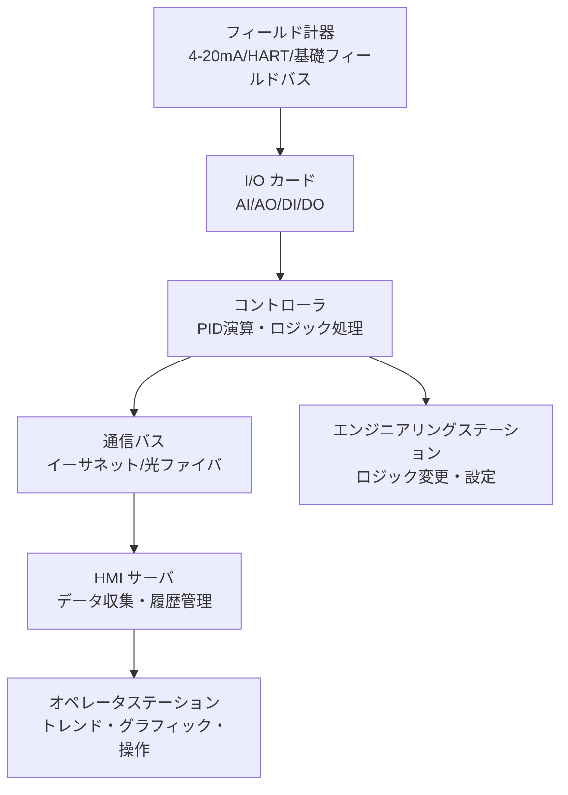

# DCS（分散制御システム）

## 30秒まとめ

DCS はフィールド計器からHMIまでを統合制御する。変更管理（MOC）なしの設定変更は絶対禁止。安全計装（SIS）は DCS とは物理的に独立させることが IEC 61511 の要求事項。

---

## DCS の基本構成

### 主要 I/O 種別

| カード種別 | 略称 | 用途 |
|----------|------|------|
| Analog Input | AI | 4-20mA 入力（伝送器） |
| Analog Output | AO | 4-20mA 出力（調節弁・インバータ） |
| Digital Input | DI | ON/OFF 入力（リミットスイッチ・流量スイッチ） |
| Digital Output | DO | ON/OFF 出力（電磁弁・モーター起動） |
| Pulse Input | PI | パルス入力（流量積算） |

---

## ファンクションブロック図の読み方

DCS のロジックはファンクションブロック（FB）で記述される。

| ブロック | 機能 |
|---------|------|
| PID | PID 演算 |
| AND | 複数入力の論理積（全て TRUE で出力 TRUE） |
| OR | 複数入力の論理和（1つでも TRUE で出力 TRUE） |
| HS（Selector） | 複数入力から最大値・最小値・手動値を選択出力 |
| DELAY | 一定時間の遅延 |
| RAMP | 設定値の速度制限（SU/SD レート） |
| INTLK | インターロック条件を評価してトリップ信号を出力 |

!!! tip "FB 図の確認手順"
    DCS のロジック変更前は必ず「上流のブロックの出力が何か」「下流に何が繋がっているか」を追いかける。
    特に INTLK（インターロック）ブロックの入力条件を全て確認してから変更する。

---

## 冗長化の考え方

化学プラントの DCS は運転継続性の観点から冗長化が基本。

| 対象 | 冗長化方式 | 切替方式 |
|------|---------|---------|
| コントローラ | 1+1 二重化 | バンプレス自動切替 |
| 電源 | 二重化（UPS ×2系統） | 無瞬断自動切替 |
| 通信バス | 二重化リング構成 | 自動バイパス |
| I/O カード | 一部設備は二重化（SIS 連携部） | — |

!!! note "冗長化されていない箇所の確認"
    現場の DCS で冗長化が省かれている I/O カードが存在する場合がある。
    カード故障時は対象ループが全て手動となるため、影響範囲を事前に把握しておく。

---

## 変更管理（MOC: Management of Change）

!!! danger "MOC なしの変更は絶対禁止"
    DCS のロジック・設定値・I/O の変更は必ず MOC（変更管理）プロセスを経ること。
    緊急の場合でも事後承認で記録を残す。

    MOC で確認すべき事項：
    1. 変更の目的と内容
    2. 影響を受けるループ・インターロックの確認
    3. 変更前後の設定値記録
    4. 試験手順と確認者
    5. ロールバック手順

---

## 化学プラント固有：SIS と DCS の分離原則

IEC 61511（機能安全：プロセス産業向け）の要求：

> **Safety Instrumented System（SIS）は DCS とは物理的に独立した別システムで構成すること。**

理由：DCS に障害が発生した際に、安全機能（緊急停止・インターロック）が道連れで停止しないようにするため。

| 項目 | DCS | SIS |
|------|-----|-----|
| 目的 | プロセス制御 | 安全機能（ESD・インターロック） |
| 規格 | — | IEC 61511 / IEC 61508 |
| 独立性 | — | DCS と物理的に分離 |
| 検証 | 運転中変更可 | SIL 検証・変更手順が厳格 |
| センサ共用 | 可 | 原則不可（別センサ使用） |
