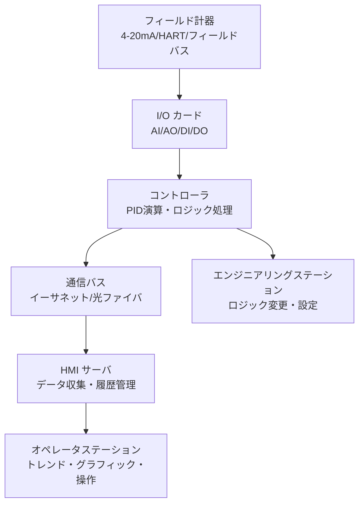

# DCS（分散制御システム）

## 30秒まとめ

DCS はフィールド計器からHMIまでを統合制御する。変更管理（MOC）なしの設定変更は絶対禁止。安全計装（SIS）は DCS とは物理的に独立させることが IEC 61511 の要求事項（SIL・投票構成・プルーフテストは [機能安全（SIS/SIL）](sis-sil.md) を参照）。

---

## DCS の基本構成

```mermaid
flowchart TB
    A[フィールド計器\n4-20mA/HART/フィールドバス] --> B[I/O カード\nAI/AO/DI/DO]
    B --> C[コントローラ\nPID演算・ロジック処理]
    C --> D[通信バス\nイーサネット/光ファイバ]
    D --> E[HMI サーバ\nデータ収集・履歴管理]
    E --> F[オペレータステーション\nトレンド・グラフィック・操作]
    C --> G[エンジニアリングステーション\nロジック変更・設定]
```

### 主要 I/O 種別

| カード種別 | 略称 | 用途 |
|----------|------|------|
| Analog Input | AI | 4-20mA 入力（伝送器） |
| Analog Output | AO | 4-20mA 出力（調節弁・インバータ） |
| Digital Input | DI | ON/OFF 入力（リミットスイッチ・流量スイッチ） |
| Digital Output | DO | ON/OFF 出力（電磁弁・モーター起動） |
| Pulse Input | PI | パルス入力（流量積算） |

---

## ファンクションブロック図の読み方

DCS のロジックはファンクションブロック（FB）で記述される。

| ブロック | 機能 |
|---------|------|
| PID | PID 演算 |
| AND | 複数入力の論理積（全て TRUE で出力 TRUE） |
| OR | 複数入力の論理和（1つでも TRUE で出力 TRUE） |
| HS（Selector） | 複数入力から最大値・最小値・手動値を選択出力 |
| DELAY | 一定時間の遅延 |
| RAMP | 設定値の速度制限（SU/SD レート） |
| INTLK | インターロック条件を評価してトリップ信号を出力 |

!!! tip "FB 図の確認手順"
    DCS のロジック変更前は必ず「上流のブロックの出力が何か」「下流に何が繋がっているか」を追いかける。
    特に INTLK（インターロック）ブロックの入力条件を全て確認してから変更する。

---

## 冗長化の考え方

化学プラントの DCS は運転継続性の観点から冗長化が基本。

| 対象 | 冗長化方式 | 切替方式 |
|------|---------|---------|
| コントローラ | 1+1 二重化 | バンプレス自動切替 |
| 電源 | 二重化（UPS ×2系統） | 無瞬断自動切替 |
| 通信バス | 二重化リング構成 | 自動バイパス |
| I/O カード | 一部設備は二重化（SIS 連携部） | — |

!!! note "冗長化されていない箇所の確認"
    現場の DCS で冗長化が省かれている I/O カードが存在する場合がある。
    カード故障時は対象ループが全て手動となるため、影響範囲を事前に把握しておく。

---

## 変更管理（MOC: Management of Change）

!!! danger "MOC なしの変更は絶対禁止"
    DCS のロジック・設定値・I/O の変更は必ず MOC（変更管理）プロセスを経ること。
    緊急の場合でも事後承認で記録を残す。

    MOC で確認すべき事項：
    1. 変更の目的と内容
    2. 影響を受けるループ・インターロックの確認
    3. 変更前後の設定値記録
    4. 試験手順と確認者
    5. ロールバック手順

---

## 化学プラント固有：SIS と DCS の分離原則

IEC 61511（機能安全：プロセス産業向け。上位に汎用規格 IEC 61508）は、SIS を BPCS（DCS）から**独立**させることを要求しています（要旨。該当条番号は原本未照合＝下記「根拠」参照）。

理由：DCS に障害が発生した際に、安全機能（緊急停止・インターロック）が道連れで停止しないようにするため。SIS 側の SIL 定義・SIF・投票構成・プルーフテストの実務は [機能安全（SIS/SIL）](sis-sil.md) を参照。

| 項目 | DCS | SIS |
|------|-----|-----|
| 目的 | プロセス制御 | 安全機能（ESD・インターロック） |
| 規格 | — | IEC 61511 / IEC 61508 |
| 独立性 | — | DCS と物理的に分離 |
| 検証 | 運転中変更可 | SIL 検証・変更手順が厳格 |
| センサ共用 | 可 | 原則不可（別センサ使用） |

---

## 根拠

- **SIS と BPCS（DCS）の独立**: IEC 61511（プロセス産業向け機能安全。対応 JIS は JIS C 0511 系。上位に IEC 61508＝JIS C 0508 系）に基づく設計原則です。ただし**該当する条文・箇条の番号は原本未照合**のため本ページでは挙げません。SIL 定義・投票構成・プルーフテストを含む機能安全の照合状況は [機能安全（SIS/SIL）](sis-sil.md) の根拠節が正典です（同ページも条番号レベルは原本未照合と明示しています）。かつて本ページはこの要求を引用符付きの文言で「規格の要求」として掲げていましたが、**原本の文言を逐語照合していない**ため、2026-08-01 に要旨である旨を明示する書き方に改めました。
- **法定義務ではない事項**: DCS の冗長化構成（コントローラ二重化・UPS 2系統・バスの二重化リング）、I/O カードの種別分類、ファンクションブロックの名称・記法、タグ命名は、法令・規格の要求として照合したものではなく、**実務慣行とメーカー仕様**（ベンダごとの実装差あり）です。自プラントの構成は納入仕様書・システム構成図で確認してください。
- **変更管理（MOC）**: MOC のプロセス自体を直接義務付ける単一の条文を本ページは根拠として持ちません（プロセス安全管理の一般実務であり、国内では保安規程・社内規定のレベルで定めるのが通例です）。SIS に関わる変更管理の考え方は [機能安全（SIS/SIL）](sis-sil.md) を参照してください。
- **限界の明示**: 本ページは DCS の構成と運用の考え方の整理であり、SIS の設計・SIL 判定・センサ共用可否の最終判断の根拠にしてはなりません。それらは IEC 61511 系規格の原本・SIL 検証・MOC の対象です。

---

## 関連ページ

- [機能安全（SIS/SIL）](sis-sil.md) — SIL・投票構成・プルーフテスト・バイパス管理
- [アラーム管理](alarm-management.md) — DCS が出すアラームの合理化・ベンチマーク指標・不良アラーム対策
- [PLC/DCS トラブル](../06-trouble/plc-dcs.md) — 通信断・I/O 異常・冗長系切替・アラーム氾濫の現場切り分け
