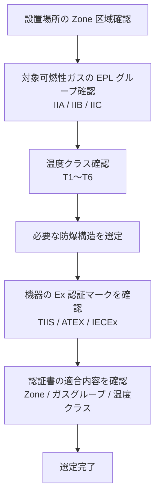

# 防爆

## 30秒まとめ

防爆は「着火源をなくす」または「着火しても爆発が伝播しない構造にする」の2つのアプローチ。化学プラントの計装担当として最低限押さえるべきは：危険区域分類・防爆構造の種類・本安バリアとアイソレータの使い分け。

---

## 危険区域の分類

IEC 60079 / TIIS（電気機械器具防爆構造規格）による分類。

| 区域 | 定義 | 化学プラントでの例 |
|------|------|----------------|
| Zone 0 | 可燃性ガスが常時または長時間存在 | タンク内部・排液ピット内 |
| Zone 1 | 通常運転中に可燃性ガスが存在する可能性あり | ポンプ周囲・圧縮機室 |
| Zone 2 | 異常時にのみ可燃性ガスが存在する可能性あり | 一般プロセスエリア・屋外プラント |
| 非危険区域 | ガスが存在しない | 中央制御室・電気室 |

!!! tip "HAZ 図（危険区域分類図）の活用"
    プラント建設時に作成した HAZ 図を参照し、設備設置場所の区域分類を確認する。
    HAZ 図がない場合は安全部門と確認してから機器を選定する。

---

## 防爆構造の種類比較表

| 防爆構造 | 記号 | 原理 | Zone 適用 | 主な用途 |
|---------|------|------|----------|---------|
| 耐圧防爆 | d | 爆発しても外部に伝播しない容器 | Zone 1/2 | ジャンクションボックス・スイッチ |
| 本質安全防爆 ia | ia | 火花や熱がガスに着火しないレベルに制限 | Zone 0/1/2 | センサ・伝送器 |
| 本質安全防爆 ib | ib | 1故障でも安全 | Zone 1/2 | センサ・伝送器 |
| 内圧防爆 | p | 内部を清浄空気または不活性ガスで陽圧に保つ | Zone 1/2 | 大型盤・分析計ハウジング |
| 油入防爆 | o | 火花を発生する部品を絶縁油に浸漬 | Zone 1/2 | 一部の開閉器 |
| 粉体充填防爆 | q | 粉体でスパーク部分を充填 | Zone 1/2 | 特殊機器 |
| 増安防爆 | e | 正常時に電弧・スパークを発生しない構造で確実性を高める | Zone 1/2 | 端子箱・モーター |

---

## 本安バリア vs アイソレータ

どちらも危険区域の本質安全機器（伝送器等）を安全区域の DCS と接続するために使用する。

| 項目 | 本安バリア（Zenerバリア） | アイソレータ |
|------|-----------------|---------|
| 動作原理 | ツェナーダイオードで電圧・電流を制限 | 変換・絶縁して信号を伝達 |
| 接地 | DCS 側の IS アース（バリア接地端子〜主接地点で 1Ω 以下）が必須 | 不要（電気的に絶縁されている） |
| 精度 | やや落ちる | 高い |
| コスト | 低い | 高い |
| 故障モード | 接地不良で機能しない | より安定 |
| 推奨場面 | IS アースが確保できる場合 | IS アースが確保できない・精度重視 |

!!! danger "IS アースの管理"
    ツェナーバリア（非絶縁形）は確実な本安接地がないと保護機能を果たさない。
    要求値は **バリア接地端子から電源系統の主接地点までの抵抗を 1Ω 以下**（IEC/JIS C 60079-14）とすること。
    接地極そのものは A 種接地工事（10Ω 以下）とし、これに 1Ω 以下の本安接地線で確実に接続する。
    IS アースは通常アースと独立させ、年1回の抵抗測定を必ず実施する。
    絶縁形バリア（アイソレータ）はガルバニック絶縁のため、この本安接地は原則不要。

    出典: IEC/JIS C 60079-14「爆発性雰囲気 — 電気設備の設計・選定・据付」、工場電気設備防爆指針（JNIOSH-TR-46-6）。
    なお従来一部で用いられた「40Ω以下」はバリア製品仕様書の外部配線抵抗パラメータとの混同に由来する誤りで、接地抵抗の規格値ではない。

---

## 本安ループのエンティティパラメータ整合

本安（IS）計装のコミッショニング・受入で最も重要な確認作業が、**エンティティパラメータ整合**（Entity Concept による適合検証）です。フィールド機器・バリア（アイソレータ）・ケーブルの3要素の許容値を突き合わせ、本安ループ全体が本質安全を満たすことを机上計算で証明します。認証書に記載された数値を1つでも満たさないと、機器単体は本安でもループ全体は**非本安**となります。

### エンティティコンセプトの考え方

エンティティコンセプト（Entity Concept）は、個別に認証された機器同士を、システム全体を再認証せずに組み合わせるための方法です。組み合わせの可否を、各機器の認証書に記載された**エンティティパラメータ**（entity parameters）の突き合わせだけで判定します。

- **関連機器（Associated Apparatus）**: 安全区域側のバリア／アイソレータ。危険区域へ供給しうる最大値（出力側、添字 **o** = output）を持つ
- **フィールド機器（Field Apparatus / Intrinsically Safe Apparatus）**: 危険区域側の伝送器・センサ。許容できる最大値（入力側、添字 **i** = input）を持つ
- **ケーブル**: 静電容量・インダクタンスというエネルギー蓄積要素。長さに比例して増えるため必ず計算に含める

### 記号の意味

| 記号 | 意味 | 属する機器 |
|------|------|-----------|
| Uo | 最大出力電圧 | バリア（関連機器） |
| Io | 最大出力電流 | バリア（関連機器） |
| Po | 最大出力電力 | バリア（関連機器） |
| Co | 許容外部静電容量（Ca とも表記） | バリア（関連機器） |
| Lo | 許容外部インダクタンス（La とも表記） | バリア（関連機器） |
| Ui | 最大許容入力電圧（Vmax） | フィールド機器 |
| Ii | 最大許容入力電流（Imax） | フィールド機器 |
| Pi | 最大許容入力電力 | フィールド機器 |
| Ci | 内部静電容量 | フィールド機器 |
| Li | 内部インダクタンス | フィールド機器 |
| Ccable | ケーブル静電容量（配線長 × 単位長容量） | ケーブル |
| Lcable | ケーブルインダクタンス（配線長 × 単位長インダクタンス） | ケーブル |

添字の **o**（output）はバリア側＝供給できる上限、**i**（input）はフィールド機器側＝受け入れられる上限を表します。

### 整合の不等式

以下の5つ（L/R比を使う場合は6つ目）を**すべて**満たして初めてループが本安として成立します。

| 項目 | 不等式 | 意味 |
|------|--------|------|
| 電圧 | Uo ≤ Ui | バリアの出せる電圧が機器の耐えられる電圧以下 |
| 電流 | Io ≤ Ii | バリアの出せる電流が機器の耐えられる電流以下 |
| 電力 | Po ≤ Pi | バリアの出せる電力が機器の耐えられる電力以下 |
| 静電容量 | Co ≥ Ci + Ccable | バリア許容容量が「機器内部容量＋ケーブル容量」以上 |
| インダクタンス | Lo ≥ Li + Lcable | バリア許容インダクタンスが「機器内部＋ケーブル」以上 |

!!! note "L/R 比（Lo/Ro）を使う方法"
    インダクタンスの代わりに **インダクタンス/抵抗比** で評価する方法もあります。バリアの許容 Lo/Ro（La/Ra）に対し、ケーブルの L/R 比が次を満たせば適合とみなせます。

    ```
    Lo/Ro ≥ (L/R)cable
    ```

    L/R 比法は配線抵抗による電流制限効果を織り込めるため、長距離配線で Lo 単独では超過してしまう場合に有効です。バリア・機器の認証書に Lo/Ro 値が併記されている場合に使用します。

!!! tip "エンティティ加算（単純法）が使える条件"
    上表の単純な加算（Co ≥ Ci + Ccable 等）は、フィールド機器単体の Ci が Co の 1% 未満、かつ Li が Lo の 1% 未満の場合に無条件で適用できます（IEC 60079-25 の「1%ルール」）。集中定数とみなせない大容量機器や複数台接続では、より詳細な検討が必要です。

### ケーブル定数の目安

ケーブルの Ccable・Lcable は「配線長 × 単位長あたりの定数」で求めます。IEC 60079-25 が規定する代表値は次のとおりです。

| 定数 | 代表値（目安） | 備考 |
|------|-----------|------|
| 単位長静電容量 | 約 200 pF/m（= 200 nF/km） | 一般計装ケーブルの標準想定値 |
| 単位長インダクタンス | 約 1 µH/m（= 1 mH/km） | シールド有無を問わない標準想定値 |
| L/R 比 | 1 µH ÷ ループ抵抗(Ω/m) | L/R 比法を使う場合 |

!!! warning "定数はケーブル仕様で必ず確認"
    上記は規格の保守的な代表値です。メーカー実測値はこれより小さいことが多く、実測値を使えば適合できる場合があります。**必ず使用するケーブルの仕様書（データシート）で単位長静電容量・インダクタンスを確認**してください。値が不明な場合は規格代表値（200 pF/m・1 µH/m）を採用します。

### 計算例

!!! example "本安ループ適合判定（数値は説明用の典型例）"
    以下は考え方を示すための例です。実際の値は必ず各機器・ケーブルの認証書／仕様書を参照してください。

    **バリア（関連機器）認証値**

    - Uo = 25.2 V、Io = 93 mA、Po = 590 mW
    - Co = 107 nF（IIC）、Lo = 3.6 mH（IIC）

    **フィールド機器（伝送器）認証値**

    - Ui = 30 V、Ii = 100 mA、Pi = 750 mW
    - Ci = 12 nF、Li = 0.2 mH

    **ケーブル**: 標準計装ケーブル、配線長 500 m

    - Ccable = 200 pF/m × 500 m = 100,000 pF = 100 nF
    - Lcable = 1 µH/m × 500 m = 500 µH = 0.5 mH

    **判定**

    | 項目 | 不等式 | 数値 | 判定 |
    |------|--------|------|------|
    | 電圧 | Uo ≤ Ui | 25.2 V ≤ 30 V | OK |
    | 電流 | Io ≤ Ii | 93 mA ≤ 100 mA | OK |
    | 電力 | Po ≤ Pi | 590 mW ≤ 750 mW | OK |
    | 静電容量 | Co ≥ Ci + Ccable | 107 nF ≥ 12 + 100 = 112 nF | **NG** |
    | インダクタンス | Lo ≥ Li + Lcable | 3.6 mH ≥ 0.2 + 0.5 = 0.7 mH | OK |

    電圧・電流・電力・インダクタンスは満たしますが、**静電容量が 112 nF > 107 nF で超過し、ループは非本安**となります。ケーブル長を短縮する（例: 460 m 以下なら Ccable = 92 nF となり合計 104 nF ≤ 107 nF で OK）、容量許容の大きいバリアに変更する、実測のケーブル容量を使う、等の対策が必要です。この例のように**ケーブル1項目の超過だけで全体がNG**になる点が整合検証の要点です。

### 現場の落とし穴

!!! danger "ケーブル長で非本安化する"
    機器単体が本安認証でも、**ケーブルが長いと Ccable・Lcable が増えて Co・Lo を超過**し、ループ全体が非本安になります。上の計算例のとおり、静電容量は数百メートルで容易に上限へ達します。配線ルート変更で長さが伸びた場合は**必ず再計算**してください。

- **複数機器接続時の容量・インダクタンス加算**: 1つのバリアに複数のフィールド機器を接続する場合、各機器の Ci と全ケーブルの Ccable を**すべて合計**して Co と比較します。インダクタンスも同様。1台ずつなら OK でも合計で超過することがあります。
- **認証の組み合わせ適合（型式適合）**: エンティティパラメータの数値が合っていても、**機器とバリアの認証（ガスグループ IIA/IIB/IIC・温度クラス・EPL）が組み合わせとして適合しているか**を必ず確認します。認証書・適合宣言書（DoC）で突き合わせます。
- **フィールドバス本安（FISCO/FNICO）**: フィールドバスのように多数の機器がバス給電される系では、機器ごとのエンティティ加算が煩雑になるため、**FISCO**（Fieldbus Intrinsically Safe Concept、Zone 0/1 対応）や **FNICO**（Fieldbus Non-Incendive Concept、Zone 2 対応）という専用モデルを使います。FISCO/FNICO は電源・機器・ケーブルのパラメータ範囲をあらかじめ規定することで、ケーブル容量・インダクタンスの個別加算計算を不要にしています。使用機器がこれらに対応しているか認証書で確認します。

### 関連ページ

- [計装配線](wiring.md) — 本安回路の配線分離・シールド処理
- [計装基礎](basics.md) — 伝送器・信号系の基礎

---

## 防爆機器選定手順



### ガスグループの目安

| グループ | 代表的なガス | 最小着火エネルギー |
|---------|-----------|--------------|
| IIA | プロパン・ブタン | 高い（着火しにくい） |
| IIB | エチレン・シクロプロパン | 中 |
| IIC | 水素・アセチレン | 低い（最も着火しやすい） |

IIC 認定機器は IIA・IIB にも使用できる（上位互換）。

---

## 施工注意事項

### グランドの締め付け
ケーブルグランドは規定のトルクで締め付ける。緩みは防爆性能の喪失につながる。使用後は**シーリングコンパウンド**（グランドシール材）で充填する機種もある。

### シールフィッティング
Zone 1 以上のエリアでは、耐圧防爆ボックスへのケーブル引き込み部に**シールフィッティング**（防爆シーリング）を設置して、管路を通じた爆発伝播を防止する。

!!! warning "防爆性能を損なう改造の禁止"
    防爆認証を取得した機器の本体に穴を開けたり、別の部品を追加したりすることは認証失効となる。
    改造が必要な場合はメーカーに確認する。
