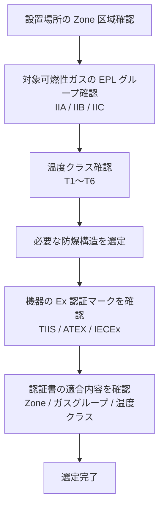

# 防爆

## 30秒まとめ

防爆は「着火源をなくす」または「着火しても爆発が伝播しない構造にする」の2つのアプローチ。化学プラントの計装担当として最低限押さえるべきは：危険区域分類・防爆構造の種類・本安バリアとアイソレータの使い分け。

---

## 危険区域の分類

IEC 60079 / TIIS（電気機械器具防爆構造規格）による分類。

| 区域 | 定義 | 化学プラントでの例 |
|------|------|----------------|
| Zone 0 | 可燃性ガスが常時または長時間存在 | タンク内部・排液ピット内 |
| Zone 1 | 通常運転中に可燃性ガスが存在する可能性あり | ポンプ周囲・圧縮機室 |
| Zone 2 | 異常時にのみ可燃性ガスが存在する可能性あり | 一般プロセスエリア・屋外プラント |
| 非危険区域 | ガスが存在しない | 中央制御室・電気室 |

!!! tip "HAZ 図（危険区域分類図）の活用"
    プラント建設時に作成した HAZ 図を参照し、設備設置場所の区域分類を確認する。
    HAZ 図がない場合は安全部門と確認してから機器を選定する。

---

## 防爆構造の種類比較表

| 防爆構造 | 記号 | 原理 | Zone 適用 | 主な用途 |
|---------|------|------|----------|---------|
| 耐圧防爆 | d | 爆発しても外部に伝播しない容器 | Zone 1/2 | ジャンクションボックス・スイッチ |
| 本質安全防爆 ia | ia | 火花や熱がガスに着火しないレベルに制限 | Zone 0/1/2 | センサ・伝送器 |
| 本質安全防爆 ib | ib | 1故障でも安全 | Zone 1/2 | センサ・伝送器 |
| 内圧防爆 | p | 内部を清浄空気または不活性ガスで陽圧に保つ | Zone 1/2 | 大型盤・分析計ハウジング |
| 油入防爆 | o | 火花を発生する部品を絶縁油に浸漬 | Zone 1/2 | 一部の開閉器 |
| 粉体充填防爆 | q | 粉体でスパーク部分を充填 | Zone 1/2 | 特殊機器 |
| 増安防爆 | e | 正常時に電弧・スパークを発生しない構造で確実性を高める | Zone 1/2 | 端子箱・モーター |

---

## 本安バリア vs アイソレータ

どちらも危険区域の本質安全機器（伝送器等）を安全区域の DCS と接続するために使用する。

| 項目 | 本安バリア（Zenerバリア） | アイソレータ |
|------|-----------------|---------|
| 動作原理 | ツェナーダイオードで電圧・電流を制限 | 変換・絶縁して信号を伝達 |
| 接地 | DCS 側の IS アース（40Ω以下）が必須 | 不要（電気的に絶縁されている） |
| 精度 | やや落ちる | 高い |
| コスト | 低い | 高い |
| 故障モード | 接地不良で機能しない | より安定 |
| 推奨場面 | IS アースが確保できる場合 | IS アースが確保できない・精度重視 |

!!! danger "IS アースの管理"
    本安バリアは IS（Intrinsically Safe）アース抵抗が **40Ω以下**でないと機能しない。
    IS アースは通常アースと独立させ、年1回の抵抗測定を必ず実施する。

---

## 防爆機器選定手順

### ガスグループの目安

| グループ | 代表的なガス | 最小着火エネルギー |
|---------|-----------|--------------|
| IIA | プロパン・ブタン | 高い（着火しにくい） |
| IIB | エチレン・シクロプロパン | 中 |
| IIC | 水素・アセチレン | 低い（最も着火しやすい） |

IIC 認定機器は IIA・IIB にも使用できる（上位互換）。

---

## 施工注意事項

### グランドの締め付け
ケーブルグランドは規定のトルクで締め付ける。緩みは防爆性能の喪失につながる。使用後は**シーリングコンパウンド**（グランドシール材）で充填する機種もある。

### シールフィッティング
Zone 1 以上のエリアでは、耐圧防爆ボックスへのケーブル引き込み部に**シールフィッティング**（防爆シーリング）を設置して、管路を通じた爆発伝播を防止する。

!!! warning "防爆性能を損なう改造の禁止"
    防爆認証を取得した機器の本体に穴を開けたり、別の部品を追加したりすることは認証失効となる。
    改造が必要な場合はメーカーに確認する。
