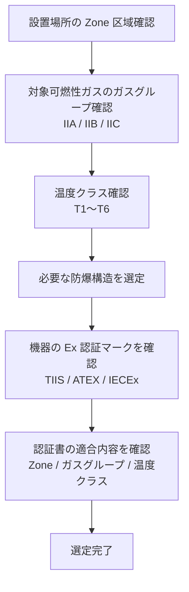

# 防爆

## 30秒まとめ

防爆は「着火源をなくす」または「着火しても爆発が伝播しない構造にする」の2つのアプローチ。化学プラントの計装担当として最低限押さえるべきは：危険区域分類・防爆構造の種類・本安バリアとアイソレータの使い分け。

---

## 危険区域の分類

分類の方法は JIS C 60079-10（IEC 60079-10 対応）によります。国内法規上は、電気機械器具防爆構造規格（昭和44年労働省告示第16号）第1条が定める**特別危険箇所・第一類危険箇所・第二類危険箇所**の3区分が Zone 0/1/2 に対応します（分類の方法は平成20年基発第0925001号により JIS C 60079-10 によることとされています。詳細は下記「根拠」）。

| 区域 | 定義 | 化学プラントでの例 |
|------|------|----------------|
| Zone 0（特別危険箇所） | 爆発性雰囲気が連続して、長時間にわたり、または頻繁に存在する | タンク内部・排液ピット内 |
| Zone 1（第一類危険箇所） | 通常の状態で爆発性雰囲気をしばしば生成するおそれがある | ポンプ周囲・圧縮機室 |
| Zone 2（第二類危険箇所） | 通常の状態で爆発性雰囲気を生成するおそれが少なく、生成しても短時間しか持続しない | 一般プロセスエリア・屋外プラント |
| 非危険区域 | 爆発性雰囲気の生成が想定されない | 中央制御室・電気室 |

!!! warning "Zone 2 を「異常時にのみガスが存在する場所」と説明するのは旧定義"
    「異常な状態において危険雰囲気（爆発性雰囲気）を生成するおそれがある場所」は旧「二種場所」の定義です。現行の第二類危険箇所（Zone 2）は**「通常の状態」での生成のおそれ**で定義され、ガスケットの経年劣化による漏出の増加や、予測されない状態でのリリーフバルブ作動も「通常の状態で想定すべき事象」に含まれます。旧定義の感覚より**想定すべき事象の範囲が広い**点に注意してください（出典は下記「根拠」）。

!!! tip "HAZ 図（危険区域分類図）の活用"
    プラント建設時に作成した HAZ 図を参照し、設備設置場所の区域分類を確認する。
    HAZ 図がない場合は安全部門と確認してから機器を選定する。

---

## 防爆構造の種類比較表

| 防爆構造 | 記号 | 原理 | Zone 適用 | 主な用途 |
|---------|------|------|----------|---------|
| 耐圧防爆 | d | 爆発しても外部に伝播しない容器 | Zone 1/2 | ジャンクションボックス・スイッチ |
| 本質安全防爆 ia | ia | 火花や熱がガスに着火しないレベルに制限 | Zone 0/1/2 | センサ・伝送器 |
| 本質安全防爆 ib | ib | 1故障でも安全 | Zone 1/2 | センサ・伝送器 |
| 内圧防爆 | p | 内部を清浄空気または不活性ガスで陽圧に保つ | Zone 1/2 | 大型盤・分析計ハウジング |
| 油入防爆 | o | 火花を発生する部品を絶縁油に浸漬 | Zone 1/2 | 一部の開閉器 |
| 粉体充填防爆 | q | 粉体でスパーク部分を充填 | Zone 1/2 | 特殊機器 |
| 増安防爆 | e | 正常時に電弧・スパークを発生しない構造で確実性を高める | Zone 1/2 | 端子箱・モーター |

!!! note "検定の系統によって Zone 適用が異なる（特に増安 e）"
    上表の Zone 適用は国際整合防爆指針・IEC 60079-0 系の選定原則です。旧構造規格ベースの検定品（工場電気設備防爆指針 1979/2006 の区分による検定）では、**安全増防爆構造（e）は第一類危険箇所（Zone 1）に適さない（×）**とされるなど適用範囲が異なります。既設設備の更新・流用時は、機器がどの系統の検定・認証かを検定合格証・認証書で確認してください。内圧防爆（p）も保護方式によって Zone 1 に適さないものがあり、IEC の区分では px・py は Zone 1 可、**pz は Zone 2 専用**です（出典: 工場防爆設備ガイド 表1-7。下記「根拠」参照）。

---

## 本安バリア vs アイソレータ

どちらも危険区域の本質安全機器（伝送器等）を安全区域の DCS と接続するために使用する。

| 項目 | 本安バリア（Zenerバリア） | アイソレータ |
|------|-----------------|---------|
| 動作原理 | ツェナーダイオードで電圧・電流を制限 | 変換・絶縁して信号を伝達 |
| 接地 | DCS 側の IS アース（バリア接地端子〜主接地点のインピーダンス 1Ω 未満）が必須 | 不要（電気的に絶縁されている） |
| 精度 | やや落ちる | 高い |
| コスト | 低い | 高い |
| 故障モード | 接地不良で機能しない | より安定 |
| 推奨場面 | IS アースが確保できる場合 | IS アースが確保できない・精度重視 |

!!! danger "IS アースの管理"
    ツェナーバリア（非絶縁形）は確実な本安接地がないと保護機能を果たさない。
    要求は、ツェナーバリアの接地端子を **(a) 実施可能な最短経路で等電位ボンディングシステムに接続する**か、**(b) TN-S 方式の場合、接続点から主電源システムの接地点までのインピーダンスが確実に 1Ω 未満になるように接続する**（電気室の接地母線への接続または独立した接地極の使用で達成する）ことです（工場防爆設備ガイド 3.9.2.4）。
    接地極そのものを A 種接地工事（10Ω 以下）とするのは実務慣行です（接地種別ごとの値の正典は[接地抵抗測定手順](../guidelines/grounding-inspection.md)）。
    IS アースは通常アースと独立させ、定期的に抵抗測定を実施する（年1回は実務の目安）。
    絶縁形バリア（アイソレータ）はガルバニック絶縁のため、この本安接地は原則不要。

    出典: 工場防爆設備ガイド（平成24年11月）3.9.2.4「本安回路の接地方法」（2026-08-01 原典照合）。同節は IEC/JIS C 60079-14「爆発性雰囲気で使用する電気機械器具−第14部: 危険区域内の電気設備」の要求に整合した記述だが、規格原本そのものは未照合（下記「根拠」参照）。
    なお従来一部で用いられた「40Ω以下」はバリア製品仕様書の外部配線抵抗パラメータとの混同に由来する誤りで、接地抵抗の規格値ではない。<!-- lint-ok: 20260710-is-setchi-40ohm 誤りの説明のため -->

---

## 本安ループのエンティティパラメータ整合

本安（IS）計装のコミッショニング・受入で最も重要な確認作業が、**エンティティパラメータ整合**（Entity Concept による適合検証）です。フィールド機器・バリア（アイソレータ）・ケーブルの3要素の許容値を突き合わせ、本安ループ全体が本質安全を満たすことを机上計算で証明します。認証書に記載された数値を1つでも満たさないと、機器単体は本安でもループ全体は**非本安**となります。

### エンティティコンセプトの考え方

エンティティコンセプト（Entity Concept）は、個別に認証された機器同士を、システム全体を再認証せずに組み合わせるための方法です。組み合わせの可否を、各機器の認証書に記載された**エンティティパラメータ**（entity parameters）の突き合わせだけで判定します。

- **関連機器（Associated Apparatus）**: 安全区域側のバリア／アイソレータ。危険区域へ供給しうる最大値（出力側、添字 **o** = output）を持つ
- **フィールド機器（Field Apparatus / Intrinsically Safe Apparatus）**: 危険区域側の伝送器・センサ。許容できる最大値（入力側、添字 **i** = input）を持つ
- **ケーブル**: 静電容量・インダクタンスというエネルギー蓄積要素。長さに比例して増えるため必ず計算に含める

### 記号の意味

| 記号 | 意味 | 属する機器 |
|------|------|-----------|
| Uo | 最大出力電圧 | バリア（関連機器） |
| Io | 最大出力電流 | バリア（関連機器） |
| Po | 最大出力電力 | バリア（関連機器） |
| Co | 許容外部静電容量（Ca とも表記） | バリア（関連機器） |
| Lo | 許容外部インダクタンス（La とも表記） | バリア（関連機器） |
| Ui | 最大許容入力電圧（Vmax） | フィールド機器 |
| Ii | 最大許容入力電流（Imax） | フィールド機器 |
| Pi | 最大許容入力電力 | フィールド機器 |
| Ci | 内部静電容量 | フィールド機器 |
| Li | 内部インダクタンス | フィールド機器 |
| Ccable | ケーブル静電容量（配線長 × 単位長容量） | ケーブル |
| Lcable | ケーブルインダクタンス（配線長 × 単位長インダクタンス） | ケーブル |

添字の **o**（output）はバリア側＝供給できる上限、**i**（input）はフィールド機器側＝受け入れられる上限を表します。

### 整合の不等式

以下の5つ（L/R比を使う場合は6つ目）を**すべて**満たして初めてループが本安として成立します。

| 項目 | 不等式 | 意味 |
|------|--------|------|
| 電圧 | Uo ≤ Ui | バリアの出せる電圧が機器の耐えられる電圧以下 |
| 電流 | Io ≤ Ii | バリアの出せる電流が機器の耐えられる電流以下 |
| 電力 | Po ≤ Pi | バリアの出せる電力が機器の耐えられる電力以下 |
| 静電容量 | Co ≥ Ci + Ccable | バリア許容容量が「機器内部容量＋ケーブル容量」以上 |
| インダクタンス | Lo ≥ Li + Lcable | バリア許容インダクタンスが「機器内部＋ケーブル」以上 |

!!! note "L/R 比（Lo/Ro）を使う方法"
    インダクタンスの代わりに **インダクタンス/抵抗比** で評価する方法もあります。バリアの許容 Lo/Ro（La/Ra）に対し、ケーブルの L/R 比が次を満たせば適合とみなせます。

    ```
    Lo/Ro ≥ (L/R)cable
    ```

    L/R 比法は配線抵抗による電流制限効果を織り込めるため、長距離配線で Lo 単独では超過してしまう場合に有効です。バリア・機器の認証書に Lo/Ro 値が併記されている場合に使用します。

!!! tip "エンティティ加算（単純法）が使える条件"
    上表の単純な加算（Co ≥ Ci + Ccable 等）は、フィールド機器単体の Ci が Co の 1% 未満、かつ Li が Lo の 1% 未満の場合に無条件で適用できます（IEC 60079-25 の「1%ルール」）。集中定数とみなせない大容量機器や複数台接続では、より詳細な検討が必要です。

### ケーブル定数の目安

ケーブルの Ccable・Lcable は「配線長 × 単位長あたりの定数」で求めます。IEC 60079-25 由来として広く用いられる代表値は次のとおりです（規格原本は未照合。下記「根拠」参照）。

| 定数 | 代表値（目安） | 備考 |
|------|-----------|------|
| 単位長静電容量 | 約 200 pF/m（= 200 nF/km） | 一般計装ケーブルの標準想定値 |
| 単位長インダクタンス | 約 1 µH/m（= 1 mH/km） | シールド有無を問わない標準想定値 |
| L/R 比 | 1 µH ÷ ループ抵抗(Ω/m) | L/R 比法を使う場合 |

!!! warning "定数はケーブル仕様で必ず確認"
    上記は規格の保守的な代表値です。メーカー実測値はこれより小さいことが多く、実測値を使えば適合できる場合があります。**必ず使用するケーブルの仕様書（データシート）で単位長静電容量・インダクタンスを確認**してください。値が不明な場合は規格代表値（200 pF/m・1 µH/m）を採用します。

### 計算例

!!! example "本安ループ適合判定（数値は説明用の典型例）"
    以下は考え方を示すための例です。実際の値は必ず各機器・ケーブルの認証書／仕様書を参照してください。

    **バリア（関連機器）認証値**

    - Uo = 25.2 V、Io = 93 mA、Po = 590 mW
    - Co = 107 nF（IIC）、Lo = 3.6 mH（IIC）

    **フィールド機器（伝送器）認証値**

    - Ui = 30 V、Ii = 100 mA、Pi = 750 mW
    - Ci = 12 nF、Li = 0.2 mH

    **ケーブル**: 標準計装ケーブル、配線長 500 m

    - Ccable = 200 pF/m × 500 m = 100,000 pF = 100 nF
    - Lcable = 1 µH/m × 500 m = 500 µH = 0.5 mH

    **判定**

    | 項目 | 不等式 | 数値 | 判定 |
    |------|--------|------|------|
    | 電圧 | Uo ≤ Ui | 25.2 V ≤ 30 V | OK |
    | 電流 | Io ≤ Ii | 93 mA ≤ 100 mA | OK |
    | 電力 | Po ≤ Pi | 590 mW ≤ 750 mW | OK |
    | 静電容量 | Co ≥ Ci + Ccable | 107 nF ≥ 12 + 100 = 112 nF | **NG** |
    | インダクタンス | Lo ≥ Li + Lcable | 3.6 mH ≥ 0.2 + 0.5 = 0.7 mH | OK |

    電圧・電流・電力・インダクタンスは満たしますが、**静電容量が 112 nF > 107 nF で超過し、ループは非本安**となります。ケーブル長を短縮する（例: 460 m 以下なら Ccable = 92 nF となり合計 104 nF ≤ 107 nF で OK）、容量許容の大きいバリアに変更する、実測のケーブル容量を使う、等の対策が必要です。この例のように**ケーブル1項目の超過だけで全体がNG**になる点が整合検証の要点です。

### 現場の落とし穴

!!! danger "ケーブル長で非本安化する"
    機器単体が本安認証でも、**ケーブルが長いと Ccable・Lcable が増えて Co・Lo を超過**し、ループ全体が非本安になります。上の計算例のとおり、静電容量は数百メートルで容易に上限へ達します。配線ルート変更で長さが伸びた場合は**必ず再計算**してください。

- **複数機器接続時の容量・インダクタンス加算**: 1つのバリアに複数のフィールド機器を接続する場合、各機器の Ci と全ケーブルの Ccable を**すべて合計**して Co と比較します。インダクタンスも同様。1台ずつなら OK でも合計で超過することがあります。
- **認証の組み合わせ適合（型式適合）**: エンティティパラメータの数値が合っていても、**機器とバリアの認証（ガスグループ IIA/IIB/IIC・温度クラス・EPL）が組み合わせとして適合しているか**を必ず確認します。認証書・適合宣言書（DoC）で突き合わせます。
- **フィールドバス本安（FISCO/FNICO）**: フィールドバスのように多数の機器がバス給電される系では、機器ごとのエンティティ加算が煩雑になるため、**FISCO**（Fieldbus Intrinsically Safe Concept、Zone 0/1 対応）や **FNICO**（Fieldbus Non-Incendive Concept、Zone 2 対応）という専用モデルを使います。FISCO/FNICO は電源・機器・ケーブルのパラメータ範囲をあらかじめ規定することで、ケーブル容量・インダクタンスの個別加算計算を不要にしています。使用機器がこれらに対応しているか認証書で確認します。

### 関連ページ

- [計装配線](wiring.md) — 本安回路の配線分離・シールド処理
- [計装基礎](basics.md) — 伝送器・信号系の基礎

---

## 防爆機器選定手順


```mermaid
flowchart TD
    A[設置場所の Zone 区域確認] --> B[対象可燃性ガスのガスグループ確認\nIIA / IIB / IIC]
    B --> C[温度クラス確認\nT1〜T6]
    C --> D[必要な防爆構造を選定]
    D --> E[機器の Ex 認証マークを確認\nTIIS / ATEX / IECEx]
    E --> F[認証書の適合内容を確認\nZone / ガスグループ / 温度クラス]
    F --> G[選定完了]
```

### ガスグループの目安

| グループ | 代表的なガス | 点火感度（最小点火エネルギー） |
|---------|-----------|--------------|
| IIA | プロパン・LP ガス・ガソリン | 低い（着火しにくい） |
| IIB | エチレン | 中 |
| IIC | 水素・アセチレン・二硫化炭素 | 高い（最も小さいエネルギーで着火する） |

代表例は工場防爆設備ガイド 表1-8「主たる可燃性ガス蒸気に適用できる機器のグループ及び温度等級」による（2026-08-01 照合）。IIC 認定機器は IIA・IIB にも使用できる（上位互換）。混合物の場合は、混合物の中で最も危険度の高いガス蒸気を基準に選定する。

---

## 施工注意事項

### グランドの締め付け
ケーブルグランドは規定のトルクで締め付ける。緩みは防爆性能の喪失につながる。使用後は**シーリングコンパウンド**（グランドシール材）で充填する機種もある。

### シールフィッティング
Zone 1 以上のエリアでは、耐圧防爆ボックスへのケーブル引き込み部に**シールフィッティング**（防爆シーリング）を設置して、管路を通じた爆発伝播を防止する。

!!! warning "防爆性能を損なう改造の禁止"
    防爆認証を取得した機器の本体に穴を開けたり、別の部品を追加したりすることは認証失効となる。
    改造が必要な場合はメーカーに確認する。

---

## 根拠

### 法令（一次照合済み）

- **防爆構造の使用義務（労働安全側）**: 労働安全衛生規則（昭和47年労働省令第32号）**第280条第1項**「……引火性の物の蒸気又は可燃性ガスが爆発の危険のある濃度に達するおそれのある箇所において電気機械器具……を使用するときは、当該蒸気又はガスに対しその種類及び爆発の危険のある濃度に達するおそれに応じた防爆性能を有する防爆構造電気機械器具でなければ、使用してはならない」（e-Gov 現行条文で 2026-08-01 に逐語照合）。同条第2項は労働者側の使用制限です。
- **電気工作物としての施設要求（電気事業法側）**: 電技省令（平成9年通商産業省令第52号）**第69条**を受けた電気設備の技術基準の解釈**第176条**（令和7年11月版の原典 PDF で 2026-08-01 に逐語照合）。低圧・高圧の電気設備は、**第1項第一号ニ**（電気機械器具は電気機械器具防爆構造規格に適合するもの）による施設か、**第1項第二号**「日本産業規格 JIS C 60079-14（2008）……の規定により施設すること」のいずれかによります。JIS C 60079-14 は**条文が版年付きで名指しする法令経由の一次アンカーを持つ規格**です（この仕分けの正典は [規格・法規](../04-sekkei/standards.md) の根拠節）。
- **消防法系（危険物施設）**: 防爆要求を消防法第10条に直接帰属させないこと。委任チェーン（消防法第10条第4項 → 危険物政令第9条第1項第十七号「電気工作物に係る法令の規定によること」→ 電技省令第69条・解釈第176条）の照合は [規格・法規](../04-sekkei/standards.md) の根拠節が正典です。

### 危険区域の3区分・防爆構造の選定（原典 PDF で 2026-08-01 に照合）

- **区分の定義**: 「ユーザーのための工場防爆設備ガイド」（労働安全衛生総合研究所技術指針、平成24年11月公表）の原典 PDF で照合しました。特別危険箇所・第一類危険箇所・第二類危険箇所の3区分は電気機械器具防爆構造規格（昭和44年労働省告示第16号）第1条第15号〜第17号によるもので、分類の方法は平成20年9月25日付け基発第0925001号により JIS C 60079-10 によることとされています（同ガイド冒頭の厚生労働省通知文で確認）。
- **Zone 2 の定義の是正**: かつて本ページは Zone 2 を「異常時にのみ可燃性ガスが存在する可能性あり」と定義していましたが、これは旧「二種場所」の定義です。同ガイドは「従来、二種場所（第二類危険箇所に相当）は『異常な状態において、危険雰囲気（爆発性雰囲気）を生成するおそれがある場所』と定義されていたが、第二類危険箇所は、通常の状態における爆発性雰囲気の生成のおそれによって定義される」と明記しており、2026-08-01 に是正しました。Zone 0 の定義も「常時または長時間」から原文の「連続し、長時間にわたり、又は頻繁に」へ揃えました。
- **防爆構造と Zone 適用（表1-7）**: 本文の比較表の Zone 適用と、検定系統による差（構造規格ベースの安全増 e は第一類危険箇所 ×・国際整合防爆指針の e は ○、IEC の pz は Zone 2 専用）は、同ガイド表1-7「電気機器の防爆構造の選定の原則」とその付表（IEC 60079-0 (2011 ed.6) に基づく参考表）で照合しました。Ex n（非点火防爆構造）が Zone 2 専用であること（`20260730-zone1-exn`）・CS₂ が T6 であること（`20260730-t5-nirankatanso`）も同ガイド由来で、CI の lint が再発を防ぎます。
- **ガスグループの代表例（表1-8）**: プロパン・LP ガス・ガソリン＝IIA、エチレン＝IIB、水素・アセチレン・二硫化炭素＝IIC、および「IIC は点火感度が最も高い（小さいエネルギーで発火する）」を同ガイド表1-8 と本文解説で照合しました。かつて記載していたブタン・シクロプロパンは表1-8 に無く、照合できる例に置き換えました。
- **選定フローの用語是正**: かつてフローチャートで IIA/IIB/IIC を「EPL グループ」と書いていましたが、IIA/IIB/IIC は**機器のグループ（ガスグループ）**であり、EPL（Equipment Protection Level）は保護レベル Ga/Gb/Gc を指す別概念のため（同ガイド附属書1-B）、2026-08-01 に是正しました。

### 本安接地（IS アース）

- **ツェナーバリアの接地要求**: 同ガイド **3.9.2.4「本安回路の接地方法」**（2026-08-01 原典照合）。非絶縁セイフティバリヤ（ツェナーバリヤ）の接地端子は「(a) 実施可能な最短経路で、等電位ボンディングシステムに接続する」「(b) TN-S 方式の場合、接続点から主電源システムの接地点までのインピーダンスが、確実に1Ω未満になるように接続する」のいずれかによります。かつて本ページは「抵抗を 1Ω 以下（IEC/JIS C 60079-14）」としていましたが、ガイド原文に合わせ**インピーダンス 1Ω 未満（TN-S の場合）または等電位ボンディング接続**へ 2026-08-01 に是正しました。同節の内容は JIS C 60079-14 に整合した記述ですが、**規格原本そのものは未照合**です。
- **接地極を A 種（10Ω 以下）とする運用・年1回測定**: 法令・規格の直接要求としては確認できていない**実務慣行**です。接地種別ごとの数値の正典は [接地抵抗測定手順](../guidelines/grounding-inspection.md)。同ガイド 3.3.4 は接地抵抗値を「『電気設備技術基準の解釈』による他、できるだけ低くする」とし、3.3.5 で「定期的な接地抵抗測定」を求めますが、頻度の数値はありません。

### 原本未照合（honest hold）

- **エンティティパラメータ整合・1% ルール・ケーブル定数（200 pF/m・1 µH/m）・FISCO/FNICO**: IEC 60079-25・IEC 60079-11 系に由来する内容ですが、いずれも有償規格で**原本は未照合**です（番号・主題は複数の二次資料で一致）。本ページの数値は保守的な代表値として広く用いられているものであり、実際の適合判定は必ず各機器・ケーブルの認証書と仕様書の値で行ってください。計算例の数値はすべて教育目的の例示です。
- **JIS C 60079-14・JIS C 60079-10 の規格本文**: 未照合です（JIS C 60079-14 は解釈第176条による法令経由アンカーのみ確認済み）。
- **シールフィッティング・グランド施工の要領**: メーカー施工要領・実務慣行に基づく記述で、規格の節番号までは照合していません。

### 限界の明示

- 本ページはガス蒸気防爆（Zone 0/1/2）のみを扱い、粉じん防爆（Zone 20/21/22・Ex t）は照合対象外です。
- 検定・認証の手続き（型式検定・TIIS/ATEX/IECEx の受入可否）は制度運用であり、本ページでは照合していません。個別機器の適用可否は検定合格証・認証書と HAZ 図で確認してください。

## 関連ページ

- [規格・法規](../04-sekkei/standards.md) — 防爆の委任チェーン（消防法→危険物政令→電技）と規格照合状況の正典
- [計装配線](wiring.md) — 本安回路の配線分離・シールド処理
- [計装基礎](basics.md) — 伝送器・信号系の基礎・FISCO/FNICO
- [照明設備](../02-teiatsu/lighting.md) — 防爆照明の選定（Ex n の Zone 2 限定）
- [レベル計測](level.md) — タンク内 Zone 0/1 でのレベル計選定
