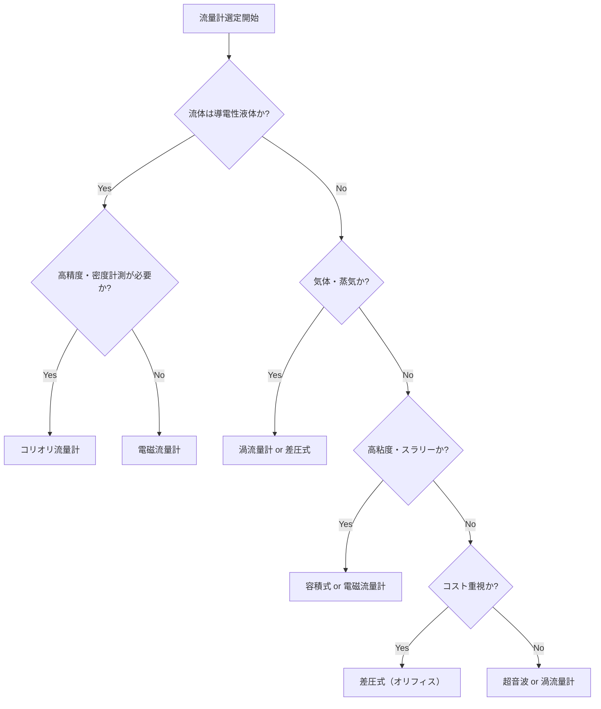

# 流量計測

## 30秒まとめ

流量計は原理が多岐にわたり、流体特性・精度・コストで選定が変わる。電磁は導電性液体の現場標準。コリオリは質量流量と密度が同時に取れる高精度品。差圧式（オリフィス）は歴史が長く信頼性が高いが直管長が必要。

---

## 流量計の種類比較表

| 方式 | 測定対象 | 精度 | コスト | 特徴・制約 |
|------|---------|------|--------|-----------|
| 電磁流量計 | 導電性液体のみ | ±0.5% | 中 | 気泡・スラリー可。接地リング必要 |
| 渦流量計 | 液体・気体・蒸気 | ±1% | 中 | 最小レイノルズ数あり。振動に弱い |
| コリオリ流量計 | 液体・気体 | ±0.1% | 高 | 質量流量＋密度。設置方向制約あり |
| 差圧式（オリフィス） | 液体・気体・蒸気 | ±1〜2% | 低 | 長い直管長が必要。永久圧力損失大 |
| 超音波流量計（外付） | 液体 | ±1〜3% | 中〜高 | 後付け可。気泡・スラリーに弱い |
| 容積式 | 液体 | ±0.2% | 中 | 高粘度に強い。詰まりリスクあり |

---

## 電磁流量計

### 原理
ファラデーの電磁誘導の法則：導電性液体を磁場中で流すと流速に比例した電圧が発生する。

```
E = k × B × D × v
E：誘起電圧、B：磁束密度、D：管径、v：流速
```

### 選定・設置の要点

| 項目 | 要件 |
|------|------|
| 最小導電率 | 5 μS/cm 以上（純水・炭化水素は使用不可） |
| 最小流速 | 0.3 m/s 以上（推奨：1〜3 m/s） |
| 最大流速 | 10 m/s（ライニング材料による） |
| 上流直管長 | 10D 以上（D：管径） |
| 下流直管長 | 5D 以上 |

!!! warning "接地リングの設置"
    電極電位を安定させるため、フランジ絶縁型の場合は**接地リング（アース電極）**が必須。
    接地リングの材質はプロセス流体に合わせて選定すること（SUS316L/ハステロイC-276等）。

---

## コリオリ流量計

### 原理
コリオリ力を利用して**質量流量を直接計測**する。チューブが振動している中を流体が流れるとコリオリ力によりチューブの振動位相がずれ、その位相差から質量流量を求める。

### 特徴

- **質量流量と密度を同時に計測**（体積流量・濃度も演算可能）
- 精度：±0.1〜0.15%（液体）
- 気泡混入に非常に弱い（計測不能になる）
- 設置方向：液体はU字管を下向き設置が基本（気泡を逃がすため）

!!! tip "化学プラントでの活用"
    試薬・溶剤の仕込み管理（質量で管理が必要な箇所）や、密度から濃度を演算する箇所に向く。コストは高いが設備投資判断での経済性評価時には精度の価値を加味する。

---

## 差圧式流量計（オリフィス）

### 流量換算式

オリフィス前後の差圧（ΔP）と流量（Q）の関係：

```
Q = Cd × A × √(2ΔP / ρ)

Q：体積流量、Cd：流量係数（≒0.6〜0.7）、A：オリフィス開口面積、ρ：流体密度
```

DCS/変換器の中で差圧から流量への**開平演算**（√計算）が必要。

### 直管長要件

| 上流の配管条件 | 上流直管長 | 下流直管長 |
|-------------|---------|---------|
| エルボ（同一平面） | 20D | 5D |
| エルボ（異なる平面） | 40D | 5D |
| コントロールバルブ | 50D | 5D |
| ストレーナ | 50D | 5D |

---

## 渦流量計

コルマンの渦（カルマン渦）を利用。三角柱のブラフボディを流れに立てると、流速に比例した周波数で渦が発生する。

| 項目 | 要件 |
|------|------|
| 最小レイノルズ数 | 5,000 以上（これ以下は線形性が崩れる） |
| 振動環境 | 強い機械振動は誤カウントの原因 |
| 上流直管長 | 25D（エルボ2段の場合） |

---

## 選定フローチャート


