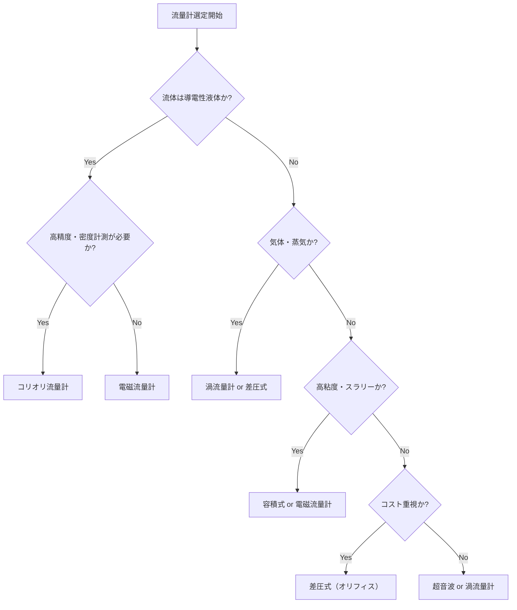

# 流量計測

## 30秒まとめ

流量計は原理が多岐にわたり、流体特性・精度・コストで選定が変わる。電磁は導電性液体の現場標準。コリオリは質量流量と密度が同時に取れる高精度品。差圧式（オリフィス）は歴史が長く信頼性が高いが直管長が必要。

---

## 流量計の種類比較表

| 方式 | 測定対象 | 精度 | コスト | 特徴・制約 |
|------|---------|------|--------|-----------|
| 電磁流量計 | 導電性液体のみ | ±0.5% | 中 | 気泡・スラリー可。接地リング必要 |
| 渦流量計 | 液体・気体・蒸気 | ±1% | 中 | 最小レイノルズ数あり。振動に弱い |
| コリオリ流量計 | 液体・気体 | ±0.1% | 高 | 質量流量＋密度。設置方向制約あり |
| 差圧式（オリフィス） | 液体・気体・蒸気 | ±1〜2% | 低 | 長い直管長が必要。永久圧力損失大 |
| 超音波流量計（外付） | 液体 | ±1〜3% | 中〜高 | 後付け可。気泡・スラリーに弱い |
| 容積式 | 液体 | ±0.2% | 中 | 高粘度に強い。詰まりリスクあり |

---

## 電磁流量計

### 原理
ファラデーの電磁誘導の法則：導電性液体を磁場中で流すと流速に比例した電圧が発生する。

```text
E = k × B × D × v
E：誘起電圧、B：磁束密度、D：管径、v：流速
```

### 選定・設置の要点

| 項目 | 要件 |
|------|------|
| 最小導電率 | 5 μS/cm 以上（純水・炭化水素は使用不可） |
| 最小流速 | 0.3 m/s 以上（推奨：1〜3 m/s） |
| 最大流速 | 10 m/s（ライニング材料による） |
| 上流直管長 | 10D 以上（D：管径） |
| 下流直管長 | 5D 以上 |

!!! warning "接地リングの設置"
    電極電位を安定させるため、フランジ絶縁型の場合は**接地リング（アース電極）**が必須。
    接地リングの材質はプロセス流体に合わせて選定すること（SUS316L/ハステロイC-276等）。

---

## コリオリ流量計

### 原理
コリオリ力を利用して**質量流量を直接計測**する。チューブが振動している中を流体が流れるとコリオリ力によりチューブの振動位相がずれ、その位相差から質量流量を求める。

### 特徴

- **質量流量と密度を同時に計測**（体積流量・濃度も演算可能）
- 精度：±0.1〜0.15%（液体）
- 気泡混入に非常に弱い（計測不能になる）
- 設置方向：液体はU字管を下向き設置が基本（気泡を逃がすため）

!!! tip "化学プラントでの活用"
    試薬・溶剤の仕込み管理（質量で管理が必要な箇所）や、密度から濃度を演算する箇所に向く。コストは高いが設備投資判断での経済性評価時には精度の価値を加味する。

---

## 差圧式流量計（オリフィス）

### 流量換算式

オリフィス前後の差圧（ΔP）と流量（Q）の関係：

```text
Q = Cd × A × √(2ΔP / ρ)

Q：体積流量、Cd：流量係数（≒0.6〜0.7）、A：オリフィス開口面積、ρ：流体密度
```

上式は近寄り速度の補正や気体の膨張補正を省いた**簡略形**です。実機の換算係数はメーカーの計算書（差圧発信器・DCS 側の設定値）が正になります。

DCS/変換器の中で差圧から流量への**開平演算**（√計算）が必要。

### 直管長要件

| 上流の配管条件 | 上流直管長 | 下流直管長 |
|-------------|---------|---------|
| エルボ（同一平面） | 20D | 5D |
| エルボ（異なる平面） | 40D | 5D |
| コントロールバルブ | 50D | 5D |
| ストレーナ | 50D | 5D |

本表は選定初期の**実務目安**です。必要直管長は絞り直径比などの条件で変わるため、設計・検収の基準値はメーカーの sizing 計算書と採用規格の本文で確認してください（→ 下記「根拠と適用上の注意」）。

---

## 渦流量計

カルマン渦（von Kármán vortex、カルマン渦列）を利用。三角柱のブラフボディを流れに立てると、流速に比例した周波数で渦が発生する。

| 項目 | 要件 |
|------|------|
| 最小レイノルズ数 | 5,000 以上（これ以下は線形性が崩れる） |
| 振動環境 | 強い機械振動は誤カウントの原因 |
| 上流直管長 | 25D（エルボ2段の場合） |

---

## 選定フローチャート


```mermaid
flowchart TD
    A[流量計選定開始] --> B{流体は導電性液体か?}
    B -- Yes --> C{高精度・密度計測が必要か?}
    C -- Yes --> D[コリオリ流量計]
    C -- No --> E[電磁流量計]
    B -- No --> F{気体・蒸気か?}
    F -- Yes --> G[渦流量計 or 差圧式]
    F -- No --> H{高粘度・スラリーか?}
    H -- Yes --> I[容積式 or 電磁流量計]
    H -- No --> J{コスト重視か?}
    J -- Yes --> K[差圧式（オリフィス）]
    J -- No --> L[超音波 or 渦流量計]
```

## 根拠と適用上の注意

- **本ページの数値はメーカー仕様・実務目安です**: 種類比較表の精度（±0.1〜3 %）・コスト感、電磁流量計の最小導電率 5 μS/cm・流速範囲 0.3〜10 m/s・直管長 10D/5D、渦流量計の最小レイノルズ数 5,000・直管長 25D、コリオリ流量計の精度 ±0.1〜0.15 % や設置方向の推奨は、いずれも法令・JIS の規定値ではなく、メーカーカタログの代表値と選定実務の目安です。機種・ライニング材質・レンジで変わるため、選定・検収は採用機種の仕様書と sizing 計算書によってください。
- **差圧式（オリフィス）の規格**: 絞り機構による流量測定の規格は **JIS Z 8762-1〜-4:2007**（ISO 5167:2003 対応。1995 年版を4部構成に分割改正）が現行です。番号・名称・版年・現行有効は JSA カタログで確認済み（2026-08-01。照合状況の仕分けの正典は [電気計装工事で押さえるJIS規格](jis-standards.md)）ですが、**規格本文は未照合**のため、流出係数・必要直管長・絞り直径比の条件など規格本文の数値は本ページには引用していません。本文の直管長表（10D〜50D）は規格値ではなく実務目安です。
- **流量換算式は簡略形**: `Q = Cd × A × √(2ΔP/ρ)` は流体力学の一般式（ベルヌーイの定理由来）で、近寄り速度の補正・気体の膨張補正を省いた基礎形です。特定の規格からの引用ではありません。
- **原理の記述**: 電磁流量計（ファラデーの電磁誘導の法則）・コリオリ流量計（コリオリ力による位相差）・渦流量計（カルマン渦）の原理説明は物理法則の一般的記述で、規格・法令への帰属はありません。接地リングの要否・材質もメーカーの設置要領によります。
- **取引・証明用の計量**: 流量計を取引・証明用の計量に使う場合は計量法（検定・JCSS 校正）の体系が別途関わります。本ページは保安・プロセス管理用の選定のみを扱い、計量法の個別条文への照合は行っていません（honest hold。位置づけは [電気計装工事で押さえるJIS規格](jis-standards.md) の注記と同じ）。
- **限界の明示**: 選定フローチャートと比較表は初期スクリーニング用です。実際の採否は流体条件（粘度・気泡・スラリー・腐食性・導電率）に対するメーカーの適用可否判定が優先します。

## 関連ページ

- [計装基礎](basics.md) — 測定原理と信号伝送の共通事項
- [圧力計測](pressure.md) — 差圧式流量計の差圧測定側
- [制御弁](control-valve.md) — 流量制御の最終操作端
- [電気計装工事で押さえるJIS規格](jis-standards.md) — JIS Z 8762 ほか計装関連規格の照合状況
- [計装カテゴリ](index.md) — より広い計装知識へ
