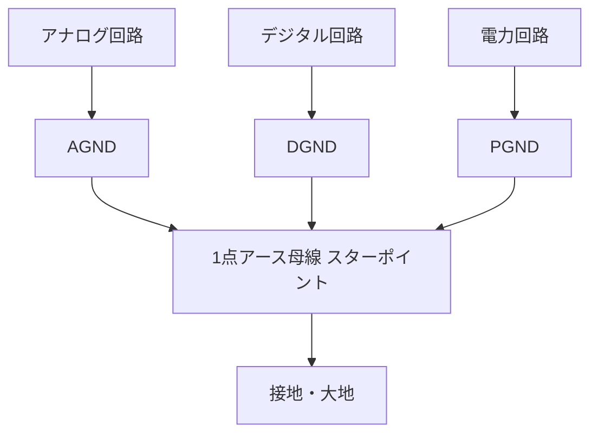

# グランド（GND）と接地（アース）

## 30秒まとめ

「グランド（GND）」と「接地（アース）」は混同されがちですが別物です。
**グランド = 回路の動作基準となる電位（必ずしも対地 0 V ではない）**、
**接地 = その電位を大地につなぐこと（対地電圧をほぼ 0 V に固定）** が核心です。
計装ではグランドを用途別に分けて配線し、最後に **1 点で接続・接地** することでノイズを抑えます。

!!! info "このページの役割"
    ここは GND と接地の **用語・分類の整理（概念）** を担当します。
    低圧の接地種別（A/B/C/D 種）は [接地（低圧）](../02-teiatsu/grounding-lv.md)、
    ノイズ・グラウンドループの対策は [接地・ノイズトラブル](../06-trouble/grounding-noise.md) を参照してください。

---

## グランドと接地は何が違うか

| 項目 | グランド（GND / Ground） | 接地（アース / Earth） |
|------|------------------------|----------------------|
| 意味 | 回路の電位の **基準点（0 V 基準）** | 基準点を **大地に接続すること** |
| 対地電圧 | 必ずしも 0 V ではない | 理想的には 0 V（実際は接地抵抗・電位差でわずかに生じる） |
| 主な目的 | 回路動作の **電位の安定** | **感電防止・電位固定・ノイズ逃がし** |
| 例 | 電池駆動回路の「−」基準、基板の GND パターン | 制御盤の計装アース、機器筐体の保護接地 |

!!! note "「グランド ＝ 0 V」とは限らない"
    グランドはあくまで「回路内で 0 V とみなす基準点」です。電池駆動の浮いた（フローティング）回路では、
    その基準点が大地に対して数 V〜数十 V の電位を持つこともあります。
    **基準点を大地につないで初めて「接地」** になり、対地電圧がほぼ 0 V に固定されます。

---

## グランドの種類

回路の性質ごとにグランドを分けて配線し、最終的に 1 点で結ぶのが基本です。

| 種別 | 略号 | 内容 |
|------|------|------|
| フレームグランド | FG | シャーシグランドとも呼ぶ。製品の金属筐体をグランドにして、複数回路の基準電位を統一する |
| シグナルグランド | SG | 信号回路の基準電位。回路の性質に合わせて分けて配線し、最後に 1 点で接続してノイズを抑える |
| アナロググランド | AGND | アナログ回路用のシグナルグランド |
| デジタルグランド | DGND | デジタル回路用のシグナルグランド |
| パワーグランド | PGND | 電力（駆動）回路用のシグナルグランド |

!!! tip "AGND / DGND / PGND を分ける理由"
    デジタル回路やパワー回路は、スイッチング時に大きく変動する電流をグランドに流します。
    アナロググランドと共用すると、その変動が **微小なアナログ信号（mV レベル）にノイズとして重畳** します。
    そのため AGND・DGND・PGND を別々に配線し、**1 点（スター接続）でまとめて接続** することで、
    変動電流がアナログ基準を揺らさないようにします。

### 結線イメージ（1点接地 / スター接続）

用途別のグランドはそれぞれ独立して配線し、**最後に 1 点（スターポイント）で母線にまとめてから接地** します。

!!! danger "やってはいけない：渡り配線（数珠つなぎ）"
    各グランドを順に渡り配線（デイジーチェーン）すると、電力・デジタルの戻り電流がアナログ GND を通り、
    アナログ基準が揺れてノイズ源になります。**必ず 1 点で母線に集約** してから接地してください。

---

## 接地の種類

グランドをさらに大地へつなぐと「接地」になります。目的別に次の3種類があります。

| 種別 | 内容 | 主な目的 |
|------|------|---------|
| フレーム接地 | フレームグランド（筐体）を大地に接続する | 感電防止。漏電時に筐体電位を上げない |
| シグナル接地 | シグナルグランドの電位をさらに大地で安定させる | 基準電位の安定・ノイズ低減 |
| 保護接地 | 人の安全を目的に機器を大地に接続する | 漏電時の感電防止（保護） |

!!! danger "保護接地（保護アース）は人命に直結"
    保護接地は漏電時の感電を防ぐための接地です。**保護接地（PE）端子の誤接続・接地外れは感電・死亡事故につながります。**
    機器の保護接地が確実に大地へ接続されているかを必ず確認してください（測定は [接地・ノイズトラブル](../06-trouble/grounding-noise.md) のメガー手順を参照）。

!!! warning "計装信号のシールドは「片端接地」が原則"
    シグナルグランドやシールドを **両端で接地** すると、2 つの接地点間の電位差で
    「グラウンドループ電流」が流れ、信号にノイズが乗ります。
    計装ケーブルのシールドは **DCS（制御盤）側の 1 点だけ** で接地するのが原則です。
    詳細は [計装配線](wiring.md) と [接地・ノイズトラブル](../06-trouble/grounding-noise.md) を参照してください。

---

## 実務での要点

- グランド（基準電位）と接地（大地接続）を区別して考えると、ノイズ対策の議論が整理しやすくなります。
- 用途の違うグランド（AGND/DGND/PGND）は **分けて配線 → 1 点で接続** が鉄則です。
- 「保護接地」は人命にかかわる接地です。低圧機器の接地種別（A/B/C/D 種）は [接地（低圧）](../02-teiatsu/grounding-lv.md) を参照してください。

!!! tip "電験学習者向け"
    電験三種の理論でも「グランド ＝ 回路の基準電位」「接地 ＝ 大地への接続」という区別が問われます。
    対地電圧が 0 V になるのは「接地された側」であって、グランドそのものが常に 0 V とは限らない点が要注意です。

---

## 関連ページ

- [計装配線](wiring.md) — シールドの片端接地・離隔・ループ抵抗の実務
- [接地・ノイズトラブル](../06-trouble/grounding-noise.md) — グラウンドループ・ノイズ3種の対策
- [接地（低圧）](../02-teiatsu/grounding-lv.md) — A/B/C/D 種接地・等電位ボンディング
- [雷・サージ保護](lightning-surge.md) — SPD の接地・等電位ボンディング・誘導雷対策
- [計装基礎](basics.md) — 4-20mA・HART・フィールドバスの基礎
