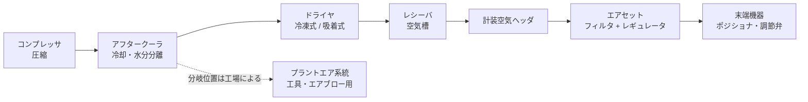

# 計装空気（Instrument Air）

## 30秒まとめ

計装空気（Instrument Air）は、空気式の調節弁・ポジショナ（Positioner）・パイロット弁（Pilot Valve）を動かす「計装の血液」です。**圧力（量）と質（露点・油分・粉塵）の両方**が保たれて初めて計装は正常に働きます。計装空気が止まると、空気式の操作端は**一斉にフェールポジション（FC/FO/FL）へ動き**、その瞬間のプラント全体の挙動を支配します。個々の弁がどちらへ倒れるかは設計時に決められているため、一般論で判断せず、**必ず自工場の P&ID・弁仕様書で確認**してください。

---

## 役割と系統構成

### 計装空気の役割

- 調節弁・遮断弁（空気式アクチュエータ）の駆動源
- ポジショナ・I/P 変換器（電流信号を空気圧に変換する機器）への供給空気
- 計装キャビネットのパージ・防爆パージ等（用途の範囲は工場によります）

### 標準的な系統構成



| 機器 | 役割 |
|------|------|
| コンプレッサ（Air Compressor） | 大気を圧縮。計装空気用はオイルフリー式が広く使われます（給油式の場合は油分除去フィルタが必須） |
| アフタークーラ（Aftercooler） | 圧縮で高温になった空気を冷却し、凝縮した水分をドレンとして分離 |
| ドライヤ（Air Dryer） | 露点を下げる心臓部。冷凍式と吸着式があります（下表） |
| レシーバ（Receiver・空気槽） | 圧力変動の吸収と、空気源喪失時の「時間稼ぎ」。**何分持つか（保有時間）は自工場の設計値を確認** |
| ヘッダ・末端配管 | 各ユニット・各機器へ分配。ヘッダ圧の一般的な目安は 0.4〜0.7 MPa 程度。末端では機器ごとにエアセット（Air Set：フィルタ + 減圧用レギュレータ）を設置 |

!!! note "レシーバの位置・台数・バックアップは工場によります"
    レシーバをドライヤ上流（湿り空気側）に置くか下流（乾き空気側）に置くか、予備コンプレッサの自動起動や窒素バックアップの有無は工場ごとの設計です。自工場のユーティリティ系統図・P&ID で確認してください。

### 冷凍式と吸着式ドライヤ

| 項目 | 冷凍式 | 吸着式 |
|------|--------|--------|
| 原理 | 空気を冷却して水分を凝縮・分離 | 乾燥剤（活性アルミナ・シリカゲル等）に水分を吸着。2塔を切り替えながら再生する方式が代表的 |
| 到達露点（一般的な目安） | 加圧露点 +3〜+10 °C 程度。凝縮水が凍るため 0 °C 以下にはできない | 加圧露点 -20 °C 以下（-40 °C 級が一般的） |
| 運転コスト | 比較的小さい | パージ空気・再生ヒータの分だけ大きい |
| 屋外・寒冷地の計装向き | 冬季は配管内結露・凍結のリスクが残る | 向いている |

### プラントエアとの分離が原則

計装空気はプラントエア（Plant Air：工具・エアブロー・一般ユーティリティ用の工場空気）と**系統を分離する**のが原則です。

- **質の理由**: プラントエアは油分・水分の管理レベルが計装空気より緩く、混ざるとポジショナ等の精密機器を傷めます
- **量の理由**: 大型エア工具やエアブローによる突発的な大量消費で系統圧が低下したとき、計装まで巻き込まれることを防ぎます
- **優先供給**: 系統圧が低下した際にプラントエア側を遮断して計装空気を優先的に守る設計が一般的です（自工場の優先供給ロジックの有無・設定圧を確認）

!!! warning "仮設ホースでのクロスコネクションに注意"
    工事・試運転時にプラントエアを計装空気系へ仮接続すると、油分・水分が計装空気系統全体を汚染し、復旧に長期間かかることがあります。仮設接続の可否は自工場の管理ルール（作業許可）に従ってください。

---

## 品質要件 — 露点・油分・粉塵

計装空気の質は **露点（水分）・油分・粉塵** の3要素で管理します。

### 露点（Dew Point）— 「加圧」か「大気圧」かを必ず区別

| 用語 | 意味 | 使いどころ |
|------|------|-----------|
| 加圧露点（Pressure Dew Point） | 実際の配管圧力のもとで結露が始まる温度 | **配管内で結露・凍結するかどうかの判断はこちら** |
| 大気圧露点（Atmospheric Dew Point） | 大気圧に換算した露点 | ドライヤのカタログ値などで使われることが多い |

同じ空気でも**加圧露点は大気圧露点より高く**なります（圧縮するほど結露しやすいため）。露点計の値や仕様書の数値を見るときは、**どちらの露点か**を必ず確認してください。

!!! tip "ISA-7.0.01 の考え方 — 最低気温より 10 °C 低く"
    計装空気品質の代表的な規格 ISA-7.0.01 では、加圧露点を**系統がさらされる現地の最低記録周囲温度より少なくとも 10 °C 低くする**ことが求められています。「夏は問題なくても冬に結露・凍結する」ことを防ぐ、最低気温基準の考え方です。

### 油分・粉塵

- **油分**: ポジショナのノズル・フラッパ機構やダイヤフラムに付着し、固着・動作不良の原因になります。一般的な目安として 1 ppm 程度以下に管理されます
- **粉塵**: 絞り部・パイロット弁の詰まりの原因。多くの空気式機器では粒子径 40 μm 以下が一般的な目安とされます（より微細な管理が必要な機器もあります）

### 規格と「自工場の仕様」の関係

- **ISA-7.0.01**: 計装空気の品質規格。露点・油分・粒子についての要求が規定されています
- **JIS B 8392-1（ISO 8573-1）**: 圧縮空気の清浄等級。固体粒子・水分（加圧露点）・油分の3項目について等級（クラス）が定められています

!!! warning "数値はまず自工場の設計図書で確認"
    本ページの数値は一般的な目安です。自工場の計装空気がどの清浄等級・露点仕様で設計されているかは、**ユーティリティ仕様書・基本設計書・ドライヤ購入仕様書**に書かれています。点検の管理値（露点の警報値・フィルタ差圧の交換基準）もそちらが正です。

---

## 空気源喪失時の挙動（最重要）

!!! danger "計装空気喪失 = 全空気式操作端が一斉にフェールポジションへ"
    計装空気の喪失は単一機器の故障と違い、**プラント中の空気式の弁が同時にフェールポジションへ動く**共通原因（Common Cause）事象です。どの弁がどちらへ倒れるかの組み合わせが、その瞬間のプラント全体の挙動（安全に停止へ向かうかどうか）を決めます。**フェールポジションはプロセスが安全側に向かうよう設計時に決められています**が、その「答え」は工場・プロセスごとに違います。

### フェールポジションの整理

| 記号 | 名称 | 空気喪失時の動き | 実現方法（代表例） |
|------|------|----------------|------------------|
| FC | Fail Close | 全閉 | バネ復帰。空気で開ける（Air to Open）構成 |
| FO | Fail Open | 全開 | バネ復帰。空気で閉める（Air to Close）構成 |
| FL | Fail Last（Fail Lock） | 直前の開度を保持 | ロックアップバルブ（Lock-up Valve）でアクチュエータ内の空気を閉じ込める |

- バネ復帰式では「空気でどちらへ動かすか」と「バネがどちらへ戻すか」の組み合わせでフェール方向が決まります
- **FL は永続ではありません**。閉じ込めた空気がリークすれば開度は徐々にドリフトします。長時間の保持は保証されないものとして扱ってください

### ゆっくり圧力が下がる場合は「一斉」にならない

瞬時の全喪失と違い、ドライヤ故障や大量リークでヘッダ圧が**緩慢に低下**する場合は、弁ごとのバネ設定圧・必要供給圧の違いによって**動き出すタイミングがばらつき**、中途半端な開度を経由することがあります。ポジショナの制御も供給圧不足で先に乱れるため、「全弁がきれいにフェール位置へ行く」とは限りません。計装空気圧力低下警報の段階（警報値→運転対応）と、その時の手順を平常時に確認しておいてください。

!!! danger "個々の弁の向きは必ず自工場の設計図書で確認"
    「冷却水弁は FO」のような一般例を、そのまま自工場の弁に当てはめてはいけません。同じ用途の弁でも、プロセス全体の安全設計によって答えは変わります。確認先は以下です。

    - **P&ID**: 弁シンボル脇の FC/FO/FL 表記
    - **弁リスト・調節弁仕様書（データシート）**: アクチュエータ形式・スプリングレンジ・フェール方向
    - **インターロック仕様書・安全関連の設計書**: 計装空気喪失を想定したケースの記載
    - **計装空気喪失時の運転手順書**: 警報設定値と運転側のアクション

---

## 凍結・露点トラブル

露点管理の崩れは、次の典型連鎖でプラントに波及します。

```text
ドライヤ不調（再生不良・冷媒系故障）
  → 露点悪化（水分が末端へ流れ込む）
  → 配管内結露・ドレン滞留（低所・デッドレグ）
  → 冬季: ドレン凍結による閉塞 ／ 通年: ポジショナ・パイロット弁の作動不良
  → 弁のハンチング・固着・応答遅れ
```

### 起きやすい場所

- **屋外の計装空気配管**: 外気で冷やされ結露・凍結しやすい。特に北側・日陰・風の通り道
- **デッドレグ（Dead Leg：行き止まり配管）**: 流れがなく水が溜まりやすい。予備機まわり・将来増設用の枝管
- **配管低所・ループ下部**: ドレンポケットになっている箇所は定期的な抜き出しが必要
- **エアセットのフィルタカップ**: 末端に到達した水分・油分が最初に「見える」場所

### 対策の考え方

- 本筋は**露点の回復**（ドライヤの修理・再生サイクルの確認）です。保温・ヒートトレース（Heat Trace）は凍結対策にはなりますが、水分が来ている根本原因は解決しません
- **凍結や末端での水たまりが繰り返される = 露点が悪化しているサイン**として、ドライヤ側をさかのぼって疑ってください

---

## 点検ポイント

頻度は一般的な目安です。自工場の点検基準書があればそちらに従ってください。

| 点検項目 | 見るところ | 頻度の目安 |
|---------|-----------|-----------|
| ドレン抜き | レシーバ・配管低所・エアセットの手動ドレン。自動ドレントラップは「実際に排水されるか」を手動操作で確認 | 日常〜週次 |
| ドライヤ露点 | 露点計の指示値（加圧露点か大気圧露点かを確認）。吸着式は切替サイクル・パージ動作も確認 | 日常 |
| フィルタ差圧 | プレフィルタ・アフタフィルタの差圧計。上昇傾向が見えたら交換を計画 | 日常〜週次 |
| 末端圧力 | 最遠端・最高所のエアセット出口圧。ヘッダ圧が正常でも末端だけ低いことがある（配管詰まり・リーク） | 週次〜月次 |
| リーク | 継手・チューブのエア漏れ音、発泡液での確認。リークは圧力低下とドライヤ負荷増（露点悪化）の両方に効いてくる | 巡回時 |

!!! tip "露点計の値は「どこの露点か」もセットで見る"
    露点計の取付位置（ドライヤ直後か、ヘッダ末端か）で値の意味が変わります。ドライヤ直後が正常でも、その先の配管に溜まった水分で末端の質が悪いことはあり得ます。

---

## トラブル逆引きミニ表

| 症状 | 疑う箇所 | 最初の確認 |
|------|---------|-----------|
| 1台の弁だけハンチング | その弁のエアセット圧力低下・ポジショナ感度 | エアセット出口圧を計測 →[制御弁トラブル](../06-trouble/valve.md)の切り分けへ |
| 複数の弁が同時にふらつく・ゆっくり閉まる（開く） | 計装空気ヘッダの圧力低下（コンプレッサ・大量リーク・他系統の大量消費） | ヘッダ圧力計とコンプレッサ運転状態を確認 |
| ポジショナの詰まり・固着が頻発 | 油分・粉塵（フィルタ破過・コンプレッサの油上がり） | エアセットのフィルタカップに油・水が溜まっていないか確認 |
| 冬の朝だけ弁が動かない・動きが渋い | 配管・ドレンの凍結（露点悪化のサイン） | 屋外配管・デッドレグの凍結確認 → ドライヤ露点を確認 |
| エアセットのカップに水が溜まる | ドライヤ不調による露点悪化 | ドライヤ露点計・自動ドレントラップの作動確認 |

---

## 関連ページ

- [制御弁](control-valve.md) — フェールポジション（FC/FO/FL）の選定・ポジショナの種類
- [制御弁トラブル](../06-trouble/valve.md) — エアセット圧力異常・固着・ハンチングの切り分け手順
- [計装カテゴリ](index.md) — 計装分野の記事一覧
