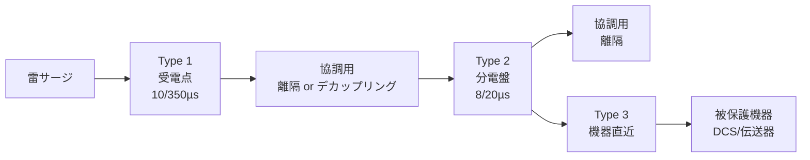

# 雷・サージ保護

**対象読者**: :material-account-hard-hat: 電気担当 / :material-account: 計装担当

---

## 概要（30秒まとめ）

> 化学プラントの屋外フィールド計装・DCS が雷で壊れる主因は、**直撃雷ではなく誘導雷と地電位上昇**です。近傍への落雷が計装ループや通信線にサージ電圧を誘起し、大地に流れた雷電流が接地電位を持ち上げて機器へ逆流します。半導体で動く現代の計装機器はサージ耐力が低く、避雷針（受雷部）だけでは守れません。**機器の直近まで SPD（サージ防護デバイス）を配置し、すべての SPD と機器接地を等電位ボンディングで結ぶ**ことが対策の要です。

!!! info "このページの役割"
    ここは「雷サージから計装・電源を守る」ことに特化します。
    接地抵抗値・接地種別は再定義せず [接地（低圧）](../02-teiatsu/grounding-lv.md)・[グランドと接地](grounding-gnd.md) を、
    本安回路のエンティティパラメータは [防爆](explosion-proof.md) を、
    ノイズ一般の切り分けは [接地・ノイズトラブル](../06-trouble/grounding-noise.md) を参照してください。

---

## 雷被害の3つの侵入経路

計装設備の雷被害は、直撃よりも「まわりに落ちた雷」の影響で起きるものが大半です。

| 経路 | 内容 | プラントでの実害 |
|------|------|----------------|
| 直撃雷 | 構造物・架空線に直接落雷し、大電流が流れる | 頻度は低いが被害は甚大。受雷部・引下げ導線・接地で処理する（建築・電気設備側の領分） |
| 誘導雷 | 近傍への落雷でケーブルに電磁的にサージ電圧が誘起される | **最多**。長い計装ループ・通信線・屋外配線に侵入し、伝送器・I/O・DCS を破損 |
| 逆流雷（地電位上昇） | 大地に流れた雷電流で接地電位が上がり、接地線から機器へサージが逆流 | 接地系が複数あると接地点間の電位差で機器の接地端子側から侵入する |

!!! danger "実害が多いのは誘導雷・地電位上昇"
    屋外フィールド機器から中央制御室までの計装ループは長く、アンテナのように誘導雷を拾います。
    さらに大地に放流された雷電流で接地電位が数 kV 単位で上昇すると、
    「接地されているはずの端子」から機器内部へサージが逆流します。
    このため**電源線・信号線・接地の3方向すべて**を守る発想が必要です。

---

## 保護の全体像（外部雷保護と内部雷保護）

雷保護は IEC 62305（JIS A 4201「建築物等の雷保護」）で体系化され、**外部雷保護システム（LPS）** と **内部雷保護** に分かれます。計装担当が主に関与するのは内部雷保護です。

| 区分 | 構成要素 | 目的 | 主担当 |
|------|---------|------|--------|
| 外部雷保護（LPS） | 受雷部（air termination）・引下げ導線（down conductor）・接地（earth termination） | 直撃雷を受け止め大地へ安全に流す | 建築・電気設備側 |
| 内部雷保護 | 等電位ボンディング（equipotential bonding）＋ SPD ＋ 離隔距離 | 侵入・逆流するサージから機器を守る | 電気・計装 |

!!! note "外部 LPS は概要のみ。詳細は建築側と切り分け"
    受雷部・引下げ導線・接地極の設計（保護レベル LPL、回転球体法など）は建築・構造側の領分です。
    計装担当は「外部 LPS が施工済みか」「その接地と計装接地が等電位化されているか」を確認し、
    **内部雷保護（SPD と等電位ボンディング）** に注力します。

### 雷保護ゾーン（LPZ）の考え方

IEC 62305-4 は建屋を電磁環境の強さで入れ子のゾーンに分け、**ゾーン境界ごとに SPD を置いて段階的にサージを弱める**という設計思想を採ります。

| ゾーン | 意味 | 想定される脅威 |
|--------|------|--------------|
| LPZ 0A | 屋外・直撃雷にさらされる領域 | 直撃雷電流＋全電磁界 |
| LPZ 0B | 直撃は受けないが電磁界にさらされる領域 | 直撃なし・部分電磁界・伝導サージ |
| LPZ 1 | 境界の SPD と建屋遮蔽で低減された領域 | 制限されたサージ・減衰した電磁界 |
| LPZ 2 以降 | さらに内側。より低いサージレベル | 微弱（DCS・精密機器の設置想定） |

境界（0→1、1→2）を越えるたびに SPD で頭を抑える、これが後述のカスケード協調の背景です。

---

## SPD（サージ防護デバイス／避雷器）の分類

SPD は電源用と信号用で規格が分かれます。

### 電源用 SPD（IEC 61643-11 / JIS C 5381-11）

設置場所と試験波形で Type 1 / 2 / 3（旧称クラス I / II / III）に分類されます。**試験波形の違いが本質**で、互換性はありません。

| Type（クラス） | 試験波形 | 想定サージ | 設置場所 | 代表値の目安 |
|---------------|---------|-----------|---------|------------|
| Type 1（クラス I） | 10/350 µs 電流波（Iimp） | 直撃雷・部分雷電流 | 受電点・引込口（LPZ 0→1） | Iimp 12.5〜50 kA（要製品確認） |
| Type 2（クラス II） | 8/20 µs 電流波（In） | 開閉サージ・近傍雷 | 分電盤（LPZ 1→2） | In 5〜20 kA（要製品確認） |
| Type 3（クラス III） | 1.2/50 µs（電圧）＋ 8/20 µs（電流）の複合波 | 残留サージ | 機器直近（単独使用不可・上流に Type 2 必須） | ― |

!!! danger "10/350 µs と 8/20 µs は別物。取り違えは即故障"
    同じ波高値でも **10/350 µs（長波尾）は 8/20 µs の約10〜20倍のエネルギー**を運びます。
    直撃雷電流を処理すべき箇所（Type 1 が要る受電点）に Type 2 を付けると、
    エネルギー超過で SPD 自体が破壊されます。**設置場所に応じた Type を選ぶ**のが鉄則です。

### 信号・計装用 SPD（IEC 61643-21 / JIS C 5381-21）

通信・信号回線用の SPD で、4-20 mA ループ・通信線・フィールドバスを保護します。適用範囲は公称電圧 1000 V a.c. / 1500 V d.c. 以下です。

- 4-20 mA ループ用は **信号帯域を通し、かつサージ時に低い制限電圧（Up）でクランプ**する設計
- 制限電圧 Up は被保護機器の耐サージ電圧より十分低いこと（4-20 mA アナログ線では Up ≤ 50 V 程度が目安。要製品確認）
- **ループ抵抗・帯域への影響**に注意：直列に入る SPD の内部抵抗がループ抵抗に加算される（[計装配線](wiring.md) のループ抵抗計算に算入する）
- 本安（IS）回路用 SPD は、SPD 自体のエンティティパラメータ（Ci・Li 等）をループ整合計算に**必ず算入**する（[防爆](explosion-proof.md) 参照）

!!! warning "信号用 SPD は信号を殺さないものを選ぶ"
    制限電圧を下げすぎたり容量の大きい SPD を入れると、HART 重畳信号や高速フィールドバスの帯域を削り、
    4-20 mA ではループ抵抗超過で伝送不能になることがあります。
    **信号仕様（帯域・ループ抵抗・本安パラメータ）と両立する専用品**を選定してください。

### 接地間用 SPD

複数の接地系が独立していて統合できない場合、平常時は絶縁し**落雷時のみ接地間を短絡して電位差をなくす**接地間用 SPD を使います。ただし原則は等電位ボンディング（後述）で、接地間 SPD はやむを得ない場合の補完です。

---

## カスケード協調（多段 SPD の協調）

受電点・分電盤・機器直近に SPD を段階配置し、上流が大電流を、下流が残留サージを分担します。段間の協調が取れていないと下流 SPD にエネルギーが集中して壊れます。



!!! tip "段間の協調条件"
    上流と下流の SPD の間には協調のための電路長が必要です。IEC 62305-4 は
    **SPD 間に最低 10 m の電路長**（またはデカップリングインダクタを入れれば約 5 m）を推奨します。
    近接して直付けすると両者が同時動作して分担が崩れます。
    製造者が「協調済みセット」として提供する組み合わせを使うのが確実です。

---

## 計装ループのサージ保護の実務

フィールド機器から本安バリア／IO までの計装ループを守る要点です。

```text
[フィールド機器]──信号ケーブル──[信号用SPD]──[バリア/IO]──[DCS]
      |                            |               |
    機器接地                    SPD接地          制御盤接地
      └────────── 等電位ボンディング母線に最短接続 ──────────┘
```

- **信号用 SPD はフィールド機器直近と制御盤入口の両端**に置くのが基本（片側だけだと反対側から侵入する）
- **SPD の接地は等電位ボンディング母線へ最短・最太で接続**する。接地線が長いとインダクタンスで制限電圧が実効的に上がり、保護効果が落ちる
- **シールドの扱いは片端接地の原則と整合**させる。計装シールドは原則 DCS 側1点接地（[グランドと接地](grounding-gnd.md)・[計装配線](wiring.md) 参照）。SPD 追加でシールド接地が多点化しないよう注意
- 屋外〜屋内をまたぐケーブルは、**LPZ 境界（建屋引込口）で必ず SPD を通す**

---

## 選定の勘所（主要パラメータ）

SPD のカタログ値は次の4つを軸に、被保護機器の耐サージ電圧（Uw）と突き合わせます。

| 記号 | 名称 | 意味 | 選定の考え方 |
|------|------|------|------------|
| Uc | 最大連続使用電圧 | 常時印加してよい上限電圧 | 系統電圧 Un 以上（Uc ≥ 1.1 × Un が目安）。低すぎると常時劣化 |
| In | 公称放電電流 | 8/20 µs で繰り返し（15回）耐える電流 | 想定サージ頻度・場所に対し余裕をもたせる |
| Imax | 最大放電電流 | 8/20 µs で1回耐える上限 | まれな大サージへの耐量 |
| Up | 電圧防護レベル | 放電時に SPD 端子間に残る電圧（制限電圧） | **被保護機器の耐サージ電圧 Uw より十分低いこと** |

!!! tip "選定の不等式（順序関係）"
    正しい大小関係は次のとおりです。

    ```text
    Un（系統電圧） < Uc（連続使用電圧） < Up（制限電圧） < Uw（機器の耐サージ電圧）
    ```

    Uc は「常時壊れない」下限、Up は「サージ時に機器を守れる」上限を決めます。
    Up が機器の Uw を上回ると、SPD が動作しても機器が壊れます。

---

## 接地・等電位化との関係

!!! danger "SPD は接地が命"
    SPD は「サージを接地へ逃がす」デバイスです。接地が不良・高インピーダンスだと保護は成立しません。
    ただし**接地抵抗値・接地種別は本ページで再定義しません**。
    値は [接地（低圧）](../02-teiatsu/grounding-lv.md)、本安 IS 接地は [防爆](explosion-proof.md) を正典として参照してください。

- 雷保護で重要なのは接地抵抗の絶対値よりも**等電位ボンディング（すべての接地・金属体を1点系で結び電位差をなくすこと）**
- SPD の接地・機器接地・シールド接地・構造体接地を**共通の等電位母線**へまとめる
- 単独の接地棒に SPD だけを落とすと、他の接地との間に電位差が残り**かえって危険**（地電位上昇時に機器へ逆流する）

---

## 現場の落とし穴

!!! danger "単独接地に逃がすと逆に危険"
    「SPD 専用に接地棒を打って独立させる」のは誤りです。落雷でその接地の電位だけが上がり、
    等電位化されていない他系統との間で機器を通してサージが流れます。**必ず等電位ボンディング**してください。

- **SPD は消耗品**。サージを受けるたびに劣化し、寿命末期には短絡故障または保護喪失に至る。**故障表示（劣化インジケータ・リモート接点）付きを選び、定期点検で確認**する
- **雷後点検を手順化**する。落雷警報・被雷の記録が出たら、SPD の故障表示・計器の挙動・通信の健全性を確認する
- **接地線は短く太く**。SPD の接地引き出しが長いとインダクタンス電圧降下で実効 Up が上がり保護が甘くなる
- **本安回路の SPD はエンティティパラメータに算入**する。SPD 追加で Ci・Li が増え、ループが非本安化することがある（[防爆](explosion-proof.md) の整合計算参照）
- **信号用 SPD のループ抵抗**を計算に入れる（[計装配線](wiring.md)）

!!! warning "「メーカーに相談」で終わらせない"
    被雷後は、まず現場で「SPD 故障表示の確認 → 計器の指示・通信の健全性確認 → 絶縁測定（[接地・ノイズトラブル](../06-trouble/grounding-noise.md) のメガー手順）」まで切り分けます。
    そのうえで交換部品・再発防止（SPD 追加・接地見直し）をメーカー／専門業者へ依頼するか判断します。

---

## よくある誤解

- **誤**: 避雷針（受雷部）があれば計装機器も守られる
  **正**: 受雷部は直撃雷を大地へ導くだけ。誘導雷・地電位上昇による計装ループ侵入は SPD と等電位化でしか防げない
- **誤**: SPD は一度付ければメンテ不要
  **正**: SPD は消耗品。故障表示の定期確認と雷後点検が必要
- **誤**: Type 2 を受電点に付ければ Type 1 の代わりになる
  **正**: 試験波形（エネルギー）が桁違い。取り違えると SPD が破壊される

---

## 関連規格

- IEC 62305 シリーズ（JIS A 4201「建築物等の雷保護」）— 雷保護システム全体・LPZ・等電位ボンディング
- IEC 61643-11（JIS C 5381-11）— 低圧電源用 SPD の分類・試験（Type 1/2/3）
- IEC 61643-21（JIS C 5381-21）— 通信・信号回線用 SPD

!!! note "規格番号・版は一次確認を"
    JIS の版数・IEC との対応は改定で変わります。設計適用時は e-Gov・JIS 原文・製品の適合宣言書で最新版を確認してください。

---

## 関連ページ

- [グランドと接地](grounding-gnd.md) — GND と接地の区別・シールド片端接地の原則
- [計装配線](wiring.md) — シールド処理・ループ抵抗計算（SPD 内部抵抗を算入）
- [防爆](explosion-proof.md) — 本安ループのエンティティパラメータ整合（本安 SPD の算入）
- [保護装置誤動作](../06-trouble/protection.md) — サージ侵入による継電器の誤動作切り分け
- [接地・ノイズトラブル](../06-trouble/grounding-noise.md) — 等電位ボンディング・メガー測定・ノイズ切り分け
