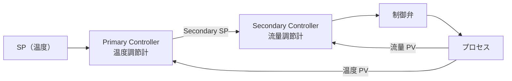

# PID制御

## 30秒まとめ

P は現在の偏差に反応、I は過去の積み上がりを解消、D は変化の速度を先読みする。ハンチング（振動）の原因はほとんどゲイン過大か積分時間が短すぎる。チューニングは「P だけで落ち着かせてから I を入れる」が基本手順。

---

## P / I / D の直感的な説明

| パラメータ | 見ているもの | 役割 | 強くすると |
|----------|-----------|------|---------|
| P（比例ゲイン） | **現在の偏差** | 偏差に比例した操作量を出す | 応答が速くなる。過大でハンチング |
| I（積分時間 Ti） | **過去の偏差の積み上がり** | 定常偏差（オフセット）を消す | 遅くすると残留偏差が残る。短すぎるとハンチング |
| D（微分時間 Td） | **偏差の変化速度** | 変化の先読みでオーバーシュートを抑制 | ノイズを増幅する。一般的には0または小さめに設定 |

!!! note "PID 演算式（位置型）"
    ```
    MV = Kp × [ e + (1/Ti) × ∫e dt + Td × de/dt ]

    MV：操作量、Kp：比例ゲイン、e：偏差（SP-PV）、Ti：積分時間、Td：微分時間
    ```

---

## ステップ応答法によるチューニング

最も現場で使いやすい方法。

### 手順

```
1. 制御ループを手動（Manual）にする
2. MV（操作量）を現在値から 10% ステップ変化させる
3. PV（測定値）のステップ応答を記録する
4. 応答曲線から以下を読み取る：
   - むだ時間（L）：MV 変化後 PV が反応し始めるまでの時間
   - 時定数（T）：応答が最終変化量の 63.2% に達するまでの時間
   - プロセスゲイン（Kp_process）：PV変化量 / MV変化量
5. Ziegler-Nichols 式でパラメータ計算
```

<svg viewBox="0 0 640 360" role="img" aria-label="ステップ応答曲線からむだ時間L・時定数T（63.2%到達点）・プロセスゲインを読み取る図" style="max-width:100%;height:auto;font-family:sans-serif;font-size:13px;">
  <!-- 軸 -->
  <line x1="70" y1="40" x2="70" y2="230" stroke="currentColor" stroke-width="1.5"/>
  <line x1="70" y1="230" x2="610" y2="230" stroke="currentColor" stroke-width="1.5"/>
  <text x="70" y="28" fill="currentColor" text-anchor="middle">PV（測定値）</text>
  <text x="600" y="250" fill="currentColor" text-anchor="end">時間 →</text>

  <!-- ステップ入力の起点（縦破線） -->
  <line x1="130" y1="40" x2="130" y2="245" stroke="currentColor" stroke-width="1" stroke-dasharray="4 3" opacity="0.6"/>
  <text x="130" y="258" fill="currentColor" text-anchor="middle">MV ステップ</text>

  <!-- 初期値・最終値の水平基準線 -->
  <line x1="70" y1="210" x2="600" y2="210" stroke="currentColor" stroke-width="0.8" stroke-dasharray="3 3" opacity="0.5"/>
  <line x1="70" y1="70" x2="600" y2="70" stroke="currentColor" stroke-width="0.8" stroke-dasharray="3 3" opacity="0.5"/>
  <text x="66" y="214" fill="currentColor" text-anchor="end">初期値</text>
  <text x="66" y="74" fill="currentColor" text-anchor="end">最終値</text>

  <!-- 63.2% ライン -->
  <line x1="70" y1="121" x2="330" y2="121" stroke="currentColor" stroke-width="0.8" stroke-dasharray="3 3" opacity="0.7"/>
  <text x="66" y="125" fill="currentColor" text-anchor="end">63.2%</text>

  <!-- 応答曲線：反応開始まで平坦（むだ時間）→ 一次遅れ状に立ち上がり -->
  <path d="M70,210 L210,210 C260,210 300,150 330,121 C380,95 470,74 600,71" fill="none" stroke="currentColor" stroke-width="2.5"/>

  <!-- 反応開始点 -->
  <line x1="210" y1="40" x2="210" y2="235" stroke="currentColor" stroke-width="1" stroke-dasharray="4 3" opacity="0.6"/>
  <text x="210" y="258" fill="currentColor" text-anchor="middle">反応開始</text>

  <!-- 63.2%到達点（T の終点） -->
  <line x1="330" y1="121" x2="330" y2="235" stroke="currentColor" stroke-width="1" stroke-dasharray="4 3" opacity="0.6"/>
  <circle cx="330" cy="121" r="3.5" fill="currentColor"/>

  <!-- むだ時間 L：ステップ〜反応開始 -->
  <line x1="130" y1="290" x2="210" y2="290" stroke="currentColor" stroke-width="1.5"/>
  <line x1="130" y1="285" x2="130" y2="295" stroke="currentColor" stroke-width="1.5"/>
  <line x1="210" y1="285" x2="210" y2="295" stroke="currentColor" stroke-width="1.5"/>
  <text x="170" y="283" fill="currentColor" text-anchor="middle">むだ時間 L</text>

  <!-- 時定数 T：反応開始〜63.2%到達 -->
  <line x1="210" y1="320" x2="330" y2="320" stroke="currentColor" stroke-width="1.5"/>
  <line x1="210" y1="315" x2="210" y2="325" stroke="currentColor" stroke-width="1.5"/>
  <line x1="330" y1="315" x2="330" y2="325" stroke="currentColor" stroke-width="1.5"/>
  <text x="270" y="338" fill="currentColor" text-anchor="middle">時定数 T（63.2%到達まで）</text>

  <!-- プロセスゲイン：最終変化量 ΔPV -->
  <line x1="560" y1="70" x2="560" y2="210" stroke="currentColor" stroke-width="1.5"/>
  <line x1="555" y1="70" x2="565" y2="70" stroke="currentColor" stroke-width="1.5"/>
  <line x1="555" y1="210" x2="565" y2="210" stroke="currentColor" stroke-width="1.5"/>
  <text x="572" y="135" fill="currentColor" text-anchor="start">ΔPV</text>
  <text x="572" y="152" fill="currentColor" text-anchor="start">ゲイン=</text>
  <text x="572" y="169" fill="currentColor" text-anchor="start">ΔPV/ΔMV</text>
</svg>

*ステップ応答曲線の読み取り：反応開始までが むだ時間 L、そこから最終変化量の 63.2% 到達までが 時定数 T、最終変化量 ΔPV と入力 ΔMV の比がプロセスゲイン。*

### Ziegler-Nichols ステップ応答法（参考値）

| 制御 | Kp | Ti | Td |
|------|----|----|-----|
| P 制御 | T / (Kp_process × L) | — | — |
| PI 制御 | 0.9 × T / (Kp_process × L) | 3.3 × L | — |
| PID 制御 | 1.2 × T / (Kp_process × L) | 2.0 × L | 0.5 × L |

!!! warning "Ziegler-Nichols はあくまで出発点"
    計算値をそのまま使うと応答が振動的になることが多い。Kp を計算値の 50〜70% から始めて調整するのが実務的。

---

## ハンチング（振動）の3大原因と対処

| 原因 | 症状 | 対処 |
|------|------|------|
| 比例ゲイン過大 | 規則的な振動。振幅が一定 | Kp を 50〜70% に下げる |
| 積分時間が短すぎる | 振幅が徐々に拡大する | Ti を 2〜3 倍に延ばす |
| むだ時間が大きい | 低周波の遅い振動 | PV ノイズには入力の 1 次遅れフィルタ、むだ時間が支配的な遅れには[カスケード制御](#カスケード制御)やむだ時間補償（スミス予測）が有効。D 成分はむだ時間が支配的な系では効きにくく、ノイズを増幅するため慎重に |

---

## カスケード制御

1つの制御ループの出力が別のループの目標値（SP）になる構成。



**適用場面**：外乱の多い流量・圧力を内側ループで素早く抑制し、外側ループの温度や液位を安定させたい場合。

---

## ワインドアップ（積分飽和）と防止策

制御弁が全開/全閉（飽和状態）になっているとき、I（積分）項は偏差を積み続けて大きな値になる（ワインドアップ）。弁が飽和から解放された瞬間に、蓄積した積分分が一気に放出されてオーバーシュートが発生する。

### 防止策

| 機能 | 内容 |
|------|------|
| アンチリセットワインドアップ（ARW） | 出力が飽和したとき積分計算を停止する |
| 出力リミット（HL/LL） | MV の上下限をリミットして積分の蓄積を制限する |
| バックキャルキュレーション | 弁の実開度をフィードバックして積分値を補正する |

---

## 主要メーカーのパラメータ表記対応表

| パラメータ | 横河 CENTUM | ABB 800xA | Emerson DeltaV |
|----------|-----------|----------|---------------|
| 比例帯（PB）または比例ゲイン | PB（%） | GAIN | GAIN |
| 積分時間 | TI（min） | RESET（min） | RESET（min） |
| 微分時間 | TD（min） | RATE（min） | RATE（min） |

!!! note "比例ゲインと比例帯の関係"
    比例帯 PB（%）= 100 / Kp
    PB が小さいほどゲインが高い（応答が敏感）。
    例：PB=50% → Kp=2.0
