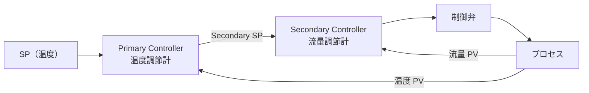

# PID制御

## 30秒まとめ

P は現在の偏差に反応、I は過去の積み上がりを解消、D は変化の速度を先読みする。ハンチング（振動）の原因はほとんどゲイン過大か積分時間が短すぎる。チューニングは「P だけで落ち着かせてから I を入れる」が基本手順。

---

## P / I / D の直感的な説明

| パラメータ | 見ているもの | 役割 | 強くすると |
|----------|-----------|------|---------|
| P（比例ゲイン） | **現在の偏差** | 偏差に比例した操作量を出す | 応答が速くなる。過大でハンチング |
| I（積分時間 Ti） | **過去の偏差の積み上がり** | 定常偏差（オフセット）を消す | 遅くすると残留偏差が残る。短すぎるとハンチング |
| D（微分時間 Td） | **偏差の変化速度** | 変化の先読みでオーバーシュートを抑制 | ノイズを増幅する。一般的には0または小さめに設定 |

!!! note "PID 演算式（位置型）"
    ```text
    MV = Kp × [ e + (1/Ti) × ∫e dt + Td × de/dt ]

    MV：操作量、Kp：比例ゲイン、e：偏差（SP-PV）、Ti：積分時間、Td：微分時間
    ```

---

## ステップ応答法によるチューニング

最も現場で使いやすい方法。

### 手順

```text
1. 制御ループを手動（Manual）にする
2. MV（操作量）を現在値から 10 % ステップ変化させる
3. PV（測定値）のステップ応答を記録する
4. 応答曲線から以下を読み取る：
   - むだ時間（L）：MV 変化後 PV が反応し始めるまでの時間
   - 時定数（T）：むだ時間 L が終わった時点を起点に、応答が最終変化量の 63.2 % に達するまでの時間
     ※ MV ステップ時点から測ると T が L だけ過大になり、Kp が過大 → ハンチングの原因
   - プロセスゲイン（Kp_process）：PV 変化量 / MV 変化量
     ※ PV・MV とも「レンジに対する %」でそろえて無次元にする
5. Ziegler-Nichols 式でパラメータ計算
```

### Ziegler-Nichols ステップ応答法（参考値）

| 制御 | Kp | Ti | Td |
|------|----|----|-----|
| P 制御 | T / (Kp_process × L) | — | — |
| PI 制御 | 0.9 × T / (Kp_process × L) | 3.3 × L | — |
| PID 制御 | 1.2 × T / (Kp_process × L) | 2.0 × L | 0.5 × L |

!!! warning "Ziegler-Nichols はあくまで出発点"
    計算値をそのまま使うと応答が振動的になることが多い。Kp を計算値の 50〜70% から始めて調整するのが実務的。

---

## ハンチング（振動）の3大原因と対処

| 原因 | 症状 | 対処 |
|------|------|------|
| 比例ゲイン過大 | 規則的な振動。振幅が一定 | Kp を 50〜70% に下げる |
| 積分時間が短すぎる | 振幅が徐々に拡大する | Ti を 2〜3 倍に延ばす |
| むだ時間が大きい | 低周波の遅い振動 | Kp を下げ Ti を延ばす。内側ループで外乱を速く潰せるならカスケード制御、それでも足りなければむだ時間補償（スミス補償）を検討 |

!!! warning "むだ時間が支配的なループに D を足しても効かない"
    D 動作が見ているのは「PV の変化速度」です。むだ時間 L の間はプロセスの変化がそもそも PV に現れないため、
    D はすでに遅れて届いた変化に反応するだけで、先読みにはなりません。ノイズ増幅の副作用だけが残ります。
    フィルタ追加も同様で、位相遅れを増やすぶん振動を悪化させる側に働きます。
    L / T（むだ時間と時定数の比）が大きいループでは、まずゲインを下げて安定させるのが定石です。

---

## カスケード制御

1つの制御ループの出力が別のループの目標値（SP）になる構成。


```mermaid
flowchart LR
    A[SP（温度）] --> B[Primary Controller\n温度調節計]
    B -- Secondary SP --> C[Secondary Controller\n流量調節計]
    C --> D[制御弁]
    D --> E[プロセス]
    E -- 流量 PV --> C
    E -- 温度 PV --> B
```

**適用場面**：外乱の多い流量・圧力を内側ループで素早く抑制し、外側ループの温度や液位を安定させたい場合。

---

## ワインドアップ（積分飽和）と防止策

制御弁が全開/全閉（飽和状態）になっているとき、I（積分）項は偏差を積み続けて大きな値になる（ワインドアップ）。弁が飽和から解放された瞬間に、蓄積した積分分が一気に放出されてオーバーシュートが発生する。

### 防止策

| 機能 | 内容 |
|------|------|
| アンチリセットワインドアップ（ARW） | 出力が飽和したとき積分計算を停止する |
| 出力リミット（HL/LL） | MV の上下限をリミットして積分の蓄積を制限する |
| バックキャルキュレーション | 弁の実開度をフィードバックして積分値を補正する |

---

## 主要メーカーのパラメータ表記対応表

| パラメータ | 横河 CENTUM | ABB 800xA | Emerson DeltaV |
|----------|-----------|----------|---------------|
| 比例帯（PB）または比例ゲイン | PB（%） | GAIN | GAIN |
| 積分時間 | TI | RESET | RESET |
| 微分時間 | TD | RATE | RATE |

!!! danger "積分時間・微分時間の単位は必ず取扱説明書で確認する"
    積分時間・微分時間の既定単位は機種・ブロック・エンジニアリング設定によって**秒**と**分**のどちらもあり、
    RESET については「時間（min）」ではなく「1分あたりの繰返し回数（repeats/min）」を採る機器もあります。
    取り違えると整定値が 60 倍・1/60 倍ずれ、ハンチングや制御不能の直接原因になります。
    上表はパラメータ名の対応のみを示すもので、単位は当該機器の取扱説明書で必ず確認してください（本Wikiでは未照合）。

!!! note "比例ゲインと比例帯の関係"
    比例帯 PB（%）= 100 / Kp
    PB が小さいほどゲインが高い（応答が敏感）。
    例：PB=50% → Kp=2.0

---

## 根拠

### 時定数 T の起点を明記しました（2026-08-02 是正）

かつて本ページは時定数 T を「応答が最終変化量の 63.2 % に達するまでの時間」とだけ書き、**起点を示していませんでした**。ステップ応答法が前提とする一次遅れ＋むだ時間モデルは次の形です。

```text
PV(t) = K × ΔMV × { 1 − exp( −(t − L) / T ) }   （t ≧ L）

K  : プロセスゲイン、L : むだ時間、T : 時定数
```

指数の中が (t − L) であることから、応答が 63.2 % に達するのは **t = L + T** です。したがって T は **むだ時間 L が終わった時点から**測ります。MV をステップさせた時点から測ると、読み取り値は L + T になり T が L だけ過大になります。

過大量は倍率 (T + L) / T = 1 + L/T で効くため、**むだ時間の比率が大きいループほど誤差が大きくなります**。

| L / T | Kp の過大率 |
|---|---|
| 0.1 | +10 % |
| 0.2 | +20 % |
| 0.5 | +50 % |
| 1.0 | +100 % |

数値検算（K = 1、L = 2、T = 10。2026-08-02 に計算して確認）。63.2 % 到達は t = 12 で、これを T と誤読した場合:

| 制御 | 正しい Kp | T = 12 と誤読 | 差 |
|---|---|---|---|
| P | 5.00 | 6.00 | +20 % |
| PI | 4.50 | 5.40 | +20 % |
| PID | 6.00 | 7.20 | +20 % |

Ti・Td は L だけで決まるため、この誤読の影響を受けません。**過大になるのはゲインだけ**で、そのまま入れると振動側に振れます。

### Ziegler-Nichols 式は再確認済み

上表の係数（P: T/(Kp_process・L)／PI: 0.9T/(Kp_process・L)・Ti = 3.3L／PID: 1.2T/(Kp_process・L)・Ti = 2L・Td = 0.5L）は、流通しているステップ応答法（反応曲線法）の値と一致することを 2026-08-02 に確認しました。比例帯 PB = 100/Kp、PB = 50 % → Kp = 2.0 も定義どおりです。

### プロセスゲインは無次元にそろえる

Kp_process = PV 変化量 / MV 変化量 は、**PV と MV をそれぞれのレンジに対する % で取って初めて無次元**になります。PV を工業単位（℃・kPa 等）、MV を % で取ると Kp_process が「℃/%」のような単位を持ち、Z-N 式から出る Kp も「%/℃」になります。調節計側が無次元のゲイン（または比例帯 %）を期待している場合、レンジ倍だけずれた値を入れることになります。

### 実務慣行（規格の裏付けなし）

次はいずれも現場の目安であり、規格・法令が定めた値ではありません。

- **MV のステップ幅 10 %**。プロセスが動く範囲で、かつ製品品質に影響しない幅を選ぶという趣旨の値です
- **計算値の 50〜70 % から始める**
- ハンチング対処の **Kp を 50〜70 % に下げる／Ti を 2〜3 倍に延ばす**
- カスケード制御の適用場面、ワインドアップ防止策の3区分

### 原本未照合（honest-hold）

- **Ziegler-Nichols 法の原論文（Ziegler & Nichols, 1942）を本 Wiki では照合していません。** 上表の係数は流通している値との一致を確認したにとどまり、原論文からの逐語引用ではありません。「計算値をそのまま使うと振動的になるのは 1/4 減衰比を設計目標にしているため」という説明が一般的ですが、原本未照合のため本 Wiki では断定しません
- **主要メーカーのパラメータ表記対応表は名称の対応のみ**です。単位（秒／分／repeats per min）は本文の danger 注記のとおり未照合で、取扱説明書での確認が必要です
- スミス補償・バックキャルキュレーション等の実装は**機器のブロック仕様に依存**します。本ページは考え方のみを扱います

### 限界の明示

- ステップ応答法が前提とするのは**一次遅れ＋むだ時間で近似できるプロセス**です。積分性プロセス（液位・バッチ昇温など、MV を変えると PV が戻らず動き続けるもの）や逆応答を持つプロセスには、この手順をそのまま当てはめられません
- **ステップ試験はプラントを乱します。** 実施前に運転部門の了解と、外れたときの戻し方（Manual 復帰・MV 復元値）を決めてください

### 正典参照

| 項目 | 正典 |
|---|---|
| 4-20 mA・NAMUR NE 43 の信号レベル | [計装基礎](basics.md) |
| 調節計側の設定項目・実装 | [調節計・記録計](controller.md) |
| PID 出力を受ける弁の応答・シート漏れ等 | [制御弁](control-valve.md) |
| DCS の PID ブロックと運用 | [DCS](dcs.md) |
| ハンチングの現場切り分け | [制御弁トラブル](../06-trouble/valve.md) |

照合日: 2026-08-02。

---

## 関連ページ

- [調節計・記録計](controller.md) — PID を実装する機器側の設定
- [制御弁](control-valve.md) — PID 出力を受ける最終操作端
- [DCS](dcs.md) — DCS 上での PID ブロックと運用
- [計装カテゴリ](index.md) — より広い計装知識へ
