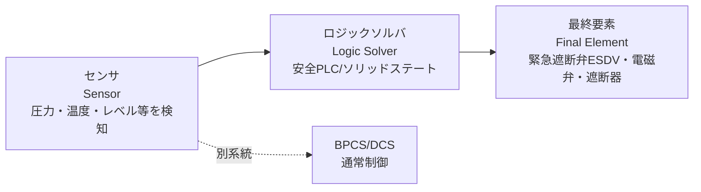

# 機能安全（SIS/SIL）

## 30秒まとめ

安全計装システム（SIS: Safety Instrumented System）は、通常運転を担う DCS/BPCS（基本プロセス制御系）とは**物理的に独立**させ、危険事象を検知して安全側へ停止させる「最後の砦」です。SIS が担う1つ1つの安全機能を SIF（Safety Instrumented Function：安全計装機能）と呼び、**センサ→ロジックソルバ→最終要素**の1ループで構成されます。各 SIF に要求される信頼性の度合いが SIL（Safety Integrity Level：安全度水準）1〜4で、値が大きいほど「要求されたときに失敗する確率（PFDavg）」を1桁ずつ小さくする必要があります。SIL は機器を買えば手に入るものではなく、**投票構成・プルーフテスト周期・診断・独立性**を設計と運用の両輪で守り続けて初めて維持されます。バイパスの放置やプルーフテストの未実施は、SIL を静かに崩す典型です。

---

## SIS と BPCS/DCS はなぜ分けるのか

化学プラントの計装は、大きく2つの層に分かれます。

| 層 | 略称 | 役割 | 状態 |
|----|------|------|------|
| 基本プロセス制御系 | BPCS（Basic Process Control System）／ DCS | 温度・圧力・流量を目標値に保つ常時制御 | 常に動いている（能動的） |
| 安全計装システム | SIS | 危険域に入ったら検知して安全側へ停止（ESD・インターロック） | 普段は待機、要求時だけ作動（受動的） |

IEC 61511（プロセス産業の機能安全規格。上位に汎用規格 IEC 61508）は、この2層を**独立させること**を要求しています。理由は明快です。

- **共通原因故障（Common Cause Failure）の排除**: BPCS が暴走・故障して危険を引き起こしたとき、その BPCS自身に安全機能を持たせていたら、道連れで安全機能も失われます。BPCS の異常こそが SIS を必要とする場面なので、同じ箱・同じセンサに同居させてはいけません
- **独立した層としての信頼性**: SIS は「BPCS が守れなかったときに独立して働く」ことに価値があります。LOPA（後述）でも SIS は BPCS とは別の独立防護層（IPL: Independent Protection Layer）として数えます

!!! danger "BPCS と SIS のセンサ共用は原則禁止"
    「同じ圧力を測るのだから伝送器は1本でよいのでは」という発想が最も危険です。BPCS の制御用トランスミッタが詰まり・ドリフトを起こすと、制御が乱れて危険に近づくと同時に、その同じ信号を使う安全機能も正しく検知できません。**SIS のセンサ・ロジックソルバ・最終要素は BPCS とは別系統**にするのが原則です。既存の [DCS](dcs.md#sis-dcs) の分離原則と合わせて確認してください。

---

## SIF — 安全計装機能という「1ループ」の考え方

SIS は複数の SIF（Safety Instrumented Function：安全計装機能）の集合体です。SIF は「ある特定の危険事象を防ぐための、独立した1つの機能」で、次の3要素で構成された1ループです。

| 要素 | 英語 | 代表機器 | 補足 |
|------|------|---------|------|
| センサ | Sensor | 圧力伝送器・温度伝送器・レベルスイッチ | SIF ごとに専用。BPCS と共用しない |
| ロジックソルバ | Logic Solver | 安全 PLC（Safety PLC）・ソリッドステートロジック | IEC 61508 認証品を使うのが一般的 |
| 最終要素 | Final Element | 緊急遮断弁（ESDV: Emergency Shutdown Valve）・電磁弁（SOV）・電動機遮断 | 実際にプロセスを止める部分。故障寄与が最も大きいことが多い |

!!! tip "SIF ごとに SIL を割り当てる"
    SIL は「工場全体」や「SIS 全体」に付く番号ではなく、**SIF 1つ1つに割り当てる**ものです。例えば「反応器高圧トリップ SIF は SIL 2」「フレアノックアウトドラム高レベル SIF は SIL 1」のように、危険事象の重大さごとに個別決定します。SIF ごとにセンサから最終要素までの全経路で PFDavg を積み上げて検証します。

SIF 全体の PFDavg は、センサ・ロジックソルバ・最終要素それぞれの寄与の足し算に近い形になります。経験的に**最終要素（弁）の寄与が支配的**になりやすく、後述の部分ストロークテスト（PST）が効いてくる理由です。

---

## SIL — 安全度水準の定義

SIL（Safety Integrity Level：安全度水準）は SIF に要求される信頼性を1〜4の離散バンドで表します。低頻度作動要求モード（Low Demand Mode：安全機能への要求が年1回程度以下。プロセス産業の大半はこちら）では、**PFDavg（Average Probability of Failure on Demand：要求時平均作動失敗確率）** の範囲で定義されます。

### SIL 定義表（低頻度作動要求モード, IEC 61508-1 表2）

| SIL | PFDavg（要求時作動失敗確率） | RRF（リスク低減係数 = 1 / PFDavg） | 桁のイメージ |
|-----|------------------------------|-------------------------------------|--------------|
| SIL 4 | 10⁻⁵ ≤ PFDavg < 10⁻⁴ | 10,000 〜 100,000 | 10万回に1回以下しか失敗しない |
| SIL 3 | 10⁻⁴ ≤ PFDavg < 10⁻³ | 1,000 〜 10,000 | 1万回に1回 |
| SIL 2 | 10⁻³ ≤ PFDavg < 10⁻² | 100 〜 1,000 | 1,000回に1回 |
| SIL 1 | 10⁻² ≤ PFDavg < 10⁻¹ | 10 〜 100 | 100回に1回 |

- **1 SIL上がるごとに PFDavg は1桁小さく**（信頼性が10倍厳しく）なります
- **RRF（Risk Reduction Factor：リスク低減係数）= 1 / PFDavg**。SIL 2 なら「危険事象の発生頻度を100〜1,000分の1に下げる能力」を意味します
- 化学プラントの SIF は **SIL 1〜SIL 2 が大半**、重大な事象で SIL 3。**SIL 4 は単一の SIF ではほぼ非現実的**（達成コストが跳ね上がる）で、現実には防護層を増やして各層を SIL 2〜3 に分担させます

!!! warning "PFDavg は「桁」で管理する"
    PFDavg は小数の細かい値の議論に見えますが、実務では**どの桁のバンドに入るか**が本質です。プルーフテスト周期を延ばす、テストカバレッジが甘い、といった運用のほころびは PFDavg を悪化させ、気づかぬうちに SIL 2 が SIL 1 相当に落ちていることがあります。設計時の SIL 検証計算書（SIL verification）と、運用実績が一致しているかを定期的に照合してください。

### 高頻度作動要求モード（参考）

作動要求が頻繁（年1回超）または連続の場合は、PFDavg ではなく **PFH（Probability of dangerous Failure per Hour：単位時間あたり危険側故障確率, 1/h）** で SIL を定義します（SIL 1: 10⁻⁶ ≤ PFH < 10⁻⁵ など）。プロセスプラントのトリップ系の多くは低頻度モードですが、常時安全機能に依存する構成では高頻度モードで評価する点に注意してください。

---

## SIL の決定手法（LOPA／リスクグラフ）

「この SIF に SIL いくつを要求するか」は感覚では決めません。代表的な2手法があります。

### LOPA（Layer of Protection Analysis：防護層解析）

半定量的な手法で、化学プラントで最も広く使われます。

1. HAZOP 等で抽出した危険シナリオごとに、**起因事象の頻度**（例: 制御ループ故障 0.1回/年）を置く
2. その事象を止める**独立防護層（IPL）** を並べ、各層の PFD を掛けていく（BPCS 制御・機械式安全弁・オペレータ介入など）
3. 残ったリスクが許容基準（企業の risk criteria）に届かない不足分を、**SIS に要求する RRF** として算出
4. 必要 RRF から逆算して SIL を決定（RRF 100〜1,000 → SIL 2 など）

!!! note "IPL として数える条件"
    LOPA で防護層に数えられるのは、**独立・有効・監査可能**な層だけです。BPCS の制御ループと、その異常を検知する SIS を「別の層」と数えるには、両者が独立（センサ・ロジック別系統）であることが前提になります。ここでも独立の原則が効いてきます。

### リスクグラフ（Risk Graph）

結果の重大度・暴露頻度・回避可能性・事象発生確率の4パラメータを分岐でたどり、SIL を導く定性的手法です。LOPA より簡便ですが、パラメータ選択の主観が入りやすく、キャリブレーション（自社基準への較正）が重要です。

---

## 投票構成（Voting Architecture）

SIF の信頼性と運転継続性は、センサや最終要素を**何重にして、いくつ一致したら動作させるか**で作り込みます。MooN（M out of N：N個中M個の一致で作動）表記を使います。

### 投票構成の比較表

| 構成 | 読み | 作動条件 | 安全性（危険側故障への強さ） | 運転継続性（スプリアストリップ耐性） | 代表用途 |
|------|------|---------|------------------------------|--------------------------------------|---------|
| 1oo1 | 1 out of 1 | 1個が検知で作動 | 低（単一故障で機能喪失。診断で補う） | 低（1個の誤検知で即トリップ） | 低 SIL・単純ループ |
| 1oo2 | 1 out of 2 | 2個中1個の検知で作動 | **高**（片方が危険側故障でも他方が作動） | 低（片方の誤検知でトリップ＝スプリアス増） | 安全最優先の遮断 |
| 2oo2 | 2 out of 2 | 2個とも検知で作動 | 低（片方が危険側故障だと作動しない） | **高**（片方の誤検知ではトリップしない） | 誤トリップを嫌う系（安全性は要注意） |
| 2oo3 | 2 out of 3 | 3個中2個の検知で作動 | 高 | 高 | **安全性と運転継続性を両立**。多用される |

### トレードオフの本質

- **安全側（危険側故障を見逃さない）を厚くする** → 冗長数を増やし、少数一致で作動させる（1oo2, 1oo3）。ただし1個の誤検知でも止まるため**スプリアストリップ（Spurious Trip：不要作動）が増える**
- **運転継続性（不要停止を避ける）を厚くする** → 多数一致を要求する（2oo2, 2oo3）。ただし要求時に作動しないリスク（危険側）とのバランスが要る
- **2oo3 が「良いとこ取り」として好まれる**理由: 1個が故障・誤検知しても、残り2個の多数決で正しく動く。危険側にもスプリアス側にも1個の故障を許容できる（HFT=1 相当）

!!! tip "スプリアストリップは安全問題でもある"
    「余計に止まるだけで安全側だから良い」とは限りません。頻繁な緊急停止は起動停止のたびに別の危険（フレア負荷・熱応力・手動介入ミス）を生み、現場が**トリップ設定を嫌ってバイパスを常用する**動機になります。スプリアス低減（2oo3化）は、SIS を「信頼して使い続けられる」ようにするための安全投資でもあります。

---

## プルーフテスト（Proof Test）

SIS は普段作動しないため、故障が起きても「静かに壊れている」ことがあります。この**危険側未検出故障（DU: Dangerous Undetected failure）** を摘み出すのがプルーフテストです。

### なぜ必須か — PFDavg との関係

- 故障のうち診断で自動検出できるもの（DD: Dangerous Detected）は警報が出ますが、診断でカバーできない DU は**次に実際に作動要求が来るまで発覚しない**
- DU が潜んでいる時間が長いほど PFDavg は悪化します。低頻度モードの PFDavg は近似的に **PFDavg ≈ (λDU × T) / 2**（λDU: 危険側未検出故障率, T: プルーフテスト周期）で表され、**テスト周期 T に比例**します
- つまり **周期を2倍に延ばすと PFDavg も約2倍悪化**します。これがプルーフテスト周期を安易に延ばしてはいけない定量的な理由です

| 判断 | PFDavg への影響 |
|------|-----------------|
| プルーフテスト周期 T を短縮 | PFDavg 改善（DU の潜伏時間が短くなる） |
| 周期 T を延長（テスト先送り） | PFDavg 悪化（SIL が1段落ちることもある） |
| テスト未実施の放置 | 検証計算の前提が崩れ、実質 SIL を保証できない |

### テストカバレッジ（Proof Test Coverage）

1回のプルーフテストで DU の何割を摘出できるかが**テストカバレッジ**です。100%と思い込みがちですが、実際は不完全なことが多いです。

- 例: 遮断弁を全ストローク動かせば弁体固着は検出できますが、テスト用に**バイパスで疑似信号を入れる方式だと、実際のセンサ〜ロジック〜弁の全経路を通していない**ことがあり、カバレッジが下がります
- カバレッジが低いと、テストしても取りこぼす DU が残り、PFDavg は計算通りには下がりません。SIL 検証計算書に用いたカバレッジ前提と、実際のテスト方法が一致しているか確認してください

### 部分ストロークテスト（PST: Partial Stroke Test）

緊急遮断弁（ESDV）は全閉テストがプロセス停止を伴うため、頻繁にはできません。そこで**弁を10〜20%程度だけ動かして固着していないかを確認**するのが PST です。

- **メリット**: 運転を止めずに弁の固着（最終要素の主要な DU）を部分的に摘出でき、フルプルーフテストの間隔を延ばしても PFDavg を抑えられる
- **限界**: 全閉・シート漏れは PST では確認できないため、**PST はフルプルーフテストを置き換えない**。周期の長いフルテストと組み合わせて使う
- 最終要素の故障寄与が支配的なことが多いため、PST は SIF 全体の PFDavg 改善に効きやすい

!!! danger "プルーフテスト記録は SIL の「証拠」"
    プルーフテストは「やったつもり」では意味がありません。**いつ・誰が・どの方法で・合否はどうだったか**の実施記録（証明試験記録）が、その SIF が今も要求 SIL を満たしている唯一の証拠です。記録のない SIS は、監査でも事故調査でも「機能保証なし」と判断されます。テスト周期の管理と記録の保存は SIS 運用の根幹です。

---

## SFF・HFT とアーキテクチャ制約

PFDavg の計算（ランダムハードウェア故障）だけでは SIL は認められません。IEC 61508 は、構成の**冗長性の下限**を別途要求します。これがアーキテクチャ制約（Architectural Constraints）です。

| 用語 | 意味 |
|------|------|
| SFF（Safe Failure Fraction：安全側故障割合） | 全故障のうち「安全側故障＋診断で検出できる危険側故障」の割合。診断（自己診断）が効くほど高くなる |
| HFT（Hardware Fault Tolerance：ハードウェアフォールトトレランス） | 何個の故障まで機能を失わずに耐えられるか。HFT=1 なら1個故障しても機能維持（＝2重化相当） |

考え方はシンプルです。**SFF が低い（診断の乏しい）機器ほど、より高い HFT（多重化）を要求される**。逆に SFF が高い認証機器なら、同じ SIL をより少ない冗長数で達成できます。

- 例: 診断のない汎用伝送器（SFF 60%未満）で高い SIL を狙うと HFT を上げざるを得ず、1oo2 や 2oo3 の多重化が必要になる
- 認証済みで診断の効く機器（SFF 90%以上）なら、より少ない冗長で同 SIL に届く

!!! note "PFDavg 合格でもアーキテクチャ制約で不合格になる"
    「計算上の PFDavg は SIL 2 を満たすから1oo1でよい」は通りません。SFF が低ければ、アーキテクチャ制約側が1oo1を認めず、多重化を要求します。**PFDavg（量）とアーキテクチャ制約（構成の下限）の両方**をクリアして初めてその SIL を主張できます。

---

## MOC・バイパス管理

SIS は「動いていること」だけでなく「勝手に無効化されていないこと」の管理が命です。

### 変更管理（MOC）

SIF のロジック・整定値・投票構成・プルーフテスト周期の変更は、すべて **MOC（Management of Change：変更管理）** を経ます。SIL 検証計算の前提（故障率・冗長・テスト周期）を変える変更は、SIL 再計算まで含めて審査対象です。[DCS](dcs.md#moc-management-of-change) の MOC ルールと同じ枠組みで、SIS はさらに厳格に扱います。

### バイパス（オーバーライド）管理

プルーフテストや校正、起動時などに SIF を一時的に無効化（バイパス／オーバーライド）することがあります。ここが最も事故に繋がりやすい運用点です。

!!! danger "SIS バイパスは2名確認・時間管理・見える化"
    バイパスは安全機能を意図的に殺す行為です。以下を徹底してください（既存 [DCS](dcs.md) のバイパス運用と整合）。

    - **2名確認**: バイパス投入・解除は単独作業にしない。誰が・いつ・なぜを記録
    - **時間管理**: 「何時までに解除」を明確にし、期限管理する。ダラダラ延長しない
    - **見える化**: バイパス中の SIF を DCS/SIS 画面・現場札で常時表示。当直交代の申し送り必須
    - **代替措置**: バイパス中は安全機能が無いに等しいため、監視強化・運転制限などの補償措置を並行する
    - **解除確認**: 作業完了後、**確実に解除されたことを2名で確認**。解除忘れが最大の落とし穴

---

## 現場の落とし穴

| 落とし穴 | 何が起きるか | 対策 |
|---------|-------------|------|
| BPCS と SIS のセンサ共用 | 共通原因故障で制御と安全が同時喪失。SIS が独立防護層として数えられない | センサ・ロジック・最終要素を別系統に。P&ID で系統を確認 |
| バイパス解除忘れ・放置 | 安全機能が無効のまま運転継続。事故時に作動しない | 時間管理・2名解除確認・画面での見える化 |
| プルーフテスト先送り・未実施 | PFDavg が周期比例で悪化し、実質 SIL が1段落ちる | テスト周期を MOC 対象として厳守。周期変更は SIL 再計算 |
| テストカバレッジの過信 | 疑似信号テストで全経路を通さず、DU を取りこぼす | 検証計算のカバレッジ前提と実テスト方法を照合。最終要素は PST 併用 |
| 整定値の無断変更 | SIL 検証の前提が崩れ、危険域で作動しない／頻繁にスプリアス | 整定値変更は必ず MOC。変更前後を記録 |
| 証明試験記録の欠落 | 機能を保証する証拠がない。監査・事故調査で「保証なし」 | いつ・誰が・どの方法で・合否を記録し保存 |
| スプリアストリップ多発の放置 | 現場が SIS を嫌いバイパス常用に走る | 2oo3化など構成見直しで不要作動を減らす |
| 防爆エリアでの機器選定漏れ | SIS 機器も防爆区分・本安要件を満たす必要がある | [防爆](explosion-proof.md) のエリア区分・保護構造と両立させる |

!!! warning "SIL は「買う」ものではなく「維持する」もの"
    SIL 3 認証センサを並べても、テストしない・バイパスを放置する・整定値を勝手に変えるなら、実際の SIL は保証できません。SIL は設計時の検証計算と、**プルーフテスト・バイパス管理・MOC という運用**で維持し続けて初めて成立します。

---

## 関連ページ

- [DCS](dcs.md) — BPCS と SIS の分離原則・MOC・ファンクションブロック（SIS ロジックの基礎）
- [防爆](explosion-proof.md) — SIS 機器も満たすべき防爆エリア区分・保護構造
- [制御弁](control-valve.md) — 最終要素となる緊急遮断弁（ESDV）・フェールポジション
- [計装空気](instrument-air.md) — 空気式最終要素の駆動源とフェール挙動
- [保護リレー試験](../guidelines/protective-relay-test.md) — 定期作動試験の考え方（プルーフテストと通じる）
- [計装カテゴリ](index.md) — 計装分野の記事一覧
