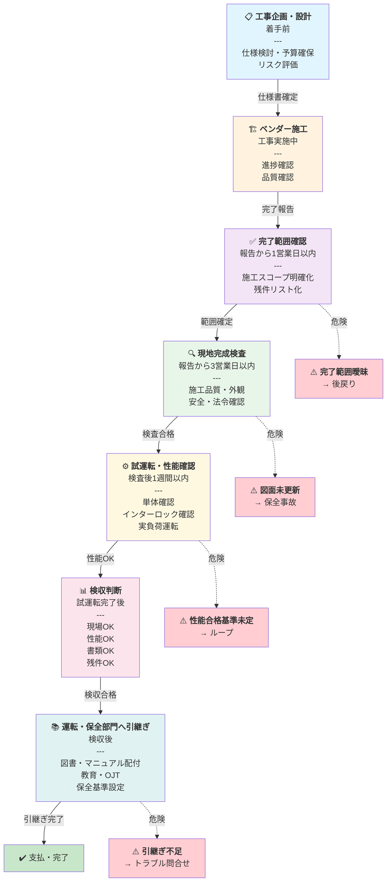

# 工事フロー全体図

## フロー（Mermaid版）

---

## フェーズ別チェックリスト

### ① 工事企画・設計（着手前）

| 項目 | 確認内容 | チェック |
|-----|---------|---------|
| 仕様書確定 | 要求仕様・性能基準が明確か | ☐ |
| 予算・期間 | プロジェクト予算・スケジュール承認済みか | ☐ |
| リスク評価 | 技術リスク・スケジュールリスク抽出済みか | ☐ |
| ベンダー選定 | 契約書で As-built 図面・試験成績書要件を明記したか | ☐ |

**次フェーズへ**: すべて ☐ がついたら施工開始 OK

---

### ② ベンダー施工（工事実施中）

| 項目 | 確認内容 | チェック |
|-----|---------|---------|
| 進捗確認 | 月次進捗会議で遅延なし、品質問題なし | ☐ |
| 変更管理 | 設計変更・代替品が適切に記録されているか | ☐ |
| 中間検査 | 設計変更部分の中間確認を実施したか | ☐ |

**注意**: この段階での問題発見が最も低コスト

---

!!! note "竣工後（③〜⑦）の実務詳細は受入ページに一本化"
    完了範囲確認・現地検査・試運転・検収・引継ぎの詳細チェックリストは [工事完了後の受入実務](../03-keiso/koji-kanryo.md) に集約しています。本ページは全体像と着工前①・施工中②に特化し、竣工後は要点＋節リンクで示します。

### ③ 完了範囲確認（報告から 1営業日以内） ⚠️ **最優先**

- 施工スコープ・残工事・変更点・手直し項目を、報告後1営業日以内に確定します。
- ここが曖昧だと「対象外」で是正コストが激増します。後戻りを防ぐ唯一のタイミングです。
- 確認項目の詳細 → [工事完了後の受入実務 ① 完了範囲の確認](../03-keiso/koji-kanryo.md#scope)

---

### ④ 現地完成検査（報告から 3営業日以内）

- 施工品質・配線/配管・支持固定・外観・清掃・接地・保全性・干渉を現地で確認します。
- 「動けばOK」ではなく、保全性・安全性の総合評価が目的です。
- 確認項目の詳細 → [工事完了後の受入実務 ② 現地完成検査](../03-keiso/koji-kanryo.md#inspection)

---

### ⑤ 試運転・性能確認（検査後 1週間以内）

- 単体確認・インターロック・保護動作・停止復旧・実負荷運転を、数値と日時の記録付きで確認します。
- 「設置された」ではなく「要求どおり機能する」までが確認範囲です。
- 確認ステップの詳細 → [工事完了後の受入実務 ③ 試運転・性能確認](../03-keiso/koji-kanryo.md#commissioning)

---

### ⑥ 検収判定（試運転完了後）

- 現場OK・性能OK・書類OK・残件OK の4条件がそろって初めて「検収可」です。
- 完成図書（As-built図面・試験成績書・マニュアル）の回収漏れに注意します。
- 判定条件・書類一覧の詳細 → [工事完了後の受入実務 ⑧ 検収・支払判断](../03-keiso/koji-kanryo.md#acceptance)

---

### ⑦ 運転・保全部門へ引継ぎ（検収後）

- 図書配付・操作/異常時対応・点検ポイント・予備品管理・教育OJT・議事録を引き継ぎます。
- 口頭のみは NG。必ず議事録・チェックシートに記録します。
- 引継ぎ項目の詳細 → [工事完了後の受入実務 ⑥ 運転・保全部門への引継ぎ](../03-keiso/koji-kanryo.md#handover)

---

## よくある過ちと対策

| 過ち | 発生フェーズ | 対策 |
|-----|-----------|------|
| 完了範囲が曖昧なまま進む | ③ | **報告から24時間以内に確認** / 以降は「対象外」で済まされる |
| 試運転の合格基準が決まっていない | ⑤ | **設計段階で数値基準を明記** / あいまいな合格は避ける |
| As-built図面が施工後の更新を依頼されている | ⑥ | **契約に「施工後30営業日以内に納入」を明記** / 施工直後が最も精度が高い |
| 引継ぎが口頭だけで記録がない | ⑦ | **OJT議事録・チェックリストに必ず署名** / 後から「そんなこと言われてない」が防げる |

---

## 関連ページ

- [工事・検収・試運転フロー（ハブページ）](index.md)
- [工事完了後の受入実務](../03-keiso/koji-kanryo.md)
- [設備投資フロー](../04-sekkei/investment-flow.md)
- [計装工事の施工・試運転](../03-keiso/index.md)
