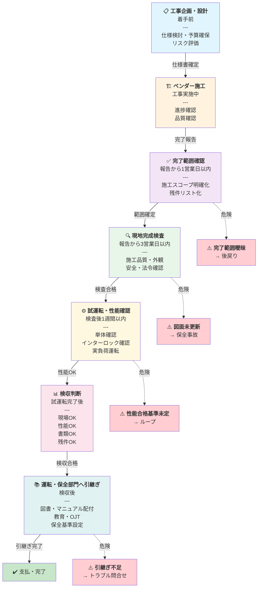

# 工事フロー全体図

## フロー（Mermaid版）



---

## フェーズ別チェックリスト

### ① 工事企画・設計（着手前）

| 項目 | 確認内容 | チェック |
|-----|---------|---------|
| 仕様書確定 | 要求仕様・性能基準が明確か | ☐ |
| 予算・期間 | プロジェクト予算・スケジュール承認済みか | ☐ |
| リスク評価 | 技術リスク・スケジュールリスク抽出済みか | ☐ |
| ベンダー選定 | 契約書で As-built 図面・試験成績書要件を明記したか | ☐ |

**次フェーズへ**: すべて ☐ がついたら施工開始 OK

---

### ② ベンダー施工（工事実施中）

| 項目 | 確認内容 | チェック |
|-----|---------|---------|
| 進捗確認 | 月次進捗会議で遅延なし、品質問題なし | ☐ |
| 変更管理 | 設計変更・代替品が適切に記録されているか | ☐ |
| 中間検査 | 設計変更部分の中間確認を実施したか | ☐ |

**注意**: この段階での問題発見が最も低コスト

---

### ③ 完了範囲確認（報告から 1営業日以内） ⚠️ **最優先**

| 項目 | 確認内容 | チェック |
|-----|---------|---------|
| 施工スコープ | どこまでが対象か明確か | ☐ |
| 残工事 | 未完了項目がないか、期日明記か | ☐ |
| 変更点記録 | 当初仕様からの全変更がリスト化されているか | ☐ |
| 手直し項目 | 指摘事項への対応完了が確認できるか | ☐ |

**ここが曖昧だと後からの是正コストが激増**

---

### ④ 現地完成検査（報告から 3営業日以内）

| カテゴリ | 確認項目 | チェック |
|---------|---------|---------|
| 施工品質 | 図面・仕様書通りに施工されているか | ☐ |
| 配線・配管 | シールド処理・端末処理・マーキング完了か | ☐ |
| 支持・固定 | 支持間隔・締め付けトルク基準を満たしているか | ☐ |
| 外観 | 銘板・危険表示・ラベル貼付完了か | ☐ |
| 清掃 | 養生材・廃材撤去・清掃完了か | ☐ |
| 安全・法令 | 接地工事・接地抵抗測定記録あるか | ☐ |
| 保全性 | メンテナンスアクセス・スペース確保か | ☐ |
| 干渉 | 既設設備との干渉・クリアランス OK か | ☐ |

**「動けばOK」ではない — 保全性・安全性の総合評価が必要**

---

### ⑤ 試運転・性能確認（検査後 1週間以内）

```
単体確認
  ☐ 電源投入・ランプ確認
  ☐ ゼロ点・スパン調整
  ☐ 入出力信号の導通確認

インターロック確認
  ☐ 各インターロック条件でのシャットダウン動作
  ☐ バイパス設定の確認

保護動作確認
  ☐ 異常警報（Hi/Lo）の発報確認
  ☐ 保護リレー動作確認

停止・復旧動作
  ☐ 緊急停止・復旧手順の動作確認

実負荷運転
  ☐ 設計流量・圧力・温度での安定動作
  ☐ PVの追従・制御ハンチング確認
  ☐ 記録（トレンド・ログ）の取得
```

**試験記録**: すべての項目を数値・日時記録に残す

---

### ⑥ 検収判定（試運転完了後）

| 条件 | 確認 | チェック |
|-----|------|---------|
| **現場OK** | 施工品質・外観・安全基準を満たしているか | ☐ |
| **性能OK** | 試運転で要求通り機能・性能が確認されたか | ☐ |
| **書類OK** | As-built図面・試験成績書・マニュアル が完備されているか | ☐ |
| **残件OK** | 是正項目が全て完了し、確認されたか | ☐ |

**4項目すべて ☐ でようやく「検収可」**

---

### ⑦ 運転・保全部門へ引継ぎ（検収後）

| 項目 | 内容 | チェック |
|-----|------|---------|
| 図書・マニュアル | As-built図面・保守要領書を配付したか | ☐ |
| 操作方法 | 正常起動・停止手順を説明したか | ☐ |
| 異常時対応 | 警報時の対処手順・連絡先を周知したか | ☐ |
| 点検ポイント | 定期点検項目・頻度・判定基準を設定したか | ☐ |
| 予備品管理 | 品番・推奨在庫数を記録したか | ☐ |
| 教育・OJT | ベンダー説明会 or 自社による教育を実施したか | ☐ |
| 議事録 | 引継ぎ内容をチェックシート/議事録に記録したか | ☐ |

**口頭のみは NG — 必ず記録に残す**

---

## よくある過ちと対策

| 過ち | 発生フェーズ | 対策 |
|-----|-----------|------|
| 完了範囲が曖昧なまま進む | ③ | **報告から24時間以内に確認** / 以降は「対象外」で済まされる |
| 試運転の合格基準が決まっていない | ⑤ | **設計段階で数値基準を明記** / あいまいな合格は避ける |
| As-built図面が施工後の更新を依頼されている | ⑥ | **契約に「施工後30営業日以内に納入」を明記** / 施工直後が最も精度が高い |
| 引継ぎが口頭だけで記録がない | ⑦ | **OJT議事録・チェックリストに必ず署名** / 後から「そんなこと言われてない」が防げる |

---

## 関連ページ

- [工事・検収・試運転フロー（ハブページ）](index.md)
- [工事完了後の受入実務](../03-keiso/koji-kanryo.md)
- [設備投資フロー](../04-sekkei/investment-flow.md)
- [計装工事の施工・試運転](../03-keiso/index.md)
