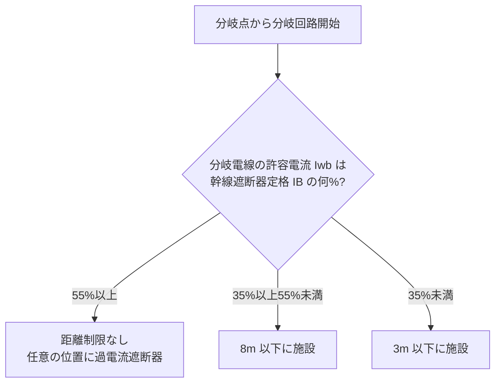

# 低圧分岐回路の施設（過電流遮断器の位置・電線太さ）

## 30秒まとめ

分岐回路は「①過電流遮断器を**どこに置くか**（分岐点から3m以下が原則）→ ②回路の種類ごとに電線太さと遮断器定格を決める」の順で設計する。原則3m以下だが、分岐電線の許容電流が幹線保護遮断器定格の **35%以上なら8m以下**、**55%以上なら距離制限なし**まで延ばせる。一般分岐回路は遮断器50A以下・電線太さは149-1表で決まる。電動機のみの分岐は幹線と同じ2.5倍／1.25・1.1倍の考え方を使う。

> 幹線側（許容電流の割り増しと遮断器定格）は [幹線サイズと過電流遮断器](feeder-breaker-sizing.md) を参照。本ページはその**負荷側（分岐）**を扱う。

---

## ① 過電流遮断器の施設位置（3m・8m・制限なし）

分岐回路の過電流遮断器は、**低圧幹線との分岐点から電線の長さ3m以下**の箇所に施設するのが原則（第149条第1項第一号）。ただし分岐電線が太く許容電流に余裕があれば、下表のとおり距離を延ばせる。

| 条件（I_wb＝分岐電線の許容電流、I_B＝幹線を保護する過電流遮断器の定格電流） | 過電流遮断器の位置 |
|------|------|
| 原則 | 分岐点から **3m 以下** |
| I_wb ≥ I_B × **35%** | 分岐点から **8m 以下** |
| I_wb ≥ I_B × **55%** | **距離制限なし**（任意の位置） |

- ここでの I_B は「その分岐回路がつながる**幹線を保護する過電流遮断器**の定格電流」。分岐回路自身の遮断器ではない。
- 分岐電線が太い（許容電流が大きい）ほど、幹線遮断器が動作するまで電線が焼けないため、遮断器を分岐点から離せる、という趣旨。



!!! warning "幹線側の『遮断器の省略条件』と混同しない"
    同じ 35%／55%・3m／8m が [幹線ページ](feeder-breaker-sizing.md) にも出るが、あちらは第148条第1項第四号「幹線の過電流遮断器を**省略**できる条件」。こちらは第149条第1項第一号「分岐回路の過電流遮断器を分岐点から**離して置ける**条件」。**対象（幹線か分岐か）と効果（省略か位置緩和か）が違う**。混同源として頻出。

---

## ② 分岐回路の種類別ルール

分岐回路は接続する負荷で3種類に分かれる（第149条第2項）。

### (1) 一般分岐回路（第2項第一号）

- 過電流遮断器の定格電流は **50 A 以下**であること。
- 電線の太さは遮断器の定格に応じて **149-1表**以上とする。

#### 149-1表（過電流遮断器の定格 → 最小電線太さ）

| 過電流遮断器の種類 | 軟銅線の太さ | MIケーブル |
|------|------|------|
| 定格 15 A 以下 | 直径 1.6 mm | 断面積 1 mm² |
| 15 A 超 20 A 以下（**配線用遮断器**） | 直径 1.6 mm | 断面積 1 mm² |
| 15 A 超 20 A 以下（配線用遮断器を除く＝ヒューズ等） | 直径 2.0 mm | 断面積 1.5 mm² |
| 20 A 超 30 A 以下 | 直径 2.6 mm | 断面積 2.5 mm² |
| 30 A 超 40 A 以下 | 断面積 8 mm² | 断面積 6 mm² |
| 40 A 超 50 A 以下 | 断面積 14 mm² | 断面積 10 mm² |

!!! tip "20A の分かれ目は『配線用遮断器かヒューズか』"
    同じ 20 A でも、**配線用遮断器**なら 1.6 mm、**ヒューズ（配線用遮断器を除く）**なら 2.0 mm。配線用遮断器は動作特性が緩く電線を守りやすいため細い線が許される。接続できるコンセント定格は 149-3表で別途規定（15A遮断器→15Aコンセント 等）。

### (2) 電動機のみに至る分岐回路（第2項第二号）

- 過電流遮断器の定格電流：**電線の許容電流 × 2.5 倍**以下（当該遮断器が第33条第4項のものなら1倍）。電線許容電流が **100 A 超**で算定値が標準定格に無ければ**直近上位**。
- 電線の許容電流：**電動機等の定格電流合計 × 1.25 倍**以上（合計が **50 A 超**なら 1.1 倍）。

```text
電線の許容電流 I_wb ≥ 1.25 × ΣI_M   （ΣI_M ≤ 50A）
                    ≥ 1.1  × ΣI_M   （ΣI_M > 50A）
過電流遮断器の定格 I_b ≤ 2.5 × I_wb
```

> 幹線（第148条）と同じ 1.25／1.1・2.5 の係数が、分岐（第149条）でも電動機回路に適用される。

### (3) 定格 50 A 超の1機器（電動機を除く）に至る分岐回路（第2項第三号）

- その機器以外の負荷を接続しないこと。
- 過電流遮断器の定格：**機器の定格電流 × 1.3 倍**以下（標準定格に無ければ直近上位）。
- 電線の許容電流：**機器の定格電流以上、かつ過電流遮断器の定格電流以上**。

---

## 計算例（一般分岐回路）

**前提**：配線用遮断器 20 A の一般分岐回路、CV ケーブル、分岐点から過電流遮断器まで 5 m。

```text
Step 1: 過電流遮断器の位置
  分岐点から 5 m ＞ 3 m のため、原則では NG。
  緩和条件を確認：分岐電線の許容電流 I_wb が
    幹線遮断器定格 I_B の 35%以上なら 8m 以下まで可。
  例）幹線遮断器 I_B = 100A、分岐電線 5.5mm²(気中 許容 47A・lv-cable.md 表) なら
    47 / 100 = 47% ≥ 35% → 8m 以下 OK（5m は可）。55%未満なので距離制限なしは不可。

Step 2: 電線の太さ（149-1表）
  配線用遮断器 20A → 軟銅線 直径 1.6mm 以上（≒2.0mm² 相当）。
  ただし Step1 の位置緩和(35%)を使うなら、その許容電流を満たす太さ
    （例 5.5mm²）が別途必要。太い側が支配する。

Step 3: コンセント
  20A 配線用遮断器の回路 → 定格 20A 以下のコンセント（149-3表）。
```

!!! danger "『遮断器定格→電線太さ』と『位置緩和→許容電流』は別条件"
    149-1表は「遮断器定格に対する電線の**最小**太さ」。位置を3m超に延ばすための35%/55%は「幹線遮断器定格に対する電線の**許容電流**」。両方を満たす太い方が最終的な電線サイズになる。

---

## つまずきやすいポイント

| 誤り | 正しい理解 |
|------|-----------|
| 3m/8m の % を分岐回路自身の遮断器で計算 | % の基準は**幹線を保護する過電流遮断器**の定格 I_B |
| 35%で距離制限なしにする | 35%は **8m 以下**まで。**距離制限なし**は **55%以上** |
| 20A なら電線は一律同じ太さ | **配線用遮断器 20A＝1.6mm／ヒューズ 20A＝2.0mm**（149-1表） |
| 算定値が標準定格に無いとき直近下位 | 電動機分岐・50A超機器分岐は **直近上位**（第149条第2項二号イ・三号ロ） |
| 幹線の省略条件（第148条）と混同 | 第149条は分岐回路の**位置**規定。対象と効果が別 |

---

## 根拠と適用上の注意

- 法的根拠：**電気設備技術基準の解釈 第149条（低圧分岐回路等の施設）**。幹線側は第148条。
  - 過電流遮断器の位置＝第1項第一号（原則3m・イ55%で制限なし・ロ35%かつ8m）。
  - 一般分岐回路＝第2項第一号（遮断器50A以下・149-1表・コンセントは149-3表）。
  - 電動機のみ＝第2項第二号（2.5倍／1.25・1.1倍）、50A超機器＝第2項第三号（1.3倍）。
- 上記の条文表現・数値（3m/8m・35%/55%・50A・1.25/1.1/2.5/1.3倍・149-1表）は **電気設備技術基準の解釈 令和7年11月版（2026-07-18 逐語照合）** で確認済み。改訂で番号・細部が変わり得るため適用時は最新版を確認。
- 電線許容電流の実数値は電線種別・敷設方法・補正係数で変わる。数値は [低圧ケーブル](../02-teiatsu/lv-cable.md) の規格値を正とする。

---

## 関連ページ

- [幹線サイズと過電流遮断器](feeder-breaker-sizing.md) — 電源側（幹線）の許容電流・遮断器定格。本ページと対
- [低圧ケーブル](../02-teiatsu/lv-cable.md) — 許容電流表・補正係数・断面積選定
- [負荷計算](load-calc.md) — 分岐に振り分ける前の需要電流の算定
- [低圧配電](../02-teiatsu/distribution.md) — 分電盤構成・MCCB の AF/AT・保護協調・ELCB 感度
- [盤設計](panel-design.md) — 分岐回路構成を反映する盤設計
