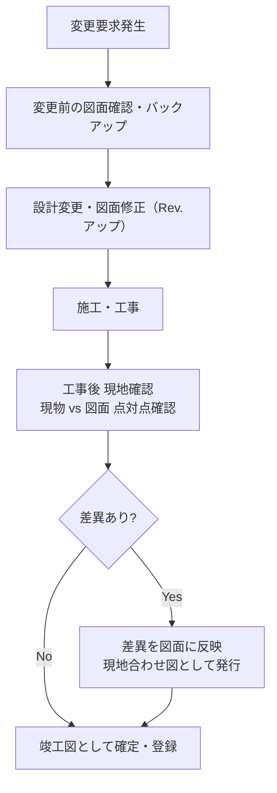

# 図面体系

## 30秒まとめ

電気計装図面には「電気系（結線図・配線図）」と「計装系（P&ID・ループ図）」の 2 系統がある。現物と図面の不一致は変更管理の不徹底から発生する。工事後は必ず「現地合わせ図」として反映し、竣工図を最新状態に保つことが保全の命綱。

---

## 電気図面の種類と用途

| 図面名 | 用途 | 記載内容 |
|-------|------|---------|
| 単線結線図 | 電源系統の全体把握 | 変圧器〜分電盤〜負荷の系統を 1 線で表現 |
| 展開接続図（シーケンス図） | 制御回路の詳細 | 機器ごとの接点・コイルの接続を展開表示 |
| 配線図 | 盤内・機器間の実際の配線 | 端子台番号・電線種・色番号を記載 |
| 配置図（機器配置図） | 盤内・現場の機器レイアウト | 機器の物理的位置・寸法 |
| ケーブルリスト | ケーブル管理 | 起点・終点・種類・長さ・経路を一覧化 |
| 接地系統図 | 接地の系統把握 | 接地極・接地線の系統 |

---

## 計装図面の種類

| 図面名 | 用途 | 記載内容 |
|-------|------|---------|
| P&ID（配管計装図） | プロセスと計装の全体把握 | 配管・バルブ・計装 TAG・制御ループ |
| 計装配線図 | 計装ケーブルの経路と接続 | フィールド機器〜接続箱〜盤の経路 |
| ループ図 | 1 制御ループの詳細接続 | 伝送器〜変換器〜DCS タグの信号の流れ |
| 計装リスト | 計装機器の全リスト | TAG・機器種別・プロセス条件・仕様 |
| HAZ 図（危険場所区分図） | 防爆設計の根拠 | Zone 区分・温度クラスの範囲 |
| 接続箱配線図 | 接続箱内部の詳細 | 端子台番号・ケーブル番号・防爆シール位置 |

---

## 図面管理（版数・改訂履歴）

### 改訂管理の基本ルール

| ルール | 内容 |
|-------|------|
| 版数表記 | Rev.0（初版）→ Rev.1 → Rev.2 と連番管理 |
| 改訂日・改訂者 | 図面右下の表題欄に記載 |
| 改訂理由 | 何を変えたか一行で記載（例：「P-001 電源容量変更 200W→400W」） |
| 廃版図面の取扱い | 廃版スタンプを押し、最新版と明確に区別して保管 |

```
表題欄の改訂履歴例：
Rev.  変更日        変更内容               変更者   確認者
0     2025-04-01   初版作成               田中     山田
1     2025-08-15   P-001 電源容量変更      田中     山田
2     2026-02-20   非常停止回路追加        鈴木     山田
```

---

## 現物と図面の不一致を防ぐ変更管理

!!! danger "図面と現物の不一致は事故の原因"
    停電作業・改造工事の前に図面を確認したが実際の配線と違っていたため作業ミス・感電事故が発生した事例は多い。図面の最新性確保は安全の基本。

### 変更管理フロー



### 「現物合わせ図」作成の徹底

工事完了後は必ず現地を歩き、配線・機器の位置・TAG を図面と照合する。差異があれば図面を現物に合わせて更新する。「だいたい合っている」は不可。

### 図面管理ツールとの連携

- 電子図面管理システム（PDM）で最新版を一元管理
- 現場作業者は「管理版（最新 Rev.）」のみ使用を徹底
- 旧版は物理的に回収するか、廃版スタンプを押す
