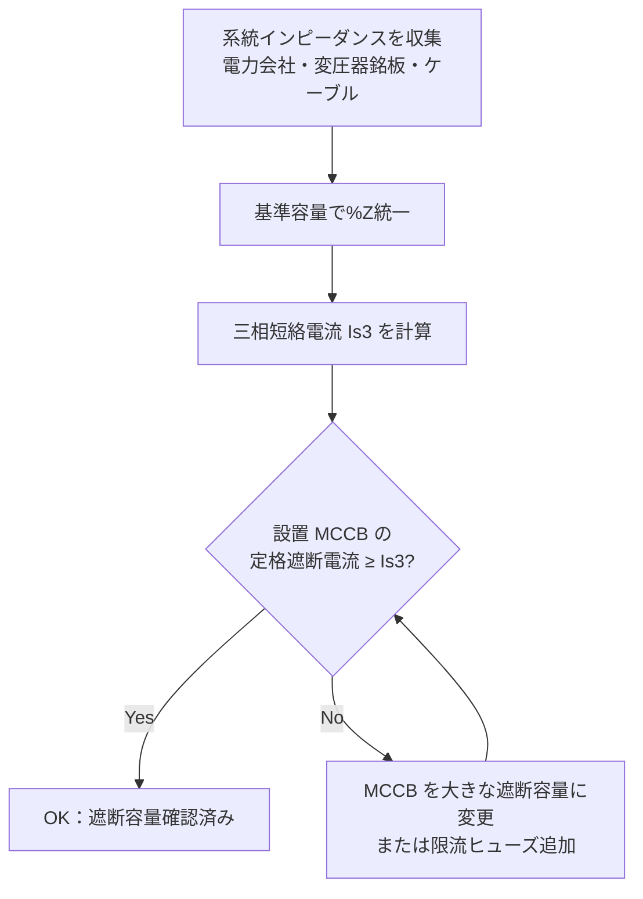

# 短絡電流計算

## 30秒まとめ

短絡電流は「%インピーダンス法」で計算する。計算値が設置する MCCB・VCB の定格遮断電流を超えてはならない。系統インピーダンスは電力会社に問い合わせ、変圧器の %Z はメーカー銘板から取得する。

---

## %インピーダンス法の概要

### 基準容量の設定

```
基準容量 Pb = 任意（計算しやすい値を選ぶ）
例: Pb = 1,000kVA（1MVA）

基準電圧 Vb = 系統電圧
例: Vb = 6.6kV（高圧）または 200V（低圧）

基準電流 Ib = Pb / (√3 × Vb)
```

### 各要素の %Z 換算

```
変圧器 %Z（メーカー銘板値）→ 基準容量に換算:
  %Z換算 = %Z銘板 × (Pb / Pn)
  Pn: 変圧器定格容量 [kVA]

系統（電力会社）%Z（問い合わせ値）→ 基準容量で統一

ケーブル %Z（Z = R + jX [Ω]、Pb: 基準容量 [VA]、Vb: 基準線間電圧 [V]）:
  %Z = Z × Pb / Vb² × 100  [%]
  %R = R × Pb / Vb² × 100  [%]
  %X = X × Pb / Vb² × 100  [%]

  導出: %Z = √3 × Ib × Z / Vb × 100 に Ib = Pb / (√3 × Vb) を代入
        → %Z = Z × Pb / Vb² × 100
  ※ Pb は VA、Vb は V で計算する（kVA・kV を使う場合は単位換算に注意）
```

### 三相短絡電流計算

```
%Z合計 = %Z系統 + %Z変圧器 + %Zケーブル

三相短絡電流 Is3 = Ib × 100 / %Z合計  [A]
または
Is3 = (Pb × 1000) / (√3 × Vb × %Z合計 / 100)  [A]
```

---

## 計算例

### 前提条件

| 項目 | 数値 |
|------|------|
| 変圧器容量 | 1,000kVA |
| 変圧器二次電圧 | 200V |
| 変圧器 %Z（銘板） | 5% |
| 系統インピーダンス（受電点から変圧器一次まで） | 0.5%（1,000kVA 基準） |

### 計算

```
基準容量 Pb = 1,000kVA
基準電流 Ib = 1,000,000 / (√3 × 200) = 2,887 A

変圧器 %Z換算 = 5% × (1,000 / 1,000) = 5.0%
系統 %Z = 0.5%（既に 1,000kVA 基準）

%Z合計（ケーブル無視）= 5.0 + 0.5 = 5.5%

三相短絡電流 Is3 = 2,887 × 100 / 5.5 = 52,490 A ≈ 52.5 kA
```

!!! danger "遮断容量確認"
    変圧器直近（二次側）の MCCB には 52.5kA 以上の遮断容量が必要。一般的な低圧 MCCB は 25〜50kA が多いため、変圧器直近では限流ヒューズまたは高遮断容量 MCCB（100kA 対応）を選定する。

!!! warning "上の 52.5 kA は「系統からの対称分」だけ"
    ここまでの計算値は電源（系統・変圧器）から供給される対称短絡電流です。回転機の多いプラントでは、これに **電動機の短絡電流拠出** を加え、さらに事故直後の **非対称分（直流分）** を考慮した **波高値** で遮断器を選定する必要があります。以下で順に積み増します。

---

## 電動機の短絡電流拠出（motor contribution）

### なぜ電動機が短絡電流を供給するのか

短絡が起きて母線電圧が落ちると、運転中の電動機（Motor）は回転子の慣性と残留磁束によって一時的に **発電機として振る舞い**、短絡点へ向けて電流を送り込みます。プラントは誘導電動機（Induction Motor）が多数接続されているため、この拠出分は無視できません。

- **誘導電動機**: 拠出電流の初期値は **始動電流（拘束回転子電流、Locked Rotor Current）** とほぼ同じ、すなわち **定格電流の約 4〜6 倍**。電源電圧を失うと磁束が減衰するため、拠出は **数サイクル（おおむね 1〜4 サイクル）で急減衰** します。
- **同期電動機**: 自前の界磁（励磁）を持つため拠出が大きく、減衰も誘導機より遅く持続します。誘導機より 1 ランク大きく見積もります。

!!! note "IEC 60909 でのモデル化"
    国際規格 IEC 60909-0 は、電動機を「拘束回転子電流比 I_LR / I_rM（既定値 5）」を持つインピーダンス源としてモデル化し、電動機拠出を系統短絡電流に加算します。実務の概算では **誘導機は定格電流 × 4〜6** の目安で足ります。

### 簡易見積り

```
電動機拠出電流 I_M ≒ (接続電動機の定格電流合計 ΣI_rM) × 倍率 m

m ：誘導機 4〜6（始動電流倍率）、同期機はさらに大きく見積もる
```

### 遮断器・投入責務での扱い

| 責務 | 電動機拠出の扱い |
|------|----------------|
| 投入電流・波高値（making） | 事故直後の第1波であり、**誘導機拠出をフルに算入**（最も過酷） |
| 遮断責務（interrupting / breaking、数サイクル後） | 誘導機拠出はほぼ減衰済みで小さい。ただし **同期機の拠出は残る** ため加算する |

!!! danger "遮断容量・投入容量の確認には電動機拠出を加算"
    遮断器の定格遮断電流・定格投入電流と突き合わせる短絡電流には、系統からの対称分に電動機拠出を **加算した値** を使います。加算を忘れると容量不足の遮断器を選定する恐れがあります。定格遮断電流・投入電流の仕様は [遮断器・断路器](../01-koatsu/breaker.md) を、時限協調への影響は [保護協調](../01-koatsu/coordination.md) を参照してください。

---

## 非対称電流と直流分（DC offset）

短絡電流は、事故が発生した瞬間の電圧位相によって **直流分（DC offset）が重畳** します。電圧ゼロ点付近で事故が起きると直流分が最大となり、事故直後の実効値・波高値は対称分（定常的な交流分）より大きくなります。

- 直流分は指数関数的に減衰します。減衰の時定数は次式で、**X/R が大きいほど直流分の減衰が遅く、非対称が長く残ります**。

```
直流分の減衰時定数 τ = (X / R) / (2π f)   [秒]

f ：系統周波数 [Hz]（50 または 60）
```

- したがって「対称短絡電流」だけでは事故直後の過酷さを表しきれず、遮断器の投入能力の確認には次項の **波高値** を用います。

---

## 波高値（投入電流・making current）

波高値（ピーク電流、i_p）は短絡電流の第1波の瞬時最大値で、遮断器の **投入（making）能力** の確認に使います。IEC 60909 は次式で定義します。

```
i_p = κ × √2 × Ik″

Ik″ ：対称短絡電流の実効値（初期対称短絡電流。ここでは系統分＋電動機拠出）[A]
√2  ：実効値→波高値の換算
κ   ：波高率（peak factor）。系統の R/X（＝ 1 / (X/R)）に依存
```

κ は IEC 60909-0 で次の近似式が与えられ、値域は **1.0（純抵抗）〜2.0（純リアクタンス）** です。

```
κ = 1.02 + 0.98 × e^(−3 R/X) = 1.02 + 0.98 × e^(−3 / (X/R))
```

工場系統の X/R は概ね 4〜15 で、κ は **1.5〜1.9** に収まります。対称実効値からの総倍率 √2·κ は κ ≒ 1.8 で **約 2.55** となり、古くから言う「波高値は対称実効値の約 2.5 倍」に一致します。

| X/R | R/X | κ = 1.02 + 0.98·e^(−3R/X) | 総倍率 √2·κ |
|-----|-----|--------------------------|------------|
| 2 | 0.50 | 1.24 | 1.75 |
| 5 | 0.20 | 1.56 | 2.20 |
| 10 | 0.10 | 1.75 | 2.47 |
| 15 | 0.067 | 1.82 | 2.57 |

!!! tip "κ の選び方"
    系統の X/R が不明なら、変圧器直近（電源インピーダンスが小さくリアクタンス優勢）では X/R が大きくなりがちなので、κ ≒ 1.8〜1.9 と保守的に置きます。端末分岐（ケーブル抵抗で R が効く）では κ は小さくなります。

---

## X/R 比の実務的意味

- **非対称遮断責務**: X/R が大きいほど直流分が残り、遮断器は非対称の大きい電流を切ることになります。カタログの定格遮断電流は前提とする X/R（力率）があるため、系統の X/R がそれより大きい場合はディレーティングを確認します。
- **波高値（投入責務）**: 上式のとおり X/R が大きいほど κ が大きく、投入時のピークが増えます。
- **ヒューズ・限流器の選定**: 限流ヒューズの遮断特性も非対称・X/R の影響を受けます。
- **典型値の目安**: 大容量変圧器の二次側で X/R ≒ 10〜15、末端の分岐回路では R が効いて X/R ≒ 2〜5 程度。

---

## 計算例（電動機拠出・波高値の積み増し）

前掲の計算例（変圧器 1,000 kVA・二次 200 V・系統からの対称短絡電流 **Ik″(系統) = 52.5 kA**）に、電動機拠出と波高値を積み増します。

### 前提の追加

| 項目 | 数値 |
|------|------|
| 母線に接続する誘導電動機の定格電流合計 ΣI_rM | 1,500 A（例） |
| 始動電流倍率 m（誘導機） | 4（保守側の下限で概算） |
| 系統の X/R | 10（変圧器直近の想定） |

### 計算

```
電動機拠出 I_M = 1,500 × 4 = 6,000 A = 6.0 kA

初期対称短絡電流 Ik″ = 系統分 + 電動機拠出
                      = 52.5 + 6.0 = 58.5 kA

波高率 κ = 1.02 + 0.98 × e^(−3 / 10) = 1.02 + 0.98 × 0.741 ≒ 1.75

波高値 i_p = κ × √2 × Ik″
           = 1.75 × 1.414 × 58.5
           ≒ 145 kA（peak）
```

!!! danger "選定への反映"
    - **遮断容量の確認**: 遮断器の定格遮断電流 ≥ Ik″ = 58.5 kA（電動機拠出込みの対称分）。系統分だけの 52.5 kA で選ぶと不足します。
    - **投入容量の確認**: 遮断器の定格投入電流（波高値）≥ i_p ≒ 145 kA（peak）。
    - 定格遮断電流・定格投入電流の仕様は [遮断器・断路器](../01-koatsu/breaker.md)、時限協調への波及は [保護協調](../01-koatsu/coordination.md) を参照。

---

## 系統インピーダンスの取得方法

| 方法 | 内容 |
|------|------|
| 電力会社への問い合わせ | 受電点の最大短絡容量 [kVA] を問い合わせ → %Z に換算 |
| 変圧器銘板 | %Z（インピーダンス電圧比）が記載されている |
| ケーブル抵抗 | ケーブルメーカーカタログの導体抵抗・リアクタンス値 |

```
電力会社から「最大短絡容量 Ps [kVA]」を入手した場合：
%Z系統 = Pb / Ps × 100 [%]（Pb：基準容量）
```

---

## 遮断容量の確認フロー



!!! tip "端末分岐回路はケーブルインピーダンスで電流が減衰"
    変圧器から遠い分岐端末では、ケーブルインピーダンスの影響で短絡電流が変圧器直近より大幅に減少する。端末では小容量 MCCB（5〜10kA）でも十分な場合が多いが、計算で確認する。

## 関連ページ

- [遮断器・断路器](../01-koatsu/breaker.md) — 定格遮断電流・定格投入電流の仕様（電動機拠出込みの Ik″・波高値と突き合わせる）
- [保護協調](../01-koatsu/coordination.md) — 短絡電流を用いた時限協調・TCC 再確認
- [負荷計算](load-calc.md) — 変圧器容量算定（負荷計算の結果が短絡電流計算の前提）
- [電圧降下計算](voltage-drop.md) — ケーブルインピーダンスを活用する電圧降下計算との連携
- [盤設計](panel-design.md) — 計算した遮断容量値をもとにした MCCB 選定・盤設計
- [規格・法規](standards.md) — 遮断容量確認に関連する電気設備技術基準・JIS の参照先
- [定期点検](../05-hozen/periodic-inspection.md) — 設置後の MCCB の点検・動作確認手順
