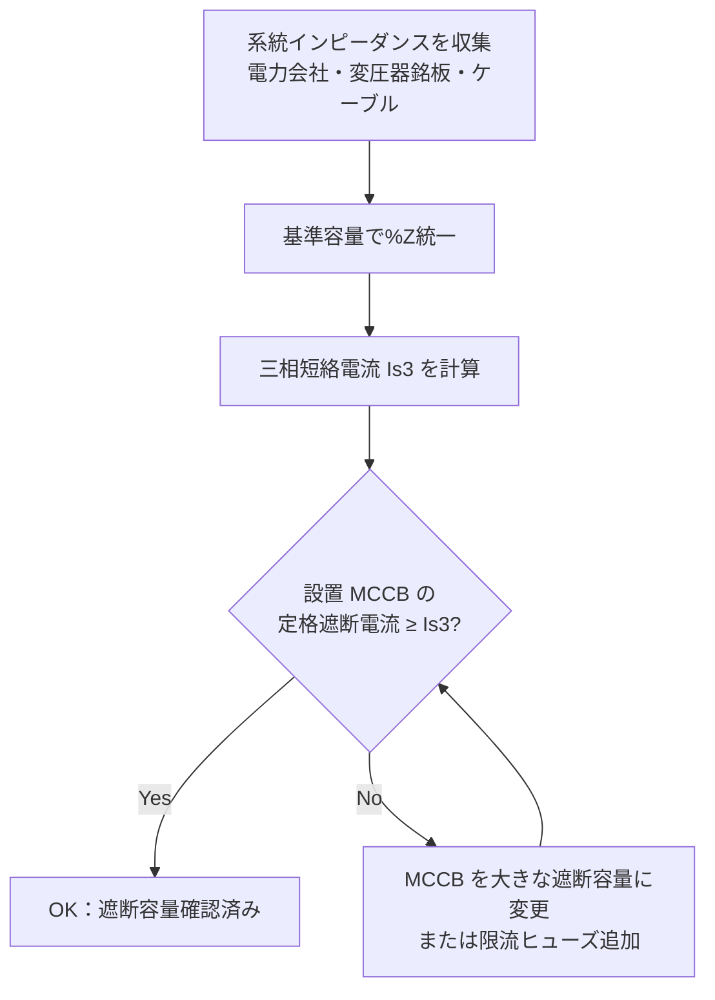

# 短絡電流計算

## 30秒まとめ

短絡電流は「%インピーダンス法」で計算する。計算値が設置する MCCB・VCB の定格遮断電流を超えてはならない。系統インピーダンスは電力会社に問い合わせ、変圧器の %Z はメーカー銘板から取得する。

---

## %インピーダンス法の概要

### 基準容量の設定

```
基準容量 Pb = 任意（計算しやすい値を選ぶ）
例: Pb = 1,000kVA（1MVA）

基準電圧 Vb = 系統電圧
例: Vb = 6.6kV（高圧）または 200V（低圧）

基準電流 Ib = Pb / (√3 × Vb)
```

### 各要素の %Z 換算

```
変圧器 %Z（メーカー銘板値）→ 基準容量に換算:
  %Z換算 = %Z銘板 × (Pb / Pn)
  Pn: 変圧器定格容量 [kVA]

系統（電力会社）%Z（問い合わせ値）→ 基準容量で統一

ケーブル %Z:
  %R = R × Ib² / Pb × 100  [%]
  %X = X × Ib² / Pb × 100  [%]
  （R, X は Ω 値）
```

### 三相短絡電流計算

```
%Z合計 = %Z系統 + %Z変圧器 + %Zケーブル

三相短絡電流 Is3 = Ib × 100 / %Z合計  [A]
または
Is3 = (Pb × 1000) / (√3 × Vb × %Z合計 / 100)  [A]
```

---

## 計算例

### 前提条件

| 項目 | 数値 |
|------|------|
| 変圧器容量 | 1,000kVA |
| 変圧器二次電圧 | 200V |
| 変圧器 %Z（銘板） | 5% |
| 系統インピーダンス（受電点から変圧器一次まで） | 0.5%（1,000kVA 基準） |

### 計算

```
基準容量 Pb = 1,000kVA
基準電流 Ib = 1,000,000 / (√3 × 200) = 2,887 A

変圧器 %Z換算 = 5% × (1,000 / 1,000) = 5.0%
系統 %Z = 0.5%（既に 1,000kVA 基準）

%Z合計（ケーブル無視）= 5.0 + 0.5 = 5.5%

三相短絡電流 Is3 = 2,887 × 100 / 5.5 = 52,490 A ≈ 52.5 kA
```

!!! danger "遮断容量確認"
    変圧器直近（二次側）の MCCB には 52.5kA 以上の遮断容量が必要。一般的な低圧 MCCB は 25〜50kA が多いため、変圧器直近では限流ヒューズまたは高遮断容量 MCCB（100kA 対応）を選定する。

---

## 系統インピーダンスの取得方法

| 方法 | 内容 |
|------|------|
| 電力会社への問い合わせ | 受電点の最大短絡容量 [kVA] を問い合わせ → %Z に換算 |
| 変圧器銘板 | %Z（インピーダンス電圧比）が記載されている |
| ケーブル抵抗 | ケーブルメーカーカタログの導体抵抗・リアクタンス値 |

```
電力会社から「最大短絡容量 Ps [kVA]」を入手した場合：
%Z系統 = Pb / Ps × 100 [%]（Pb：基準容量）
```

---

## 遮断容量の確認フロー



!!! tip "端末分岐回路はケーブルインピーダンスで電流が減衰"
    変圧器から遠い分岐端末では、ケーブルインピーダンスの影響で短絡電流が変圧器直近より大幅に減少する。端末では小容量 MCCB（5〜10kA）でも十分な場合が多いが、計算で確認する。

## 関連ページ

- [負荷計算](load-calc.md) — 変圧器容量算定（負荷計算の結果が短絡電流計算の前提）
- [電圧降下計算](voltage-drop.md) — ケーブルインピーダンスを活用する電圧降下計算との連携
- [盤設計](panel-design.md) — 計算した遮断容量値をもとにした MCCB 選定・盤設計
- [規格・法規](standards.md) — 遮断容量確認に関連する電気設備技術基準・JIS の参照先
- [定期点検](../05-hozen/periodic-inspection.md) — 設置後の MCCB の点検・動作確認手順
