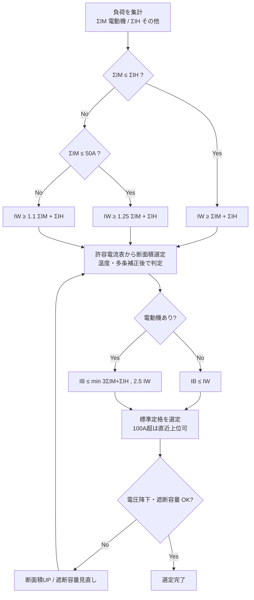

# 幹線サイズと過電流遮断器の定格選定

## 30秒まとめ

電動機を含む低圧幹線は「①幹線の許容電流（太さ）→ ②過電流遮断器の定格電流」の順に決める。電動機は始動電流が大きいため、電熱など一般負荷とは別扱いにして割り増す。幹線太さは電動機合計 ΣIM が一般負荷合計 ΣIH を超えるときに 1.25 倍（ΣIM ≤ 50 A）または 1.1 倍（ΣIM > 50 A）する。遮断器定格は「3 ΣIM + ΣIH」と「幹線許容電流の 2.5 倍」の**小さい方以下**で標準定格を選ぶ（原則は直近下位。ただし幹線許容電流が 100 A を超え算定値が標準定格に無いときは直近上位でよい＝第148条第1項第五号ハ）。

---

## 記号の定義

| 記号 | 意味 | 備考 |
|------|------|------|
| ΣI_M | 電動機など**始動電流の大きい負荷**の定格電流の合計 [A] | インバータ・ソフトスタータ付きは実質的に始動電流が小さく、扱いは要確認 |
| ΣI_H | 電熱器・照明など**始動電流の大きくない負荷**の定格電流の合計 [A] | いわゆる「その他の負荷」 |
| I_W | 幹線（電線）の**許容電流** [A] | 温度・多条補正**後**の値で判定する |
| I_B | 幹線を保護する**過電流遮断器の定格電流** [A] | MCCB の AT（アンペアトリップ） |

!!! info "なぜ電動機だけ別扱いか"
    電動機は始動時に定格の 5〜8 倍の電流が数秒流れる。この始動電流で電線が過熱せず、かつ遮断器が誤動作しないよう、電動機分だけ許容電流・遮断器定格に裕度を持たせるのが本規定の趣旨。

---

## ① 幹線の許容電流（太さ）の求めかた

電動機の合計 ΣI_M と、その他負荷の合計 ΣI_H の大小で場合分けする（内線規程「低圧幹線」・電技解釈第148条）。

| 条件 | 必要な幹線許容電流 I_W |
|------|----------------------|
| ΣI_M ≤ ΣI_H | I_W ≥ ΣI_M + ΣI_H |
| ΣI_M > ΣI_H かつ ΣI_M ≤ 50 A | I_W ≥ 1.25 × ΣI_M + ΣI_H |
| ΣI_M > ΣI_H かつ ΣI_M > 50 A | I_W ≥ 1.1 × ΣI_M + ΣI_H |

- 電動機がまったく無い幹線（ΣI_M = 0）は、単純に **I_W ≥ ΣI_H**（全負荷電流以上）でよい。
- 求めた I_W を満たす断面積を [低圧ケーブル](../02-teiatsu/lv-cable.md) の許容電流表から選ぶ。**表の値は 40 ℃ 基準**なので、周囲温度・多条敷設の補正を掛けた後の許容電流で判定する。

!!! warning "割り増しは「電動機分」だけ"
    1.25 / 1.1 を掛けるのは ΣI_M だけ。ΣI_H には掛けない。「合計電流を一律 1.25 倍」ではない点に注意（電験・実務で頻出の取り違え）。

---

## ② 過電流遮断器の定格電流の求めかた

幹線の太さ I_W が決まったら、その幹線を保護する過電流遮断器（MCCB）の定格電流 I_B を決める。

### 原則（電動機が無い幹線）

過電流遮断器の定格電流は電線の許容電流以下（第148条第1項第五号 本文）。

```text
I_B ≤ I_W
```

これは「遮断器が動作する前に電線が過熱してはならない」という電線保護の大原則。

### 電動機を含む幹線（特例）

電動機の始動電流で遮断器が誤動作しないよう、定格を I_W より大きく取れる特例がある（第148条第1項第五号 イ・ロ）。次の 2 つを計算し、**小さい方の値以下**とする。

```text
I_B ≤ 3 × ΣI_M + ΣI_H     … (a) 始動電流を見込んだ上限（イ）
I_B ≤ 2.5 × I_W           … (b) 電線保護の上限（ロ）
```

```text
算定値 = min( 3 ΣI_M + ΣI_H , 2.5 I_W )
```

- **原則**：算定値**以下**で最大の標準定格（例：50, 60, 75, 100, 125, 150, 175, 200, 225, 250 A …）を選ぶ（＝直近下位）。
- **例外（第148条第1項第五号ハ）**：幹線許容電流 I_W が **100 A を超える**場合で、算定値が標準定格に当てはまらないときは、算定値の**直近上位**の標準定格としてよい（算定値を上回る定格を選べる）。大容量幹線を1段小さい定格に落とさないための規定。
- (b) の 2.5 倍が効いて I_B が I_W を上回ることがあるが、これは始動電流を見込んだ規定上の許容範囲。**定常運転では電線の許容電流を超えない**ことが前提。

!!! info "電験学習者向け"
    法規では AF/AT ではなく「過電流遮断器の定格電流と電線の許容電流の関係」（電技解釈第148条・第149条）として出題される。実務の MCCB 選定はこの規定の運用そのもの。→ [低圧配電](../02-teiatsu/distribution.md)（AF/AT の実務）も参照。

---

## 計算例

**前提**：三相 200 V 幹線。電動機 3.7 kW（定格 15 A）× 2 台、11 kW（定格 40 A）× 1 台、電熱器 定格 20 A、CV 3 芯・ケーブルラック敷設・周囲温度 40 ℃（補正なし）。

```text
Step 1: 合計電流を集計
  ΣI_M = 15 + 15 + 40 = 70 A   （電動機分）
  ΣI_H = 20 A                  （電熱器分）

Step 2: 幹線の許容電流（太さ）
  ΣI_M (70) > ΣI_H (20) かつ ΣI_M > 50 A → 1.1 倍を適用
  I_W ≥ 1.1 × 70 + 20 = 97 A
  → CV 3芯 ケーブルラックで 97 A 以上 = 38 mm²（許容 132 A）を選定
     ※ lv-cable.md 許容電流表より。22 mm²（98 A）は補正代を考え不採用

Step 3: 過電流遮断器の定格電流
  (a) 3 × ΣI_M + ΣI_H = 3 × 70 + 20 = 230 A
  (b) 2.5 × I_W      = 2.5 × 132 = 330 A   （実配線 38 mm² の許容電流で計算）
  算定値 = min(230, 330) = 230 A
  I_W = 132 A > 100 A で 230 A は標準定格に無い
    → 第五号ハにより直近上位の 250 A（250AF/250AT）を選定
  （幹線許容電流が 100 A 以下の系統なら、直近下位 225 AT を選定する）
```

!!! tip "(b) の I_W は実際に選んだ電線の許容電流"
    (b) は「必要許容電流 97 A」ではなく、実際に採用した電線（38 mm² = 132 A）の許容電流で計算する。太い電線を選ぶほど遮断器を大きくできる、という関係になる。

---

## 選定フロー



---

## つまずきやすいポイント

| 誤り | 正しい理解 |
|------|-----------|
| 合計電流を一律 1.25／1.1 倍する | 割り増すのは**電動機分 ΣI_M だけ**。ΣI_H には掛けない |
| 遮断器定格を大きい方の値で選ぶ | (a)(b) の**小さい方以下**。安全側は小さい値 |
| 算定値をそのまま定格にする | 原則は算定値**以下**の標準定格（直近下位）。ただし I_W > 100 A で算定値が標準定格に無ければ**直近上位**でよい（第五号ハ） |
| 補正前の許容電流で判定 | 周囲温度・多条補正**後**の許容電流 I_W で判定 |
| 電動機幹線で IB ≤ IW に固執 | 電動機ありは特例で IB > IW も可（最大 2.5 IW） |

!!! danger "遮断容量（kA）は別問題"
    ここで求めるのは定格電流（AT）。系統短絡電流に対する**遮断容量 [kA]** は別途 [短絡電流計算](fault-current.md) で確認する。定格電流が正しくても遮断容量が不足すると短絡時に遮断器が破損する。

---

## 根拠と適用上の注意

- 法的根拠：**電気設備技術基準の解釈 第148条（低圧幹線の施設）**、および分岐回路は第149条。実務の標準は **内線規程（JEAC 8001）「低圧幹線」の規定**。
  - 幹線の許容電流＝第148条第1項第二号イ・ロ（1.25 / 1.1・50 A 境界）、需要率・力率が明らかなら第三号で修正可。
  - 過電流遮断器の定格＝同第五号 本文（I_B ≤ I_W）・イ（3 ΣI_M + ΣI_H）・ロ（2.5 I_W 超過時は 2.5 I_W）・ハ（I_W > 100 A で標準定格に無いとき直近上位）。
- 上記の条文表現は **電気設備技術基準の解釈 令和7年11月版（2026-07-18 逐語照合）** で確認済み。ただし改訂で番号・細部が変わり得るため、適用時は最新版の該当条文を必ず確認すること。
- 許容電流の実数値は電線種別・敷設方法・補正係数で変わる。数値は [低圧ケーブル](../02-teiatsu/lv-cable.md) のメーカーカタログ／規格値を正とする。

---

## 関連ページ

- [分岐回路の施設](branch-circuit-sizing.md) — 負荷側（分岐）の過電流遮断器の位置（3m/8m）・電線太さ。本ページと対
- [負荷計算](load-calc.md) — 需要率・不等率から幹線の需要電流を求める前段
- [低圧ケーブル](../02-teiatsu/lv-cable.md) — 許容電流表・補正係数・断面積選定
- [電圧降下計算](voltage-drop.md) — 太さ選定のもう一つの制約（幹線 2% 以内）
- [短絡電流計算](fault-current.md) — 過電流遮断器の遮断容量 [kA] の確認
- [低圧配電](../02-teiatsu/distribution.md) — MCCB の AF/AT・保護協調・ELCB 感度
- [盤設計](panel-design.md) — 選定結果を反映する主幹・分岐の盤設計
