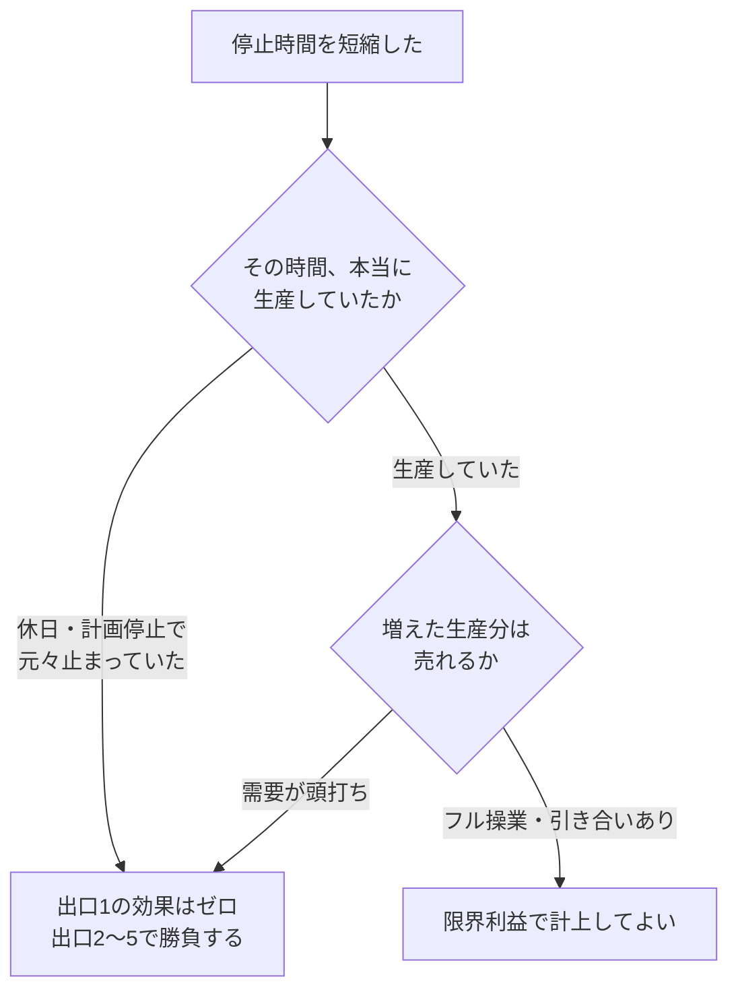

# 改善効果の金額化

## 30秒まとめ

「工数が 30 時間減りました」では投資判断に使えません。効果は **確定（現金支出が実際に減る）／見込み（データ未検証）／参考（社内工数）** の 3 つに分け、混ぜずに出します。電気計装の改善効果は、生産停止時間・電力量・契約電力・外注工事費・部品と予備品・社内工数・保安リスクの **7 つの出口** のどれかに必ず落ちます。単価は自分で置かず経理・用役担当と合意した値を使い、「誰が・いつ・どのデータで確認するか」まで書いて初めて稟議で使える数字になります。

---

## なぜ「工数が減った」では通らないのか

工場長・経理が見ているのは、**P/L のどの科目がいくら動くか**です。現場の改善報告が通らない原因はほぼこの 3 つに絞られます。

| よくある報告 | 何が問題か |
|------------|-----------|
| 「年間 200 時間の工数削減」 | 人員を減らさない限り給与支払額は変わらない。現金は 1 円も減らない |
| 「停止時間を 22 時間短縮」 | その時間に生産していたのか、作った分が売れるのかが示されていない |
| 「年間 500 万円の効果」（内訳なし） | 確実な分と希望的観測が混ざっている。翌年 P/L が動かないと次から信用されない |

!!! warning "一度崩されると戻らない"
    効果を大きく見せるために社内工数を金額換算して合計に足すと、その場は通っても翌年の実績照合で必ず露見します。**金額の信用は一度失うと回復しません。** 小さくても検証できる数字を出すほうが、長期的には多くの案件が通ります。

---

## 効果の3分類

提案書では必ずこの 3 つを**別々の行**に書き、①だけを合計します。

| 分類 | 中身 | 合計への扱い | 検証手段 |
|------|------|------------|---------|
| **① 確定** | 実際に現金支出が減る。外注工事費・電力料金・部品費・休日出勤手当 | **合計に算入する** | 請求書・検針値・給与データ |
| **② 見込み** | 起きる公算は高いが実績データによる裏づけがまだ無い | **合計と分けて表示**。検証後に①へ振り替える | 検証方法・時期・担当を明記する |
| **③ 参考** | 社内工数。人員が減らない限り現金は減らない | **金額を合計に混ぜない**。人時（h）で示す | 勤怠データ |

③は「削減した人時を何に振り向けるか」をセットで書くと通ります。たとえば「年 144 人時を予兆保全のデータ整備に充当する」と書けば、価値が伝わったうえで金額の水増しにもなりません。

---

## 唯一の計算式

テーマが何であれ、効果額はこの 1 本で計算できます。

```text
年間効果額 ＝ （従来値 － 改善後値） × 対象数量 × 単価 × 年間実施回数
```

テーマごとに違うのは「何を従来値・改善後値に置くか」「どの単価を掛けるか」だけです。

!!! tip "コスト増も同じ式で書ける"
    改善に伴って増える費用は **従来値 = 0／改善後値 = 増える量** と置きます。差が自動的にマイナスになり、効果から差し引かれます。コスト増専用の欄を作る必要はありません。

---

## 電気計装の改善が効く7つの出口

自分のテーマがどの出口に落ちるかを最初に決めます。ここが決まれば、掛ける単価も自動的に決まります。

| 出口 | 従来値・改善後値に置くもの | 掛ける単価 | P/L・B/S 科目 | 注意点 |
|------|--------------------------|-----------|--------------|-------|
| **1. 生産停止時間** | 停止時間（h） | 限界利益（円/h） | 売上高 | ★停止中に生産していたか、増産分が売れるかを必ず確認する（次節） |
| **2. 電力量** | 消費電力量（kWh/年） | 電力従量単価（円/kWh） | 用役費 | インバータ化・高効率機器更新はここ |
| **3. 契約電力** | 契約電力（kW） | 基本料金単価（円/kW・月）× 12 | 用役費 | **年間最大デマンドを削らないと 1 円も減らない** |
| **4. 外注工事費** | 延べ人日・台日・足場面積 | 工事単価・レンタル単価 | 修繕費・外注加工費 | **最も確実に検証できる**。請求書で追える |
| **5. 部品・予備品** | 年間交換個数・在庫金額 | 部品単価・在庫保有コスト率 | 修繕費・棚卸資産 | 在庫金額そのものは利益ではない（後述） |
| **6. 社内工数** | 作業時間（h） | 金額換算しない | P/L に出ない | 人時で語る。分類は「参考」 |
| **7. 保安・災害リスク** | 重大災害・法令違反の件数 | 金額化しない | P/L に出ない | 件数とリスクレベルで語る |

!!! danger "7 を金額に換算しない"
    保安効果を「災害 1 件あたり損失 ◯◯ 万円 × 発生確率」で金額化すると、他の投資と同じ土俵で比較される対象になります。**安全は比較対象ではなく前提**として、件数で示してください。

---

## 単価は自分で決めない

7 つの出口に掛ける単価は、必ず経理・用役担当から取得します。自分で置いた単価は会議で必ず崩されます。

| 単価 | 取得先 | 備考 |
|------|-------|------|
| 限界利益（円/h、円/t） | 経理 | 売上高 − 変動費。**粗利や売価で代用しない** |
| 電力従量単価（円/kWh） | 電力会社請求書 ÷ 使用量 | 燃料費調整額・再エネ賦課金の扱いを経理と揃える |
| 基本料金単価（円/kW・月） | 電力需給契約書 | 力率割引の条件もここで確認する |
| 社内 時間当たり労務費（円/h） | 経理の部門別時間当たり労務費 | 賃金 ＋ 法定福利 ＋ 部門間接費 |
| 時間外・休日出勤手当（円/h） | 給与規程 | **実際に支払いが減る分**。分類は「確定」 |
| 工事単価（円/人日） | 年間単価契約書 | 職種別（機械・電気計装）に分ける |
| 在庫保有コスト率（%/年） | 経理 | 金利 ＋ 保管費 ＋ 陳腐化。一般に 15〜25 % |

!!! tip "一度合意すれば全テーマで使い回せる"
    この表を一枚作って経理の承認者名と合意日を残すと、以後の改善提案から単価論争が消えます。**最初にやるべきはテーマの計算ではなくこの表の作成**です。

### 限界利益（contribution margin）とは

売上高から**変動費**（原料費・用役費・外注加工費など、生産量に比例して増減する費用）を差し引いた額です。労務費・減価償却費のような固定費は差し引きません。

生産を 1 時間止めたときに失われるのは売上高そのものではなく、この限界利益です。経理に「この製品の限界利益は 1 時間あたりいくらか」と聞けば出てきます。

---

## 「作れば売れるか」の判定

出口 1（生産停止時間）の効果は、**この判定ひとつでゼロになります**。改善提案が経理に崩される最大の原因がここです。



需要が頭打ちなら、稼働時間を増やしても在庫が増えるだけで利益は増えません。その場合は出口 2〜5（電力量・契約電力・外注工事費・部品）に改善の力を振り向けるのが正解です。**どのテーマに人を張るべきかを、この判定が教えてくれます。**

---

## 計算例：全停電工事の1日化

受変電設備の年次点検に伴う全停電工事を、従来の 2 日間から 1 日に短縮する場合です。

!!! note "数値はすべて仮置きの例"
    以下の単価・数量は計算手順を示すための例です。実際の試算では自社の単価契約書・作業日報・勤怠データの実額に置き換えてください。

### ① 確定効果（1 回あたり）

| 項目 | 従来 | 改善後 | 差 | 単価 | 効果額 |
|------|-----|-------|---|------|-------|
| 電気工事（延べ人日） | 24 人日 | 16 人日 | 8 人日 | 45,000円/人日 | 360,000円 |
| 高所作業車 | 4 台日 | 2 台日 | 2 台日 | 35,000円/台日 | 70,000円 |
| 警備員 | 8 人日 | 4 人日 | 4 人日 | 22,000円/人日 | 88,000円 |
| 仮設発電機（賃料＋燃料） | 2 日 | 1 日 | 1 日 | 110,000円/日 | 110,000円 |
| 休日出勤手当（実支払） | 192 h | 120 h | 72 h | 3,000円/h | 216,000円 |
| **小計** | | | | | **844,000円** |

延べ人日が減るのは、事前のプレハブ加工と工程の並列化で、2 日案にあった試験待ち・2 日目の再養生と再 KY の時間が消えるためです。

### ② コスト増（1 回あたり）

| 項目 | 従来 | 改善後 | 差 | 単価 | 効果額 |
|------|-----|-------|---|------|-------|
| 事前プレハブ加工（外注） | 0 | 1 式 | −1 式 | 120,000円/式 | −120,000円 |
| 仮設投光器・照明 | 0 | 1 式 | −1 式 | 40,000円/式 | −40,000円 |
| 追加安全監視員 | 0 | 2 人日 | −2 人日 | 22,000円/人日 | −44,000円 |
| **小計** | | | | | **−204,000円** |

### ③ 判定

| 項目 | 金額 |
|------|------|
| 正味 確定効果（1 回あたり） | 844,000 − 204,000 = **640,000円/回** |
| 年間実施回数 | 2 回/年 |
| **年間 正味確定効果** | **1,280,000円/年** |
| 初期投資（治具・作業手順の標準化） | 800,000円 |
| **単純回収期間** | 800,000 ÷ 1,280,000 × 12 = **約 7.5 ヶ月** |

参考（合計に含めない）: 社内立会工数 72 h/回 × 2 回 = **144 人時/年**。予兆保全のデータ整備に充当します。

!!! warning "この例で停止時間の効果を計上してはいけない"
    全停電工事は休日に実施するため、**生産は元々停止しています**。停止時間 48 h → 26 h を限界利益 120,000円/h で換算して「年 528 万円の効果」と書くと、経理に一撃で崩されます。前節の判定フローの左端（元々止まっていた）に該当するケースです。

---

## 部品・資材のベンダー変更は単価差で語らない

出口 5 に該当しますが、**購入単価の差だけで比較すると判断を誤ります**。計器・伝送器・遮断器・ケーブルなどのベンダー変更は、年間の **TCO（Total Cost of Ownership, 総保有コスト）** で比較してください。

| 比較する費目 | 現行 | 新規 | 見落としやすい点 |
|------------|-----|-----|----------------|
| 部品購入費（年間交換個数 × 単価） | | | **寿命の差**が単価差より大きいことが多い |
| 交換工数（外注人日） | | | 取付性が変われば工数も変わる |
| 予備品の在庫保有コスト | | | 納期が短くなれば安全在庫を減らせる |
| 物流・荷役費 | | | 海外調達では**増える**ことがある |
| 技術サポート・立会費 | | | 導入初年度は**増える**のが普通 |
| 故障・不具合による停止 | | | 安い部品が早く壊れれば TCO は悪化する |

これに加えて、**切替コスト（一時費用）** を必ず計上します。実機トライアル・材質や仕様の同等性評価・図面と保全基準の改訂・作業要領書の改訂と教育、そして**移行期に使い切れずに残る現行在庫の評価損**です。最後の項目が最も忘れられ、最も指摘されます。

!!! tip "「変更しない」も数字で言える"
    TCO で比較して現行ベンダーのほうが安いと分かったら、**「変更しない」と数字で報告する**のが正しい技術判断です。このシートの価値は採用を後押しすることではなく、判断の根拠を残すことにあります。

技術的な同等性の確認（設計条件への適合・防爆認証の区分一致・SIL・材質証明・既存図面との整合）と供給継続性の評価は [メーカー選定](vendor-selection.md) が正典です。効果額の計算だけを本ページで扱います。

---

## 検証の約束

**これが無い提案は一度きりで終わります。** 提案書の最後に必ず付けてください。

| 確認すること | 担当 | 時期 | 使うデータ |
|------------|-----|------|----------|
| 外注工事費の実減額 | 保全・電気担当 | 工事翌月 | 請求書と前回実績の差額 |
| 休日出勤時間の実減少 | 保全・電気担当 | 工事翌月 | 勤怠システム出力 |
| 電力量・契約電力の実減少 | 用役担当 | 実施後 3〜12 ヶ月 | 検針値・デマンド記録 |
| 安全面の影響 | 安全衛生担当 | 実施当日〜翌週 | ヒヤリハット報告・復電後の不具合記録 |

実績が計画の 80 % を割ったら理由を書きます。理由が「前提の単価が違った」であれば単価表を直します。これを繰り返すと算定精度が上がり、提案の通りやすさが変わってきます。

---

## よくある失敗

| 失敗 | なぜ崩れるか | 正しくは |
|------|------------|---------|
| 社内工数を金額換算して合計に足す | 人員が減らないので現金が減らない | 人時で示し、再投資先を書く |
| 停止時間を限界利益で換算する（休日工事） | 元々生産していない | 出口 1 はゼロ。出口 4・5 で勝負する |
| 増産効果を計上する（需要が頭打ち） | 作っても在庫が増えるだけ | 販売部門に需要を確認してから計上する |
| 売価や粗利で計算する | 変動費が差し引かれていない | 限界利益を使う |
| 電力の基本料金を「平均使用量」で計算する | 基本料金は年間最大デマンドで決まる | ピークを削った分だけを計上する |
| 在庫削減額をそのまま効果にする | 在庫金額は利益ではない | 保有コスト率を掛ける。廃棄損の回避は別途 |
| 効果だけを並べてコスト増を書かない | 増員・事前準備・安全対策の費用が必ずある | 自分から開示し「差引でいくら」を示す |
| 3 年分を合計して大きく見せる | 初年度の検証ができない | 年間効果額で示し、累計は別行にする |

---

## 根拠

### 法令に基づく事項

**本ページに法令に基づく記述はありません。** 効果の分類・計算式・単価の取り扱いはいずれも原価計算と投資評価の実務手法であり、法令の規定ではありません。

改善の実施に伴う法令手続き（電気事業法の工事計画届出、高圧ガス保安法の変更許可・届出）は [設備投資フロー](investment-flow.md)・[工事の法令手続きガイド](../09-hoantokei/koji-tetsuzuki.md)・[法定業務一覧](../09-hoantokei/legal-duties.md) が正典です。**効果額が大きいことは、手続きを省略してよい理由になりません。**

### 実務慣行・社内目安（法定値ではない）

- 効果の 3 分類、7 つの出口、計算式は、原価計算・投資評価の一般的な整理です。**自社の稟議規程・原価計算基準が優先します。**
- 計算例に用いた単価・数量（45,000円/人日、3,000円/h、120,000円/h ほか）と初期投資額は、計算手順を示すための**仮置きの例**です。自社の実額に置き換えてください。
- 在庫保有コスト率「15〜25 %」は一般的な目安であり、自社の値は経理が持ちます。
- 実績照合のしきい値「計画の 80 %」は運用上の目安です。
- 単純回収期間は**時間価値を考慮しない簡便法**です。投資額が大きい案件は、自社規程が定める評価方法（正味現在価値・内部収益率など）に従ってください。

### 限界の明示

- **限界利益の定義は自社の原価計算方式に依存します。** 全部原価計算と直接原価計算では変動費の範囲が変わります。必ず経理が使っている定義に合わせてください。
- **効果の帰属（発注者側の設備担当・保全担当・調達担当のどこの実績とするか）は社内ルール次第**です。ベンダー変更のように調達側と重なるテーマは、提案前に帰属を合意しておかないと、後から効果の取り合いになります。
- 本ページは方法論のみを扱い、**自工場固有の単価・実績値は含みません**。
- 7 つの出口は電気計装の改善テーマを想定した整理です。プロセス側の収率・原料原単位の改善は対象外で、製造・技術部門の原単位管理の枠組みで扱ってください。

照合日: 2026-09-12（本ページは repo 内の関連ページとの整合のみを確認。外部の一次資料に照合すべき法令記述を持ちません）。

---

## 関連ページ

- [設備投資フロー](investment-flow.md) — 稟議・法定手続きを含む投資の全体フロー（効果額はその稟議資料の一部）
- [メーカー選定](vendor-selection.md) — ベンダー変更の技術評価・同等性確認・供給継続性（技術面の正典）
- [改造・更新設計の注意点](renovation-design.md) — 更新か修繕かの判断材料
- [力率改善ROI](../08-energy/power-factor-roi.md) — 出口 3 の具体例（力率割引制度に基づく投資回収計算）
- [インバータ省エネ計算](../08-energy/vfd-energy.md) — 出口 2 の具体例（消費電力量の削減計算）
- [デマンド管理](../08-energy/demand-management.md) — 出口 3 の前提となる契約電力の決まり方
- [停電作業](../05-hozen/outage-work.md) — 計算例に挙げた全停電工事の作業手順
- [保全体系](../05-hozen/maintenance-system.md) — 保全方式の変更（TBM/CBM）を検討する際の前提
- [予備品管理](../05-hozen/spare-parts.md) — 出口 5 の在庫削減で前提となる予備品の考え方
