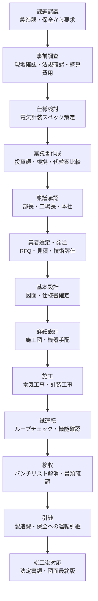

# 設備投資フロー

## 30秒まとめ

化学プラントの設備投資は「課題認識 → 稟議 → 設計 → 施工 → 試運転 → 引継」のフローで進む。電気計装エンジニアは仕様検討から試運転まで全フェーズに関与する。高圧ガス保安法の設備変更届が必要なケースを早期に確認することが工程遅延防止の鍵。

---

## 全体フロー

---

## 各フェーズでの電気計装エンジニアの役割

| フェーズ | 主な役割 | 成果物 |
|---------|---------|-------|
| 事前調査 | 法規確認（高圧ガス・電気事業法）、既設設備確認 | 事前調査メモ |
| 仕様検討 | 電気容量・計装仕様の策定、防爆要否判断 | 電気・計装仕様書ドラフト |
| 稟議 | 電気計装コスト積算、技術的根拠の説明資料 | 稟議書の電気計装パート |
| 発注 | RFQ 作成、技術評価（Q&A 対応） | 見積技術比較表 |
| 設計 | 図面レビュー、メーカー図面承認、施工仕様確認 | 図面承認記録 |
| 施工 | 施工立会い、材料確認、施工品質確認 | 施工チェックシート |
| 試運転 | ループチェック、インターロック確認、DCS タグ確認 | 試運転チェックリスト |
| 検収 | パンチリスト作成・解消確認、書類チェック | 検収書類一式 |
| 引継 | 運転員への設備説明、保全への点検ポイント説明 | 引継書・取扱説明書 |

---

## 稟議資料に必要な内容

| 項目 | 記載内容 |
|------|---------|
| 投資額 | 工事費・機器費・設計費・予備費の内訳（±20% 精度が多い） |
| 投資根拠 | なぜ今やるのか（安全・法規・生産継続リスク） |
| 代替案比較 | 最低 2〜3 案の比較（修繕・更新・設計変更等） |
| リスク評価 | 実施しない場合のリスク（故障・停止・法令違反） |
| 回収期間 | 生産性向上・省エネ効果がある場合のみ |
| 工程表 | 設計・製作・施工・試運転の大日程 |

---

## 高圧ガス保安法の設備変更届出が必要なケース

!!! warning "届出忘れは法令違反"
    高圧ガス保安法の適用設備を変更する場合は事前届出が必要。無届変更は行政処分の対象。

| 変更内容 | 届出要否 | 種類 |
|---------|---------|------|
| 高圧ガス設備の電気系統変更（制御ロジック変更） | 要確認（設備に応じる） | 軽微変更届または変更工事許可申請 |
| 安全装置（安全弁・緊急遮断弁）の電気制御変更 | 届出必要 | 変更工事許可申請 |
| 計器（圧力計・温度計）の変更（同等品交換） | 軽微変更届で足りる場合多 | 軽微変更届 |
| 処理能力の変更を伴う機械・設備の増設 | 届出必要 | 変更工事許可申請 |

---

## 竣工後の法定書類

| 書類 | 提出先 | タイミング |
|------|-------|---------|
| 設備変更届（高圧ガス） | 都道府県知事（事前） | 工事着手前 |
| 完成検査申請・合格書 | 経済産業省・都道府県 | 試運転前 |
| 電気工事完了届 | 電力会社（自家用電気工作物の場合は社内） | 工事完了後 |
| 竣工図面（電気・計装） | 社内資産管理・設備管理システム | 検収後 1 ヶ月以内 |

---

## 施工管理での安全管理

| 活動 | 内容 | 頻度 |
|------|------|------|
| TBT（ツールボックストーク） | 作業前の危険予知確認（工事業者主導） | 毎日朝 |
| KY（危険予知）活動 | 作業者全員で危険点を列挙し対策確認 | 作業前 |
| 停電確認 | 作業前に検電・短絡接地を確認 | 停電作業前 |
| 立入制限 | 危険区域にバリケード・看板設置 | 工事中常時 |
| 作業許可証（PTW） | 危険作業は許可証発行後に着手 | 危険作業ごと |
