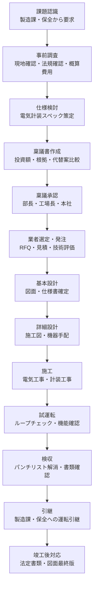

# 設備投資フロー

## 30秒まとめ

化学プラントの設備投資は「課題認識 → 稟議 → 設計 → 施工 → 試運転 → 引継」のフローで進む。電気計装エンジニアは仕様検討から試運転まで全フェーズに関与する。高圧ガス保安法の変更許可・届出（第一種製造者は許可）と電気事業法の工事計画届出が必要なケースを早期に確認することが工程遅延防止の鍵。

---

## 全体フロー

```mermaid
flowchart TD
    A[課題認識\n製造課・保全から要求] --> B[事前調査\n現地確認・法規確認・概算費用]
    B --> C[仕様検討\n電気計装スペック策定]
    C --> D[稟議書作成\n投資額・根拠・代替案比較]
    D --> E[稟議承認\n部長・工場長・本社]
    E --> F[業者選定・発注\nRFQ・見積・技術評価]
    F --> G[基本設計\n図面・仕様書確定]
    G --> H[詳細設計\n施工図・機器手配]
    H --> I[施工\n電気工事・計装工事]
    I --> J[試運転\nループチェック・機能確認]
    J --> K[検収\nパンチリスト解消・書類確認]
    K --> L[引継\n製造課・保全への運転引継]
    L --> M[竣工後対応\n法定書類・図面最終版]
```

---

## 各フェーズでの電気計装エンジニアの役割

| フェーズ | 主な役割 | 成果物 |
|---------|---------|-------|
| 事前調査 | 法規確認（高圧ガス・電気事業法）、既設設備確認 | 事前調査メモ |
| 仕様検討 | 電気容量・計装仕様の策定、防爆要否判断 | 電気・計装仕様書ドラフト |
| 稟議 | 電気計装コスト積算、技術的根拠の説明資料 | 稟議書の電気計装パート |
| 発注 | RFQ 作成、技術評価（Q&A 対応） | 見積技術比較表 |
| 設計 | 図面レビュー、メーカー図面承認、施工仕様確認 | 図面承認記録 |
| 施工 | 施工立会い、材料確認、施工品質確認 | 施工チェックシート |
| 試運転 | ループチェック、インターロック確認、DCS タグ確認 | 試運転チェックリスト |
| 検収 | パンチリスト作成・解消確認、書類チェック | 検収書類一式 |
| 引継 | 運転員への設備説明、保全への点検ポイント説明 | 引継書・取扱説明書 |

---

## 稟議資料に必要な内容

| 項目 | 記載内容 |
|------|---------|
| 投資額 | 工事費・機器費・設計費・予備費の内訳（±20% 精度が多い） |
| 投資根拠 | なぜ今やるのか（安全・法規・生産継続リスク） |
| 代替案比較 | 最低 2〜3 案の比較（修繕・更新・設計変更等） |
| リスク評価 | 実施しない場合のリスク（故障・停止・法令違反） |
| 回収期間 | 生産性向上・省エネ効果がある場合のみ |
| 工程表 | 設計・製作・施工・試運転の大日程 |

---

## 高圧ガス保安法の変更手続きが必要なケース

!!! warning "手続き漏れは法令違反"
    高圧ガス保安法の適用設備を変更する場合、第一種製造者は変更**許可**（法第 14 条第 1 項）、第二種製造者は事前**届出**（同条第 4 項）が必要。軽微な変更の工事は完成後遅滞なく届け出る（同条第 2 項）。無許可・無届の変更は行政処分の対象。条文照合は [規格・法規](standards.md) の根拠節を参照。

| 変更内容 | 手続き要否 | 種類 |
|---------|---------|------|
| 高圧ガス設備の電気系統変更（制御ロジック変更） | 要確認（設備に応じる） | 軽微変更届または変更許可申請 |
| 安全装置（安全弁・緊急遮断弁）の電気制御変更 | 手続き必要 | 変更許可申請（第一種）／変更届出（第二種） |
| 計器（圧力計・温度計）の変更（同等品交換） | 軽微変更届で足りる場合多 | 軽微変更届（工事完成後の事後届出） |
| 処理能力の変更を伴う機械・設備の増設 | 手続き必要 | 変更許可申請（第一種）／変更届出（第二種） |

上表の「変更許可申請」は第一種製造者の場合です。第二種製造者は同じ変更でも事前の変更届出（法第 14 条第 4 項）になります。「軽微な変更の工事」に該当するかどうかの判断は、自社の保安担当・所轄と確認してください（該当性の範囲を定める省令は本ページでは未照合です。下記「根拠」参照）。

---

## 電気事業法の工事計画届出

受変電設備の増設・変更など、電気事業法施行規則 別表第二に該当する工事は、着工前の工事計画届出と**受理から 30 日の経過**が必要です（法第 48 条第 1 項・第 2 項）。該当すると着工可能日が最短でも届出受理の 30 日後になるため、投資工程表にはこの待機期間を織り込みます。また、工事計画届出をした工事は、完成後・使用開始前に使用前自主検査の実施と記録の保存が必要です（法第 51 条第 1 項）。対象工事の判定・様式・罰則は [法定業務一覧](../09-hoantokei/legal-duties.md)、工事フェーズごとの時系列は [工事の法令手続きガイド](../09-hoantokei/koji-tetsuzuki.md) が正典です。

---

## 竣工後の法定書類

工事着手**前**の手続き（変更許可・事前届出・工事計画届出）は上の各節のとおりです。竣工後〜使用開始前には次の検査・書類が残ります。法定と実務・社内の区分を混同しないでください。

| 書類・検査 | 区分 | 相手先 | タイミング |
|------|------|-------|---------|
| 完成検査（高圧ガス・特定変更工事） | 法定（高圧ガス保安法第 20 条第 3 項） | 都道府県知事（または高圧ガス保安協会・指定完成検査機関の検査を受け、その旨を知事へ届出） | 工事完成後。技術上の基準への適合が認められた後でなければ施設を使用できない |
| 軽微変更届（高圧ガス・第一種製造者） | 法定（法第 14 条第 2 項） | 都道府県知事 | 工事完成後遅滞なく（事後届出） |
| 使用前自主検査の実施・記録（電気事業法） | 法定（法第 51 条第 1 項。工事計画届出をした工事のうち主務省令で定めるものが対象） | 自社で実施し記録を保存（実施体制は使用前安全管理審査の対象） | 使用開始前 |
| 電力会社への竣工連絡・契約手続き | 実務（契約上の手続きであり法定の届出ではない） | 電力会社 | 工事完了後 |
| 竣工図面（電気・計装） | 社内 | 社内資産管理・設備管理システム | 検収後 1 ヶ月以内（社内目安） |

---

## 施工管理での安全管理

| 活動 | 内容 | 頻度 |
|------|------|------|
| TBT（ツールボックストーク） | 作業前の危険予知確認（工事業者主導） | 毎日朝 |
| KY（危険予知）活動 | 作業者全員で危険点を列挙し対策確認 | 作業前 |
| 停電確認 | 作業前に検電・短絡接地を確認 | 停電作業前 |
| 立入制限 | 危険区域にバリケード・看板設置 | 工事中常時 |
| 作業許可証（PTW） | 危険作業は許可証発行後に着手 | 危険作業ごと |

---

## 根拠

### 法令に基づく事項（e-Gov 現行条文で 2026-08-01 に逐語照合）

- **高圧ガスの変更手続き**: 高圧ガス保安法（昭和26年法律第204号）**第14条第1項**（第一種製造者の変更は都道府県知事の**許可**。ただし書＝経済産業省令で定める軽微な変更の工事は許可不要）・**第2項**（第一種製造者の軽微な変更の工事は「その完成後遅滞なく」届出＝**事後届出**）・**第4項**（第二種製造者は「あらかじめ」届出。ただし書により軽微な変更の工事は事前届出の対象外）。許可／届出の区分の正典は [規格・法規](standards.md) の根拠節です。
- **完成検査**: 法**第20条第3項**。変更許可を受けた者の変更の工事（経済産業省令で定めるものを除く＝**特定変更工事**）は、**都道府県知事が行う完成検査**を受け、技術上の基準に適合していると認められた後でなければ使用できません。ただし書により、高圧ガス保安協会・指定完成検査機関の完成検査を受けてその旨を知事に届け出た場合、または認定完成検査実施者が検査記録を知事に届け出た場合（同項第一号・第二号）は例外です。かつて本ページは完成検査の相手先を「経済産業省・都道府県」としていましたが、完成検査を行うのは**都道府県知事（または協会・指定完成検査機関）**であり国の本省ではないため（大臣の役割は検査機関の指定・実施者の認定）、2026-08-01 に是正しました。
- **工事計画届出・使用前自主検査**: 電気事業法（昭和39年法律第170号）**第48条第1項**（主務省令で定める工事の事前届出）・**第2項**（受理から30日を経過した後でなければ着工不可）・**第51条第1項**（届出をした工事のうち主務省令で定めるものは、使用開始前に自主検査を行い、結果を記録・保存）。対象工事の判定（施行規則 別表第二）と様式・罰則の正典は [法定業務一覧](../09-hoantokei/legal-duties.md)・[工事の法令手続きガイド](../09-hoantokei/koji-tetsuzuki.md) です。

### 実務慣行・社内目安（法定値ではない）

- 稟議の投資額精度「±20 %」・代替案「2〜3 案」・TBT/KY の実施頻度・竣工図面「検収後 1 ヶ月以内」は、いずれも投資実務・社内運用の目安であり、法令・規格の規定値ではありません。
- 電力会社への竣工連絡・契約手続きは契約・系統運用上の実務です。かつて本ページはこれを「電気工事完了届」という名称で法定書類の表に載せていましたが、法定の届出ではないため 2026-08-01 に区分を是正しました。

### 限界の明示

- 高圧ガス関係で照合したのは**法律本体（第14条・第20条）のみ**です。「軽微な変更の工事」の具体的範囲と、特定変更工事から除かれる（完成検査を要しない）工事の範囲は、いずれも経済産業省令（一般高圧ガス保安規則等。施設区分で適用規則が異なる）に委任されており、**本ページでは未照合**です。個別案件の該当性は必ず自社の保安担当・所轄と確認してください。
- 全体フロー・各フェーズの役割・稟議記載事項の表は投資実務の一般的な整理であり、自社の稟議規程・権限規程が優先します。

## 関連ページ

- [仕様書の書き方](spec-writing.md) — 仕様検討フェーズで使う仕様書テンプレートと必須項目
- [メーカー選定](vendor-selection.md) — 業者選定・RFQ 評価の具体的な手順
- [規格・法規](standards.md) — 届出に必要な法規制（高圧ガス保安法・電気事業法）の整理
- [盤設計](panel-design.md) — 基本設計フェーズで必要な盤設計の考え方
- [改造・更新設計の注意点](renovation-design.md) — 新設ではなく改造・更新で進める場合の注意事項
- [工事の法令手続きガイド](../09-hoantokei/koji-tetsuzuki.md) — 工事フェーズ×法令の時系列マップ（届出・検査の逆引き）
- [保全体系](../05-hozen/maintenance-system.md) — 竣工引継後の保全計画策定に必要な考え方
- [停電作業](../05-hozen/outage-work.md) — 施工・試運転フェーズでの停電手順
