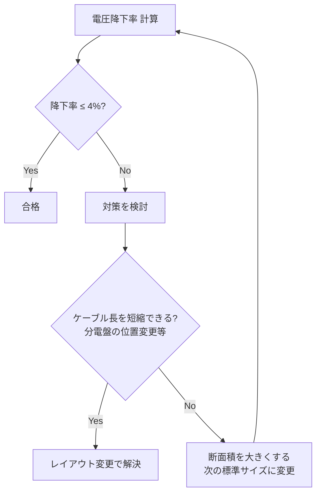

# 電圧降下計算

## 30秒まとめ

電圧降下の許容値は幹線 2% + 分岐 2% = 合計 4% 以内。電動機の始動電流（定格の 5〜8 倍）での電圧降下も別途確認し、他の設備への影響がないか確認する。太線化で電圧降下を解消するか、MCCB の位置を変えて配線を短縮するかを比較する。

---

## 三相電圧降下計算式

### 基本式（三相 3 線式）

```
e = √3 × I × (R cosθ + X sinθ) × L

e     : 線間電圧降下 [V]
I     : 電流 [A]
R     : 導体抵抗 [Ω/km]（ケーブルカタログ値、20℃ 基準）
X     : 誘導リアクタンス [Ω/km]（通常 0.07〜0.09 Ω/km）
cosθ  : 負荷力率
sinθ  : √(1 - cos²θ)
L     : 片道ケーブル長 [km]
```

### 電圧降下率

```
電圧降下率 [%] = e / V0 × 100

V0 : 送り端電圧（受電端電圧）[V]
例: 200V 系統なら V0 = 200V
```

### 計算例

**条件：** 三相 200V、負荷電流 50A、力率 0.85、CV 14sq（R = 1.32 Ω/km、X = 0.083 Ω/km）、片道 100m

```
sinθ = √(1 - 0.85²) = 0.527

e = √3 × 50 × (1.32 × 0.85 + 0.083 × 0.527) × 0.100
e = 1.732 × 50 × (1.122 + 0.044) × 0.100
e = 1.732 × 50 × 1.166 × 0.100
e = 10.1 V

電圧降下率 = 10.1 / 200 × 100 = 5.05%  → 許容値 4% 超 → 太線化が必要
```

---

## 許容値の目安

| 区分 | 許容電圧降下率 | 根拠 |
|------|-------------|------|
| 幹線（受電点〜分電盤） | 2% 以内 | 内線規程 JEAC8001 |
| 分岐（分電盤〜負荷） | 2% 以内 | 内線規程 JEAC8001 |
| 幹線 + 分岐（合計） | 4% 以内 | 上記合算 |
| 低圧電動機（日本電機工業会） | 始動時 10〜15% 以内（他機器への影響で判断） | JEM 規格 |

---

## 電動機始動時の電圧降下確認

電動機の始動時には定格電流の 5〜8 倍の電流が流れ、その間は電圧降下が急増する。

```
始動時電流 Is = In × Ks

In : 定格電流 [A]
Ks : 始動電流倍率（直入れ: 5〜8、Y-Δ: 1.7〜2.7）

始動時電圧降下 es = √3 × Is × (R cosθs + X sinθs) × L
cosθs : 始動時力率（電動機始動時: 0.3〜0.4 が目安）
```

**確認すべき事項：**

1. 始動時電圧降下により、他の電動機の運転が止まらないか（電圧 85% 以下でトリップする機器あり）
2. 計装機器・DCS の電源電圧が許容範囲内（±10%）に収まるか

---

## 太線化判断の基準



### 断面積アップと電流の関係

太線化は電圧降下を改善するが、許容電流も増える副次効果がある。反面、ケーブルコスト・重量・曲げやすさが悪化する。断面積を 1 ランク上げて再計算し、基準を満たす最小断面積を選ぶ。

| CV ケーブル断面積 | 導体抵抗 [Ω/km]（20℃） |
|----------------|---------------------|
| 5.5 sq | 3.28 |
| 8 sq | 2.27 |
| 14 sq | 1.32 |
| 22 sq | 0.847 |
| 38 sq | 0.490 |
| 60 sq | 0.308 |
| 100 sq | 0.188 |

## 関連ページ

- [負荷計算](load-calc.md) — 電圧降下計算の入力となる負荷電流値の算定手順
- [短絡電流計算](fault-current.md) — ケーブルインピーダンスを使う短絡電流計算との連携
- [電路設計](cable-route.md) — ケーブルサイズ選定後のラック・管路ルート設計
- [規格・法規](standards.md) — 許容電圧降下 4% の根拠となる内線規程 JEAC8001
- [盤設計](panel-design.md) — 電圧降下を抑えるための分電盤配置の考え方
