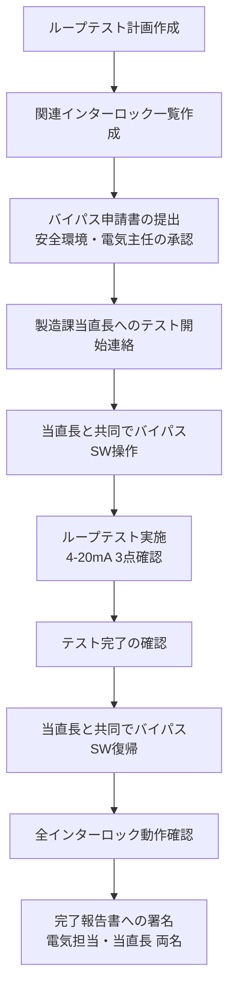

# 他部門調整ノウハウ

## 30秒まとめ

電計エンジニアの仕事は技術力より「誰に何をいつ伝えるか」で成否が決まることが多い。
停電作業は「〇時間・〇ラインへの影響」を先に伝え、製造課の言語（生産・品質・コスト）で話す。
「口頭合意で進めた」は後でトラブルになる。重要な決定は必ず書面に残す。

---

## なぜ他部門調整が難しいか

電計と製造課では「関心の軸」が根本的に違う。

| 視点 | 電計エンジニア | 製造課 |
|------|-------------|-------|
| 主な関心 | 設備の安全・信頼性・法令遵守 | 生産量・製品品質・コスト |
| 時間軸 | 保全サイクル・法定点検周期 | 生産計画・出荷期限 |
| リスクの見方 | 設備故障・電気事故 | 生産停止・品質外れ |
| 成功の定義 | 設備が安定稼働している | 製品が計画通り出荷される |

この違いを理解した上で「相手の関心軸で話す」ことが調整を成立させる最短経路。

---

## 停電作業の製造影響評価と調整

### 製造課への伝え方

**やってしまいがちな伝え方**：
> 「来週の火曜日に受変電の保護継電器試験をします」

→ 製造課には何をすればいいかわからない。

**正しい伝え方（製造課の言語）**：
> 「来週火曜 9:00〜12:00（3時間）、第1・第3ラインが停電します。
> 第2・第4ラインは通常稼働できます。
> 停電前に在庫を〇〇kg確保していただければ生産計画への影響を最小化できます。
> この条件でOKでしょうか？」

**伝えるべき5点セット**：

| 項目 | 内容 | なぜ重要か |
|------|------|---------|
| 停止時間（具体的に） | HH:MM〜HH:MM の X 時間 | 製造計画調整のため |
| 影響ライン（特定して） | 第〇ライン・〇系統 | 何を止め何を動かせるかの判断 |
| 影響しない範囲 | 第〇ラインは稼働可能 | 製造課の代替案検討のため |
| 前日準備の依頼 | 「〇〇を事前に完了してください」 | 停電中の製造影響を下げるため |
| 代替案（あれば） | 「夜間作業にする場合は影響が〇〇になります」 | 選択肢を与えることで承認が得やすい |

### 事前連絡のタイムライン

```
3週間前: 製造課長へ計画の第一報（口頭 + メール）
         「来月〇日に年次停電作業を予定しています。影響は△△です」

2週間前: 停電申請書（ドラフト）を提出
         製造影響の詳細・代替案の提示

1週間前: 停電申請書の承認取得
         製造課・安全管理の確認印をもらう

前日:    最終確認
         「明日 9:00 から停電します。準備できていますか？」
         当日の緊急連絡先を共有

当日朝:  確認コール
         「〇時に停電開始します。現在のプロセス状態を確認させてください」
```

!!! tip "3週間前に「計画あり」の一報だけでも入れる"
    製造課の困るのは「突然言われること」。細部が決まっていなくても「〇月に停電作業を予定しています」という事前報告だけで、製造計画の組み替えを早めに始めてもらえる。

---

## 計装ループテスト時のオペレータ連携

### バイパス操作・インターロック解除の申請フロー



**オペレータへの事前説明のポイント**：

- 「どのインターロックをいつ何分間無効にするか」を具体的に伝える
- テスト中に「何が動作して何が動作しないか」を説明する
- テスト中の異常時の連絡先を告げる

### DCS状態管理（「テスト中」フラグ）

| 管理項目 | 方法 | 担当 |
|---------|------|------|
| テスト対象のタグ | DCSコメント欄に「TEST YYYY-MM-DD」を入力 | 計装担当 |
| バイパスSW状態 | バイパスSWリスト（紙）に日時・実施者を記録 | 電計担当 |
| インターロック無効 | 安全関連インターロックは台帳管理 | 電気主任 |

!!! warning "バイパス解除の確認は2名で行う"
    テスト完了後のバイパス解除は「実施者」と「確認者」の2名体制で行う。解除確認を1名で行ったものの、後でバイパスが残っていたことが発覚したケースがある。

---

## MOC（変更管理）プロセスへの対応

### 何が変更管理の対象か

| 変更内容 | 対象区分 |
|---------|---------|
| 制御ロジック・インターロックの変更 | 必須 |
| 計装機器の型番変更（仕様変更） | 必須 |
| 電気主任技術者の変更 | 必須（電気事業法上の届出義務） |
| 防爆機器の変更 | 必須 |
| 同型番消耗品の交換（仕様変更なし） | 不要（記録のみ） |

**判断に迷う場合の基準**：「これが原因でプロセスの安全・品質・環境に影響が出る可能性があるか？」→ YESなら変更管理対象。

### 安全環境部レビューを通すためのポイント

安全環境部のレビューで引っかかるパターン：

| 引っかかりポイント | 改善策 |
|----------------|-------|
| 変更理由が「老朽化のため」だけ | 「型番XYZが製造中止のため代替品ABCに更新。仕様差異は〇〇」と具体的に |
| リスク評価が「特になし」 | 変更前後の差異を表で示し、リスクが変わらない根拠を記載 |
| 竣工後の確認方法が未記載 | 「ループテスト成績書を提出する」「動作確認記録を保管する」を明記 |

---

## 調整上手になるための3つの原則

### 原則1：相手の言語で話す

| 電計の言葉 | 製造課への翻訳 |
|-----------|-------------|
| 「保護継電器の定期試験です」 | 「法定点検で3時間停電が必要です。来週実施しないと次の点検は来年になります」 |
| 「絶縁抵抗が低下しています」 | 「このまま放置すると2〜3ヶ月以内にモーターが焼損し、ライン停止が最大2日発生します」 |
| 「インバータのパラメータ変更です」 | 「設定変更により月間電力使用量が約5%削減できます」 |

### 原則2：相手のコストで語る

製造課が最も動くのは「生産コストへの影響」を数値で示されたとき。

- 「今すぐ対処するコスト」vs「放置した場合のコスト」を比較する
- 例：「今月の月次停止で対処するコスト：作業費20万円 / 放置した場合のリスク：緊急停止による損失100万円以上」

### 原則3：書面で証跡を残す

口頭で合意したつもりが「そんな話は聞いていない」になることがある。

- 停電承認は必ず**押印または署名済みの申請書**を保管する
- メールで承認を得る場合は**返信メールを保存**する
- 当日の確認コールは**メモに時刻と相手名を記録**する

!!! tip "メールの件名に「承認依頼」「確認依頼」を入れる"
    件名に「承認依頼」「確認依頼」と入れると、受け手が何をすべきかが明確になる。「〇月〇日までに回答ください」を本文冒頭に入れることも有効。
