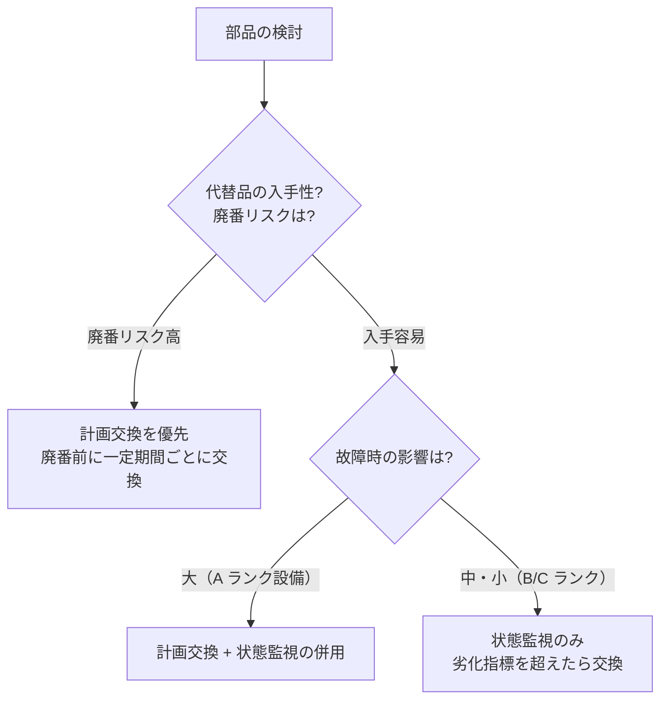

# 寿命管理

## 30秒まとめ

電気計装部品の寿命は「時間・動作回数・測定値」の3軸で管理する。廃番品の代替品は代替前に動作互換性を確認することが必須。更新計画は設備重要度 A ランクから優先的に立案する。

---

## 主要部品の寿命目安一覧表

| 部品 | 寿命目安 | 劣化指標 |
|------|---------|---------|
| 電解コンデンサ | 5〜10 年（温度・リプル電流で大きく変動） | 容量低下・ESR 増加 |
| 鉛蓄電池（UPS・非常用） | 4〜5 年（周囲温度 25℃ 基準） | 内部抵抗増加・容量低下 |
| リチウムイオン電池 | 8〜10 年 | 容量低下（80% 以下で交換） |
| 電磁接触器（MC） | 電気的寿命 100〜500 万回（負荷種別・電流による） | 接点溶着・接触抵抗増加 |
| 電磁リレー（補助リレー） | 電気的寿命 30〜100 万回 | 接点摩耗・接触不良 |
| 電磁弁 | 100〜500 万回（流体・温度・サイクルで変動） | スプール固着・シール劣化 |
| O リング・ガスケット | 3〜5 年（化学的劣化による） | ひび割れ・硬化・永久変形 |
| 保護継電器（デジタル型） | 10〜15 年（電子部品寿命） | 動作試験での精度確認 |
| 変圧器絶縁油 | 15〜20 年 | 絶縁破壊電圧低下・酸価増加 |
| MCCB | 機械的寿命 5,000〜20,000 回 / 電気的寿命は条件次第 | 引き外し電流の変化 |
| インバータ（電解コンデンサ） | 10 年（但し高温環境では 5 年程度） | 電解コンデンサ内部抵抗 |

---

## 劣化判定の指標

| 部品 | 時間基準 | 動作回数基準 | 測定値基準 |
|------|---------|------------|---------|
| 電解コンデンサ | 10 年以上経過 | — | 容量が定格の 80% 以下、ESR が初期の 2 倍超 |
| 電磁接触器 | — | カタログ寿命の 80% 到達 | 接触抵抗が初期の 3 倍超 |
| 鉛蓄電池 | 4 年経過 | — | 内部抵抗が初期の 1.5 倍超 |
| 電磁弁 | 5 年経過 | 50 万回到達 | 動作確認試験での応答遅延 |

---

## 計画交換 vs 状態監視の判断基準

### 判断のポイント

| 条件 | 推奨方式 |
|------|---------|
| 故障時にプロセス停止・安全影響がある | 計画交換（余裕を持って） |
| 故障検知が容易で迅速対応できる | 状態監視 |
| 部品が廃番・入手困難になる可能性 | 廃番前に一括交換または代替品確保 |
| 劣化の測定方法が確立されている | 状態監視が効率的 |

---

## 製造中止品・廃番品の代替品調査方法

!!! warning "代替品の互換性確認が最重要"
    型番が似ていても外形・端子配列・電気仕様が異なる場合がある。代替品採用前は必ず動作確認テストを行う。

### 調査ステップ

1. **メーカーへの問い合わせ**
   - 廃番品の後継品・推奨代替品をメーカーに確認（型番変更で同等品があることが多い）

2. **仕様の比較確認**
   - 外形寸法（取付互換性）
   - 電気仕様（電圧・電流・接点容量）
   - 端子配列（ピン配置の変更確認）
   - 通信プロトコル（デジタル機器の場合）

3. **代替品の検証テスト**
   - ベンチテスト：単体での動作確認
   - 実機テスト：実設備への仮接続での動作確認
   - T/A の機会を使って本番切り替え

4. **代替品の登録**
   - 資産管理システム・保全管理システムに代替品型番を登録
   - 図面・仕様書に代替品情報を追記

### 廃番リスクの早期検出

- メーカーニュースレター・製品終息通知を定期確認
- 年次点検時に使用部品の継続販売状況を確認
- 重要設備の部品は 5〜10 年分の予備品を確保

## 関連ページ

- [保全体系](maintenance-system.md) — 設備重要度（A/B/C ランク）と最適な保全方式の選択
- [予備品管理](spare-parts.md) — 廃番リスクが高い部品の先行確保と在庫数量の決め方
- [データ活用・予兆保全](predictive-maintenance.md) — 絶縁抵抗・電流・振動のトレンドから交換判断へ
- [定期点検](periodic-inspection.md) — T/A 時の計画交換実施と記録の残し方
- [メーカー選定](../04-sekkei/vendor-selection.md) — LCC 計算・代替品選定での評価軸と見積比較
- [改造・更新設計の注意点](../04-sekkei/renovation-design.md) — 廃番品代替選定の互換性確認 5 項目
