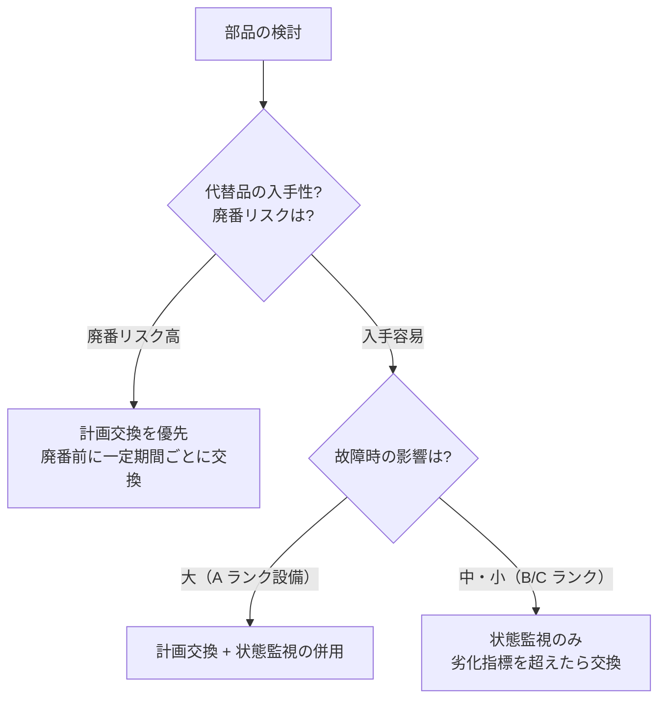

# 寿命管理

## 30秒まとめ

電気計装部品の寿命は「時間・動作回数・測定値」の3軸で管理する。廃番品の代替品は代替前に動作互換性を確認することが必須。更新計画は設備重要度 A ランクから優先的に立案する。

---

## 主要部品の寿命目安一覧表

!!! warning "この表は目安であり、規格・法令の規定値ではない"
    以下の年数・回数はメーカーカタログ・業界慣行に基づく**計画立案用の目安**です。個別機器の寿命・耐久回数は**その機器のメーカー仕様書・カタログ値が正**で、使用環境（温度・負荷・開閉頻度）で大きく変わります。各行の出所の切り分けは本ページ末尾の「根拠」節を参照。

| 部品 | 寿命目安 | 劣化指標 |
|------|---------|---------|
| 電解コンデンサ | 5〜10 年（温度・リプル電流で大きく変動） | 容量低下・ESR 増加 |
| 鉛蓄電池（UPS・非常用） | 4〜5 年（周囲温度 25℃ 基準・小形制御弁式の目安。長寿命据置形は別で、形式ごとのメーカー期待寿命が正） | 内部抵抗増加・容量低下 |
| リチウムイオン電池 | 8〜10 年 | 容量低下（80% 以下で交換） |
| 電磁接触器（MC） | 電気的寿命 100〜500 万回（負荷種別・電流による） | 接点溶着・接触抵抗増加 |
| 電磁リレー（補助リレー） | 電気的寿命 30〜100 万回 | 接点摩耗・接触不良 |
| 電磁弁 | 100〜500 万回（流体・温度・サイクルで変動） | スプール固着・シール劣化 |
| O リング・ガスケット | 3〜5 年（化学的劣化による） | ひび割れ・硬化・永久変形 |
| 保護継電器（デジタル型） | 10〜15 年（電子部品寿命） | 動作試験での精度確認 |
| 変圧器絶縁油 | 15〜20 年 | 絶縁破壊電圧低下・酸価増加 |
| MCCB | 機械的寿命 5,000〜20,000 回 / 電気的寿命は条件次第 | 引き外し電流の変化 |
| インバータ（電解コンデンサ） | 10 年（但し高温環境では 5 年程度） | 電解コンデンサ内部抵抗 |

---

## 劣化判定の指標

| 部品 | 時間基準 | 動作回数基準 | 測定値基準 |
|------|---------|------------|---------|
| 電解コンデンサ | 使用環境に応じ 5〜10 年経過（高温環境は短い側で計画） | — | 容量が定格の 80% 以下、ESR が初期の 2 倍超 |
| 電磁接触器 | — | カタログ寿命の 80% 到達 | 接触抵抗が初期の 3 倍超 |
| 鉛蓄電池 | 4 年経過 | — | 内部抵抗が初期の 1.5 倍超 |
| 電磁弁 | 5 年経過 | カタログ寿命の 80% 到達 | 動作確認試験での応答遅延 |

---

## 計画交換 vs 状態監視の判断基準

```mermaid
flowchart TD
    A[部品の検討] --> B{代替品の入手性?\n廃番リスクは?}
    B -- 廃番リスク高 --> C[計画交換を優先\n廃番前に一定期間ごとに交換]
    B -- 入手容易 --> D{故障時の影響は?}
    D -- 大（A ランク設備） --> E[計画交換 + 状態監視の併用]
    D -- 中・小（B/C ランク） --> F[状態監視のみ\n劣化指標を超えたら交換]
```

### 判断のポイント

| 条件 | 推奨方式 |
|------|---------|
| 故障時にプロセス停止・安全影響がある | 計画交換（余裕を持って） |
| 故障検知が容易で迅速対応できる | 状態監視 |
| 部品が廃番・入手困難になる可能性 | 廃番前に一括交換または代替品確保 |
| 劣化の測定方法が確立されている | 状態監視が効率的 |

---

## 製造中止品・廃番品の代替品調査方法

!!! warning "代替品の互換性確認が最重要"
    型番が似ていても外形・端子配列・電気仕様が異なる場合がある。代替品採用前は必ず動作確認テストを行う。

### 調査ステップ

1. **メーカーへの問い合わせ**
   - 廃番品の後継品・推奨代替品をメーカーに確認（型番変更で同等品があることが多い）

2. **仕様の比較確認**
   - 外形寸法（取付互換性）
   - 電気仕様（電圧・電流・接点容量）
   - 端子配列（ピン配置の変更確認）
   - 通信プロトコル（デジタル機器の場合）

3. **代替品の検証テスト**
   - ベンチテスト：単体での動作確認
   - 実機テスト：実設備への仮接続での動作確認
   - T/A の機会を使って本番切り替え

4. **代替品の登録**
   - 資産管理システム・保全管理システムに代替品型番を登録
   - 図面・仕様書に代替品情報を追記

### 廃番リスクの早期検出

- メーカーニュースレター・製品終息通知を定期確認
- 年次点検時に使用部品の継続販売状況を確認
- 重要設備の部品は 5〜10 年分の予備品を確保

---

## 根拠

### 本ページが正典の範囲

**電気計装部品の寿命目安一覧・劣化判定の3軸（時間・動作回数・測定値）・計画交換 vs 状態監視の判断・廃番品の代替調査手順**が本ページの正典範囲です。遮断器（VCB）の寿命の目安と「メーカー仕様書が正」の扱いは [遮断器・開閉器](../01-koatsu/breaker.md)、絶縁抵抗・電流・振動のトレンド判定は [データ活用・予兆保全](predictive-maintenance.md)、絶縁抵抗の判定境界は [絶縁管理](insulation-management.md) が正典で、本ページは数値を再記述しません。

### 寿命目安の出所の切り分け（1件ずつ）

いずれも**規格・法令の規定値ではありません**。区分は次のとおりです。

| 行 | 出所の区分 |
|---|---|
| 電解コンデンサ 5〜10 年・容量 80%・ESR 2 倍 | メーカー技術資料で広く一致する慣用目安（原本の規格なし） |
| 鉛蓄電池 4〜5 年（25℃・小形制御弁式） | メーカー・電池業界が公表する**期待寿命**の目安（原本未照合・下記 hold） |
| リチウムイオン電池 8〜10 年・容量 80% で交換 | メーカー公表目安・実務慣行 |
| 電磁接触器の電気的寿命・電磁弁の動作回数 | **メーカーカタログの耐久回数が正**（負荷種別・電流・流体条件で桁が変わる。表の範囲は計画用の目安） |
| O リング・ガスケット 3〜5 年 | 実務慣行（材質・流体で大きく変動） |
| 保護継電器（デジタル型）10〜15 年 | 業界団体の更新推奨とされる値（原本未照合・下記 hold） |
| 変圧器絶縁油 15〜20 年 | 実務目安。継続可否は年数でなく**劣化診断（絶縁破壊電圧・酸価）の実測**で判断する |
| MCCB の機械的寿命 | JIS の耐久回数区分・メーカーカタログの領域（原本未照合・下記 hold） |
| インバータ 10 年（高温 5 年） | メーカー推奨の部品交換周期（電解コンデンサ律速） |
| 劣化判定表の倍率（ESR 2 倍・接触抵抗 3 倍・内部抵抗 1.5 倍） | 実務慣行の目安 |
| 予備品 5〜10 年分確保・カタログ寿命の 80% で交換着手 | 社内運用の計画基準（本 Wiki の推奨であり外部根拠なし） |

### 是正の記録（2026-08-06）

- **電磁弁の判定回数の内部矛盾**: 劣化判定表の動作回数基準を「50 万回到達」としていましたが、寿命目安一覧の「100〜500 万回」と最大 10 倍食い違っていました。電磁接触器の行と同じ「**カタログ寿命の 80% 到達**」に統一しました（固定回数ではなく採用機種のカタログ値基準に）
- **電解コンデンサの判定年数の内部矛盾**: 劣化判定表の時間基準が「10 年以上経過」となっており、寿命目安「5〜10 年（温度・リプル電流で大きく変動）」の**短い側（高温環境で 5 年）を無視して危険側**でした。「使用環境に応じ 5〜10 年経過（高温環境は短い側で計画）」に是正しました
- **鉛蓄電池の一律年数**: 「4〜5 年」を全形式に見える書き方をしていましたが、これは小形制御弁式（UPS 用）の目安であり、長寿命据置形は別です。形式ごとのメーカー期待寿命が正である旨を追記しました
- **表全体の位置づけ**: 目安一覧の冒頭に「規格・法令の規定値ではない・メーカー仕様書が正」の注記を新設しました

### 原本未照合（honest-hold）

- **鉛蓄電池の期待寿命**（電池工業会・メーカー公表値）: 公表資料の原本は未照合です。交換計画は採用電池のメーカー期待寿命と内部抵抗・容量の実測によってください
- **保護継電器（デジタル型）10〜15 年**: 業界団体（日本電機工業会等）の更新推奨時期とされる値ですが、推奨文書の原本は未照合のため、団体名・文書名を根拠として引用しません
- **MCCB の耐久回数**: JIS（低圧遮断器規格）に開閉耐久の区分があるとされますが原本未照合です。フレームサイズごとの回数はメーカーカタログを正としてください

### 実務慣行（規格・法令の裏付けなし）

- 計画交換 vs 状態監視のフローチャート・判断のポイント表・廃番リスクの早期検出の3項目は、いずれも本 Wiki の運用推奨です
- 設備重要度 A/B/C ランクの運用は [保全体系](maintenance-system.md) の定義によります

### 限界の明示

- **寿命目安は「その年数まで壊れない」保証ではありません**。目安より早い偶発故障は起こり得るため、A ランク設備は計画交換と状態監視を併用してください
- 代替品の互換性確認（外形・端子配列・電気仕様・通信）を省いた置き換えは、型番が似ていても事故源になります。必ずベンチテスト→実機テストの順を踏んでください

### 正典参照

| 項目 | 正典 |
|---|---|
| 遮断器（VCB）の寿命の目安・点検周期 | [遮断器・開閉器](../01-koatsu/breaker.md) |
| 絶縁抵抗・電流・振動のトレンド判定 | [データ活用・予兆保全](predictive-maintenance.md) |
| 絶縁抵抗の判定境界（電動機の管理値） | [絶縁管理](insulation-management.md) |
| 設備重要度（A/B/C ランク）の定義 | [保全体系](maintenance-system.md) |
| 予備品の在庫数量の決め方 | [予備品管理](spare-parts.md) |

照合日: 2026-08-06（新規の条文・規格照合なし。寿命目安の出所を1件ずつ区分し、判定表の内部矛盾2件を是正）。

## 関連ページ

- [保全体系](maintenance-system.md) — 設備重要度（A/B/C ランク）と最適な保全方式の選択
- [予備品管理](spare-parts.md) — 廃番リスクが高い部品の先行確保と在庫数量の決め方
- [データ活用・予兆保全](predictive-maintenance.md) — 絶縁抵抗・電流・振動のトレンドから交換判断へ
- [定期点検](periodic-inspection.md) — T/A 時の計画交換実施と記録の残し方
- [メーカー選定](../04-sekkei/vendor-selection.md) — LCC 計算・代替品選定での評価軸と見積比較
- [改造・更新設計の注意点](../04-sekkei/renovation-design.md) — 廃番品代替選定の互換性確認 5 項目
