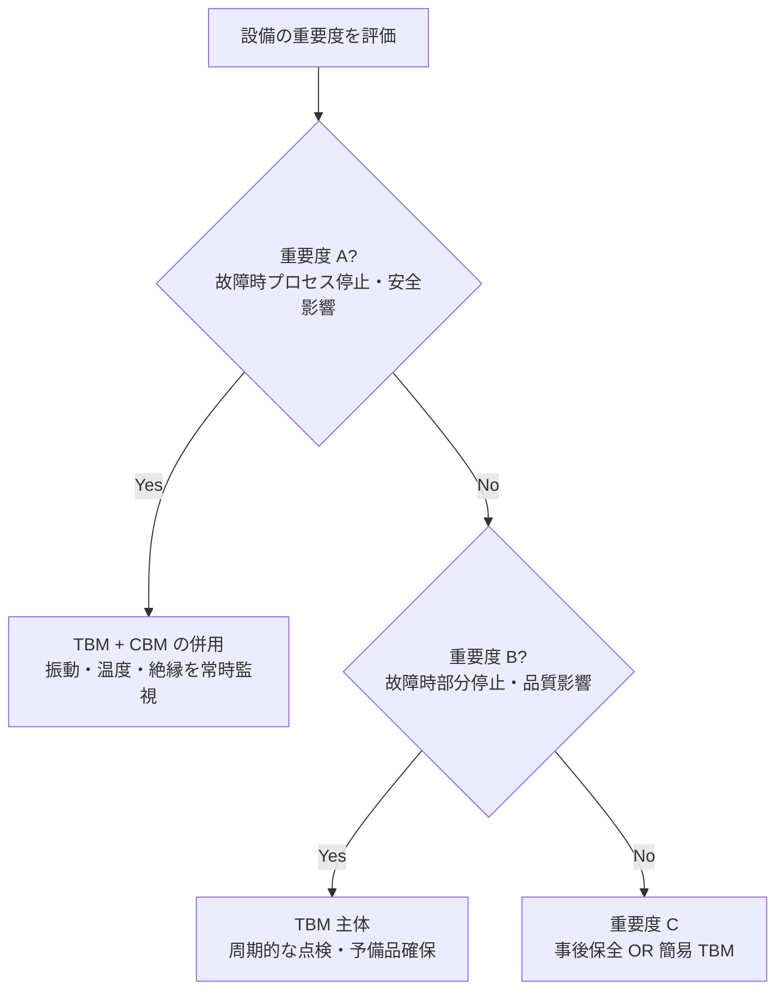

# 保全体系

## 30秒まとめ

化学プラントの保全は「重要度 A 設備は TBM/CBM 優先、B/C はコスト最適化」が基本。事後保全でも許容できるのは影響が軽微な C ランク設備のみ。ターンアラウンド（定期修理）は電気計装作業が集中するため事前準備が重要。

---

## 保全方式の比較

| 保全方式 | 英語 | 特徴 | 適用 |
|---------|------|------|------|
| 事後保全（BM） | Breakdown Maintenance | 故障してから修理 | C ランク設備・代替品がある場合 |
| 時間基準保全（TBM） | Time Based Maintenance | 一定周期で点検・交換 | A/B ランク・寿命が明確な部品 |
| 状態基準保全（CBM） | Condition Based Maintenance | 状態監視データで判断 | A ランク・連続プロセスの主要機器 |
| 予知保全（PdM） | Predictive Maintenance | AI・センサーで劣化予測 | 高コスト機器・CBM の発展形 |

### 化学プラントでの使い分け



---

## 設備重要度ランク（A/B/C）による保全計画

| ランク | 定義 | 保全方針 |
|-------|------|---------|
| A（最重要） | 故障がプロセス停止・安全事故・環境事故に直結 | TBM + CBM 併用、予備機保有、ターンアラウンドで必ず点検 |
| B（重要） | 故障が生産ロス・品質低下に影響、代替手段あり | TBM 主体、予備品在庫確保 |
| C（一般） | 故障の影響が軽微、迅速修理で復旧可能 | 事後保全または簡易 TBM |

### 評価基準（重要度ランク付けのポイント）

- **安全への影響**：故障が安全装置の動作に関係するか
- **環境への影響**：故障が漏洩・排出につながるか
- **生産継続性**：代替設備（バイパス弁・スタンバイポンプ）があるか
- **修復時間（MTTR）**：故障時に何時間で復旧できるか

---

## MTBF / MTTR 活用による最適保全周期

### 定義

```
MTBF（平均故障間隔）= 運転時間の合計 / 故障回数

MTTR（平均修復時間）= 修復時間の合計 / 故障回数

設備稼働率 = MTBF / (MTBF + MTTR)
```

### 保全周期の決定

- TBM 周期 = MTBF × 0.6〜0.8（故障前に点検・交換する）
- 例：MTBF = 3 年のリレー → 点検周期は 2 年（= 3 × 0.7）

!!! tip "故障データの蓄積が精度を上げる"
    MTBF を精度良く計算するには故障記録（発生日時・故障部位・修復時間）の蓄積が必要。工場のメンテナンス管理システム（CMMS）への登録を徹底する。

---

## 定期修理（ターンアラウンド）の役割と電気計装作業

ターンアラウンド（T/A）は年 1〜数年に 1 回のプラント全停止による集中点検期間。電気計装作業は全保全作業の 20〜30% を占める。

### 電気計装の主な T/A 作業

| 作業 | 内容 |
|------|------|
| 高圧設備停電点検 | VCB・DS の動作確認・接触抵抗測定・絶縁測定 |
| 変圧器内部点検 | 絶縁油・ブッシング・タップの確認 |
| MCC 年次点検 | MCCB・MC 接点の確認・締付確認 |
| 計装器校正 | 全計装器のゼロ・スパン校正 |
| 制御弁メンテ | 分解点検・パッキン交換 |
| 計装配線確認 | 接続確認・絶縁測定 |
| 安全計装（SIS）テスト | 緊急遮断弁の動作確認・ループテスト |

### T/A 準備のポイント

- **3 ヶ月前：** 作業リスト確定・予備品発注・工事業者手配
- **1 ヶ月前：** 工程表確定・危険作業の許可申請準備
- **1 週間前：** 材料・工具の搬入・現地確認
- **T/A 後：** 試運転チェックリスト・図面更新・竣工記録
