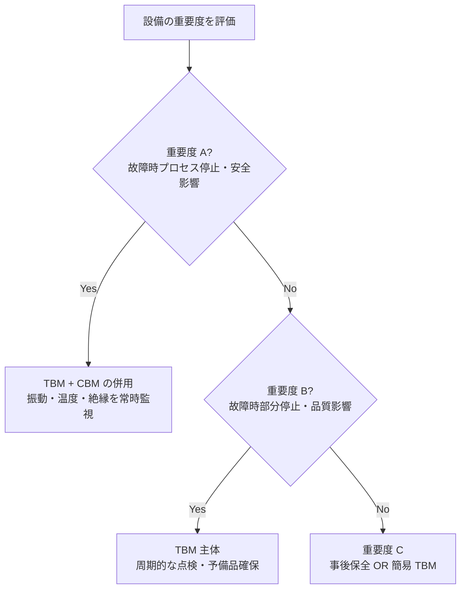

# 保全体系

## 30秒まとめ

化学プラントの保全は「重要度 A 設備は TBM/CBM 優先、B/C はコスト最適化」が基本。事後保全でも許容できるのは影響が軽微な C ランク設備のみ。ターンアラウンド（定期修理）は電気計装作業が集中するため事前準備が重要。

---

## 保全方式の比較

| 保全方式 | 英語 | 特徴 | 適用 |
|---------|------|------|------|
| 事後保全（BM） | Breakdown Maintenance | 故障してから修理 | C ランク設備・代替品がある場合 |
| 時間基準保全（TBM） | Time Based Maintenance | 一定周期で点検・交換 | A/B ランク・寿命が明確な部品 |
| 状態基準保全（CBM） | Condition Based Maintenance | 状態監視データで判断 | A ランク・連続プロセスの主要機器 |
| 予知保全（PdM） | Predictive Maintenance | AI・センサーで劣化予測 | 高コスト機器・CBM の発展形 |

### 方式の階層：4方式は横並びではない

上の表は4行が並んでいますが、同じ階層の選択肢ではありません。**対になるのは「予防保全（PM）」と「事後保全（BM）」で、TBM と CBM は予防保全の中の区分**です。

```text
保全
├─ 予防保全（PM：Preventive Maintenance）… 故障する前に手を打つ
│   ├─ 時間基準保全（TBM）… 暦の周期（定期保全）または累積稼働時間・動作回数（経時保全）で実施
│   └─ 状態基準保全（CBM）… 測定した状態が基準を超えたら実施
│        └ 予知保全（PdM）… CBM のデータから故障時期まで予測する発展形
└─ 事後保全（BM：Breakdown Maintenance）… 故障してから直す

保全そのものを減らす活動（TPM の生産保全では、予防・事後と並ぶ構成要素として扱います）
├─ 改良保全 … 故障しにくいように設備自体を改造する（同じ故障を繰り返す設備への対策）
└─ 保全予防（MP：Maintenance Prevention）… 設計・購入の段階で壊れにくく、保全しやすくする
```

「BM・PM・CBM のどれにするか」という問い方は階層が混ざっています。正しい順序は、**①予防するか（PM か BM か）→ ②予防するなら時間で決めるか状態で決めるか（TBM か CBM か）**の2段階です。

!!! warning "略語の取り違えに注意"
    | 略語 | 取り違えやすい点 |
    |---|---|
    | PM | **予防保全（Preventive Maintenance）** と **生産保全（Productive Maintenance。TPM の P）** の2つの意味があります。文書の文脈で判断してください |
    | CM | 日本の TPM の文献では「改良保全」の略として使われますが、英語の *corrective maintenance* は**故障の後に復旧させる保全＝事後保全**側の用語です。海外メーカーの資料の CM を改良保全と読むと、別の活動と取り違えます |
    | MP と PM | 保全予防（MP）は**設計段階**、予防保全（PM）は**運用段階**の活動です。語順が逆なだけで別物です |
    | TBM と CBM の和名 | 本 Wiki は「時間基準保全／状態基準保全」と書きますが、「時間計画保全／状態監視保全」と書く文献もあります（同じ概念） |

### 化学プラントでの使い分け


```mermaid
flowchart TD
    START[設備の重要度を評価] --> A{重要度 A?\n故障時プロセス停止・安全影響}
    A -- Yes --> B[TBM + CBM の併用\n振動・温度・絶縁を常時監視]
    A -- No --> C{重要度 B?\n故障時部分停止・品質影響}
    C -- Yes --> D[TBM 主体\n周期的な点検・予備品確保]
    C -- No --> E[重要度 C\n事後保全 OR 簡易 TBM]
```

### 方式を選ぶ理屈：故障の起き方で TBM の効き目が変わる

重要度だけでなく、**その設備が「どういう起き方で壊れるか」**でも方式が決まります。故障率の時間変化（バスタブ曲線）の3つの期間で考えます。

TBM には「周期で**交換・オーバーホール**する」ものと「周期で**点検・動作試験**する」ものがあり、効き目は分けて考えます。

| 期間 | 故障率の変化 | 主な原因 | 効く対策 | 周期交換（TBM）が効くか |
|---|---|---|---|---|
| 初期故障期 | 使い始めは高く、時間とともに下がる | 製造不良・施工不良（締付け不足、結線誤り） | 試運転、初期の増し締め・点検、保全予防（MP） | **逆効果**。交換のたびに初期故障と作業ミスを持ち込む |
| 偶発故障期 | ほぼ一定 | 外乱・サージ・偶発的な部品不良 | 兆候が測れる故障は CBM。兆候のない突発故障（サージ等）は改良保全（避雷器・サージ保護）・冗長化・予備品。影響が小さければ BM | **効かない**。いつ壊れるかが使用時間に関係しないので、交換しても故障率は下がらない |
| 摩耗故障期 | 時間とともに上がる | 摩耗・劣化（軸受、接点、パッキン、電解コンデンサ） | TBM（または CBM） | **寿命のばらつきが小さければ効く**。ばらつきが大きいと交換前に壊れるものが多く残るので、CBM のほうがよい |

!!! warning "偶発故障でも「周期の点検・動作試験」は省けません"
    保護継電器・待機機・警報のように、**壊れても表に出ない（隠れ故障の）機器**は、周期的な動作試験をしなければ故障に気づけません。この表の「効かない」は周期交換の話で、[定期点検](periodic-inspection.md) の保護継電器動作試験のような周期試験を不要とする意味ではありません。

!!! tip "TBM の周期を詰めても故障が減らないとき"
    周期を短くしても故障件数が変わらない設備は、偶発故障が主体である可能性が高いです。周期をさらに詰めるのではなく、状態を測る方式（CBM）に切り替えるか、改良保全で原因そのものを断つことを検討してください。ただし**交換・分解の直後に故障が集中している**なら、原因は初期故障か作業ミスです。周期を詰めるとかえって悪化します。

---

## 設備重要度ランク（A/B/C）による保全計画

| ランク | 定義 | 保全方針 |
|-------|------|---------|
| A（最重要） | 故障がプロセス停止・安全事故・環境事故に直結 | TBM + CBM 併用、予備機保有、ターンアラウンドで必ず点検 |
| B（重要） | 故障が生産ロス・品質低下に影響、代替手段あり | TBM 主体、予備品在庫確保 |
| C（一般） | 故障の影響が軽微、迅速修理で復旧可能 | 事後保全または簡易 TBM |

### 評価基準（重要度ランク付けのポイント）

- **安全への影響**：故障が安全装置の動作に関係するか
- **環境への影響**：故障が漏洩・排出につながるか
- **生産継続性**：代替設備（バイパス弁・スタンバイポンプ）があるか
- **修復時間（MTTR）**：故障時に何時間で復旧できるか（下記のとおり修理作業の時間だけではない）

---

## MTBF / MTTR 活用による最適保全周期

### 定義

```
MTBF（平均故障間隔）= 運転時間の合計 / 故障回数

MTTR（平均修復時間）= 復旧までの時間の合計 / 故障回数
　　　　　　　　　※「修理作業の時間」ではない。下記 warning を参照

設備稼働率 = MTBF / (MTBF + MTTR)　※定常状態での値
```

### 保全周期の決定

- TBM 周期 = 平均寿命 × 0.6〜0.8（故障前に交換・オーバーホールする）
- 平均寿命に使う値は対象で変わります。**交換して使い捨てる部品は MTTF（平均故障寿命）**、**修理して使い続ける設備のオーバーホール周期は MTBF** です（下記「根拠」の用語表）
- 寿命を測る物差しも故障の起き方に合わせます。接点が摩耗して壊れる補助リレーの寿命は**年数ではなく動作回数**で決まります（目安の回数は [寿命管理](lifetime.md) が正典）
- 例：故障記録から、ある系統の補助リレーの平均寿命（MTTF）が 60 万回と分かった → 60 万 × 0.7 = 42 万回。**切り捨てて 40 万回**で交換する（切り上げると故障側に寄る）。年単位の交換計画にするときは、動作回数のカウンタ値か、1 日あたりの動作回数の実績で年数に換算します

!!! warning "この係数が意味を持つのは、摩耗故障が主体で寿命のばらつきが小さい機器だけです"
    偶発故障が主体の機器（故障率が時間によらずほぼ一定）では、平均寿命の 0.7 倍で交換しても故障は減りません。交換した新品も同じ確率で壊れるからです（上記「方式を選ぶ理屈」）。摩耗故障でも、寿命のばらつきが大きければ交換前に壊れるものが多く残ります（寿命がワイブル分布に従うとき、平均寿命の 0.7 倍で交換しても交換前に壊れる割合は、形状パラメータ β = 2 で約 32 %、β = 6 でも約 7 %）。

    係数を当てる前に、故障記録で**使用時間帯ごとの故障率**（その時間帯の故障件数 ÷ その時間帯まで使われていた台数）が時間とともに上がっているかを確かめてください。件数だけを数えると、台数の多い時間帯ほど故障が多く見えて判定を誤ります。

!!! warning "MTTR は「修理にかかった時間」ではありません"
    IEC 60050-192 の MTTR は **mean time to restoration（復旧までの時間）**で、**mean time to repair は非推奨語**として明記されています（[IEV 192-07-23](https://www.electropedia.org/iev/iev.nsf/display?openform&ievref=192-07-23)）。

    復旧までの時間には、修理作業そのもの（corrective maintenance time）だけでなく、**故障に気づくまでの時間（fault detection time）と、手配・移動・部品待ちなどの administrative delay** が含まれます（[IEV 192-01-23](https://www.electropedia.org/iev/iev.nsf/display?openform&ievref=192-01-23) の図）。

    **工具を握っていた時間だけを MTTR に入れると、稼働率を実態より高く見積もります。** 夜間に故障して朝まで気づかなかった時間、予備品の取り寄せ待ちも数えてください。時間の内訳の管理は [復旧性管理](recovery-management.md) が正典です。

!!! tip "故障データの蓄積が精度を上げる"
    MTBF を精度良く計算するには故障記録（発生日時・故障部位・修復時間）の蓄積が必要。工場のメンテナンス管理システム（CMMS）への登録を徹底する。

---

## 定期修理（ターンアラウンド）の役割と電気計装作業

ターンアラウンド（T/A）は年 1〜数年に 1 回のプラント全停止による集中点検期間。電気計装作業は全保全作業の 20〜30% を占める（経験則。事業場により異なる）。

!!! note "T/A の周期は法定の一律値ではない"
    T/A の周期そのものを一律に定める法令はありません。実際の周期は、高圧ガス保安法の保安検査・定期自主検査の周期（条文照合済みの整理は [規格・法規](../04-sekkei/standards.md) の根拠節）、電気事業法の保安規程で自ら定めた点検頻度（[法定業務一覧](../09-hoantokei/legal-duties.md)）、生産計画・設備の劣化状況を突き合わせて事業場ごとに決めます。

### 電気計装の主な T/A 作業

| 作業 | 内容 |
|------|------|
| 高圧設備停電点検 | VCB・DS の動作確認・接触抵抗測定・絶縁測定 |
| 変圧器内部点検 | 絶縁油・ブッシング・タップの確認 |
| MCC 年次点検 | MCCB・MC 接点の確認・締付確認 |
| 計装器校正 | 全計装器のゼロ・スパン校正 |
| 制御弁メンテ | 分解点検・パッキン交換 |
| 計装配線確認 | 接続確認・絶縁測定 |
| 安全計装（SIS）テスト | 緊急遮断弁の動作確認・ループテスト |

### T/A 準備のポイント

- **3 ヶ月前：** 作業リスト確定・予備品発注・工事業者手配
- **1 ヶ月前：** 工程表確定・危険作業の許可申請準備
- **1 週間前：** 材料・工具の搬入・現地確認
- **T/A 後：** 試運転チェックリスト・図面更新・竣工記録

## 根拠

- **保全方式の階層・略語の説明は規格原文・文献と未照合（要確認）**: 「方式の階層」節の分類（予防保全の下に時間基準・状態基準、PdM を CBM の発展形とする位置づけ）、*corrective maintenance* を事後保全側とする扱い、改良保全・保全予防・生産保全と PM／CM の二義性の説明は、保全の教科書的な整理を書いたものです。**2026-10-05 時点でディペンダビリティ用語規格（JIS／IEC 60050-192）の原文にも TPM の文献にも当たっていません**（作成環境から IEC Electropedia に接続できなかったため）。用語の定義を逐語で扱う場合は原文で確認してください。下の項目のとおり、区分そのものは規格の規定値ではありません。バスタブ曲線と周期交換の効き目の関係、ワイブル分布での交換前故障の割合は信頼性工学の一般原理と計算例で、法令・規格の数値ではありません。
- **本ページに法定数値は登場しません**: 保全方式の区分（BM/TBM/CBM/PdM）、重要度ランク A/B/C の基準、TBM 周期 = 平均寿命 × 0.6〜0.8、補助リレーの計算例の 60 万回（架空の値）、T/A に占める電気計装作業の比率 20〜30 %、T/A 準備のリードタイム（3 ヶ月前〜）は、いずれも化学プラント保全の実務慣行・経験則であり、出典となる法令・規格の規定値ではありません。係数・比率は自事業場の実データ（CMMS の故障記録）で見直してください。
- **点検の頻度・項目は保安規程で決まる**: 電気設備の点検を実施し記録することは、電気事業法第42条に基づく保安規程の遵守を通じて求められますが、頻度・項目の数値は法定値ではなく自事業場の保安規程で定めます（施行規則第50条第3項第三号が「巡視・点検・検査に関すること」を規程に定めるよう求める構造）。条文照合済みの整理は [法定業務一覧](../09-hoantokei/legal-duties.md)・[保安規程の管理](../09-hoantokei/hoan-kisoku.md) が正典です。本ページでは頻度の数値を再掲しません。
- **高圧ガス設備の検査周期**: T/A 周期の背景となる保安検査・定期自主検査の周期と条文（高圧ガス保安法・一般高圧ガス保安規則）は [規格・法規](../04-sekkei/standards.md) の根拠節（2026-08-01 時点で一次照合済み）が正典です。本ページでは数値を再掲しません。
- **MTBF・MTTR・稼働率の定義**: **2026-09-19 に IEC 60050-192（ディペンダビリティ用語。[IEC Electropedia](https://www.electropedia.org/) で無償公開）で確認しました。** 有償の JIS（ディペンダビリティ用語規格）は原本未照合のままですが、国際規格側は一次資料に当たれます。

    | 用語 | IEV 番号 | 正式名称 | 本ページの扱い |
    |---|---|---|---|
    | MTBF | [192-05-13](https://www.electropedia.org/iev/iev.nsf/display?openform&ievref=192-05-13) | mean operating **time** between failures（平均故障間動作時間） | 「運転時間の合計 ÷ 故障回数」は正式定義と整合。**修理して使い続ける設備にだけ使う**（Note 1。使い捨て品は 192-05-11 の MTTF） |
    | MTTR | [192-07-23](https://www.electropedia.org/iev/iev.nsf/display?openform&ievref=192-07-23) | mean time to **restoration**（平均修復時間） | 下記の warning のとおり「修理作業の時間」ではない |
    | 稼働率 | [192-01-23](https://www.electropedia.org/iev/iev.nsf/display?openform&ievref=192-01-23) | availability | up 状態と down 状態の 2 状態で考える。MTBF/(MTBF+MTTR) は定常状態での値 |
- **限界の明示**: 安全計装システム（SIS）のプルーフテスト周期は SIL 設計から決まる別系統の要求であり、本ページの TBM 周期の考え方（MTBF × 係数）を適用してはいけません。[SIS・SIL](../03-keiso/sis-sil.md) を参照してください。T/A 作業表の項目立ても標準例であり、対象設備は事業場の保安規程・検査計画によります。

### 条文リンク（e-Gov 法令検索・2026-09-19 閲覧）

本節で引用した条文の所在です。e-Gov のリンクは現行条文で、2026-09-19 に e-Gov 法令 API（v1）で取得した本文と本節の引用内容が一致することを再確認しました。アンカー ID は e-Gov 法令 API の XML 階層（章・節・款）から算出しています。ただし e-Gov は読み込み直後に該当条まで自動でスクロールしないことがあります。その場合は画面左の目次または法令内検索で条番号へ移動してください。

- 電気事業法（昭和39年法律第170号）: [第42条](https://laws.e-gov.go.jp/law/339AC0000000170#Mp-Ch_3-Se_2-Ss_2-At_42)
- 電気事業法施行規則（平成7年通商産業省令第77号）: [第50条](https://laws.e-gov.go.jp/law/407M50000400077#Mp-Ch_3-Se_2-Ss_2-At_50)

## 関連ページ

- [定期点検](periodic-inspection.md) — TBM の実務：年次・月次点検の標準チェックリスト
- [データ活用・予兆保全](predictive-maintenance.md) — CBM・PDM の実装方法と測定データ活用
- [絶縁管理](insulation-management.md) — A ランク設備の状態基準指標となる絶縁抵抗のトレンド管理
- [寿命管理](lifetime.md) — 部品の寿命目安（年数・動作回数）を使った計画交換・更新計画の立案
- [予備品管理](spare-parts.md) — A/B ランク設備の予備品選定と在庫数量の考え方
- [復旧性管理](recovery-management.md) — 重要度ランクに「何時間で戻せるか」の軸を足し、復旧時間を算式で管理する
- [設備投資フロー](../04-sekkei/investment-flow.md) — 更新投資・改造投資の稟議・設計フロー
