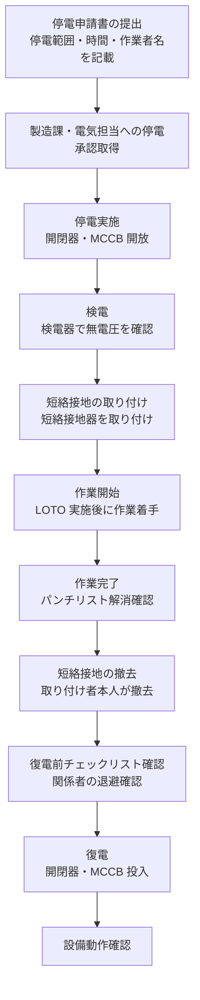

# 停電作業

## 30秒まとめ

停電作業の絶対原則は「検電 → 短絡接地 → 作業 → 接地撤去 → 復電」の順序を守ること。LOTO（ロックアウト/タグアウト）は複数作業者・複数電源系統がある場合に命を守る手順。「停電しているはず」は危険——必ず検電器で確認する。

---

## 停電作業の全体フロー



---

## ロックアウト/タグアウト（LOTO）の実施手順

### LOTO の目的

複数の電源・エネルギー源がある設備で、誰かが作業中に誤って通電・弁開放などをしないように「物理的な錠と警告タグ」で封鎖する。

### 手順

1. **危険エネルギーの特定**：停電すべき電源・閉鎖すべきバルブを全て列挙
2. **機器の停止**：全ての電源・エネルギーを安全な状態に移行
3. **ロックアウト**：各開閉器・ブレーカーに南京錠で施錠（作業者全員が1人1個）
4. **タグアウト**：「作業中・投入禁止」タグを錠とともに取り付け
5. **残留エネルギーの放散**：蓄電コンデンサの放電・スプリングの解放・圧力の解放
6. **ゼロエネルギーの確認**：検電・ゲージ確認

!!! danger "他人の錠を外すことは絶対禁止"
    LOTO の錠は作業者が施錠し、必ず本人が外す。他人の錠を外すことは作業者の安全を直接脅かす行為であり、事故の直因となる。

---

## 検電器の使い方

| 種類 | 特徴 | 使用場面 |
|------|------|---------|
| 接触型（ネオン管式） | 安価・単純・電源不要 | 低圧（AC100/200V）確認 |
| 非接触型（電子式） | 電界検出・接触不要 | 低圧の安全確認（ただし誤検知注意） |
| 高圧検電器 | 6.6kV 対応・絶縁棒付き | 高圧設備の無電圧確認 |

### 使用前の動作確認

```
1. 検電器の電池残量確認（電子式）
2. 既知の活線部分でテスト（「反応すること」を確認してから使う）
3. 停電対象に検電し「無電圧」を確認
4. 再度活線部分で確認（検電器が機能していることを確認）
```

!!! warning "検電器は正常動作を前後に確認"
    停電対象だけに当てて「反応なし = 停電」と判断するのは危険。前後に活線への確認を行い、検電器が正常に機能していることを確認してから無電圧判断を行う。

---

## 短絡接地の実施

停電後も誘導電圧・誤投入に備え、作業前に短絡接地を取り付ける。

### 短絡接地の手順

1. 検電で無電圧を確認
2. 短絡接地器の接地側（緑）を接地母線に接続
3. 短絡接地器の充電側を各相に接続（接触を確実に）
4. 作業中は常時取り付けたまま

### 短絡接地器の選定

- 予想最大短絡電流に耐える容量を持つ短絡接地器を使用
- 接地線の断面積が十分なものを選ぶ（細い接地線は事故時に溶断する）

---

## 復電前チェックリスト

| 確認項目 | 確認方法 |
|---------|---------|
| 短絡接地の撤去確認 | 取り付け者本人が確認・取り外し記録 |
| 全作業者の退避確認 | 声掛け・人員点呼 |
| 工具・材料の残置なし | 目視確認 |
| 盤扉・端子カバーの取り付け | 目視確認 |
| MCCB・開閉器の状態 | 投入位置になっていること |
| LOTO の解除 | 全員の錠・タグを外したことを確認 |
| 関係設備への影響確認 | 製造課への連絡・確認 |

---

## 高圧ガス保安法の「停止工事」届出が必要なケース

| ケース | 届出の要否 |
|-------|----------|
| 高圧ガス製造設備に係る電気設備の修理・改造 | 要確認（工事内容・規模による） |
| 安全装置の一時停止を伴う工事 | 代替措置の届出が必要な場合あり |
| 制御系の変更・改造工事 | 設備変更届出が必要な場合あり |
| 消耗品交換（同等品への交換） | 軽微変更届または届出不要の場合が多い |

不明な場合は工場保安担当者・都道府県高圧ガス担当部署に事前確認する。
