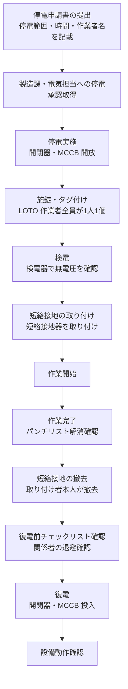

# 停電作業

## 30秒まとめ

停電作業の絶対原則は「開放 → **施錠（LOTO）** → 検電 → 短絡接地 → 作業 → 接地撤去 → 復電」の順序を守ること。**施錠しないまま検電・接地に入らない**（誰でも再投入できる状態で充電部に近づくことになる）。「停電しているはず」は危険——必ず検電器で確認する。

---

## 停電作業の全体フロー


```mermaid
flowchart TD
    A[停電申請書の提出\n停電範囲・時間・作業者名を記載] --> B[製造課・電気担当への停電承認取得]
    B --> C[停電実施\n開閉器・MCCB 開放]
    C --> C2[施錠・タグ付け\nLOTO 作業者全員が1人1個]
    C2 --> D[検電\n検電器で無電圧を確認]
    D --> E[短絡接地の取り付け\n短絡接地器を取り付け]
    E --> F[作業開始]
    F --> G[作業完了\nパンチリスト解消確認]
    G --> H[短絡接地の撤去\n取り付け者本人が撤去]
    H --> I[復電前チェックリスト確認\n関係者の退避確認]
    I --> J[復電\n開閉器・MCCB 投入]
    J --> K[設備動作確認]
```

---

## ロックアウト/タグアウト（LOTO）の実施手順

### LOTO の目的

複数の電源・エネルギー源がある設備で、誰かが作業中に誤って通電・弁開放などをしないように「物理的な錠と警告タグ」で封鎖する。

### 手順

1. **危険エネルギーの特定**：停電すべき電源・閉鎖すべきバルブを全て列挙
2. **機器の停止**：全ての電源・エネルギーを安全な状態に移行
3. **ロックアウト**：各開閉器・ブレーカーに南京錠で施錠（作業者全員が1人1個）
4. **タグアウト**：「作業中・投入禁止」タグを錠とともに取り付け
5. **無電圧の確認**：検電器で電気回路の無電圧を確認する（**電気回路ではこれを先に行う**）
6. **残留エネルギーの放散**：蓄電コンデンサ・ケーブルの放電、スプリングの解放、圧力の解放
7. **ゼロエネルギーの最終確認**：放電後に再度の検電・ゲージ確認

!!! danger "電気回路では「検電」が「放電・接地」より先"
    放電棒・接地棒を当てる行為は**充電部への接触そのもの**です。無電圧を確認しないまま放電操作に入ると、充電されたままの導体に触れることになります。
    一方、圧力・ばね・位置エネルギーなど**非電気の蓄積エネルギー**は、遠隔の弁・ブロック等で先に開放して構いません。順序が問題になるのは「素手側が充電部に近づく操作」だけです。
    この順序は [ロックアウト／タグアウト](../10-safety/lockout-tagout.md) および [制御盤撤去ガイドライン](../guidelines/seigyoban-tekkyo-guideline.md) と一致させています。

!!! danger "他人の錠を外すことは絶対禁止"
    LOTO の錠は作業者が施錠し、必ず本人が外す。他人の錠を外すことは作業者の安全を直接脅かす行為であり、事故の直因となる。

---

## 検電器の使い方

| 種類 | 特徴 | 使用場面 |
|------|------|---------|
| 接触型（ネオン管式） | 安価・単純・電源不要 | 低圧（AC100/200V）確認 |
| 非接触型（電子式） | 電界検出・接触不要 | 低圧の安全確認（ただし誤検知注意） |
| 高圧検電器 | 6.6kV 対応・絶縁棒付き | 高圧設備の無電圧確認 |

### 使用前の動作確認

```
1. 検電器の電池残量確認（電子式）
2. 既知の活線部分でテスト（「反応すること」を確認してから使う）
3. 停電対象に検電し「無電圧」を確認
4. 再度活線部分で確認（検電器が機能していることを確認）
```

!!! warning "検電器は正常動作を前後に確認"
    停電対象だけに当てて「反応なし = 停電」と判断するのは危険。前後に活線への確認を行い、検電器が正常に機能していることを確認してから無電圧判断を行う。

---

## 短絡接地の実施

停電後も誘導電圧・誤投入に備え、作業前に短絡接地を取り付ける。

### 短絡接地の手順

1. 検電で無電圧を確認
2. 短絡接地器の接地側（緑）を接地母線に接続
3. 短絡接地器の充電側を各相に接続（接触を確実に）
4. 作業中は常時取り付けたまま

### 短絡接地器の選定

- 予想最大短絡電流に耐える容量を持つ短絡接地器を使用
- 接地線の断面積が十分なものを選ぶ（細い接地線は事故時に溶断する）

---

## 復電前チェックリスト

| 確認項目 | 確認方法 |
|---------|---------|
| 短絡接地の撤去確認 | 取り付け者本人が確認・取り外し記録 |
| 全作業者の退避確認 | 声掛け・人員点呼 |
| 工具・材料の残置なし | 目視確認 |
| 盤扉・端子カバーの取り付け | 目視確認 |
| MCCB・開閉器の状態 | 投入位置になっていること |
| LOTO の解除 | 全員の錠・タグを外したことを確認 |
| 関係設備への影響確認 | 製造課への連絡・確認 |

---

## 高圧ガス保安法の「停止工事」届出が必要なケース

| ケース | 手続きの要否 |
|-------|----------|
| 高圧ガス製造設備に係る電気設備の修理・改造 | 要確認（工事内容・規模による） |
| 安全装置の一時停止を伴う工事 | 代替措置の届出が必要な場合あり |
| 制御系の変更・改造工事 | 変更許可（第一種製造者）または変更届出（第二種製造者）が必要な場合あり |
| 消耗品交換（同等品への交換） | 軽微変更届（工事完成後の事後届出）または手続き不要の場合が多い |

不明な場合は工場保安担当者・都道府県高圧ガス担当部署に事前確認する。

---

## 根拠

- **停電作業の法定措置**: 労働安全衛生規則（昭和47年労働省令第32号）**第339条第1項**。e-Gov 法令検索の現行条文で **2026-08-01 に逐語照合**しました。本ページのフローとの対応は次のとおりです。
    - 施錠・タグ付け → **第一号**（開路に用いた開閉器に、作業中、施錠し、**若しくは**通電禁止に関する所要事項を表示し、**又は**監視人を置くこと）。条文上は**施錠・表示・監視人の選択制**で、「作業者全員が 1 人 1 個施錠する」のは条文より厳しい実務・社内基準です（詳細は [ロックアウト／タグアウト](../10-safety/lockout-tagout.md) が正典）
    - 残留エネルギーの放散（電気） → **第二号**(電力ケーブル・電力コンデンサー等の残留電荷の放電)
    - 検電・短絡接地 → **第三号**。条文が検電と短絡接地を義務づけるのは**高圧又は特別高圧であった電路**で、文言も「検電器具により停電を確認し、かつ…短絡接地」の順です。低圧では条文上の義務ではありませんが、本ページでは安全側の実務として検電を必須にしています
    - 復電前チェック（短絡接地の撤去確認・退避確認） → **第2項**（通電しようとするときは、感電の危険のおそれがないこと**及び短絡接地器具を取りはずしたこと**を確認した後でなければ行ってはならない）
- **断路器等の誤操作防止**: 同**第340条**（負荷電流を遮断するためのものでない開閉器は、パイロットランプ・タブレット等で無負荷を確認させる）。同日照合。
- **法定でない実務事項**: 停電申請書・製造課の承認フロー、検電器の前後動作確認、短絡接地器の容量選定、復電前チェックリストの項目立ては法令ではなく実務・社内手順です。検電器・短絡接地器具の仕様は製造者の取扱説明書によってください。
- **高圧ガス保安法の手続き**: 変更許可（第一種製造者＝法第14条第1項）・事前届出（第二種製造者＝同条第4項）・軽微変更の事後届出（同条第2項）の区分と条文照合は [規格・法規](../04-sekkei/standards.md) の根拠節が正典です。本ページの表は目安であり、「停止工事」という語も法令用語ではありません。
- **LOTO（ロックアウト/タグアウト）という枠組み自体**は日本の法令用語ではなく、米国 OSHA 29 CFR 1910.147 等に由来する実務です（同規則は米国の連邦規則で、国内での法的拘束力はありません）。

## 関連ページ

- [他部門調整ノウハウ](coordination.md) — 停電承認取得・製造課への影響説明・事前連絡のタイムライン
- [定期点検](periodic-inspection.md) — 停電作業中に実施する年次点検項目と記録方法
- [絶縁管理](insulation-management.md) — 停電後に実施するケーブル・電動機の絶縁抵抗測定
- [測定器の使い方](instruments.md) — 停電作業で使用する検電器の種類・使用前確認方法
- [規格・法規](../04-sekkei/standards.md) — 停電作業の法的根拠（労働安全衛生法・高圧ガス保安法）
- [設備投資フロー](../04-sekkei/investment-flow.md) — 改造工事を伴う停電作業時の施工安全管理との連携
- [保護リレー試験手順](../guidelines/protective-relay-test.md) — 停電状態で実施する保護継電器試験の手順・CT二次開放防止の注意点
