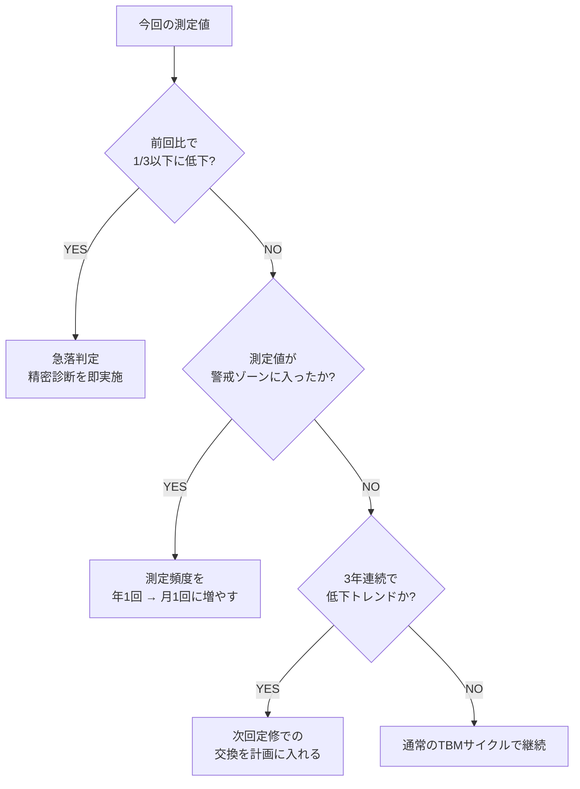

# データ活用・予兆保全

## 30秒まとめ

予兆保全のゴールは「感覚で判断していたことを数値化する」こと。絶縁抵抗が 1 MΩ を下回ったら要注意、0.1 MΩ で交換検討の目安。
モーターの電流値が定格比 110% を超えたら劣化サイン。振動速度が 4.5 mm/s 超えで精密診断が必要。
まずExcelで記録を始めることが予兆保全の第一歩。完璧なシステムより継続できるシンプルな仕組みを作る。

---

## TBM vs CBM：どちらをいつ使うか

| 保全方式 | 定義 | メリット | デメリット |
|---------|------|---------|---------|
| **TBM**（時間基準保全） | 一定期間ごとに交換・点検 | 計画しやすい・保全作業が予測可能 | 劣化していなくても交換する無駄が出る |
| **CBM**（状態基準保全） | 状態の変化を検知して対処 | 実際の劣化に対応・交換タイミングを最適化 | 測定・記録のコストがかかる |

**使い分けの基準（2軸マトリクス）**：

| | 故障したら困る（重要度 高） | 故障してもすぐ対処できる（重要度 低） |
|---|---|---|
| **状態を測定できる** | → CBM（予兆保全） | → TBM（定期交換）でも可 |
| **状態を測定できない** | → TBM（定期交換）+ 予備品確保 | → 故障対応（事後保全） |

CBMに向いている設備：電動機・変圧器・高圧ケーブル・計装機器など、絶縁抵抗・電流・振動・温度で状態がわかるもの。

---

## 絶縁抵抗トレンド管理

### 測定条件の統一ルール（5項目）

| 条件 | 記録方法 | 理由 |
|------|---------|------|
| 測定時の気温・湿度 | 温湿度計で記録 | 絶縁抵抗は湿度で大きく変わる |
| 機器の温度（冷間 or 熱間） | 停止後の経過時間を記録 | 温度が高いと絶縁抵抗は低く出る |
| 測定電圧 | 低圧: 500V / 高圧: 1000V | 電圧が違うと比較できない |
| 測定時間 | 1分値を基本とする | JIS C 1302準拠 |
| 測定箇所 | 端子番号・相（R/S/T-E）を記録 | 同じ箇所を毎回測る |

### 絶縁抵抗の判定基準

**低圧電動機（200V系）**：

| 状態 | 測定値 | 対応 |
|------|-------|------|
| 良好 | 10 MΩ 以上 | 通常運転継続 |
| 注意 | 1〜10 MΩ | 半年以内に再測定 |
| 警戒 | 0.1〜1 MΩ | 月1回測定、早期の交換計画立案 |
| 危険 | 0.1 MΩ 未満 | 即停止・点検、通電継続禁止 |

**高圧電動機（3.3kV / 6.6kV系）**：

| 状態 | 測定値（1分値） | 対応 |
|------|-------------|------|
| 良好 | 100 MΩ 以上 | 通常運転継続 |
| 注意 | 10〜100 MΩ | 半年以内に再測定 |
| 警戒 | 1〜10 MΩ | 精密診断（PI値・吸収比）を実施 |
| 危険 | 1 MΩ 未満 | 即停止・精密点検 |

!!! warning "絶縁抵抗の急落（前回比 1/10 以下）は緊急サイン"
    値の絶対値より「変化速度」の方が重要。前回測定から短期間で 1/10 以下に急落した場合は、設定値内でも即精密点検を行う。

### 「そろそろ交換」の判断フロー



---

## 電力デマンドデータから読む設備劣化

### モーター負荷電流の長期トレンド

**劣化メカニズム別の電流変化パターン**：

| 劣化原因 | 電流の変化 | 追加確認事項 |
|---------|-----------|-----------|
| 軸受け劣化 | 漸増（定格比 105〜110% 以上） | 振動・温度の同時確認 |
| 負荷の増加（設備側） | 漸増 | プロセス量・ポンプ揚程の確認 |
| 電圧低下（電源側） | 増加 | 端子電圧の確認 |
| 巻線劣化（短絡） | 3相不平衡が拡大 | 相電流の差が 5% 以上で精密診断 |

**判定基準**：

- 定格電流比 105% → 注意域（月1回監視）
- 定格電流比 110% → 警戒域（週1回監視、早期点検計画）
- 定格電流比 115% 以上 → 危険域（即精密点検）

### 異常なデマンドピークの解釈

| パターン | 判断方法 | 次のアクション |
|---------|---------|-------------|
| 大型モーターの起動電流 | 起動時刻と重なる | 起動タイミングの分散を検討 |
| 設備の劣化による効率低下 | 生産量が変わらずデマンドが増加 | 該当設備の負荷電流を測定 |
| インバータ設定ミス | 特定インバータ稼働中に増加 | 出力・周波数設定を確認 |
| 別ラインの起動スケジュール変更 | 生産計画変更と時期が一致 | 製造課に確認 |

---

## 振動・温度による状態監視

### 簡易CBMで使えるツール

| ツール | 測定対象 | 価格帯 | 判断できること |
|-------|---------|-------|-------------|
| クランプメータ | 負荷電流 | 3〜10万円 | モーター劣化・過負荷 |
| 放射温度計 | 軸受け温度 | 1〜3万円 | 軸受け劣化・潤滑不良 |
| 振動計（簡易） | 振動速度 mm/s | 5〜20万円 | 軸受け劣化・アンバランス |
| 絶縁抵抗計 | 絶縁抵抗 MΩ | 3〜10万円 | 絶縁劣化・汚損 |

### 振動速度の判定基準（ISO 10816準拠）

小型機械（15kW以下の電動機）の目安：

| 振動速度（RMS） | 状態 | 対応 |
|--------------|------|------|
| 2.3 mm/s 以下 | 良好 | 継続使用 |
| 2.3〜4.5 mm/s | 注意 | 次回定修で点検 |
| 4.5〜7.1 mm/s | 警戒 | 早期精密診断 |
| 7.1 mm/s 超 | 危険 | 即停止・点検 |

**温度判定の測定箇所と基準**：

| 測定箇所 | 警告温度 | 危険温度 |
|---------|---------|---------|
| 電動機軸受け（外面） | 70°C | 90°C |
| インバータ放熱フィン | 60°C | 80°C |
| 変圧器外箱 | 60°C | 80°C |
| ブレーカー端子 | 55°C | 75°C |

!!! tip "放射温度計は「同じ設備を同じ角度で」測る習慣を作る"
    同じ条件で測ることで「前回より○°C上昇」という比較が意味を持つ。測定箇所の写真と共に記録すると比較しやすい。

---

## CBM実装ステップ（ゼロからの始め方）

### Step 1：対象機器の選定

| 機器 | 重要度 | 測定可否 | 優先度 |
|------|-------|---------|-------|
| 主要ライン駆動モーター | 高（ライン停止） | 可 | → CBM最優先 |
| 高圧変圧器 | 高（全停電） | 可 | → CBM最優先 |
| 非常用発電機 | 高（停電時バックアップ） | 可 | → CBM優先 |
| 照明用安定器 | 低 | 困難 | → TBM（寿命交換） |

### Step 2：記録システムの作り方（Excelで十分）

最低限必要な列：

```
設備名 | 測定日 | 気温 | 湿度 | 絶縁抵抗(MΩ) | 負荷電流(A) | 振動(mm/s) | 軸受温度(°C) | 判定 | 特記事項
```

**運用のコツ**：

- 月1回の測定日を固定する（例：毎月第1月曜日の午前中）
- 前回値との比較欄を追加し、変化率を自動計算する
- 警告値を超えたセルを赤くなる条件付き書式を設定する

### Step 3：生成AIを活用したトレンド分析

ExcelデータをChatGPT/ClaudeにコピーしてAI分析を活用する具体的な指示例：

```
指示例1: 絶縁抵抗の急落・継続低下トレンドの特定
「以下の絶縁抵抗データを分析し、警戒が必要な設備を特定してください。
急落（前回比 1/3 以下）と継続低下トレンドの両方を確認してください。」

指示例2: 負荷電流異常の抽出
「モーター負荷電流の月次データから、定格電流比で異常なものを抽出し、
劣化の可能性が高い順にランキングしてください。」

指示例3: 振動基準判定
「以下の振動測定データについて、ISO 10816基準で判定し、
精密診断が必要なものを指摘してください。」
```

!!! info "CBMはまず「記録を始める」ことが全て"
    完璧な管理システムを作ろうとして始められないよりも、Excelで月1回の記録を続ける方が100倍価値がある。3年分のデータが溜まると、トレンドが見え始め予兆が掴めるようになる。

---

## 関連記事リンク

- [絶縁管理](insulation-management.md) — 絶縁抵抗の測定手順・記録様式の詳細はこちら（なぜつながるか：測定値の解釈基準が共通）
- [寿命管理](lifetime.md) — CBMで判定した機器の更新計画立案の方法はこちら（なぜつながるか：予兆検知 → 交換計画の連携）
- [測定器の使い方](instruments.md) — クランプメータ・放射温度計・振動計の具体的な使い方はこちら（なぜつながるか：CBMの測定ツールを網羅）
- [保全体系](maintenance-system.md) — TBM/CBM/PDMの全体的な考え方はこちら（なぜつながるか：本記事はCBMの実装詳細、体系理解はこちら）
