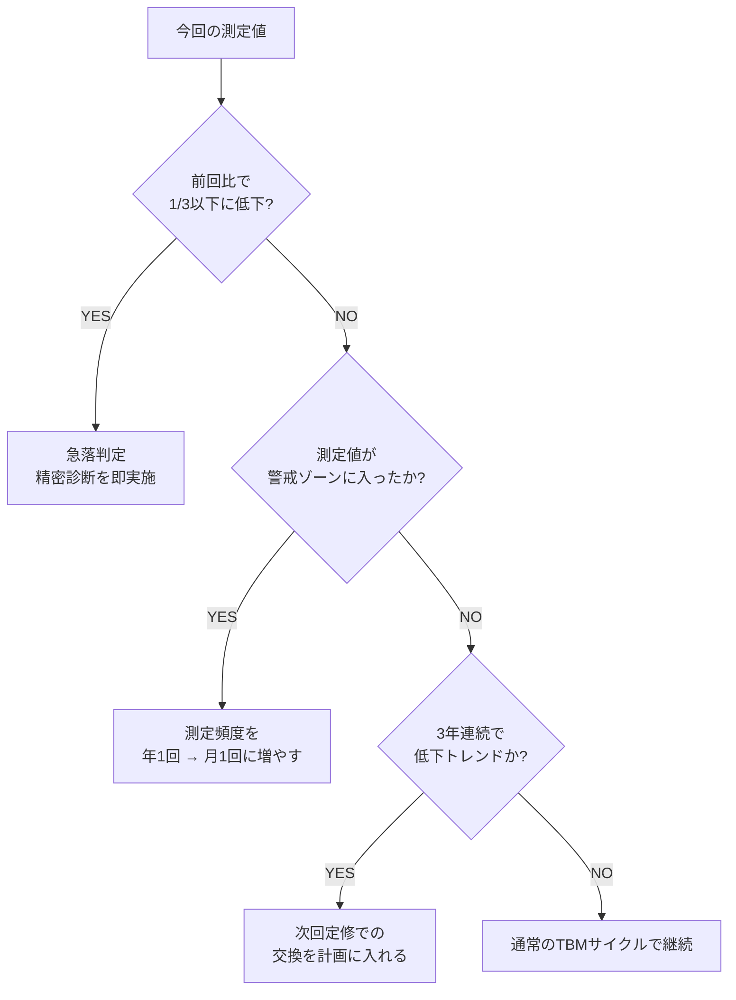

# データ活用・予兆保全

## 30秒まとめ

予兆保全のゴールは「感覚で判断していたことを数値化する」こと。絶縁抵抗が 1 MΩ を下回ったら要注意、0.1 MΩ で交換検討の目安。
モーターの電流値が定格比 110% を超えたら劣化サイン。振動速度が 4.5 mm/s 超えで精密診断が必要。
まずExcelで記録を始めることが予兆保全の第一歩。完璧なシステムより継続できるシンプルな仕組みを作る。

---

## TBM vs CBM：どちらをいつ使うか

| 保全方式 | 定義 | メリット | デメリット |
|---------|------|---------|---------|
| **TBM**（時間基準保全） | 一定期間ごとに交換・点検 | 計画しやすい・保全作業が予測可能 | 劣化していなくても交換する無駄が出る |
| **CBM**（状態基準保全） | 状態の変化を検知して対処 | 実際の劣化に対応・交換タイミングを最適化 | 測定・記録のコストがかかる |

**使い分けの基準（2軸マトリクス）**：

| | 故障したら困る（重要度 高） | 故障してもすぐ対処できる（重要度 低） |
|---|---|---|
| **状態を測定できる** | → CBM（予兆保全） | → TBM（定期交換）でも可 |
| **状態を測定できない** | → TBM（定期交換）+ 予備品確保 | → 故障対応（事後保全） |

CBMに向いている設備：電動機・変圧器・高圧ケーブル・計装機器など、絶縁抵抗・電流・振動・温度で状態がわかるもの。

---

## 絶縁抵抗トレンド管理

### 測定条件の統一ルール（5項目）

| 条件 | 記録方法 | 理由 |
|------|---------|------|
| 測定時の気温・湿度 | 温湿度計で記録 | 絶縁抵抗は湿度で大きく変わる |
| 機器の温度（冷間 or 熱間） | 停止後の経過時間を記録 | 温度が高いと絶縁抵抗は低く出る |
| 測定電圧 | 低圧: 500V / 高圧（6.6kV 機器）: 5000V | 電圧が違うと比較できない |
| 測定時間 | 1分値を基本とする | 通電時間で値が動くため毎回そろえる（正典: [絶縁管理](insulation-management.md)） |
| 測定箇所 | 端子番号・相（R/S/T-E）を記録 | 同じ箇所を毎回測る |

### 絶縁抵抗の判定基準

**低圧電動機（200V系）**：

| 状態 | 測定値 | 対応 |
|------|-------|------|
| 良好 | 1 MΩ 以上 | 通常運転継続 |
| 要注意 | 0.5〜1 MΩ | 半年以内に再測定、トレンド監視強化 |
| 危険 | 0.5 MΩ 未満 | 即停止・点検、通電継続禁止 |

!!! info "絶対値の判定基準は絶縁管理ページを参照"
    絶縁抵抗の絶対値の合否基準（法定最低値・実務管理値・メガー印加電圧）は [絶縁管理](insulation-management.md) を正典とする。本ページはトレンド監視（前回比の変化）を主眼とし、判定境界値は絶縁管理ページに統一している。新品電動機は 5〜10 MΩ 程度あるが、実務管理値の「良好」境界は 1 MΩ 以上。

**高圧電動機（3.3kV / 6.6kV系）**：

判定境界は [絶縁管理](insulation-management.md) が正典で、**「設備電圧 [kV] + 1 [MΩ] 以上」**（6.6 kV 機なら 7.6 MΩ 以上）を良好の目安とします。本ページでは値を再掲しません。

!!! warning "「100 MΩ 以上＝良好」の4段表を使わない（2026-08-06 是正）"
    本ページはかつて高圧電動機を「100 MΩ 以上＝良好／10〜100＝注意／1〜10＝警戒／1 MΩ 未満＝危険」の独自表で判定していましたが、**正典と物差しが食い違います**。正典（設備電圧 [kV] + 1 MΩ）では 6.6 kV 機の良好境界は 7.6 MΩ なので、旧表では**正典が「良好」とする 7.6〜10 MΩ を「警戒」と判定**してしまいます。同じ機械に2つの基準を置かないため、正典参照に一本化しました（同型の表は [モータートラブル](../06-trouble/motor.md) からも除去済み）。
    なお高圧機では**絶対値より PI 値（成極指数）とトレンド**が主役です（下記）。

!!! warning "絶縁抵抗の急落（前回比 1/10 以下）は緊急サイン"
    値の絶対値より「変化速度」の方が重要。前回測定から短期間で 1/10 以下に急落した場合は、設定値内でも即精密点検を行う。

### 「そろそろ交換」の判断フロー


```mermaid
flowchart TD
    A[今回の測定値] --> B{前回比で\n1/3以下に低下?}
    B -- YES --> C[急落判定\n精密診断を即実施]
    B -- NO --> D{測定値が\n警戒ゾーンに入ったか?}
    D -- YES --> E[測定頻度を\n年1回 → 月1回に増やす]
    D -- NO --> F{3年連続で\n低下トレンドか?}
    F -- YES --> G[次回定修での\n交換を計画に入れる]
    F -- NO --> H[通常のTBMサイクルで継続]
```

---

## 電力デマンドデータから読む設備劣化

### モーター負荷電流の長期トレンド

**劣化メカニズム別の電流変化パターン**：

| 劣化原因 | 電流の変化 | 追加確認事項 |
|---------|-----------|-----------|
| 軸受け劣化 | 漸増（定格比 105〜110% 以上） | 振動・温度の同時確認 |
| 負荷の増加（設備側） | 漸増 | プロセス量・ポンプ揚程の確認 |
| 電圧低下（電源側） | 増加 | 端子電圧の確認 |
| 巻線劣化（短絡） | 3相不平衡が拡大 | 相電流の差が 5% 以上で精密診断 |

**判定基準**：

- 定格電流比 105% → 注意域（月1回監視）
- 定格電流比 110% → 警戒域（週1回監視、早期点検計画）
- 定格電流比 115% 以上 → 危険域（即精密点検）

### 異常なデマンドピークの解釈

| パターン | 判断方法 | 次のアクション |
|---------|---------|-------------|
| 大型モーターの起動電流 | 起動時刻と重なる | 起動タイミングの分散を検討 |
| 設備の劣化による効率低下 | 生産量が変わらずデマンドが増加 | 該当設備の負荷電流を測定 |
| インバータ設定ミス | 特定インバータ稼働中に増加 | 出力・周波数設定を確認 |
| 別ラインの起動スケジュール変更 | 生産計画変更と時期が一致 | 製造課に確認 |

---

## 振動・温度による状態監視

### 簡易CBMで使えるツール

| ツール | 測定対象 | 価格帯 | 判断できること |
|-------|---------|-------|-------------|
| クランプメータ | 負荷電流 | 3〜10万円 | モーター劣化・過負荷 |
| 放射温度計 | 軸受け温度 | 1〜3万円 | 軸受け劣化・潤滑不良 |
| 振動計（簡易） | 振動速度 mm/s | 5〜20万円 | 軸受け劣化・アンバランス |
| 絶縁抵抗計 | 絶縁抵抗 MΩ | 3〜10万円 | 絶縁劣化・汚損 |

### 振動速度の判定目安

小型機械（15 kW 以下の電動機）に対して本 Wiki が使う目安です。**規格値ではありません**（下記「根拠」参照）。

| 振動速度（RMS） | 状態 | 対応 |
|--------------|------|------|
| 2.3 mm/s 以下 | 良好 | 継続使用 |
| 2.3〜4.5 mm/s | 注意 | 次回定修で点検 |
| 4.5〜7.1 mm/s | 警戒 | 早期精密診断 |
| 7.1 mm/s 超 | 危険 | 即停止・点検 |

!!! warning "この表を「ISO 10816 準拠」として持ち出さない（原本未照合）"
    かつて本ページはこの表に「ISO 10816準拠」と付していましたが、**同規格の原本を本 Wiki では照合していません**。規格は機械の**クラス（出力・据付剛性）ごと**に評価領域を与える構造で、1枚の表がどのクラスに対応するかを特定できません。加えて ISO 10816 系は **ISO 20816 系**（ISO 20816-1:2016 ほか）への置き換えが進んでおり、規格番号自体が古い可能性があります。判定値は必ず**機器メーカーの推奨値と社内基準**で確定してください。

**温度判定の測定箇所と基準**：

| 測定箇所 | 警告温度 | 危険温度 |
|---------|---------|---------|
| 電動機軸受け（外面） | 70°C | 90°C |
| インバータ放熱フィン | 60°C | 80°C |
| 変圧器外箱 | 60°C | 80°C |
| ブレーカー端子 | 55°C | 75°C |

!!! tip "放射温度計は「同じ設備を同じ角度で」測る習慣を作る"
    同じ条件で測ることで「前回より○°C上昇」という比較が意味を持つ。測定箇所の写真と共に記録すると比較しやすい。

---

## CBM実装ステップ（ゼロからの始め方）

### Step 1：対象機器の選定

| 機器 | 重要度 | 測定可否 | 優先度 |
|------|-------|---------|-------|
| 主要ライン駆動モーター | 高（ライン停止） | 可 | → CBM最優先 |
| 高圧変圧器 | 高（全停電） | 可 | → CBM最優先 |
| 非常用発電機 | 高（停電時バックアップ） | 可 | → CBM優先 |
| 照明用安定器 | 低 | 困難 | → TBM（寿命交換） |

### Step 2：記録システムの作り方（Excelで十分）

最低限必要な列：

```text
設備名 | 測定日 | 気温 | 湿度 | 絶縁抵抗(MΩ) | 負荷電流(A) | 振動(mm/s) | 軸受温度(°C) | 判定 | 特記事項
```

**運用のコツ**：

- 月1回の測定日を固定する（例：毎月第1月曜日の午前中）
- 前回値との比較欄を追加し、変化率を自動計算する
- 警告値を超えたセルを赤くなる条件付き書式を設定する

### Step 3：生成AIを活用したトレンド分析

ExcelデータをChatGPT/ClaudeにコピーしてAI分析を活用する具体的な指示例：

```text
指示例1: 絶縁抵抗の急落・継続低下トレンドの特定
「以下の絶縁抵抗データを分析し、警戒が必要な設備を特定してください。
急落（前回比 1/3 以下）と継続低下トレンドの両方を確認してください。」

指示例2: 負荷電流異常の抽出
「モーター負荷電流の月次データから、定格電流比で異常なものを抽出し、
劣化の可能性が高い順にランキングしてください。」

指示例3: 振動基準判定
「以下の振動測定データについて、社内の判定基準（別途貼付）で判定し、
精密診断が必要なものを指摘してください。」
```

!!! info "CBMはまず「記録を始める」ことが全て"
    完璧な管理システムを作ろうとして始められないよりも、Excelで月1回の記録を続ける方が100倍価値がある。3年分のデータが溜まると、トレンドが見え始め予兆が掴めるようになる。

---

## 根拠

### 「1分値は JIS C 1302準拠」という帰属を撤回（2026-08-03 是正）

**JIS C 1302 は絶縁抵抗計（計器）の規格**であり、測定手順の 1 分値を定めるものとは確認できていません。同規格は有償・**原本未照合**であることを [絶縁管理](insulation-management.md) の根拠節が既に明示しており、本ページだけが「準拠」と断定していたため撤回しました。

1 分値を採る理由は規格の要求ではなく、**絶縁抵抗が通電時間とともに動く（吸収電流が減衰する）ため、比較するには同じ時間で読む必要がある**という測定上の理由です。トレンド管理では時間をそろえること自体が本質で、1 分か 10 分かは社内で決めて固定すれば足ります。

### 振動判定表の「ISO 10816準拠」を撤回し、ページ間不一致を解消

本ページは「良好 2.3 mm/s 以下」、[高圧電動機](../01-koatsu/hv-motor.md) は「ISO 10816 基準。速度 RMS 2.8 mm/s 以下（良好）」と、**同じ規格を挙げながら良否境界が食い違っていました**。ISO 10816／20816 の原本を本 Wiki では照合していないため、**どちらが正しいかを一次資料で決められません**。

そこで、値を推測で「訂正」せず次の扱いにしました。

- 本ページの表は**本 Wiki の実務目安**であることを明示し、規格への帰属を外す
- 高圧電動機ページは数値の再記述をやめ、**本ページを参照**する（R6: 同じ数値を複数ページに書かない）
- **判定値の確定はメーカー推奨値と社内基準による**ことを本文の警告に明記

### 絶縁抵抗の判定境界は絶縁管理ページが正典

低圧電動機の「1 MΩ 以上＝良好／0.5〜1 MΩ＝要注意／0.5 MΩ 未満＝危険」は [絶縁管理](insulation-management.md) と一致していることを 2026-08-03 に確認しました。同ページが正典で、**法定最低値（電技省令第58条の 0.1／0.2／0.4 MΩ）とは別物**である点も同ページが扱います。本ページはトレンド（前回比の変化）を主眼にしています。

**高圧電動機側は 2026-08-06 に是正**しました。低圧側だけ正典参照にして**高圧側に独自の4段表（100／10／1 MΩ）を残していた**ため、正典（設備電圧 [kV] + 1 [MΩ] 以上）と判定が食い違っていました。`grep -rn "MΩ" docs/` で絶縁抵抗値を持つページを横断監査して発見したもので、同型は [モータートラブル](../06-trouble/motor.md)（2026-08-05 是正済み）と本ページの2件でした。**正典参照に切り替えるときは、ページ内の全ての電圧区分を同時に切り替える**（片側だけ残すと、正典があるのに食い違うという最も見つけにくい状態になる）。

### 実務慣行（規格・法令の裏付けなし）

- 急落判定の「前回比 1/3 以下」「1/10 以下」（**高圧電動機の 100／10／1 MΩ の区分は 2026-08-06 に撤去**。判定境界は正典 [絶縁管理](insulation-management.md) の「設備電圧 [kV] + 1 [MΩ] 以上」に一本化）
- 負荷電流の 105／110／115 % の域、3相不平衡「5 % 以上」
- 温度判定（軸受 70／90 ℃、放熱フィン 60／80 ℃、変圧器外箱 60／80 ℃、端子 55／75 ℃）
- TBM / CBM の2軸マトリクス、CBM 実装ステップ

### 原本未照合（honest-hold）

- **ISO 10816 / ISO 20816 系**は有償で未照合。規格番号・年号・クラス区分・評価領域の値のいずれも本 Wiki では引用しません
- **JIS C 1302（絶縁抵抗計）・IEEE Std 43** も未照合（[絶縁管理](insulation-management.md) の根拠節と同じ扱い）
- **測定ツールの価格帯（1〜20 万円）は 2026 年時点の概算**で、出典はありません。陳腐化します

### 限界の明示

- 本ページの判定値は**トレンドの異常を拾うための入口**です。停止・交換の最終判断は精密診断とメーカー所見によってください
- 生成 AI にデータを渡す手順は考え方の例示です。**設備データの外部サービスへの入力可否は社内規程に従ってください**（[生成AI](../11-genai/index.md)）

### 正典参照

| 項目 | 正典 |
|---|---|
| 絶縁抵抗の合否境界・メガー印加電圧・温度換算 | [絶縁管理](insulation-management.md) |
| 高圧電動機の軸受・絶縁の管理項目 | [高圧電動機](../01-koatsu/hv-motor.md) |
| TBM / CBM / PDM の体系と設備重要度 | [保全体系](maintenance-system.md) |
| 測定器の使い方 | [測定器の使い方](instruments.md) |
| 熱画像による面的な過熱検出 | [サーモグラフィ診断](thermography.md) |

照合日: 2026-08-03。

---

## 関連ページ

- [絶縁管理](insulation-management.md) — 絶縁抵抗の測定手順・記録様式の詳細（測定値の解釈基準が共通）
- [寿命管理](lifetime.md) — CBM で判定した機器の更新計画立案の方法（予兆検知 → 交換計画の連携）
- [サーモグラフィ診断](thermography.md) — 通電中・非接触の熱画像で接続部過熱や偏流を面的に検出（CBM の測定手段の一つ）
- [測定器の使い方](instruments.md) — クランプメータ・放射温度計・振動計の具体的な使い方（CBM の測定ツールを網羅）
- [保全体系](maintenance-system.md) — TBM/CBM/PDM の全体的な考え方（本記事は CBM の実装詳細、体系理解はこちら）
- [定期点検](periodic-inspection.md) — 点検データを CBM トレンド管理に転用するための記録方法
- [設備投資フロー](../04-sekkei/investment-flow.md) — CBM データで劣化が確認された設備の更新投資・稟議フロー
