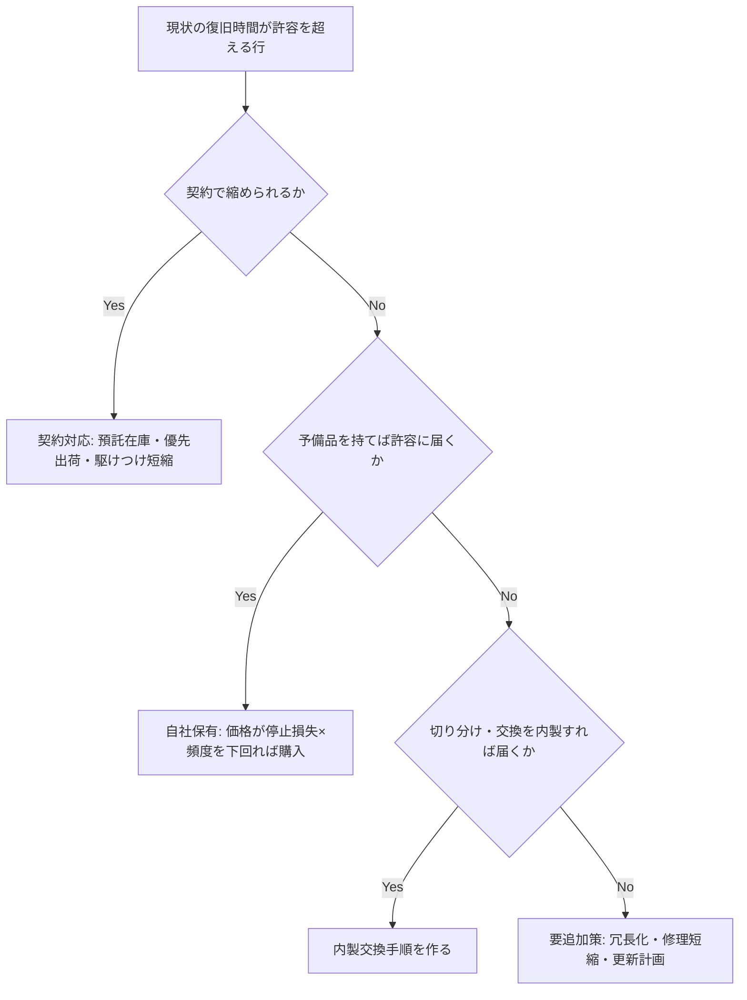

# 復旧性管理

## 30秒まとめ

重要度ランクは「止まると困る設備」を決めますが、「何時間で戻せるか」は決めません。復旧性管理は、A ランク設備ごとに **現状の復旧時間 ＝ 到着 ＋ 診断 ＋ 部品納期 ＋ 修理** を数字で持ち、契約・予備品・手順・担当者でその数字を縮める活動です。トラブル時に協力会社やメーカーを待つしかない状態は、技能不足ではなく**この表が無い**ことから始まります。

---

## なぜ重要度ランクだけでは復旧できないか

設備の重要度は「影響度」と「復旧性」の 2 軸の積で決まります。多くの工場では影響度（止まると生産にどう効くか）は製造部門がランク付けしていますが、復旧性（誰が・何時間で・何が要るか）は誰も持っていません。

| 軸 | 内容 | 持ち主 | 状態の例 |
|---|---|---|---|
| 影響度 | 止まると生産・安全・環境にどう効くか | 製造部門 | A/B/C ランクとして整備済み |
| 復旧性 | 誰が・何時間で直せるか。部品納期、契約、代替手段 | 保全部門（電気計装） | **未整備**。故障して初めて納期を知る |

製造部門は部品納期もベンダー依存度も知る立場にありません。復旧性の列を足せるのは保全側だけです。「A ランクなのに予備品が無い」「メーカー待ちで 2 週間止まった」は、ランクが無いのではなく、ランクが復旧性に接続されていない症状です。

ランクの定義と保全方式の使い分けは [保全体系](maintenance-system.md) が正典です。本ページはランクを再定義しません。

---

## 復旧境界を先に決める

全部を自分たちで直す必要はありません。分けるべきは「診断と判断」と「修理」です。

| 担当 | 受け持つこと |
|---|---|
| 製造部門の現場 | 日常点検、異常の一次報告、隔離・安全処置、発生時刻と復旧時刻の記録 |
| 保全（電気計装） | 故障箇所の切り分け、予備品交換、手順書の作成・更新、ベンダー呼出の代行と立会い、復旧性表の維持 |
| 協力会社・メーカー | 基板・機器内部の修理、専用ツールを要する調整、保全の立会いの下での作業 |

目標は「原因特定・隔離・予備品交換までは自分たち、内部修理は外部」という境界の明文化です。基板内部の修理までメーカーに依存するのは経済合理的ですが、故障箇所の切り分けもできずメーカーが来るまで何が壊れたか分からない状態は、復旧時間を丸ごと外部に預けています。

!!! warning "現場に交換をお願いするのは第 2 段階"
    予備品交換を製造部門の現場に置くのは、「手順書がある・無電圧で作業できる・非防爆区域」の範囲に限り、安全部門の確認を取ってからにします。第 1 案は保全の担当者が交換する運用です。電気作業の資格要件と作業許可は [作業許可証（PTW）](../guidelines/work-permit.md)・[ロックアウト・タグアウト](../10-safety/lockout-tagout.md) に従います。

初動の手順そのもの（安全確認・第一報・エスカレーション）は [トラブル初動対応フロー](../guidelines/trouble-first-response.md) が正典です。本ページは初動の後、「誰をいつ呼ぶか」の判断基準を与えます。

---

## 復旧時間の算式

```text
現状(h)   = 到着 + 診断 + 部品納期 + 修理        ※予備品が有れば 部品納期 = 0
対策後(h) = 対策を打った後に同じ式で再計算
判定      = 対策後 ≦ 許容停止時間 → 達成
            縮んだが許容に届かない → 要追加策
            縮まらない            → 不達
```

| 項 | 決め方 |
|---|---|
| 到着(h) | 修理主体が現場に着くまでの時間。**夜間・休日を含む最悪値**で書く。「翌営業日」契約なら金曜夜の故障で 72 h を超える |
| 診断(h) | 切り分けに要する時間。自分たちで切り分けできない設備は、メーカー到着後の診断時間を入れる |
| 部品納期(h) | 営業日を暦日に換算して h に直す（14 営業日 ≈ 20 暦日 ≈ 480 h）。半導体不足や特注仕様で大きく延びるため、発注実績で更新する |
| 修理(h) | 交換・調整・試運転を含む。予備品を持っても修理時間はゼロにならない |
| 許容停止時間(h) | 製造部門が持つ数字ですが、時間単位の分析を製造部門に求めると止まります。保全側が仮置き（例: A ランク = 8 h）して○×をもらう |

!!! tip "不明と空欄を区別する"
    契約が無い設備の到着時間は取れないことがあります。取れない項は最悪値で仮置きして「仮」の印を付けます。空欄は未着手、不明は仮置き済み、と読めるようにしておかないと、表の充足率が測れません。

---

## 復旧性表

行は製造部門の A ランク設備リストをそのまま使い、1 行 ＝ 1 故障モードにします。設備単位の復旧時間は各モードの最大値です。まず表計算ソフトで埋まることを確認し、設備管理システム（CMMS）への登録は充足率が上がってから判断します。

| 設備 | 故障モード | 修理主体 | 到着 | 診断 | 納期 | 修理 | 予備品 | 現状(h) | 許容(h) | 対策案 | 対策後(h) | 判定 | 担当（正／副） |
|---|---|---|---|---|---|---|---|---|---|---|---|---|---|
| 例: 主電源インバータ | 主回路素子故障 | メーカー | 24 | 2 | 480 | 8 | 無し | 514 | 8 仮 | 自社保有＋内製交換手順 | 11 | 要追加策 | 未割当 |
| 例: 主電源インバータ | 制御基板故障 | メーカー | 24 | 2 | 336 | 4 | 無し | 366 | 8 仮 | 自社保有＋内製交換手順 | 7 | 達成 | 未割当 |
| 例: 温度調節計 | 入力回路故障 | 保全 | 1 | 1 | 120 | 1 | 有り | 3 | 8 仮 | 不要（現状で達成） | 3 | 達成 | 担当者名／副担当名 |

上の 3 行は書き方の例で、架空の値です。1 行目は予備品を持って内製交換しても 到着 1 h ＋ 診断 2 h ＋ 修理 8 h ＝ 11 h で許容 8 h に届きません。この場合「要追加策」と書き、冗長化か修理時間の短縮かを次に検討します。**予備品を買えば解決という筋書きにしない**ことが、この表の役割です。

---

## 対策の優先順位

対策は安い順・可逆な順に検討します。



!!! warning "「納期 ＞ 許容停止時間なら予備品」だけで判定しない"
    許容停止時間が 8 h 級の設備では、納期 8 h 以内の部品はほぼ存在しないため、この 1 条件だけでは A ランク設備の全部品が「要」になります。「広く買わない」と自己矛盾します。判定は「契約で縮められるか → 対策後に許容へ届くか → 価格が停止損失 × 頻度を下回るか」の 3 段で行います。在庫数量・保管条件・廃番対応は [予備品管理](spare-parts.md) が正典です。

---

## 手順書と技能を「次のトラブル」で作る

研修やスキルマップから始めても定着しません。対象が定義されていない教育は、身につける相手がいないからです。技能は復旧性表の空欄を埋める作業と、次の 3 つの機会で付けます。

| 機会 | やること |
|---|---|
| トラブル立会い | メーカーを呼んだとき、担当者が必ず立ち会い、作業を 1 枚手順に落とす。次回は自分でやる |
| 計画保全・定期交換 | 停電点検や定期交換の機会に、同じ交換作業を担当者が実施して手順化する |
| 取扱説明書 | トラブルを待たず、メーカー取説の交換手順から 1 枚手順を起こす。故障しない設備の手順が永遠に埋まらないのを防ぐ |

- **設備担当制（正・副）**: A ランク設備ごとに保全の担当者を 2 名決めます。担当が無いと立会いは毎回「手が空いている人」になり、知識が誰にも溜まりません。24 時間運転の工場では正担当の不在が必ずあるため、副担当が立ち会い、正担当が事後に手順化します
- **スキルマップは台帳として後から作る**: 「どの設備の手順を誰が書き、誰が自走したか」の実績を記録する表として作ります。先に作っても埋まりません

---

## 指標（先行 2・遅行 2）

A ランク設備の故障は半年で数件しか起きません。実績の MTTR（平均修復時間）は月次では母数が無く、内製化の初期はむしろ悪化します（初回は遅い）。チームの作業で動く先行指標を主に置きます。

| 区分 | 指標 | 定義 |
|---|---|---|
| 先行 | 復旧性表の充足率 | 判定・対策案・担当が揃った行 ÷ 全行 |
| 先行 | 対策後(h) 合計の削減 | 表上の「現状」合計と「対策後」合計の差。故障が起きなくても動く |
| 遅行 | 外部を呼ばず復旧した比率 | 故障件数のうち外部を呼ばずに復旧した件数 ÷ 全故障件数。「部品を指定して呼んだ」は別カウント |
| 遅行 | 故障の件別一覧 | 発生・到着・部品着・復旧の 4 時刻から待ち時間を分離した一覧。平均は取らず件別で見る |

「ベンダー呼出件数」を指標にしてはいけません。呼ばなければ下がり、故障が減っても下がり、立会い制度で正式に呼ぶ回数が増えると上がる、操作可能な数字です。MTTR・MTBF の定義式は [保全体系](maintenance-system.md) が正典で、本ページでは再掲しません。

---

## 製造部門との合意の取り方

復旧性表は保全が埋めますが、許容停止時間と初動の分担は製造部門との合意が要ります。伝え方の原則（製造部門の言語で話す・書面に残す）は [他部門調整ノウハウ](coordination.md) が正典です。復旧性管理に固有の 3 点だけ挙げます。

1. **数字を持ってから行く**。「A ランク設備は電気・計装起因で今壊れると最長 X 時間止まります」が言えない段階の提案は、製造部門から見て保全の都合にしか見えません。記録が無ければベンダー見積の納期と駆けつけ時間からの推計でよいので、根拠を添えます
2. **製造部門の作業を最小にする**。許容停止時間は保全が仮置きして○×をもらう。記録は発生時刻と復旧時刻の 2 点だけ、様式は保全が用意する
3. **範囲を正直に言う**。製造部門のランクは設備単位です。電気・計装部分だけ見た数字を設備全体の復旧性として出さず、機械側は未評価と明記します

---

## よくある誤解

- **誤**: メンバーのレベルが上がれば管理できるようになる
  **正**: 管理の仕組み（何を守る設備か・どこまで自分で直すか・何を持つか）が無い状態では、教育しても身につける対象がありません。順番は「仕組み → 実務で回す → その過程でレベルが上がる」です
- **誤**: 自分たちで復旧できないから全部内製化すべき
  **正**: 内部修理の外部依存は合理的です。問題は診断と判断まで外部に預けていることです。復旧境界を決めます
- **誤**: 予備品を管理していないのが問題
  **正**: 何を持つべきか決める基準（許容停止時間と復旧時間の比較）が無いのが問題です。基準なしに予備品リストを作ると、全部持つか何も持たないかの二択になります
- **誤**: 重要度ランクが決まっているから管理されている
  **正**: ランクが行動（予備品・手順・担当）を何も駆動していなければ「分類されている」だけです。A ランク N 台のうち復旧性表が埋まっているのは M 台、と言えるかが管理レベルの実測値です

---

## 根拠

### 本ページが正典の範囲

本ページは「復旧時間の算式・復旧境界・対策の優先順位・先行指標」の正典です。以下は他ページが正典で、本ページでは数値・定義を再掲しません。

| 項目 | 正典 |
|---|---|
| 重要度ランク A/B/C の定義、保全方式（BM/TBM/CBM/PdM）、MTBF・MTTR の定義式 | [保全体系](maintenance-system.md) |
| 予備品の選定軸・在庫数量の式・保管条件・廃番対応 | [予備品管理](spare-parts.md) |
| 部品寿命の目安・計画交換と状態監視の判断 | [寿命管理](lifetime.md) |
| トラブル初動（安全確認・第一報・エスカレーション） | [トラブル初動対応フロー](../guidelines/trouble-first-response.md) |
| 製造部門への伝え方・停電作業の事前連絡 | [他部門調整ノウハウ](coordination.md) |
| 作業許可・ロックアウト | [作業許可証（PTW）](../guidelines/work-permit.md)・[ロックアウト・タグアウト](../10-safety/lockout-tagout.md) |

### 本ページに法定数値は登場しません

復旧時間の算式、許容停止時間の仮置き値（A ランク = 8 h）、営業日から暦日への換算（14 営業日 ≈ 480 h）、対策の 3 段判定、先行・遅行の指標の組み方は、いずれも保全実務の設計手順であり、法令・規格の規定値ではありません。表の 3 行の数値は書き方を示す架空の例です。

| 数値・基準 | 出所 |
|---|---|
| 現状(h) ＝ 到着 ＋ 診断 ＋ 部品納期 ＋ 修理 | 復旧経路が直列（到着 → 診断 → 部品手配 → 修理）であることからの定義。並行して部品を手配できる体制なら、到着と納期の大きい方 ＋ 診断 ＋ 修理 に読み替える |
| 許容停止時間 A ランク = 8 h | 仮置きの例。実値は製造部門の在庫・仕掛・出荷計画で決まる |
| 14 営業日 ≈ 20 暦日 ≈ 480 h | 週休 2 日を挟む暦日換算の例。事業場の休日で変わる |
| 価格 ＜ 停止損失 × 発生頻度 | 費用便益の簡易比較。停止損失の単価は製造部門の概算でよい |
| 24 時間運転で正担当の不在が必ずある | 連続プロセスの化学プラントを前提とした運用上の判断 |

### 限界の明示

- 安全計装システム（SIS）の復旧は、本ページの「予備品交換で復旧」の考え方をそのまま当てはめてはいけません。プルーフテストと変更管理が別系統で要求されます。[SIS・SIL](../03-keiso/sis-sil.md) を参照してください
- 防爆区域での交換作業は、復旧時間より先に作業可否が決まります。[防爆](../03-keiso/explosion-proof.md) の区域区分と機器要件に従います
- 予備品として長期保管する電子機器（電解コンデンサを含むインバータ本体など）は保管中に劣化します。保管条件と定期確認は [予備品管理](spare-parts.md) の保管条件に従い、本ページでは扱いません

照合日: 2026-09-03（本ページの数値をすべて「設計手順・仮置き例・架空の例」に切り分け、法令・規格由来と誤読される記述が無いことを確認。正典参照先のリンク先が実在することを `mkdocs build --strict` で確認）。

## 関連ページ

- [保全体系](maintenance-system.md) — 重要度ランクと保全方式。本ページはそのランクに復旧性の軸を足す
- [予備品管理](spare-parts.md) — 対策案が「自社保有」になった行の在庫数量・保管・廃番対応
- [寿命管理](lifetime.md) — 「要追加策」になった行の更新計画・計画交換
- [他部門調整ノウハウ](coordination.md) — 許容停止時間と初動分担を製造部門と合意する伝え方
- [トラブル初動対応フロー](../guidelines/trouble-first-response.md) — 復旧境界に沿って「誰をいつ呼ぶか」を初動で判断する
- [トラブル対応の基本](../06-trouble/basics.md) — 切り分けの考え方。内製できる診断の範囲を広げる
