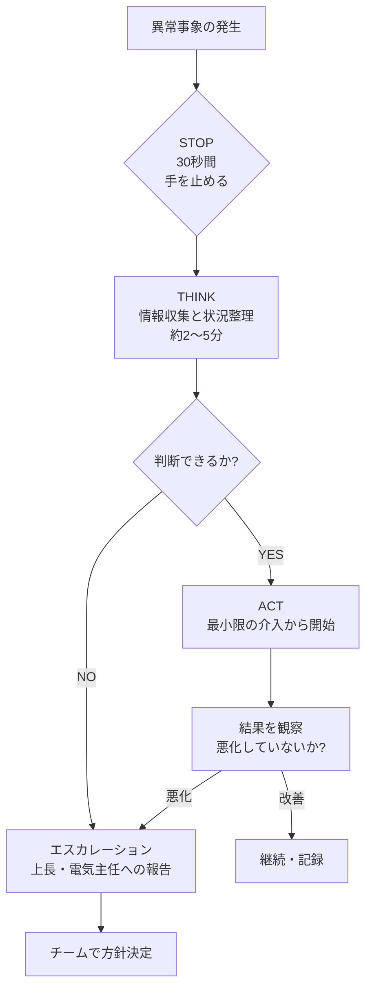
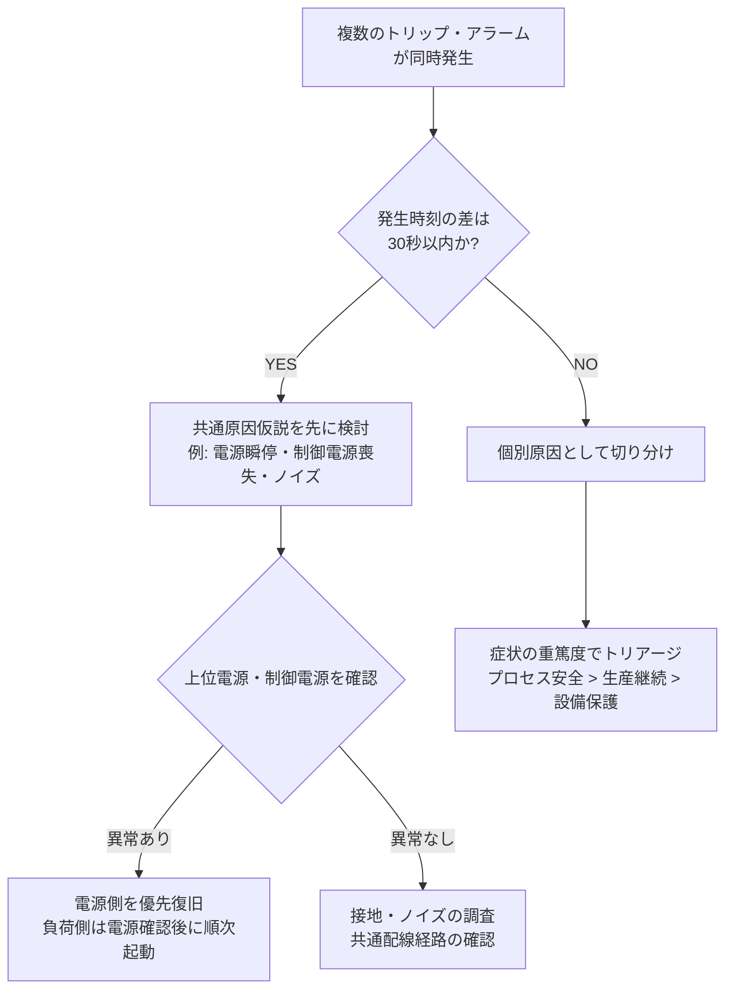
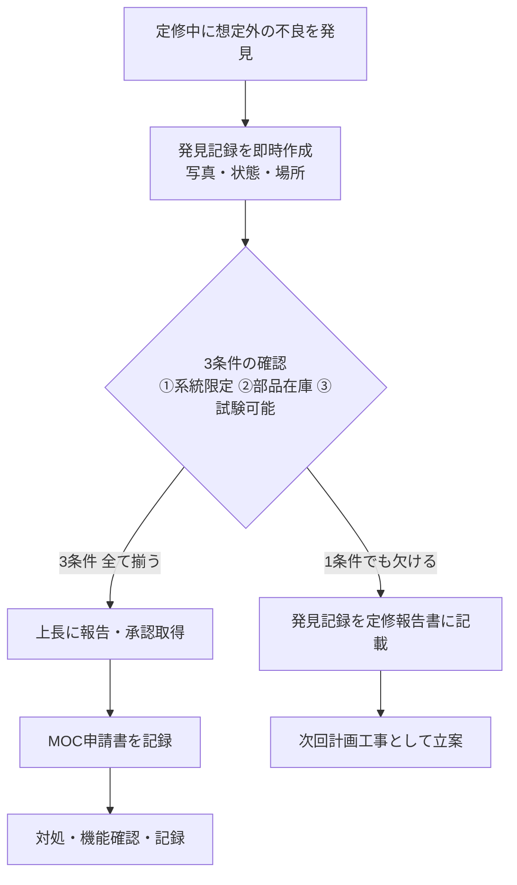
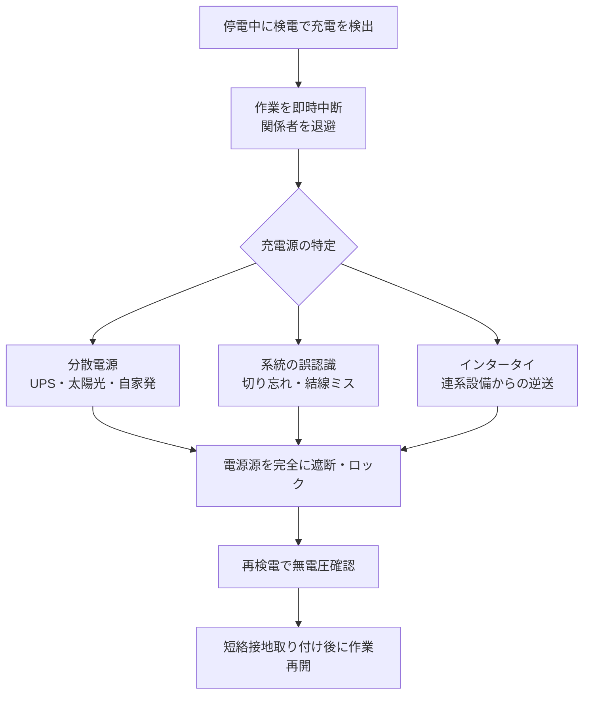

# 非定常時の判断フレーム

## 30秒まとめ

非定常時に定常手順を適用すると状況を悪化させる。「STOP-THINK-ACT」の30秒ルールで冷静さを確保してから動く。
複数トリップ同時発生は「共通原因」を最初に疑う。定修中の想定外不良は3条件（系統限定・部品在庫・試験可能）で続行か中断かを判断する。
判断した根拠は必ず記録する。「なんとなく判断した」はあとで誰も守れない。

---

## 非定常時の定義と罠

**非定常時とは**：事前に手順書・チェックリストが準備されていない状況。または、事前に準備した手順が適用できない状況。

| 定常時 | 非定常時 |
|-------|---------|
| 手順書がある | 手順書が対応していない |
| 予測できる手順で進む | 予測外の事象が発生している |
| チェックリストが使える | チェックリストが不完全になる |
| 判断を手順に委ねられる | 自分で判断根拠を作る必要がある |

**非定常時の罠**：

- **焦り**：「早く直さなければ」というプレッシャーで確認を省略する
- **正常化バイアス**：「いつもと違うが、たぶん大丈夫」と思い込む
- **手順の流用**：似ている定常手順を非定常に適用して状況を悪化させる

---

## 非定常判断の基本フレーム「STOP-THINK-ACT」



### STOPの実践

異常発生直後に「何かしなければ」と動く前に、**30秒間手を止めて現場を観察する**。

確認項目：

- 煙・異臭・異音はあるか？（二次災害リスクの確認）
- 人員の安全は確保されているか？
- プロセスに重大影響が出ているか？

!!! danger "二次災害のリスクを先に排除する"
    感電・爆発・有毒ガス漏洩のリスクがある状況では、設備の保護より人命が優先される。状況が不明な場合はまず退避。

### THINKの実践

| 収集すべき情報 | 収集手段 | 目安時間 |
|--------------|---------|---------|
| 発生時刻・アラーム内容 | DCSアラームログ | 1分 |
| 直前の操作・変化 | 運転員へのヒアリング | 1分 |
| 影響範囲（どの設備・ラインか） | 現場巡視 or DCSトレンド | 2分 |
| 過去の同種事象 | トラブルログ検索 | 1分 |

### ACTの原則

- **最小限の介入**から始める。一度に複数の操作をしない
- **可逆的な操作**（開→閉、入→切）を先に試みる
- **記録しながら動く**：何時に何をしたか、結果はどうだったかをメモ

---

## 場面別 判断フロー

### 複数トリップ同時発生時



**優先順位の考え方**：

| 優先度 | 対象 | 判断基準 |
|--------|------|---------|
| 1位 | 人命・防爆 | 感電・爆発リスクを持つ系統 |
| 2位 | プロセス安全 | 反応暴走・高圧開放リスク |
| 3位 | 製造継続 | 製品品質・生産量への影響 |
| 4位 | 設備保護 | 機器の二次損傷防止 |

!!! warning "複数トリップ時に各設備を個別に順次起動するのは危険"
    共通原因（例：制御電源瞬停）が解消されていない状態で負荷を次々に起動すると、起動電流でさらにトリップを繰り返し状況が悪化する。電源側の確認を先に行う。

---

### 定修中に想定外の不良が見つかった場合

「発見したので直しておきました」は最もやってはいけない対応。MOCなしの変更は安全・法規・品質のすべてに抵触する。

**続行か中断かの判断基準（3条件）**：

| 条件 | 内容 | 確認手段 |
|------|------|---------|
| 条件1 | 発見した不良が停電確立済みの系統に限定されているか | 単線結線図で確認 |
| 条件2 | 修繕に必要な部品・材料が現地に在庫あるか | 予備品台帳・倉庫確認 |
| 条件3 | 修繕後に機能確認（試験）ができる環境にあるか | 定修工程の残り時間確認 |

**3条件が揃う場合**：上長へ報告・承認を得てから対処。必ずMOC申請を記録に残す。

**1条件でも欠ける場合**：発見事実を記録して定修の作業範囲外として報告。次回定修または緊急作業依頼として立案。



---

### 地震・台風後の設備点検優先順位

**点検起動基準**：

- 震度4以上：点検実施（震度4未満は目視巡視）
- 最大瞬間風速 25 m/s 以上：台風後点検実施

**点検の優先順位**：

| 優先度 | 対象 | 確認内容 | 基準値 |
|--------|------|---------|-------|
| 1位 | 高圧受変電設備 | 碍子破損・異物混入・トリップ有無 | 目視異常なし |
| 2位 | 非常用発電機 | 起動試験・燃料残量 | 燃料 80% 以上 |
| 3位 | 防爆機器 | 接続部のゆるみ・ガスケット | トルク規定値以上 |
| 4位 | 制御盤・分電盤 | 扉の変形・配線の外れ | 目視異常なし |
| 5位 | 計装機器 | 測定値の正常範囲確認 | 前日比 ±5% 以内 |

地震後の絶縁抵抗確認：高圧ケーブルは震度5以上で絶縁抵抗測定を実施。基準値 1 MΩ 以上（3.3kV系）。

!!! info "点検記録は法定保存期間（5年）を守る"
    地震・台風後の点検記録は電気事業法上の保安規程に基づく記録義務がある。「異常なし」の記録も残す。

---

### 停電中の予期しない電源検出（バックフィード）



**バックフィード発生パターン4類型**：

| 類型 | 発生原因 | 見落としやすい場面 |
|------|---------|-----------------|
| UPSバックフィード | UPS出力が切り忘れ | サーバ室・制御室電源 |
| 自家発並列運転 | 自家発が切り離し前 | 定修中の停電切替時 |
| 太陽光逆潮流 | PCSの解列忘れ | 昼間停電作業 |
| 連系設備経由 | 隣接設備からの接続 | 設備改造後・結線変更後 |

!!! danger "「停電したはず」は検電してから言う言葉"
    バックフィードによる感電死亡事故は毎年発生している。検電は手順であり習慣でなく「命を守る確認」。

---

## 「判断した根拠を残す」ことの重要性

非定常時の判断は後に「なぜそう判断したか」を問われることがある（労災調査・品質問題の追跡）。

**記録すべき内容**：

```
【判断時刻】YYYY-MM-DD HH:MM
【状況】発生した事象の概要
【収集した情報】何を確認したか、結果は何だったか
【判断内容】何をする・しないと決めたか
【判断根拠】なぜそう判断したか（数値・規程・上長指示）
【実施結果】判断に基づいて何をしたか、結果はどうだったか
```

!!! tip "「判断の根拠」を書けない判断は再考する"
    後から根拠を説明できない判断は、その場の感覚に依存している。非定常時ほど「なぜそうするか」を言語化してから動く。言語化できないなら、エスカレーションを選ぶ。

---

## ベテランの判断軸を借りる：エスカレーション基準

| 状況 | エスカレーションの要否 |
|------|---------------------|
| 影響範囲が自分の担当設備に限定される | 判断してから事後報告でよい |
| 他ラインや製造課への影響がある | 事前に報告・承認が必要 |
| 法定設備（高圧・防爆）に関わる | 電気主任への報告が必須 |
| 人命・爆発リスクの可能性がある | 即時報告・作業中断 |
| 判断に確信が持てない（30秒以上迷う） | エスカレーション |

**30秒伝達テンプレート**：

```
「○○設備で△△が発生しています。
現在の状況は□□で、□□と□□を確認しました。
私の判断では◇◇が原因と考えていますが、
◎◎について判断が必要です。指示をいただけますか？」
```
